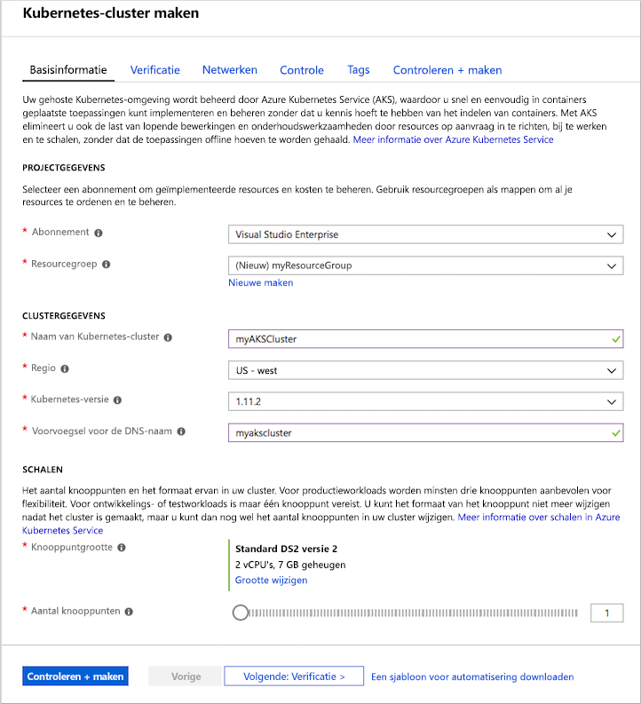
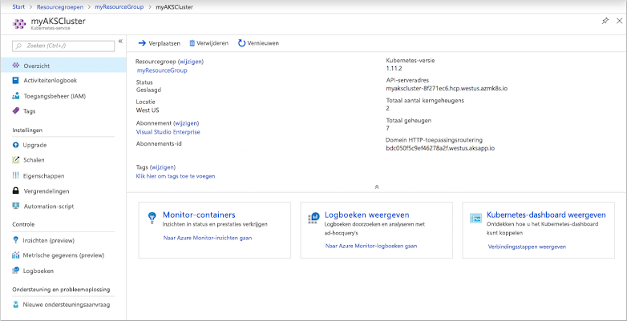
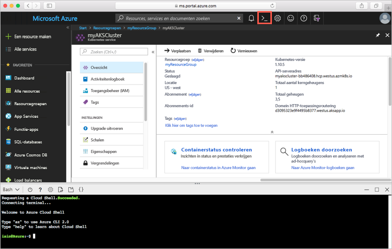
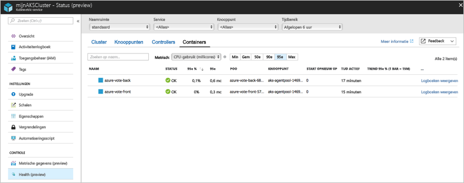
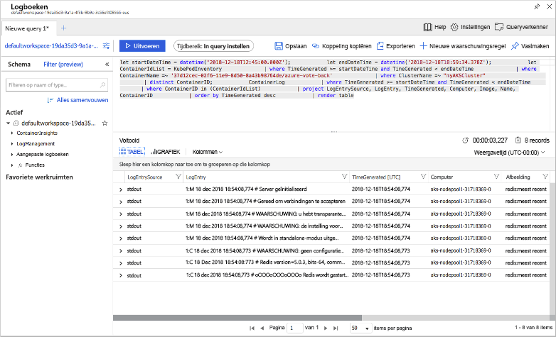

# <a name="quickstart-deploy-an-azure-kubernetes-service-aks-cluster"></a>Snelstart: Een AKS-cluster (Azure Kubernetes Service) implementeren

In deze snelstart implementeert u een AKS-cluster met behulp van Azure Portal. Vervolgens wordt een toepassing met meerdere containers op het cluster uitgevoerd die bestaat uit een web-front-end en een Redis-exemplaar. Zodra de toepassing is voltooid, is deze toegankelijk via internet.


In deze snelstart wordt ervan uitgegaan dat u een basisbegrip hebt van Kubernetes-concepten. Raadpleeg de [Kubernetes-documentatie][kubernetes-documentation] voor gedetailleerde informatie over Kubernetes.

Als u nog geen abonnement op Azure hebt, maak dan een [gratis account](https://azure.microsoft.com/free/?WT.mc_id=A261C142F) aan voordat u begint.

## <a name="sign-in-to-azure"></a>Aanmelden bij Azure

Meld u aan bij Azure Portal op https://portal.azure.com.

## <a name="create-an-aks-cluster"></a>Een AKS-cluster maken

Selecteer in de linkerbovenhoek van de Azure-portal **Een resource maken** > **Kubernetes-service**.

Voltooi de volgende stappen om een AKS-cluster te maken:

1. **Basisprincipes**, configureer de volgende opties:
    - *PROJECTDETAILS*: selecteer een Azure-abonnement, en selecteer of maak vervolgens een Azure-resourcegroep, zoals *myResourceGroup*. Voer een **Kubernetes-clusternaam** in, zoals *myAKSCluster*.
    - *CLUSTERDETAILS*: selecteer een regio, Kubernetes-versie en DNS-naamvoorvoegsel voor het AKS-cluster.
    - *SCHAAL*: selecteer een VM-grootte voor de AKS-knooppunten. De VM-grootte kan **niet** meer worden gewijzigd als een AKS-cluster eenmaal is geïmplementeerd.
        - Selecteer het aantal knooppunten dat u in het cluster wilt implementeren. Stel voor deze quickstart het **Aantal knooppunten** in op *1*. Het aantal knooppunten kan nog **wel** worden gewijzigd als het cluster is geïmplementeerd.
    
    

    Selecteer **Volgende: verificatie** wanneer u klaar bent.

1. **Verificatie**, configureer de volgende opties:
    - Maak een nieuwe service-principal of *configureer* om een bestaande te gebruiken. Wanneer u een bestaande service-principal gebruikt, moet u de SPN-client-ID en het geheim opgeven.
    - Schakel de optie voor Kubernetes-toegangsbeheer op basis van rollen (RBAC) in. Deze besturingselementen bieden een verfijnder beheer van de toegang tot de Kubernetes-resources die zijn geïmplementeerd in het AKS-cluster.

    Selecteer **Volgende: Netwerk** wanneer u klaar bent.

1. **Netwerken**: configureer de volgende netwerkopties die als standaard moeten worden ingesteld:
    
    - **Routering van HTTP-toepassing**: selecteer **Ja** om een geïntegreerde ingangscontroller te configureren met functionaliteit voor het automatisch maken van openbare DNS-namen. Zie [HTTP-routering en DNS voor AKS][http-routing] voor meer informatie over HTTP-routering.
    - **Netwerkconfiguratie**: selecteer de **basisnetwerkconfiguratie** die gebruikmaakt van de Kubernetes-invoegtoepassing [kubenet][kubenet], in plaats van de geavanceerde netwerkconfiguratie die gebruikmaakt van [Azure CNI][azure-cni]. Zie het [AKS-netwerkoverzicht][aks-network] voor meer informatie over netwerkopties.
    
    Selecteer **Volgende: Controle** wanneer u klaar bent.

1. Bij het implementeren van een AKS-cluster kunt u Azure Monitor voor containers configureren voor het bewaken van de status van het AKS-cluster en de pods die in het cluster worden uitgevoerd. Zie [Status van Azure Kubernetes Service controleren][aks-monitor] voor meer informatie over het controleren van de status van de container.

    Selecteer **Ja** als u statuscontrole van de container wilt inschakelen en selecteer een bestaande Log Analytics-werkruimte of maak een nieuwe.
    
    Selecteer **Controleren + maken** en vervolgens **Maken** wanneer u klaar bent.

Het duurt enkele minuten om het AKS-cluster te maken en voor te bereiden voor gebruik. Blader naar de AKS-clusterresourcegroep, zoals *myResourceGroup*, en selecteer de AKS-resource, zoals *myAKSCluster*. Het AKS-clusterdashboard wordt weergegeven, zoals u kunt zien in de volgende voorbeeldschermopname:



## <a name="connect-to-the-cluster"></a>Verbinding maken met het cluster

Als u een Kubernetes-cluster wilt beheren, gebruikt u [kubectl][kubectl], de Kubernetes-opdrachtregelclient. De client `kubectl` is vooraf geïnstalleerd in Azure Cloud Shell.

Open Cloud Shell met behulp van de knop in de rechterbovenhoek van Azure Portal.



Gebruik de opdracht [az aks get-credentials][az-aks-get-credentials] om `kubectl` te configureren om verbinding te maken met het Kubernetes-cluster. In het volgende voorbeeld worden de referenties opgehaald voor de clusternaam *myAKSCluster* in de resourcegroep met de naam *myResourceGroup*:

```azurecli-interactive
az aks get-credentials --resource-group myResourceGroup --name myAKSCluster
```

Als u de verbinding met uw cluster wilt controleren, gebruikt u de opdracht [kubectl get][kubectl-get] om een lijst met clusterknooppunten te retourneren.

```azurecli-interactive
kubectl get nodes
```

In de volgende voorbeelduitvoer ziet u het enkele knooppunt dat is gemaakt in de vorige stappen.

```
NAME                       STATUS    ROLES     AGE       VERSION
aks-agentpool-14693408-0   Ready     agent     10m       v1.11.2
```

## <a name="run-the-application"></a>De toepassing uitvoeren

In een Kubernetes-manifestbestand wordt een gewenste status voor een cluster gedefinieerd, inclusief zaken zoals welke containerinstallatiekopieën moeten worden uitgevoerd. In deze quickstart wordt een manifest gebruikt om alle objecten te maken die nodig zijn om een Azure Vote-voorbeeldtoepassing uit te voeren. Dit omvat twee [Kubernetes-implementaties][kubernetes-deployment]: een voor de Azure Vote-front-end en een voor een Redis-exemplaar. Er worden ook twee [Kubernetes-services][kubernetes-service] gemaakt: een interne service voor het Redis-exemplaar en een externe service voor toegang tot de Azure Vote-toepassing vanaf internet.

> [!TIP]
> In deze snelstart maakt en implementeert u handmatig uw toepassingsmanifesten in het AKS-cluster. In meer praktijkgerichte scenario’s kunt u [Azure Dev Spaces][azure-dev-spaces] gebruiken om uw code snel te herhalen en fouten op te sporen, rechtstreeks in het AKS-cluster. U kunt Dev Spaces gebruiken op alle OS-platformen en in alle ontwikkelomgevingen, en u kunt samenwerken met andere leden van uw team.

Maak een bestand met de naam `azure-vote.yaml` en kopieer de volgende YAML-code naar het bestand. Als u werkt in Azure Cloud Shell, maakt u het bestand met behulp van `vi` of `Nano`, zoals bij een virtueel of fysiek systeem.

```yaml
apiVersion: apps/v1
kind: Deployment
metadata:
  name: azure-vote-back
spec:
  replicas: 1
  selector:
    matchLabels:
      app: azure-vote-back
  template:
    metadata:
      labels:
        app: azure-vote-back
    spec:
      containers:
      - name: azure-vote-back
        image: redis
        resources:
          requests:
            cpu: 100m
            memory: 128Mi
          limits:
            cpu: 250m
            memory: 256Mi
        ports:
        - containerPort: 6379
          name: redis
---
apiVersion: v1
kind: Service
metadata:
  name: azure-vote-back
spec:
  ports:
  - port: 6379
  selector:
    app: azure-vote-back
---
apiVersion: apps/v1
kind: Deployment
metadata:
  name: azure-vote-front
spec:
  replicas: 1
  selector:
    matchLabels:
      app: azure-vote-front
  template:
    metadata:
      labels:
        app: azure-vote-front
    spec:
      containers:
      - name: azure-vote-front
        image: microsoft/azure-vote-front:v1
        resources:
          requests:
            cpu: 100m
            memory: 128Mi
          limits:
            cpu: 250m
            memory: 256Mi
        ports:
        - containerPort: 80
        env:
        - name: REDIS
          value: "azure-vote-back"
---
apiVersion: v1
kind: Service
metadata:
  name: azure-vote-front
spec:
  type: LoadBalancer
  ports:
  - port: 80
  selector:
    app: azure-vote-front
```

Gebruik de opdracht [kubectl apply][kubectl-apply] om de toepassing uit te voeren.

```azurecli-interactive
kubectl apply -f azure-vote.yaml
```

In de volgende voorbeelduitvoer ziet u de Kubernetes-resources die zijn gemaakt in het AKS-cluster:

```
deployment "azure-vote-back" created
service "azure-vote-back" created
deployment "azure-vote-front" created
service "azure-vote-front" created
```

## <a name="test-the-application"></a>De toepassing testen

Terwijl de toepassing wordt uitgevoerd, wordt er een [Kubernetes-service][kubernetes-service] gemaakt die de toepassing beschikbaar maakt op internet. Dit proces kan enkele minuten duren.

Gebruik de opdracht [kubectl get service][kubectl-get] met het argument `--watch` om de voortgang te controleren.

```azurecli-interactive
kubectl get service azure-vote-front --watch
```

In eerste instantie wordt het *EXTERNE IP-adres* voor de service *azure-vote-front* weergegeven als *in behandeling*.

```
NAME               TYPE           CLUSTER-IP   EXTERNAL-IP   PORT(S)        AGE
azure-vote-front   LoadBalancer   10.0.37.27   <pending>     80:30572/TCP   6s
```

Zodra het *EXTERNE IP-adres* is gewijzigd van *in behandeling* in een *IP-adres*, gebruikt u `CTRL-C` om het controleproces van kubectl te stoppen.

```
azure-vote-front   LoadBalancer   10.0.37.27   52.179.23.131   80:30572/TCP   2m
```

Open een webbrowser naar het externe IP-adres van uw service om de Azure Vote-app te zien, zoals wordt weergegeven in het volgende voorbeeld:


## <a name="monitor-health-and-logs"></a>Status en logboeken controleren

Toen u het cluster maakte, werd Container Insights-controle ingeschakeld. Deze controlefunctie biedt metrische statusgegevens voor zowel het AKS-cluster als de pods die in het cluster worden uitgevoerd. Zie [Status van Azure Kubernetes Service controleren][aks-monitor] voor meer informatie over het controleren van de status van de container.

Het kan enkele minuten duren voordat deze gegevens in Azure Portal worden ingevuld. Ga terug naar de AKS-resource in de Azure-portal, zoals *myAKSCluster*, om de huidige status, de uptime en het resourcegebruik te zien voor de Azure Vote-pods. Vervolgens kunt u de status als volgt openen:

1. Kies onder **Bewaking** aan de linkerkant de optie **Inzichten (preview)**
1. Kies bovenaan **+ Filter toevoegen**
1. Selecteer *Namespace* als eigenschap en kies vervolgens  *\<Alles behalve kube-systeem\>*
1. Kies de weergave **Containers**.

De containers *azure-vote-back* en *azure-vote-front* worden weergegeven, zoals in het volgende voorbeeld:



Selecteer de koppeling **Containerlogboeken weergeven** aan de rechterkant van de lijst met containers om de logboeken voor de `azure-vote-front`-pod te zien. Deze logboeken bevatten de stromen *stdout* en *stderr* van de container.



## <a name="delete-cluster"></a>Cluster verwijderen

Wanneer het cluster niet meer nodig is, verwijdert u de clusterresource. Hierdoor worden ook alle bijbehorende resources verwijderd. Deze bewerking kan worden voltooid in de Azure-portal door op het AKS-clusterdashboard de knop **Verwijderen** te selecteren. U kunt ook de opdracht [az aks delete][az-aks-delete] gebruiken in Cloud Shell.

```azurecli-interactive
az aks delete --resource-group myResourceGroup --name myAKSCluster --no-wait
```

> [!NOTE]
> Wanneer u het cluster verwijdert, wordt de Azure Active Directory-service-principal die door het AKS-cluster wordt gebruikt niet verwijderd. Zie [Overwegingen voor en verwijdering van AKS service-principal][sp-delete] voor stappen voor het verwijderen van de service-principal.

## <a name="get-the-code"></a>Code ophalen

In deze snelstart zijn vooraf gemaakte containerinstallatiekopieën gebruikt om een Kubernetes-implementatie te maken. De gerelateerde toepassingscode, Dockerfile en het Kubernetes-manifestbestand zijn beschikbaar op GitHub.

[https://github.com/Azure-Samples/azure-voting-app-redis][azure-vote-app]

## <a name="next-steps"></a>Volgende stappen

In deze snelstart hebt u een Kubernetes-cluster geïmplementeerd en vervolgens een toepassing met meerdere containers geïmplementeerd.

Voor meer informatie over AKS en een volledig stapsgewijs voorbeeld van code tot implementatie gaat u naar de zelfstudie over Kubernetes-clusters.

> [!div class="nextstepaction"]
> [AKS-zelfstudie][aks-tutorial]

<!-- LINKS - external -->
[azure-vote-app]: https://github.com/Azure-Samples/azure-voting-app-redis.git
[azure-cni]: https://github.com/Azure/azure-container-networking/blob/master/docs/cni.md
[kubectl]: https://kubernetes.io/docs/user-guide/kubectl/
[kubectl-apply]: https://kubernetes.io/docs/reference/generated/kubectl/kubectl-commands#apply
[kubectl-get]: https://kubernetes.io/docs/reference/generated/kubectl/kubectl-commands#get
[kubenet]: https://kubernetes.io/docs/concepts/cluster-administration/network-plugins/#kubenet
[kubernetes-deployment]: https://kubernetes.io/docs/concepts/workloads/controllers/deployment/
[kubernetes-documentation]: https://kubernetes.io/docs/home/
[kubernetes-service]: https://kubernetes.io/docs/concepts/services-networking/service/

<!-- LINKS - internal -->
[az-aks-get-credentials]: /cli/azure/aks?view=azure-cli-latest#az-aks-get-credentials
[az-aks-delete]: /cli/azure/aks#az-aks-delete
[aks-monitor]: ../monitoring/monitoring-container-health.md
[aks-network]: ./concepts-network.md
[aks-tutorial]: ./tutorial-kubernetes-prepare-app.md
[http-routing]: ./http-application-routing.md
[sp-delete]: kubernetes-service-principal.md#additional-considerations
[azure-dev-spaces]: https://docs.microsoft.com/azure/dev-spaces/
