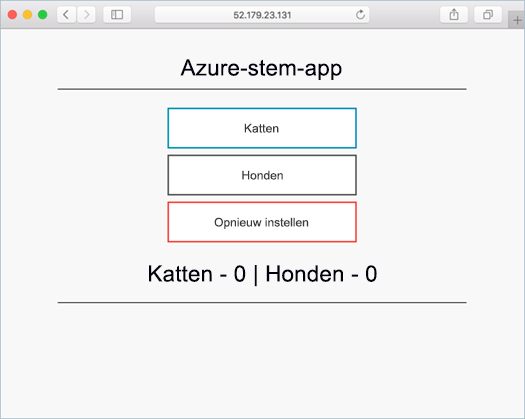

# <a name="deploy-an-azure-container-service-aks-cluster"></a>Een AKS-cluster (Azure Container Service) implementeren

In deze quickstart gaan we een AKS-cluster implementeren met behulp van de Azure CLI. Vervolgens wordt een toepassing met meerdere containers op het cluster uitgevoerd die bestaat uit een web-front-end en een Redis-exemplaar. Zodra de toepassing is voltooid, is deze toegankelijk via internet.



In deze quickstart wordt ervan uitgegaan dat u over basiskennis van Kubernetes-concepten beschikt. Raadpleeg de [Kubernetes-documentatie][kubernetes-documentation] voor gedetailleerde informatie over Kubernetes.

[!INCLUDE [cloud-shell-try-it.md](../../includes/cloud-shell-try-it.md)]

Als u ervoor kiest om de CLI lokaal te installeren en te gebruiken, moet u voor deze snelstartgids de Azure CLI versie 2.0.27 of later uitvoeren. Voer `az --version` uit om de versie te bekijken. Als u Azure CLI 2.0 wilt installeren of upgraden, raadpleegt u [Azure CLI 2.0 installeren][azure-cli-install].

## <a name="enabling-aks-preview"></a>AKS-preview inschakelen

Zorg ervoor dat de benodigde Azure-serviceproviders worden ingeschakeld met de opdracht `az provider register`. 

```azurecli-interactive
az provider register -n Microsoft.Network
az provider register -n Microsoft.Storage
az provider register -n Microsoft.Compute
az provider register -n Microsoft.ContainerService
```

Als dat is gebeurd, kunt u een Kubernetes-cluster gaan maken met AKS.

## <a name="create-a-resource-group"></a>Een resourcegroep maken

Een resourcegroep maken met de opdracht [az group create][az-group-create]. Een Azure-resourcegroep is een logische groep waarin Azure-resources worden geïmplementeerd en beheerd.
Bij het aanmaken van een resourcegroep wordt u gevraagd een locatie op te geven. Dit is waar uw resources zich in Azure zullen bevinden. Zolang AKS in preview is, zijn er slechts enkele locatieopties beschikbaar. Dit zijn `eastus, westeurope, centralus, canadacentral, canadaeast`.

In het volgende voorbeeld wordt een resourcegroep met de naam *myResourceGroup* gemaakt op de locatie *VS Oost*.

```azurecli-interactive
az group create --name myResourceGroup --location eastus
```

Uitvoer:

```json
{
  "id": "/subscriptions/00000000-0000-0000-0000-000000000000/resourceGroups/myResourceGroup",
  "location": "eastus",
  "managedBy": null,
  "name": "myResourceGroup",
  "properties": {
    "provisioningState": "Succeeded"
  },
  "tags": null
}
```

## <a name="create-aks-cluster"></a>AKS-cluster maken

Gebruik de opdracht [az aks create][az-aks-create] om een AKS-cluster te maken. In het volgende voorbeeld wordt een cluster met de naam *myAKSCluster* gemaakt met één knooppunt.

```azurecli-interactive
az aks create --resource-group myResourceGroup --name myAKSCluster --node-count 1 --generate-ssh-keys
```

Na enkele minuten is de opdracht voltooid en retourneert deze informatie over het cluster in JSON-indeling.

## <a name="connect-to-the-cluster"></a>Verbinding maken met het cluster

Als u een Kubernetes-cluster wilt beheren, gebruikt u [kubectl][kubectl], de Kubernetes-opdrachtregelclient.

Als u Azure Cloud Shell gebruikt, is kubectl al geïnstalleerd. Als u het lokaal wilt installeren, gebruikt u de opdracht [az aks install-cli][az-aks-install-cli].


```azurecli
az aks install-cli
```

Als u kubectl zo wilt configureren dat de client verbinding maakt met uw Kubernetes-cluster, gebruikt u de opdracht [az aks get-credentials][az-aks-get-credentials]. In deze stap worden referenties gedownload en wordt Kubernetes CLI geconfigureerd voor het gebruik van deze referenties.

```azurecli-interactive
az aks get-credentials --resource-group myResourceGroup --name myAKSCluster
```

Als u de verbinding met uw cluster wilt controleren, gebruikt u de opdracht [kubectl get][kubectl-get] om een lijst met clusterknooppunten te retourneren. Houd er rekening met dat het een paar minuten kan duren voordat gegevens worden weergegeven.

```azurecli-interactive
kubectl get nodes
```

Uitvoer:

```
NAME                          STATUS    ROLES     AGE       VERSION
k8s-myAKSCluster-36346190-0   Ready     agent     2m        v1.7.7
```

## <a name="run-the-application"></a>De toepassing uitvoeren

In een Kubernetes-manifestbestand wordt een gewenste status voor het cluster gedefinieerd, inclusief zaken zoals welke containerinstallatiekopieën moeten worden uitgevoerd. In dit voorbeeld worden met behulp van een manifest alle objecten gemaakt die nodig zijn om de Azure Vote-toepassing uit te voeren. De bijgeleverde installatiekopie is een voorbeeldtoepassing, maar u kunt lezen over [het maken van een installatiekopie](https://docs.microsoft.com/en-us/azure/aks/tutorial-kubernetes-prepare-app) en [implementeren naar het Azure Container Registry](https://docs.microsoft.com/en-us/azure/aks/tutorial-kubernetes-prepare-acr) als u zelf een toepassing wilt maken.

Maak een bestand met de naam `azure-vote.yaml` en kopieer de volgende YAML-code naar het bestand. Als u werkt in Azure Cloud Shell, kan dit bestand worden gemaakt met behulp van vi of Nano, zoals bij een virtueel of fysiek systeem. Als u lokaal werkt, kunt u Visual Studio Code gebruiken om dit bestand te maken door `code azure-vote.yaml` uit te voeren.

```yaml
apiVersion: apps/v1beta1
kind: Deployment
metadata:
  name: azure-vote-back
spec:
  replicas: 1
  template:
    metadata:
      labels:
        app: azure-vote-back
    spec:
      containers:
      - name: azure-vote-back
        image: redis
        ports:
        - containerPort: 6379
          name: redis
---
apiVersion: v1
kind: Service
metadata:
  name: azure-vote-back
spec:
  ports:
  - port: 6379
  selector:
    app: azure-vote-back
---
apiVersion: apps/v1beta1
kind: Deployment
metadata:
  name: azure-vote-front
spec:
  replicas: 1
  template:
    metadata:
      labels:
        app: azure-vote-front
    spec:
      containers:
      - name: azure-vote-front
        image: microsoft/azure-vote-front:v1
        ports:
        - containerPort: 80
        env:
        - name: REDIS
          value: "azure-vote-back"
---
apiVersion: v1
kind: Service
metadata:
  name: azure-vote-front
spec:
  type: LoadBalancer
  ports:
  - port: 80
  selector:
    app: azure-vote-front
```

Gebruik de opdracht [kubectl create][kubectl-create] om de toepassing uit te voeren.

```azurecli-interactive
kubectl create -f azure-vote.yaml
```

Uitvoer:

```
deployment "azure-vote-back" created
service "azure-vote-back" created
deployment "azure-vote-front" created
service "azure-vote-front" created
```

## <a name="test-the-application"></a>De toepassing testen

Terwijl de toepassing wordt uitgevoerd, wordt er een [Kubernetes-service][kubernetes-service] gemaakt die de front-end van de toepassing beschikbaar maakt op internet. Dit proces kan enkele minuten duren.

Gebruik de opdracht [kubectl get service][kubectl-get] met het argument `--watch` om de voortgang te controleren.

```azurecli-interactive
kubectl get service azure-vote-front --watch
```

Eerst wordt het *externe IP-adres* voor de service *azure-vote-front* weergegeven als *in behandeling*.

```
NAME               TYPE           CLUSTER-IP   EXTERNAL-IP   PORT(S)        AGE
azure-vote-front   LoadBalancer   10.0.37.27   <pending>     80:30572/TCP   6s
```

Zodra het *EXTERNE IP-adres* is gewijzigd van *in behandeling* in een *IP-adres*, gebruikt u `CTRL-C` om het controleproces van kubectl te stoppen.

```
azure-vote-front   LoadBalancer   10.0.37.27   52.179.23.131   80:30572/TCP   2m
```

Nu kunt u naar het externe IP-adres browsen voor een overzicht van de Azure Vote-toepassing.


## <a name="delete-cluster"></a>Cluster verwijderen

U kunt de opdracht [az group delete][az-group-delete] gebruiken om de resourcegroep, de containerservice en alle gerelateerde resources te verwijderen wanneer u het cluster niet meer nodig hebt.

```azurecli-interactive
az group delete --name myResourceGroup --yes --no-wait
```

## <a name="get-the-code"></a>Code ophalen

In deze quickstart zijn vooraf gemaakte containerinstallatiekopieën gebruikt om een Kubernetes-implementatie te maken. De gerelateerde toepassingscode, Dockerfile en het Kubernetes-manifestbestand zijn beschikbaar op GitHub.

[https://github.com/Azure-Samples/azure-voting-app-redis][azure-vote-app]

## <a name="next-steps"></a>Volgende stappen

In deze snelstartgids hebt u een Kubernetes-cluster geïmplementeerd en vervolgens een toepassing met meerdere containers naar het cluster geïmplementeerd.

Voor meer informatie over AKS en een volledig stapsgewijs voorbeeld van code tot implementatie gaat u naar de zelfstudie over Kubernetes-clusters.

> [!div class="nextstepaction"]
> [ASK-zelfstudie][aks-tutorial]:

<!-- LINKS - external -->
[azure-vote-app]: https://github.com/Azure-Samples/azure-voting-app-redis.git
[kubectl]: https://kubernetes.io/docs/user-guide/kubectl/
[kubectl-create]: https://kubernetes.io/docs/reference/generated/kubectl/kubectl-commands#create
[kubectl-get]: https://kubernetes.io/docs/reference/generated/kubectl/kubectl-commands#get
[kubernetes-documentation]: https://kubernetes.io/docs/home/
[kubernetes-service]: https://kubernetes.io/docs/concepts/services-networking/service/

<!-- LINKS - internal -->
[az-aks-browse]: /cli/azure/aks?view=azure-cli-latest#az_aks_browse
[az-aks-create]: /cli/azure/aks?view=azure-cli-latest#az_aks_create
[az-aks-get-credentials]: /cli/azure/aks?view=azure-cli-latest#az_aks_get_credentials
[az aks install-cli]: /cli/azure/aks?view=azure-cli-latest#az_aks_install_cli
[az-group-create]: /cli/azure/group#az_group_create
[az-group-delete]: /cli/azure/group#az_group_delete
[azure-cli-install]: /cli/azure/install-azure-cli
[aks-tutorial]: ./tutorial-kubernetes-prepare-app.md

