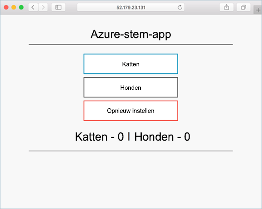

# <a name="run-applications-in-azure-container-service-aks"></a>Toepassingen uitvoeren in Azure Container Service (AKS)

In deze zelfstudie maakt deel uit van vier van acht, een voorbeeld van een toepassing wordt geïmplementeerd in een cluster met Kubernetes. Stappen voltooid omvatten:

> [!div class="checklist"]
> * Kubernetes manifestbestanden bijwerken
> * Toepassing uitvoeren in Kubernetes
> * De toepassing testen

In volgende zelfstudies deze toepassing is uitgebreid, bijgewerkt, en Operations Management Suite geconfigureerd voor het controleren van het cluster Kubernetes.

Deze zelfstudie wordt ervan uitgegaan dat een basiskennis van Kubernetes-concepten voor gedetailleerde informatie over Kubernetes Zie de [Kubernetes documentatie][kubernetes-documentation].

## <a name="before-you-begin"></a>Voordat u begint

In vorige zelfstudies, een toepassing in een installatiekopie van een container is verpakt, deze installatiekopie is geüpload naar Azure Container register en een Kubernetes-cluster is gemaakt. 

Voor deze zelfstudie hebt voltooid, moet u de vooraf gemaakte `azure-vote-all-in-one-redis.yaml` Kubernetes manifestbestand. Dit bestand is gedownload met de broncode van de toepassing in een vorige zelfstudie. Controleer of dat u de opslagplaats hebt gekloond en dat u de mappen in de gekloonde opslagplaats hebt gewijzigd.

Als u deze stappen nog niet hebt gedaan en u wilt volgen, terug naar [zelfstudie 1 – installatiekopieën van de container maken][aks-tutorial-prepare-app].

## <a name="update-manifest-file"></a>Manifestbestand bijwerken

In deze zelfstudie is Azure Container register (ACR) gebruikt voor het opslaan van een installatiekopie van een container. Voordat de toepassing wordt uitgevoerd, moet de servernaam van de ACR-aanmelding in het manifestbestand Kubernetes worden bijgewerkt.

Ophalen van de servernaam van ACR aanmelding met de [az acr lijst] [ az-acr-list] opdracht.

```azurecli
az acr list --resource-group myResourceGroup --query "[].{acrLoginServer:loginServer}" --output table
```

Het manifestbestand is vooraf gemaakte met een aanmeldingsnaam voor de server van `microsoft`. Open het bestand met een teksteditor. In dit voorbeeld wordt het bestand is geopend met `vi`.

```console
vi azure-vote-all-in-one-redis.yaml
```

Vervang `microsoft` met de naam van ACR aanmelding. Deze waarde is gevonden op regel **47** van het manifestbestand.

```yaml
containers:
- name: azure-vote-front
  image: microsoft/azure-vote-front:redis-v1
```

Sla en sluit het bestand.

## <a name="deploy-application"></a>Toepassing implementeren

Gebruik de [kubectl maken] [ kubectl-create] opdracht de toepassing uit te voeren. Deze opdracht het manifestbestand parseert en maakt de gedefinieerde Kubernetes-objecten.

```azurecli
kubectl create -f azure-vote-all-in-one-redis.yaml
```

Uitvoer:

```
deployment "azure-vote-back" created
service "azure-vote-back" created
deployment "azure-vote-front" created
service "azure-vote-front" created
```

## <a name="test-application"></a>Toepassing testen

Een [Kubernetes service] [ kubernetes-service] die beschrijft de toepassing met het internet wordt gemaakt. Dit proces kan enkele minuten duren. 

Om voortgang te controleren, gebruikt u de [kubectl ophalen service] [ kubectl-get] opdracht met de `--watch` argument.

```azurecli
kubectl get service azure-vote-front --watch
```

Eerst wordt het *externe IP-adres* voor de service *azure-vote-front* weergegeven als *in behandeling*.
  
```
azure-vote-front   10.0.34.242   <pending>     80:30676/TCP   7s
```

Zodra het *EXTERNE IP-adres* is gewijzigd van *in behandeling* in een *IP-adres*, gebruikt u `CTRL-C` om het controleproces van kubectl te stoppen. 

```
azure-vote-front   10.0.34.242   52.179.23.131   80:30676/TCP   2m
```

Overzicht van de toepassing, blader naar het externe IP-adres.



## <a name="next-steps"></a>Volgende stappen

In deze zelfstudie is de toepassing Azure stem geïmplementeerd op een cluster Kubernetes in AKS. Taken zijn voltooid, zijn onder andere:  

> [!div class="checklist"]
> * Kubernetes manifest-bestanden downloaden
> * De toepassing uitvoert in Kubernetes
> * De toepassing testen

Ga naar de volgende zelfstudie voor meer informatie over het schalen van zowel een Kubernetes-toepassing en de onderliggende Kubernetes-infrastructuur. 

> [!div class="nextstepaction"]
> [Schaal Kubernetes toepassingen en infrastructuur][aks-tutorial-scale]

<!-- LINKS - external -->
[kubectl-create]: https://kubernetes.io/docs/reference/generated/kubectl/kubectl-commands#create
[kubectl-get]: https://kubernetes.io/docs/reference/generated/kubectl/kubectl-commands#get
[kubernetes-documentation]: https://kubernetes.io/docs/home/
[kubernetes-service]: https://kubernetes.io/docs/concepts/services-networking/service/

<!-- LINKS - internal -->
[aks-tutorial-prepare-app]: ./tutorial-kubernetes-prepare-app.md
[aks-tutorial-scale]: ./tutorial-kubernetes-scale.md
[az-acr-list]: /cli/azure/acr#list
