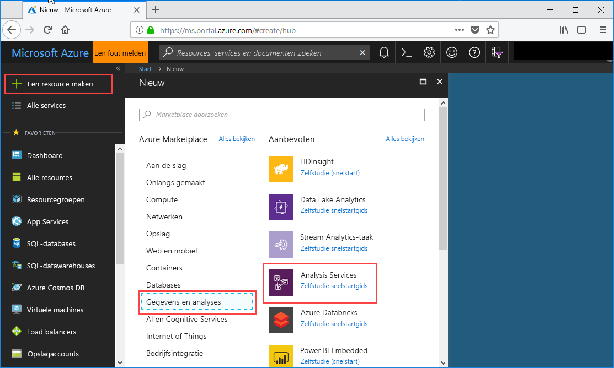
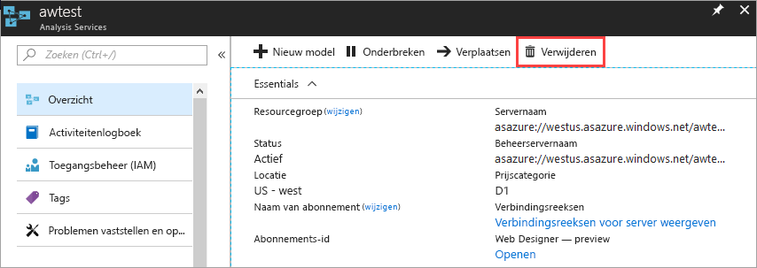

# Snelstart: Een server maken - Portal

In deze snelstart wordt beschreven hoe u een Azure Analysis Services-serverresource in uw Azure-abonnement maakt met behulp van de portal.

## Vereisten 

* **Azure-abonnement**: ga naar [gratis proefversie van Azure](https://azure.microsoft.com/offers/ms-azr-0044p/) om een account te maken.
* **Azure Active Directory**: uw abonnement moet zijn gekoppeld aan een Azure Active Directory-tenant. En u moet zijn aangemeld bij Azure met een account in deze Azure Active Directory. Raadpleeg voor meer informatie [Verificatie en gebruikersmachtigingen](analysis-services-manage-users.md).

## Aanmelden bij Azure Portal 

[Meld u aan bij de portal](https://portal.azure.com).

## Een server maken

1. Klik op **+ Een resource maken** > **Gegevens en analyse** > **Analysis Services**

    

2. Vul in **Analysis Services** de vereiste velden in. Druk vervolgens op **Maken**.
   
   * **Servernaam**: typ een unieke naam om te verwijzen naar de server.
   * **Abonnement**: selecteer het abonnement waaraan deze server wordt gekoppeld.
   * **Resourcegroep**: maak een nieuwe resourcegroep of selecteer een bestaande resourcegroep. Resourcegroepen zijn ontworpen om u te helpen bij het beheren van een verzameling Azure-resources. Zie [Resourcegroepen](../azure-resource-manager/resource-group-overview.md) voor meer informatie.
   * **Locatie**: op deze Azure-datacenterlocatie wordt de server gehost. Kies een locatie die zich zo dicht mogelijk bij uw grootste gebruikersgroep bevindt.
   * **Prijscategorie**: selecteer een prijscategorie. Als u de voorbeeldmodeldatabase wilt testen en waarschijnlijk wilt installeren, selecteert u de gratis **D1**-laag. Zie [Prijzen van Azure Analysis Services](https://azure.microsoft.com/pricing/details/analysis-services/) voor meer informatie. 
    * **Beheerder**: dit is standaard het account waarmee u bent aangemeld. U kunt een ander account kiezen in uw Azure Active Directory.
    * **Instelling voor back-upopslag**: optioneel. Als u al een [opslagaccount](../storage/common/storage-introduction.md) hebt, kunt u dit als de standaardopslag opgeven voor back-ups van de modeldatabase. U kunt de instellingen voor [back-up en herstellen](analysis-services-backup.md) ook later opgeven.
    * **Vervaldatum van de opslagsleutel**: optioneel. Geef een verloopperiode op voor de opslagsleutel.

Het maken van de server duurt gewoonlijk minder dan een minuut. Als u **Toevoegen aan de portal** hebt geselecteerd, navigeert u naar de portal om de nieuwe server te zien. Of navigeer naar **Alle services** > **Analysis Services** om te zien of de server gereed is.

## Resources opschonen

Verwijder de server als u deze niet meer nodig hebt. Klik in het **Overzicht** van de server op **Verwijderen**. 

 

## Volgende stappen
In deze snelstart hebt u geleerd hoe u een server maakt in uw Azure-abonnement. Nu u een server hebt gemaakt, kunt u deze beveiligen door een serverfirewall te configureren. (Optioneel) U kunt ook rechtstreeks vanuit de portal een eenvoudig voorbeeldgegevensmodel toevoegen aan de server. Een voorbeeldmodel is handig als u meer wilt weten over het configureren van modeldatabaserollen en het testen van clientverbindingen. Als u meer wilt weten, gaat u verder met de zelfstudie waarin u leert een voorbeeldmodel toe te voegen.

> [!div class="nextstepaction"]
> [Snelstart: Een serverfirewall configureren - Portal](analysis-services-qs-firewall.md)   
> [!div class="nextstepaction"]
> [Zelfstudie: Een voorbeeldmodel toevoegen aan uw server](analysis-services-create-sample-model.md)
