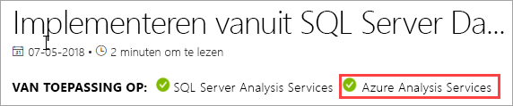
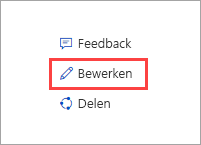

# Wat is Azure Analysis Services?

Azure Analysis Services is een volledig beheerd platform als een service (PaaS) dat gegevensmodellen van ondernemingsklasse in de cloud levert. Gebruik geavanceerde mashup- en modelleringsfuncties om gegevens uit meerdere gegevensbronnen te verfijnen en te combineren, metrische gegevens te definiëren, en uw gegevens te beveiligen in één vertrouwd tabellarisch semantisch gegevensmodel. Het gegevensmodel biedt gebruikers een eenvoudigere en snellere manier om enorme hoeveelheden gegevens te doorzoeken voor ad-hoc gegevensanalyse.

**Video:** Bekijk [Overzicht van Azure Analysis Services](https://sec.ch9.ms/ch9/d6dd/a1cda46b-ef03-4cea-8f11-68da23c5d6dd/AzureASoverview_high.mp4) om te ontdekken hoe Azure Analysis Services past in de algemene BI-mogelijkheden van Microsoft.

## Snel aan de slag

In Azure Portal kunt u binnen enkele minuten [een server maken](analysis-services-create-server.md). En met Azure Resource Manager-[sjablonen](../azure-resource-manager/resource-manager-create-first-template.md) en PowerShell kunt u servers maken met behulp van een declaratieve sjabloon. Met één enkele sjabloon kunt u meerdere serverresources implementeren, samen met andere Azure-onderdelen als opslagaccounts en Azure Functions. 

**Video:** Bekijk [Implementatie automatiseren](https://channel9.msdn.com/series/Azure-Analysis-Services/AzureAnalysisServicesAutomation) voor meer informatie over hoe u Azure Automation kunt gebruiken om sneller servers te maken.

Azure Analysis Services kan worden geïntegreerd met veel Azure-services, zodat u geavanceerde analyseoplossingen kunt creëren. Integratie met [Azure Active Directory](../active-directory/fundamentals/active-directory-whatis.md) biedt beveiligde, op rollen gebaseerde toegang tot kritieke gegevens. Integreer met [Azure Data Factory](../data-factory/introduction.md)-pijplijnen door een activiteit toe te voegen die gegevens in het model laadt. [Azure Automation](../automation/automation-intro.md) en [Azure Functions](../azure-functions/functions-overview.md) kunnen worden gebruikt voor de eenvoudige indeling van modellen met behulp van aangepaste code. 

## Altijd de juiste laag

Azure Analysis Services is beschikbaar in de servicelagen **Developer**, **Basic** en **Standard**. Binnen elke servicelaag variëren de abonnementskosten afhankelijk van verwerkingskracht, QPU's en geheugen. Wanneer u een server maakt, selecteert u binnen een servicelaag een abonnement. U kunt een abonnement binnen dezelfde servicelaag omhoog of omlaag bijstellen en ook upgraden naar een hogere servicelaag. U kunt echter niet downgraden naar een lagere servicelaag.

### Developer-laag

Deze laag wordt aanbevolen voor evaluatie-, ontwikkelings- en testscenario's. Eén abonnement bevat alle functionaliteit van de Standard-laag, maar heeft beperkte verwerkingskracht, QPU's en geheugengrootte. Uitschalen van queryreplica’s *is niet beschikbaar* voor deze laag. Voor deze laag is geen SLA beschikbaar.

|Plannen  |QPU's  |Geheugen (GB)  |
|---------|---------|---------|
|D1    |    20     |    3     |

### Basislaag

Deze-laag wordt aanbevolen voor productieoplossingen met kleinere tabellarische modellen, een beperkt aantal gelijktijdige gebruikers en eenvoudige vereisten voor gegevensvernieuwing. Uitschalen van queryreplica’s *is niet beschikbaar* voor deze laag. Perspectieven, meerdere partities en functies van het tabellarische DirectQuery-model *worden niet ondersteund* in deze laag.  

|Plannen  |QPU's  |Geheugen (GB)  |
|---------|---------|---------|
|B1    |    40     |    10     |
|B2    |    80     |    20     |

### Standaardlaag

Deze laag is de meest geschikte voor essentiële productietoepassingen waarvoor elastische gebruikersgelijktijdigheid is vereist en waarvan de gegevensmodellen snel groter worden. Deze laag ondersteunt geavanceerde gegevensvernieuwing voor bijna real-time gegevensmodelupdates en ondersteunt alle tabellarische modelleringsfuncties.

|Plannen  |QPU's  |Geheugen (GB)  |
|---------|---------|---------|
|S1    |    40     |    10     |
|S2    |    100     |    25     |
|S3    |    200     |    50     |
|S4    |    400     |    100     |
|S8*    |    320     |    200     |
|S9*    |    640    |    400     |

\* Niet beschikbaar in alle regio’s.  

## Beschikbaarheid per regio

Azure Analysis Services wordt ondersteund in regio's in de hele wereld. Ondersteunde abonnementen en beschikbaarheid van querreplica's is afhankelijk van de regio die u kiest. De beschikbaarheid van abonnementen en queryreplica's kan veranderen, afhankelijk van de behoefte aan en de beschikbare resources voor elke regio. 

### Noord- en Zuid-Amerika

|Regio  | Ondersteunde abonnementen | Queryreplica's (alleen Standard-abonnementen) |
|---------|---------|:---------:|
|Brazilië - zuid     |    B1, B2, S0, S1, S2, S4, D1     |     1    |
|Canada - midden    |     B1, B2, S0, S1, S2, S4, D1    |     1    |
|US - oost     |     B1, B2, S0, S1, S2, S4, D1    |    1     |
|US - oost 2     |     B1, B2, S0, S1, S2, S4, D1   |    7    |
|US - oost 2     |     S8, S9   |    1    |
|US - noord-centraal     |     B1, B2, S0, S1, S2, S4, D1     |    1     |
|US - centraal     |    B1, B2, S0, S1, S2, S4, D1     |    1     |
|US - zuid-centraal     |    B1, B2, S0, S1, S2, S4, D1     |    1     |
|US - west-centraal   |     B1, B2, S0, S1, S2, S4, D1    |    3     |
|US - west     |    B1, B2, S0, S1, S2, S4, D1    |    7   |
|US - west     |    S8, S9   |    2  |
|VS - west 2    |    B1, B2, S0, S1, S2, S4, D1    |    3   |
|VS - west 2    |    S8, S9  |    1     |

### Europa

|Regio  | Ondersteunde abonnementen | Queryreplica's (alleen Standard-abonnementen) |
|---------|---------|:---------:|
|Europa - noord     |    B1, B2, S0, S1, S2, S4, D1      |    7     |
|Verenigd Koninkrijk Zuid     |    B1, B2, S0, S1, S2, S4, D1      |     1    |
|Europa -west     |    B1, B2, S0, S1, S2, S4, D1   |    7    |
|Europa -west    |   S8, S9  |  1  |

### Azië en Stille Oceaan 

|Regio  | Ondersteunde abonnementen | Queryreplica's (alleen Standard-abonnementen) |
|---------|---------|:---------:|
|Australië - oost     |    B1, B2, S0, S1, S2, S4     |    3     |
|Australië - oost     |    S8, S9    |    1     |
|Australië - zuidoost     | B1, B2, S0, S1, S2, S4, D1       |    1     |
|Japan - oost     |   B1, B2, S0, S1, S2, S4, D1       |    1     |
|Azië - zuidoost     |     B1, B2, S0, S1, S2, S4, S8, S9, D1     |   1      |
|India - west     |    B1, B2, S0, S1, S2, S4, D1     |    1     |

## Schalen naar uw behoeften

### Omhoog/omlaag schalen, onderbreken en hervatten

U kunt uw server omhoog of omlaag schalen en zelfs onderbreken. Dit doet u via Azure Portal of, voor volledige controle op elk moment, met behulp van PowerShell. U betaalt alleen voor wat u gebruikt.  

### Resources uitschalen voor snellere queryrespons

Door uit te schalen worden clientquery's verdeeld over meerdere *queryreplica's* in een querypool. Queryreplica's bevatten gesynchroniseerde kopieën van uw modellen in tabelvorm. Door de werkbelasting van query's te spreiden, kunnen responstijden tijdens hoge querywerkbelastingen worden verlaagd. Taken voor modelverwerking kunnen worden gescheiden van de querypool, zodat de prestaties van clientquery's niet nadelig worden beïnvloed door verwerkingstaken. 

U kunt een querypool maken met maximaal zeven extra queryreplica's (acht in totaal, met inbegrip van uw server). Het aantal queryreplica's dat u in uw pool kunt hebben, is afhankelijk van het abonnement en de regio die u hebt gekozen. Queryreplica's kunnen niet buiten de regio van uw server worden verspreid. Queryreplica's worden gefactureerd tegen hetzelfde tarief als uw server.

Net zoals bij het wijzigen van lagen, kunt u queryreplica's uitschalen als dat nodig is. Dit kan in de portal of met behulp van REST-API's. Zie [Azure Analysis Services uitschalen](analysis-services-scale-out.md) voor meer informatie.

## Prijzen

Totale kosten zijn afhankelijk van een aantal factoren; bijvoorbeeld uw gekozen regio, laag, queryreplica's en onderbreken/hervatten. Gebruik de calculator voor [Prijzen voor Azure Analysis Services](https://azure.microsoft.com/pricing/details/analysis-services/) om typische prijzen voor uw regio te bepalen. Dit hulpprogramma berekent prijzen voor één single-serverexemplaar voor één regio. Denk eraan dat queryreplica's worden gefactureerd tegen hetzelfde tarief als de server. 

## Gebaseerd op SQL Server Analysis Services

Azure Analysis Services is compatibel met veel geweldige functies die al deel uitmaken van SQL Server Analysis Services Enterprise Edition. Azure Analysis Services ondersteunt tabellarische modellen met het [compatibiliteitsniveau](analysis-services-compat-level.md) 1200 of hoger. Tabellarische modellen zijn constructies voor relationele modellering (model, tabellen, kolommen), geformuleerd in tabellarische metagegevensobjectdefinities in TMSL- (Tabular Model Scripting Language) en TOM-code (Tabular Object Model. Partities, perspectieven, beveiliging op rijniveau, bidirectionele relaties en translaties worden allemaal ondersteund*. Multidimensionale modellen en PowerPivot voor Sharepoint *worden niet* ondersteund in Azure Analysis Services.

Tabellarische modellen in zowel in-memory- als DirectQuery-modi worden ondersteund. In de in-memory-modus (standaard) ondersteunen tabellarische modellen meerdere gegevensbronnen. Omdat modelgegevens in hoge mate worden gecomprimeerd en in het geheugen worden gecachet, biedt deze modus de snelste queryrespons op grote hoeveelheden gegevens. Deze modus biedt ook de meeste flexibiliteit voor complexe gegevenssets en query's. Partitionering maakt incrementele belastingen mogelijk, verhoogt de parallellisatie en vermindert het geheugenverbruik. Andere geavanceerde functies voor gegevensmodellering, zoals berekende tabellen, en alle DAX-functies worden ondersteund. Geheugenmodellen moeten worden vernieuwd (verwerkt) om gecachete gegevens uit gegevensbronnen bij te werken. Dankzij Azure-service-principal-ondersteuning bieden onbeheerde vernieuwingsbewerkingen met PowerShell, TOM, TMSL en REST flexibiliteit om ervoor te zorgen dat uw modelgegevens altijd up-to-date zijn. 

DirectQuery-modus* maakt gebruik van de relationele back-end-database voor opslag en query-uitvoering. Extreem grote gegevenssets in afzonderlijke SQL Server-, SQL Server Data Warehouse-, Azure SQL Database-, Azure SQL Data Warehouse-, Oracle- en Teradata-gegevensbronnen worden ondersteund. Backend-gegevenssets kunnen het beschikbare serverresourcesgeheugen overschrijden. Complexe scenario's voor het vernieuwen van gegevensmodellen zijn niet nodig. Er zijn ook enkele beperkingen, zoals beperkte gegevensbrontypen en DAX-formulebeperkingen, en enkele geavanceerde functies voor gegevensmodellering worden niet ondersteund. Zie [DirectQuery-modus](https://docs.microsoft.com/sql/analysis-services/tabular-models/directquery-mode-ssas-tabular)voordat u bepaalt wat voor u de beste modus is.

\* Welke functies beschikbaar zijn hangt af van de laag.

## Ondersteunde gegevensbronnen

Tabellarische modellen in Azure Analysis Services ondersteunen een breed scala aan gegevensbronnen, van eenvoudige tekstbestanden tot Big Data in Azure Data Lake Store. Raadpleeg voor meer informatie [Data sources supported in Azure Analysis Services](analysis-services-datasource.md) (Gegevensbronnen die in Azure Analysis Services worden ondersteund).

## Gegevens zijn beveiligd

Azure Analysis Services beveiligt uw gevoelige gegevens op meerdere niveaus. Op serverniveau: firewall, Azure-verificatie, serverbeheerdersrollen en serverversleuteling. En op gegevensmodelniveau zorgen gebruikersrollen en beveiliging op rijniveau en objectniveau ervoor dat uw gegevens veilig zijn en alleen worden gezien door de gebruikers voor wie ze bestemd zijn.

### Firewall

De firewall van Azure Analysis Services blokkeert alle clientverbindingen behalve die met IP-adressen die zijn opgegeven in regels. Configureer regels voor toegestane IP-adressen als individuele client-IP-adressen of als een bereik. Verbindingen van Power BI (service) kunnen ook worden toegestaan of geblokkeerd. Configureer de firewall en regels in de portal of met behulp van PowerShell. Zie [Configure a server firewall](analysis-services-qs-firewall.md) (een serverfirewall configureren) voor meer informatie.

### Verificatie

Gebruikersverificatie wordt afgehandeld door [Azure Active Directory (AAD)](../active-directory/fundamentals/active-directory-whatis.md). Bij het inloggen gebruiken gebruikers de identiteit van een organisatie-account met op rollen gebaseerde toegang tot de database. Gebruikers-id's moeten lid zijn van de standaard Azure Active Directory voor het abonnement waarin de server is ondergebracht. Raadpleeg voor meer informatie [Verificatie en gebruikersmachtigingen](analysis-services-manage-users.md).

### Gegevensbeveiliging

Azure Analysis Services maakt gebruik van Azure Blob-opslag om opslag en metagegevens voor Analysis Services-databases persistent te maken. Gegevensbestanden in Blob worden versleuteld met behulp van [Azure Blob Server Side Encryption (SSE)](../storage/common/storage-service-encryption.md). Wanneer de Direct Query-modus wordt gebruikt, worden alleen metagegevens opgeslagen. De werkelijke gegevens worden op het moment van uitvoering van de query via een versleuteld protocol opgehaald uit de gegevensbron.

Beveiligde toegang tot on-premises gegevens binnen uw organisatie wordt gerealiseerd door een [on-premises gegevensgateway](analysis-services-gateway.md) te installeren en te configureren. Gateways bieden toegang tot gegevens voor zowel de DirectQuery-modus als de in-memory-modus.

### Rollen

Analysis Services maakt gebruik van [op rollen gebaseerde autorisatie](https://docs.microsoft.com/sql/analysis-services/tabular-models/roles-ssas-tabular) die toegang verleent tot server- en modeldatabasebewerkingen, -objecten en -gegevens. Alle gebruikers die toegang hebben tot een server of database, doen dit met hun Azure AD-gebruikersaccount binnen een toegewezen rol. De serverbeheerdersrol bevindt zich op serverresourceniveau. Standaard wordt het account dat wordt gebruikt bij het maken van een server automatisch opgenomen in de rol Serverbeheerder. Extra gebruikers en groepen worden toegevoegd met behulp van de portal, SSMS of PowerShell.
  
Eindgebruikers die geen beheerder zijn, krijgen toegang via databaserollen wanneer ze gegevens opvragen. Een databaserol wordt gemaakt als een afzonderlijk object in de database en is alleen van toepassing op de database waarin die rol is gemaakt. Databaserollen worden gedefinieerd door de machtigingen (database)Beheerder, Lezen, en Lezen en verwerken. Gebruikers- en groepsaccounts worden toegevoegd met behulp van SSMS of PowerShell.

### Beveiliging op rijniveau

Tabellarische modellen op alle compatibiliteitsniveaus ondersteunen beveiliging op rijniveau. Beveiliging op rijniveau wordt geconfigureerd in het model door DAX-expressies te gebruiken die de rijen in een tabel definiëren, en alle rijen in de vele richtingen van een gerelateerde tabel die een gebruiker kan opvragen. Rijfilters met DAX-expressies worden gedefinieerd voor de machtigingen Lezen en Lezen en verwerken. 

### Beveiliging op objectniveau 

Tabellarische modellen op het 1400-compatibiliteitsniveau ondersteunen beveiliging op objectniveau, waaronder beveiliging op paginaniveau en beveiliging op kolomniveau. Beveiliging op objectniveau wordt met behulp van TMSL of TOM ingesteld in de op JSON-gebaseerde metagegevens in het bestand Model.bim. Zie [Object-level security](https://docs.microsoft.com/sql/analysis-services/tabular-models/object-level-security) (beveiliging op objectniveau) voor meer informatie.

### Automatisering via service-principals

Service-principals zijn een Azure Active Directory-toepassingsresource die u in uw tenant maakt om onbeheerde bewerkingen op resource- en serviceniveau uit te voeren. Service-principals worden gebruikt met Azure Automation, de onbeheerde PowerShell-modus, aangepaste clienttoepassingen en webapps om veelvoorkomende taken zoals gegevensvernieuwing, omhoog/omlaag schalen en onderbreken/hervatten te automatiseren. Machtigingen worden aan service-principals toegewezen via rollidmaatschappen. Zie [Automatisering met service-principals](analysis-services-service-principal.md) voor meer informatie.

### Azure-governance

Azure Analysis Services is onderhevig aan de [gebruiksvoorwaarden van Microsoft Online Services](http://www.microsoftvolumelicensing.com/DocumentSearch.aspx?Mode=3&DocumentTypeId=31) en de [privacyverklaring van Microsoft](https://privacy.microsoft.com/privacystatement).
Ga naar het [Microsoft Vertrouwenscentrum](https://www.microsoft.com/trustcenter) voor meer informatie over Azure-beveiliging.

## Werken met de tools die u al kent

### Visual Studio

Ontwikkel en implementeer modellen met de gratis [SQL Server Data Tools (SSDT) voor Visual Studio](https://msdn.microsoft.com/library/mt204009.aspx). SSDT bevat Analysis Services-projectsjablonen waarmee u snel aan de slag kunt gaan. Bovendien biedt SSDT voor tabellaire modellen met compatibiliteitsniveau 1400 nu ook de innovatieve queryfunctie Get Data en mashup-functionaliteit. Als u al bekend bent met Get Data in Power BI Desktop en Excel 2016, weet u hoe eenvoudig het is om voor gegevensbronnen query's te maken die naadloos aansluiten bij uw behoeften. 

Als u Visual Studio 2017 gebruikt, zijn Microsoft Analysis Services-projecten beschikbaar als een gratis installeerbaar VSIX-pakket. [Downloaden van Marketplace](https://marketplace.visualstudio.com/items?itemName=ProBITools.MicrosoftAnalysisServicesModelingProjects).

### SQL Server Management Studio

Servers en modeldatabases beheert u met behulp van [SQL Server Management Studio (SSMS)](https://docs.microsoft.com/sql/ssms/download-sql-server-management-studio-ssms). Maak verbinding met uw servers in de cloud. Voer rechtstreeks vanuit het XMLA-queryvenster TMSL-scripts uit en automatiseer taken met behulp van TMSL-scripts en PowerShell. Omdat er in hoog tempo nieuwe functies en mogelijkheden worden toegevoegd, wordt SSMS maandelijks bijgewerkt.

### PowerShell

Gebruik AzureRM-cmdlets (Azure Resource Manager) om beheertaken voor serverresources uit te voeren, zoals serverresources maken, serverbewerkingen onderbreken of hervatten, of het serviceniveau (de servicelaag) te wijzigen. Voor andere databasebeheertaken, zoals het toevoegen of verwijderen van roltoewijzingen, het toepassen van bewerkingen of het uitvoeren van TMSL-scripts, gebruikt u de cmdlets van de SQL Server-module. Zie [Azure Analysis Services beheren met PowerShell](analysis-services-powershell.md) voor meer informatie.

### Objectmodel en scripts

De tabellaire modellen kunnen snel worden ontwikkeld en zijn in hoge mate aanpasbaar. Tabellarische modellen bevatten ook het [Tabular Object Model](https://docs.microsoft.com/sql/analysis-services/tabular-model-programming-compatibility-level-1200/introduction-to-the-tabular-object-model-tom-in-analysis-services-amo) (TOM) om modelobjecten te beschrijven. TOM wordt in JSON weergegeven via [TMSL (Tabular Model Scripting Language)](https://docs.microsoft.com/sql/analysis-services/tabular-model-scripting-language-tmsl-reference) en in de AMO Data Definition Language met behulp van de naamruimte [Microsoft.AnalysisServices.Tabular](https://msdn.microsoft.com/library/microsoft.analysisservices.tabular.aspx). 

## Ondersteuning voor de nieuwste clienthulpprogramma's

Moderne hulpprogramma's voor het verkennen en visualiseren van gegevens, zoals Power BI, Excel, Reporting Services en hulpprogramma's van derden, bieden gebruikers interactieve en visueel aantrekkelijke inzichten in de gegevens van uw model. 

## Controle en diagnose

Azure Analysis Services is geïntegreerd met metrische gegevens van Azure en biedt een groot aantal resourcespecifieke metrische gegevens waarmee u de prestaties en de status van uw servers kunt volgen. Zie [Monitor server metrics](analysis-services-monitor.md) (Metrische servergegevens bewaken) voor meer informatie. Leg metrische gegevens vast met [diagnostische logboeken van Azure-resources](../monitoring-and-diagnostics/monitoring-overview-of-diagnostic-logs.md). Bewaak en verzend logbestanden naar [Azure Storage](https://azure.microsoft.com/services/storage/), stream ze naar [Azure Event Hubs](https://azure.microsoft.com/services/event-hubs/)en exporteer ze naar [Log Analytics](https://azure.microsoft.com/services/log-analytics/), een service van [Azure](https://www.microsoft.com/cloud-platform/operations-management-suite). Zie [Registratie in diagnoselogboek instellen](analysis-services-logging.md) voor meer informatie.

Azure Analysis Services ondersteunt ook het gebruik van [DMV's (dynamische beheerweergaven)](https://docs.microsoft.com/sql/analysis-services/instances/use-dynamic-management-views-dmvs-to-monitor-analysis-services). DMV’s zijn gebaseerd op SQL-syntaxis en werken samen met schemarijensets die metagegevens en bewakingsgegevens over serverexemplaren retourneren.

## Documentatie

Specifieke documentatie bij Azure Analysis Services is hier opgenomen. Gebruik de inhoudsopgave aan de linkerkant van uw browserscherm om artikelen te zoeken. 

Omdat de tabellarische modellen van Azure Analysis Services sterk lijken op tabellarische modellen in SQL Server Analysis Services, is er een uitgebreide bibliotheek met gedeelde conceptuele, procedurele, ontwikkelaars- en referentieartikelen in de [documentatie van SQL Server Analysis Services](https://docs.microsoft.com/sql/analysis-services/analysis-services). Bij artikelen in de documentatie van SQL Server Analysis Services wordt aangegeven of ze ook van toepassing zijn op Azure Analysis Services door de banner VAN TOEPASSING OP onder de titel.

### U kunt bijdragen!

Analysis Services-documentatie, zoals dit artikel, is open source. Als u een GitHub-account hebt, kunt u een artikel bewerken door op Edit (potlood) in de rechterbovenhoek van uw browserscherm te klikken. Gebruik de editor in de browser en klik vervolgens op Propose file change (bestandswijziging voorstellen). 

Uw bijdrage wordt beoordeeld door het documentatieteam en indien deze wordt goedgekeurd, wordt de naam van uw GitHub-account weergegeven als bijdrager. Zie de [handleiding voor bijdragers aan documenten](https://docs.microsoft.com/contribute/) voor meer informatie.

In de documentatie van Azure Analysis Services wordt ook gebruikgemaakt van [GitHub Issues](https://docs.microsoft.com/teamblog/a-new-feedback-system-is-coming-to-docs). U kunt feedback geven over het product of de documentatie. Gebruik **Feedback** onderaan een artikel. GitHub Issues zijn nog niet ingeschakeld voor SQL Server Analysis Services-documentatie. 

## Blogs

Er veranderen nog veel dingen. Krijg de meest recente informatie in het [blog van het Analysis Services-team](https://blogs.msdn.microsoft.com/analysisservices/) en in het [Azure-blog](https://azure.microsoft.com/blog/).

## Community

Analysis Services heeft een zeer actieve gebruikerscommunity. Doe mee op [het Azure Analysis Services-forum](https://aka.ms/azureanalysisservicesforum).

## Volgende stappen

> [!div class="nextstepaction"]
> [Meld u aan voor een gratis proefversie van Azure](https://azure.microsoft.com/offers/ms-azr-0044p/)   

> [!div class="nextstepaction"]
> [Snelstart: Een server maken - Portal](analysis-services-create-server.md)   

> [!div class="nextstepaction"]
> [Snelstart: Een server maken - PowerShell](analysis-services-create-powershell.md)  
