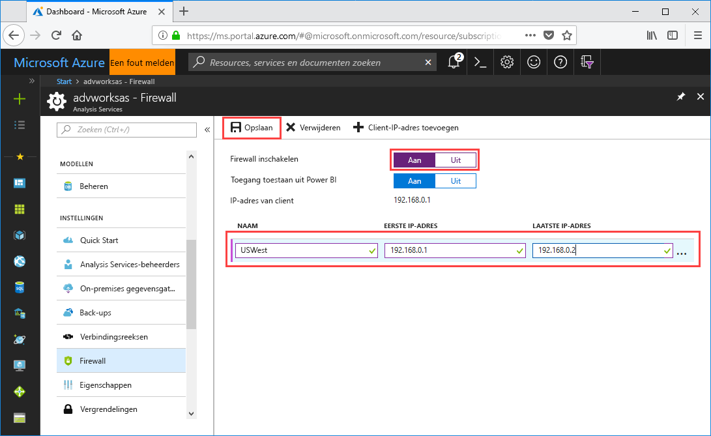

# Snelstart: Een serverfirewall configureren - Portal

Deze snelstart helpt u bij het configureren van een firewall voor uw Azure Analysis Services-server. Een firewall inschakelen en het configureren van IP-adresbereiken voor uitsluitend de computers die toegang tot de server hebben, speelt een belangrijke rol bij het beveiligen van uw server en uw gegevens.

## Vereisten

- Een Azure Analysis Services-server in uw abonnement. Zie [Snelstart: Een server maken - Portal](analysis-services-create-server.md) of [Snelstart: Een server maken - PowerShell](analysis-services-create-powershell.md) voor meer informatie.
- Een of meer IP-adresbereiken voor clientcomputers (indien nodig).

## Aanmelden bij Azure Portal 

[Meld u aan bij de portal](https://portal.azure.com).

## Een firewall configureren

1. Klik op de server om de overzichtspagina te openen. 
2. Klik in **INSTELLINGEN** > **Firewall** > **Firewall inschakelen** op **Aan**.
3. Klik op **Aan** bij **Toegang toestaan vanuit Power BI** om toegang tot DirectQuery toe te staan vanuit Power BI-service.  
4. (Optioneel) Geef een of meer IP-adresbereiken op. Typ een naam, begin- en eind-IP-adressen voor elk bereik. 
5. Klik op **Opslaan**.

     

## Resources opschonen

Wanneer deze niet langer nodig zijn, verwijdert u de IP-adresbereiken of schakelt u de firewall uit.

## Volgende stappen
In deze snelstart hebt u geleerd hoe u een firewall configureert voor uw server. Nu dat u een server hebt en deze hebt beveiligd met een firewall, kunt u een eenvoudig voorbeeldgegevensmodel vanuit de portal toevoegen. Een voorbeeldmodel is handig als u meer wilt weten over het configureren van modeldatabaserollen en het testen van clientverbindingen. Als u meer wilt weten, gaat u verder met de zelfstudie waarin u leert een voorbeeldmodel toe te voegen.

> [!div class="nextstepaction"]
> [Zelfstudie: Een voorbeeldmodel toevoegen aan uw server](analysis-services-create-sample-model.md)
