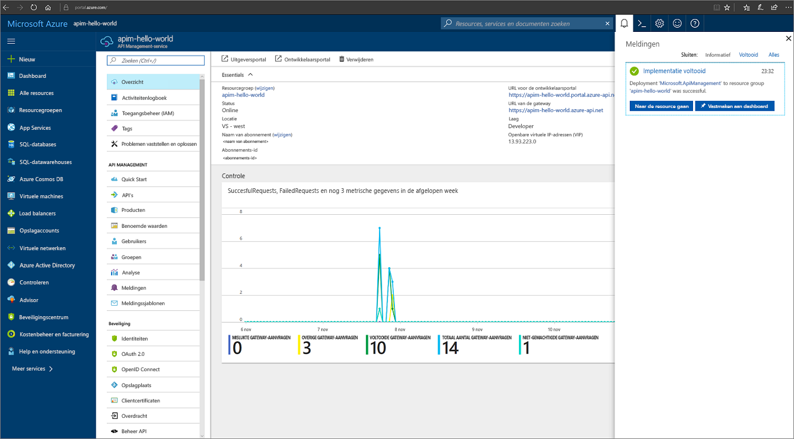
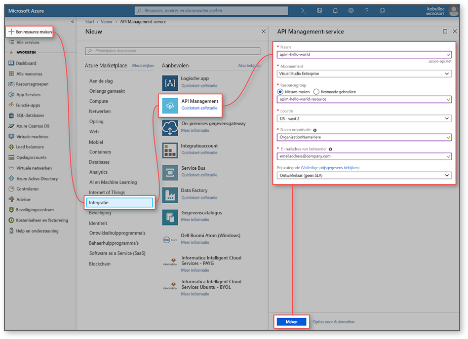
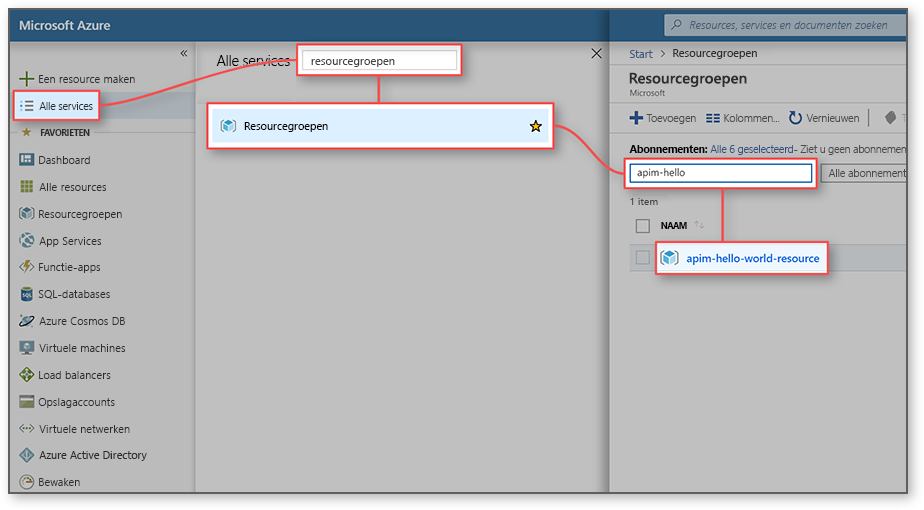
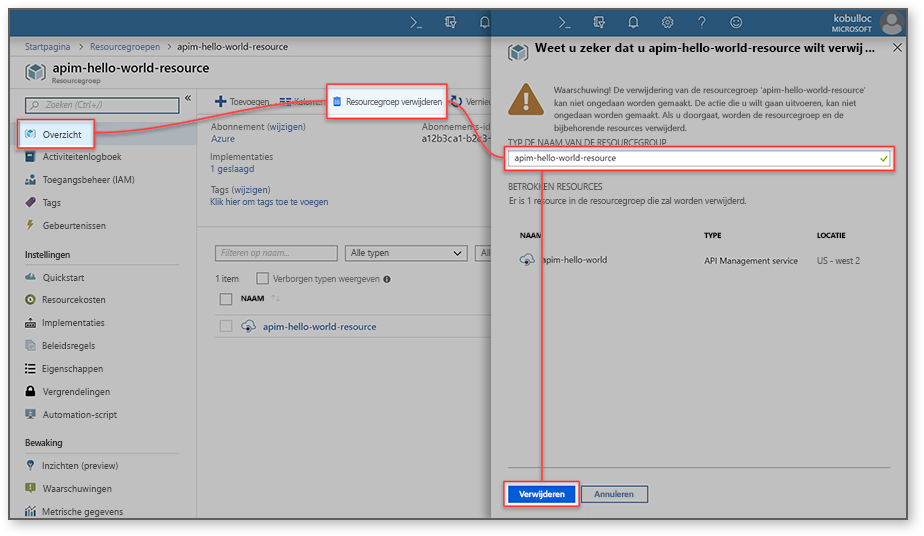

# Een nieuw exemplaar van de API Management-service maken

APIM (API Management) helpt organisaties bij het publiceren van API's naar externe en interne ontwikkelaars, en naar partnerontwikkelaars om alle mogelijkheden van hun gegevens en services te ontsluiten. API Management beschikt over de competenties die belangrijk zijn voor een geslaagd API-programma via ontwikkelaarsbetrokkenheid, zakelijke inzichten, analytische gegevens, beveiliging en bescherming. Met APIM kunt u moderne API-gateways maken en beheren voor bestaande back-endservices die op elke willekeurige locatie worden gehost. Bekijk het [Overzicht](api-management-key-concepts.md) voor meer informatie.

In deze quickstart worden de stappen beschreven voor het maken van een nieuw API Management-exemplaar met behulp van Azure Portal.

[!INCLUDE [quickstarts-free-trial-note](../../includes/quickstarts-free-trial-note.md)]

## Meld u aan bij Azure.

Meld u aan bij Azure Portal op https://portal.azure.com.

## Een nieuwe service maken

1. Selecteer in [Azure Portal](https://portal.azure.com/) achtereenvolgens **Een resource maken** > **Bedrijfsintegratie** > **API Management**.

    U kunt ook **Nieuw** kiezen, `API management` typen in het zoekvak en op Enter drukken. Klik op **Create**.

2. Voer in het venster **API Management-service** de instellingen in.

    

    | Instelling                 | Voorgestelde waarde                               | Beschrijving                                                                                                                                                                                                                                                                                                                         |
|-------------------------|-----------------------------------------------|-------------------------------------------------------------------------------------------------------------------------------------------------------------------------------------------------------------------------------------------------------------------------------------------------------------------------------------|
| **Naam**                | Een unieke naam voor de API Management-service | De naam kan later niet meer worden gewijzigd. De servicenaam wordt gebruikt om een standaarddomeinnaam te genereren in de notatie: *{name}.azure-api.net.* Zie [Een aangepast domein configureren](configure-custom-domain.md) als u een aangepaste domeinnaam wilt gebruiken.   De servicenaam wordt gebruikt om naar de service en de bijbehorende Azure-resource te verwijzen. |
| **Abonnement**        | Uw abonnement                             | Het abonnement waarin dit nieuwe service-exemplaar wordt gemaakt. U kunt het abonnement selecteren in een van de verschillende Azure-abonnementen waartoe u toegang hebt.                                                                                                                                                            |
| **Resourcegroep**      | *apimResourceGroup*                           | U kunt een nieuwe of bestaande resource selecteren. Een resourcegroep is een verzameling resources met dezelfde levenscyclus, dezelfde machtigingen en hetzelfde beleid. Klik [hier](../azure-resource-manager/resource-group-overview.md#resource-groups) voor meer informatie.                                                                                                  |
| **Locatie**            | *US - west*                                    | Selecteer de geografische regio bij u in de buurt. Alleen de beschikbare regio’s voor de API Management-service worden weergegeven in de vervolgkeuzelijst.                                                                                                                                                                                                          |
| **Naam van de organisatie**   | De naam van uw organisatie                 | Deze naam wordt op een aantal plekken gebruikt, onder andere in de titel van de ontwikkelaarsportal en als afzender bij e-mailmeldingen.                                                                                                                                                                                                             |
| **E-mailadres van de beheerder** | *admin@org.com*                               | Vast e-mailadres waarnaar alle meldingen afkomstig van **API Management** worden verzonden.                                                                                                                                                                                                                                              |
| **Prijscategorie**        | *Developer*                                   | Vaste **Developer**-laag om de service te evalueren. Deze laag is niet bedoeld voor productie. Zie [bijwerken en schalen](upgrade-and-scale.md) voor meer informatie over het schalen van API Management-lagen.                                                                                                                                    |

3. Kies **Maken**.

    > [!TIP]
    > Het duurt meestal tussen de 20 en 30 minuten om een API Management-service te maken. Als u **Vastmaken aan dashboard** selecteert, kunt u een nieuwe service gemakkelijker terugvinden.

[!INCLUDE [api-management-navigate-to-instance.md](../../includes/api-management-navigate-to-instance.md)]

## Resources opschonen

Wanneer de resourcegroep niet meer nodig is, kunt u deze stappen volgen om de resourcegroep en alle gerelateerde resources te verwijderen:

1. Selecteer in de Azure-portal de optie **Alle services**.
2. Voer `resource groups` in het zoekvak in en klik op het resultaat.

    

3. Ga naar uw resourcegroep en klik erop.
4. Klik op **Resourcegroep verwijderen**.

    

5. Bevestig de verwijdering door de naam van de resourcegroep in te voeren.
6. Klik op **Verwijderen**.

## Volgende stappen

> [!div class="nextstepaction"]
> [Uw eerste API importeren en publiceren](import-and-publish.md)
