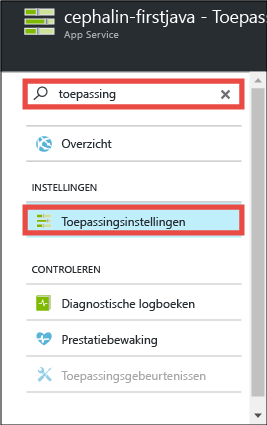
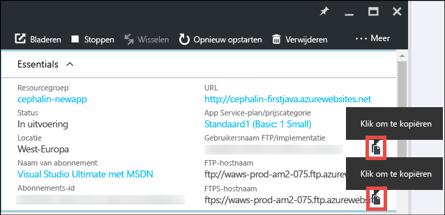
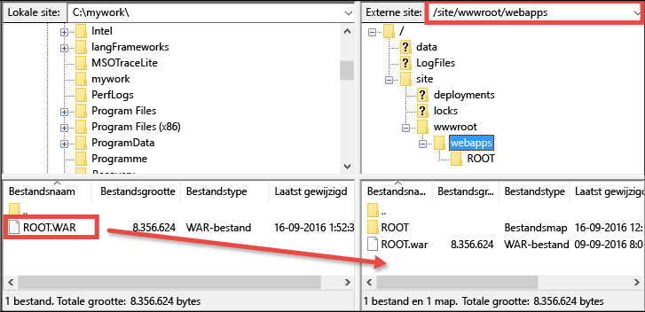

# Uw eerste Java-web-app in vijf minuten implementeren in Azure
Deze zelfstudie helpt u om een eenvoudige Java-web-app te implementeren in [Azure App Service](../app-service/app-service-value-prop-what-is.md).
Met App Service kunt u web-apps, [back-ends voor mobiele apps](/documentation/learning-paths/appservice-mobileapps/) en [API-apps](../app-service-api/app-service-api-apps-why-best-platform.md) maken.

U gaat het volgende doen: 

* Een web-app maken in Azure App Service.
* Een Java-voorbeeld-app implementeren.
* Zien hoe de code live in productie wordt uitgevoerd.

## Vereisten
* U moet beschikken over een FTP-/FTPS-client, zoals [FileZilla](https://filezilla-project.org/).
* Verkrijg een Microsoft Azure-account. Als u geen account hebt, kunt u zich [aanmelden voor een gratis proefversie](/pricing/free-trial/?WT.mc_id=A261C142F) of [uw voordelen als Visual Studio-abonnee activeren](/pricing/member-offers/msdn-benefits-details/?WT.mc_id=A261C142F).

> [!NOTE]
> U kunt [App Service proberen](http://go.microsoft.com/fwlink/?LinkId=523751) zonder een Azure-account. U kunt een beginnerstoepassing maken en hier een uur mee spelen. U hebt geen creditcard nodig en u doet geen toezeggingen.
> 
> 

## Een webtoepassing maken
1. Meld u met uw Azure-account aan bij [Azure Portal](https://portal.azure.com).
2. Klik in het menu aan de linkerkant op **Nieuw** > **Web en mobiel** > **Web-app**.
   
    
3. Gebruik op de blade voor het maken van de app de volgende instellingen voor de nieuwe app:
   
   * **App-naam**: voer een unieke naam in.
   * **Resourcegroep**: selecteer **Nieuwe maken** en geef de resourcegroep een naam.
   * **App Service-plan/-locatie**: klik hier om te configureren en klik vervolgens op **Nieuwe maken** om als u de naam, locatie en prijscategorie van het App Service-plan wilt instellen. Gebruik gerust de prijscategorie **Gratis**.
     
     Wanneer u klaar bent, ziet de blade voor het maken van de app er als volgt uit:
     
     
4. Klik onderaan op **Maken**. U kunt bovenaan op het **melding**spictogram klikken als u de voortgang wilt bekijken.
   
    
5. Wanneer de implementatie is voltooid, ziet u deze melding. Klik op het bericht als u de blade van uw implementatie wilt openen.
   
    
6. Klik op de blade **Implementatie is voltooid** op de koppeling **Resource** om de blade van de nieuwe web-app te openen.
   
    

## Een Java-app implementeren voor uw web-app
U gaat nu een Java-app in Azure implementeren via FTPS.

1. Schuif op de blade van de web-app omlaag naar **Toepassingsinstellingen** of zoek deze optie en klik erop. 
   
    
2. Selecteer in **Java-versie** de optie **Java 8** en klik op **Opslaan**.
   
    
   
    Wanneer u de melding **Web-appinstellingen zijn bijgewerkt** ziet, gaat u naar http://*&lt;appnaam>*.azurewebsites.net om de JSP-standaardservlet in actie te zien.
3. Schuif op de blade van de web-app omlaag naar **Referenties voor implementatie** of zoek deze optie en klik erop.
4. Stel uw implementatiereferenties in en klik op **Opslaan**.
5. Klik op de blade van de web-app op **Overzicht**. Klik naast **Gebruikersnaam FTP/implementatie** en **FTPS-hostnaam** op **Kopiëren** om deze waarden te kopiëren.
   
    
   
    U kunt nu de Java-app met FTPS gaan implementeren.
6. Meld u in de FTP-/FTPS-client aan bij de FTP-server van de Azure-web-app. Gebruik daarvoor de waarden die u tijdens de vorige stap hebt gekopieerd. Gebruik het implementatiewachtwoord dat u eerder hebt gemaakt.
   
    In de volgende schermafbeelding ziet u hoe aanmelding met FileZilla werkt.
   
    
   
    Mogelijk krijgt u beveiligingswaarschuwingen te zien over het niet-herkende SSL-certificaat van Azure. U kunt gewoon doorgaan.
7. Klik op [deze koppeling](https://github.com/Azure-Samples/app-service-web-java-get-started/raw/master/webapps/ROOT.war) om het WAR-bestand te downloaden naar de computer.
8. Navigeer in de FTP-/FTPS-client naar **site/wwwroot/webapps** van de externe site. Sleep het gedownloade WAR-bestand van de computer naar de externe map.
   
    
   
    Klik op **OK** om het bestand in Azure te overschrijven.
   
   > [!NOTE]
   > In overeenstemming met het standaardgedrag van Tomcat verwijst de bestandsnaam **ROOT.war** in site/wwwroot/webapps naar de hoofdweb-app (http://*&lt;appnaam>*.azurewebsites.net) en verwijst de bestandsnaam ***&lt;willekeurigenaam>*.war** naar een web-app met een naam (http://*&lt;appnaam>*.azurewebsites.net/*&lt;willekeurigenaam>*).
   > 
   > 

Dat is alles. De Java-app wordt nu live uitgevoerd in Azure. Navigeer in uw browser naar http://*&lt;appname>*.azurewebsites.net om de code in actie te zien. 

## Updates aanbrengen in uw app
Wanneer u een update wilt uitvoeren, uploadt u het nieuwe WAR-bestand via de FTP-/FTPS-client naar dezelfde externe map.

## Volgende stappen
[Maak een Java-web-app op basis van een sjabloon in Azure Marketplace](web-sites-java-get-started.md#marketplace). U kunt uw eigen volledig aanpasbare Tomcat-container krijgen en gebruikmaken van de vertrouwde gebruikersinterface voor beheerders. 

Spoor fouten in de Azure-web-app rechtstreeks op via [IntelliJ](app-service-web-debug-java-web-app-in-intellij.md) of [Eclipse](app-service-web-debug-java-web-app-in-eclipse.md).

Of doe meer met uw eerste web-app. Bijvoorbeeld:

* Probeer [andere manieren om uw code in Azure te implementeren](web-sites-deploy.md). 
* Breng uw Azure-app naar een hoger niveau. Verifieer uw gebruikers. Schaal de app op basis van vraag. Stel prestatiewaarschuwingen in. Dit alles met slechts enkele klikken. Zie [Functionaliteit toevoegen aan uw eerste web-app](app-service-web-get-started-2.md).

<!--HONumber=Nov16_HO2-->

