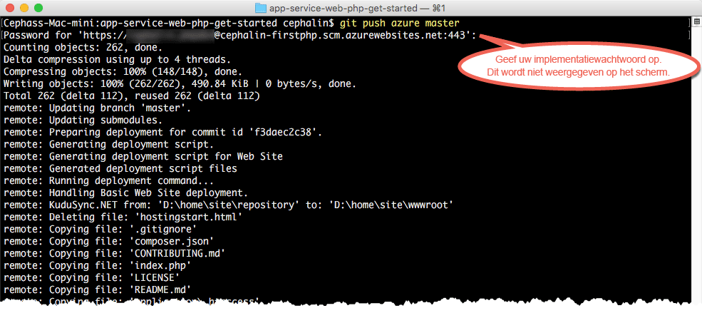

# Uw eerste PHP-web-app in vijf minuten in Azure implementeren

> [!div class="op_single_selector"]
> * [Eerste HTML-site](app-service-web-get-started-html-cli-nodejs.md)
> * [Eerste .NET-app](app-service-web-get-started-dotnet-cli-nodejs.md)
> * [Eerste PHP-app](app-service-web-get-started-php-cli-nodejs.md)
> * [Eerste Node.js-app](app-service-web-get-started-nodejs-cli-nodejs.md)
> * [Eerste Python-app](app-service-web-get-started-python-cli-nodejs.md)
> * [Eerste Java-app](app-service-web-get-started-java.md)
> 
> 

Met deze zelfstudie leert u om uw eerste PHP-web-app te implementeren in [Azure App Service](../app-service/app-service-value-prop-what-is.md).
Met App Service kunt u web-apps, [back-ends voor mobiele apps](/documentation/learning-paths/appservice-mobileapps/) en [API-apps](../app-service-api/app-service-api-apps-why-best-platform.md) maken.

U gaat het volgende doen: 

* Een web-app maken in Azure App Service.
* PHP-voorbeeldcode implementeren.
* Zien hoe de code live in productie wordt uitgevoerd.
* De web-app op dezelfde manier bijwerken als waarop u [Git-doorvoeracties pusht](https://git-scm.com/docs/git-push).

[!INCLUDE [app-service-linux](../../includes/app-service-linux.md)]

## CLI-versies om de taak uit te voeren

U kunt de taak uitvoeren met behulp van een van de volgende CLI-versies:

- [Azure CLI 1.0](app-service-web-get-started-php-cli-nodejs.md): onze CLI voor het klassieke implementatiemodel en het Resource Manager-implementatiemodel
- [Azure CLI 2.0 (Preview)](app-service-web-get-started-php.md): onze CLI van de volgende generatie voor het Resource Manager-implementatiemodel

## Vereisten
* [Git](http://www.git-scm.com/downloads).
* [Azure CLI](../xplat-cli-install.md).
* Een Microsoft Azure-account. Als u geen account hebt, kunt u zich [aanmelden voor een gratis proefversie](https://azure.microsoft.com/pricing/free-trial/?WT.mc_id=A261C142F) of [uw voordelen als Visual Studio-abonnee activeren](https://azure.microsoft.com/pricing/member-offers/msdn-benefits-details/?WT.mc_id=A261C142F).

> [!NOTE]
> U kunt [App Service proberen](https://azure.microsoft.com/try/app-service/) zonder een Azure-account. U kunt een beginnerstoepassing maken en hier een uur mee spelen. U hebt geen creditcard nodig en u doet geen toezeggingen.
> 
> 

## Een PHP-web-app implementeren
1. Open een nieuw(e) Windows-opdrachtprompt, PowerShell-venster, Linux-shell of OS X-terminal. Voer `git --version` en `azure --version` uit om te controleren of Git en Azure CLI op uw computer zijn geïnstalleerd.
   
    
   
    Als u de hulpprogramma's niet hebt geïnstalleerd, raadpleeg dan [Vereisten](#Prerequisites) voor downloadkoppelingen.
2. Meld u als volgt aan bij Azure:
   
        azure login
   
    Volg de aanwijzingen in het Help-bericht om door te gaan met de aanmelding.
   
    
3. Zet Azure CLI in de ASM-modus en stel vervolgens de implementatiegebruiker voor App Service in. U gaat later code implementeren met behulp van de referenties.
   
        azure config mode asm
        azure site deployment user set --username <username> --pass <password>
4. Schakel naar een werkmap (`CD`) en ga als volgt te werk om de voorbeeld-app voor PHP te kopiëren:
   
        git clone https://github.com/Azure-Samples/app-service-web-php-get-started.git
5. Schakel naar de opslagplaats van uw voorbeeld-app. Bijvoorbeeld:
   
        cd app-service-web-php-get-started
6. Maak de App Service-appresource in Azure met een unieke app-naam en de implementatiegebruiker die u eerder hebt geconfigureerd. Geef het nummer van de gewenste regio op wanneer dit wordt gevraagd.
   
        azure site create <app_name> --git --gitusername <username>
   
    
   
    Uw app is nu gemaakt in Azure. Bovendien is de huidige map voor Git geïnitialiseerd en als Git remote verbonden met de nieuwe App Service-app.
    U kunt naar de URL van de app bladeren (http://&lt;app_naam>.azurewebsites.net), om de mooi vormgegeven standaard-HTML-pagina te bekijken, maar in deze zelfstudie gaan we uw code hier neerzetten.
7. Implementeer de voorbeeldcode in de Azure-app op dezelfde manier als waarop u code zou pushen met Git. Gebruik, wanneer u daarnaar wordt gevraagd, het wachtwoord dat u eerder hebt geconfigureerd.
   
        git push azure master
   
    
   
    `git push` plaatst niet alleen code in Azure, maar activeert ook implementatietaken in de implementatie-engine. U kunt ook  [de Composer-extensie inschakelen](web-sites-php-mysql-deploy-use-git.md#composer) als u composer.json-bestanden in uw PHP-app automatisch wilt verwerken.

Gefeliciteerd, u hebt uw app geïmplementeerd in Azure App Service.

## Uw app live in werking zien
Als u uw app in Azure in werking wilt zien, voert u deze opdracht uit vanuit een willekeurige map in de opslagplaats:

    azure site browse

## Updates aanbrengen in uw app
Nu kunt u met Git op elk moment push-acties uitvoeren vanuit het project (opslagplaats) om een actieve site bij te werken. Dit werkt op dezelfde manier als toen u de code voor het eerst implementeerde. Zo hoeft u telkens wanneer u een nieuwe wijziging wilt pushen die u lokaal hebt getest, alleen de volgende opdrachten uit te voeren vanuit de hoofdmap van het project (opslagplaats):

    git add .
    git commit -m "<your_message>"
    git push azure master

## Volgende stappen
[Maak, configureer en implementeer een Laravel-web-app in Azure](app-service-web-php-get-started-cli-nodejs.md). Door deze zelfstudie te volgen, leert u de basisvaardigheden voor het uitvoeren van een PHP-web-app in Azure, zoals:

* Apps via PowerShell/Bash maken en configureren in Azure.
* De PHP-versie instellen.
* Een opstartbestand gebruiken dat zich niet in de hoofdmap van de toepassing bevindt.
* Composer-automatisering inschakelen.
* Omgevingsspecifieke variabelen openen.
* Veelvoorkomende problemen oplossen.

Of doe meer met uw eerste web-app. Bijvoorbeeld:

* Probeer [andere manieren om uw code in Azure te implementeren](web-sites-deploy.md). Als u bijvoorbeeld wilt implementeren vanuit een van uw GitHub-opslagplaatsen, selecteert u in **Implementatieopties** **GitHub** in plaats van **Lokale Git-opslagplaats**.
* Breng uw Azure-app naar een hoger niveau. Verifieer uw gebruikers. Schaal de app op basis van vraag. Stel prestatiewaarschuwingen in. Dit alles met slechts enkele klikken. Zie [Functionaliteit toevoegen aan uw eerste web-app](app-service-web-get-started-2.md).

<!--HONumber=Feb17_HO2-->

