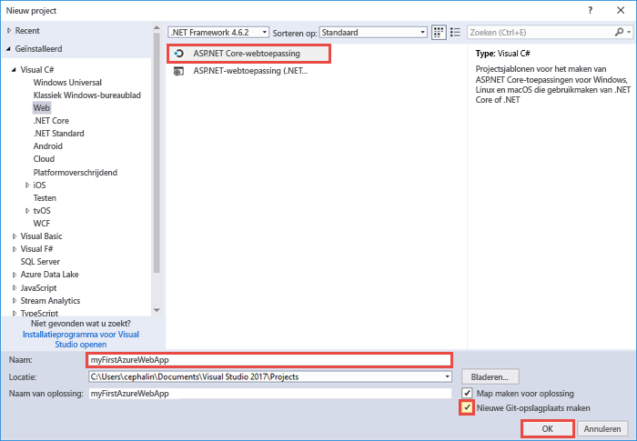
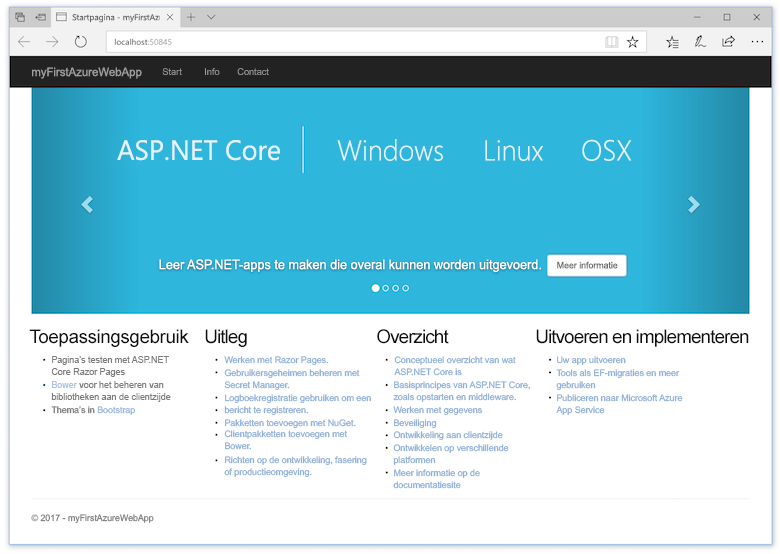
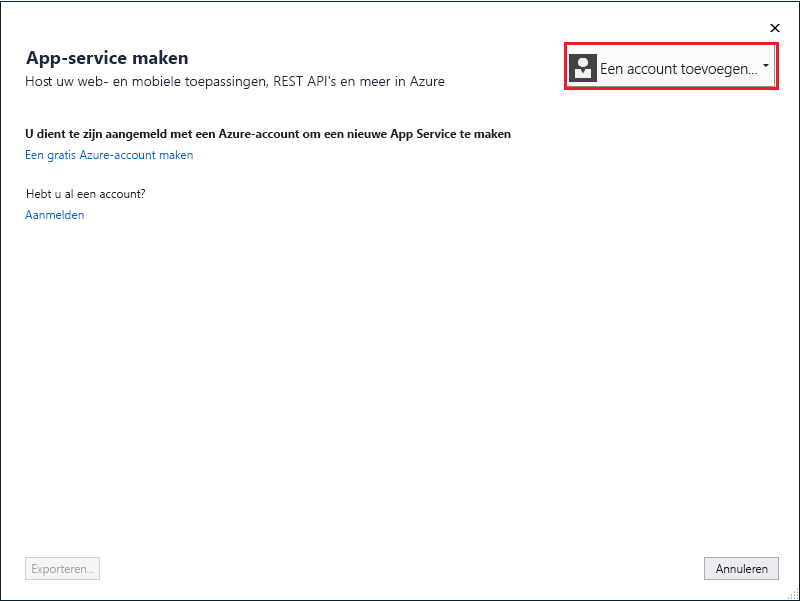
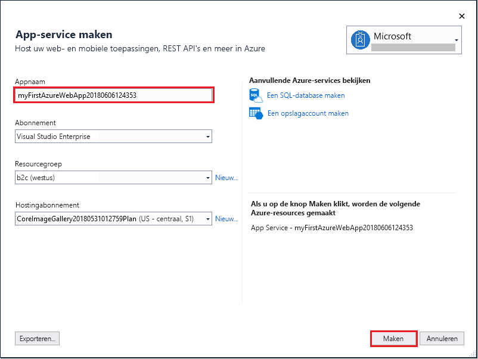
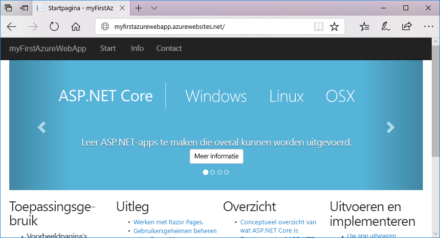
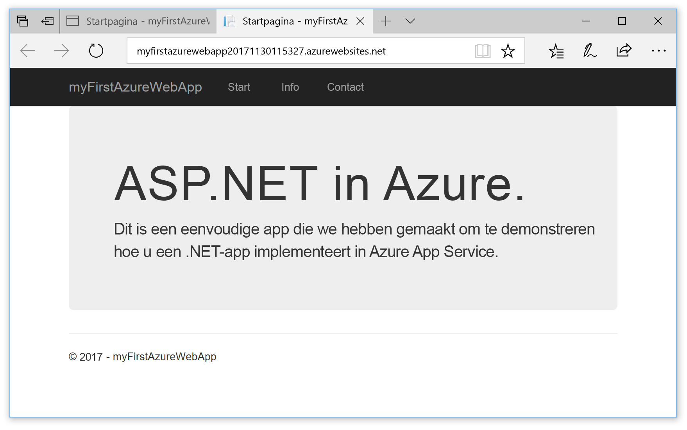

# <a name="create-an-aspnet-core-web-app-in-azure"></a>Een ASP.NET Core-web-app maken in Azure

> [!NOTE]
> In dit artikel gaat u een app implementeren in App Service onder Windows. Zie [Een .NET Core-web-app maken en implementeren in App Service onder Linux ](./containers/quickstart-dotnetcore.md) om een app te implementeren in App Service onder _Linux_.
>

[Azure Web Apps](app-service-web-overview.md) biedt een uiterst schaalbare webhostingservice met self-patchfunctie.  Deze quickstart laat zien hoe uw eerste ASP.NET Core-web-app implementeert in Azure Web Apps. Als u klaar bent, hebt u een resourcegroep die bestaat uit een App Service-plan en een Azure-web-app met een geïmplementeerde webtoepassing.

> [!NOTE]
> Als u wilt weten hoe u een ASP.NET Framework-web-app kunt maken en implementeren, raadpleegt u het artikel [hier](app-service-web-get-started-dotnet-framework.md). 
>

## <a name="prerequisites"></a>Vereisten

Vereisten voor het voltooien van deze zelfstudie:

* Installeer <a href="https://www.visualstudio.com/downloads/" target="_blank">Visual Studio 2017</a> met de volgende workloads:
    - **ASP.NET- en web-ontwikkeling**
    - **Azure-ontwikkeling**

    

[!INCLUDE [quickstarts-free-trial-note](../../includes/quickstarts-free-trial-note.md)]

## <a name="create-an-aspnet-core-web-app"></a>Een ASP.NET Core-web-app maken

Maak in Visual Studio een project door **Bestand > Nieuw > Project** te selecteren. 

Selecteer **Visual C# > Web > ASP.NET Core-webtoepassing** in het dialoogvenster **Nieuw project**.

Geef de toepassing de naam _myFirstAzureWebApp_ en selecteer vervolgens **OK**.
   


U kunt elk type ASP.NET Core-web-app implementeren in Azure. Voor deze quickstart selecteert u de sjabloon **Webtoepassing** en stelt u verificatie in op **Geen verificatie**.
      
Selecteer **OK**.


Zodra het ASP.NET Core-project is gemaakt, worden de welkomstpagina van ASP.NET Core weergegeven. Deze biedt talrijke koppelingen naar bronnen die u op weg helpen. 


Selecteer in het menu **Fouten opsporen > Starten zonder foutopsporing** om de web-app lokaal uit te voeren.



## <a name="publish-to-azure"></a>Publiceren naar Azure

Klik in **Solution Explorer** met de rechtermuisknop op het project **myFirstAzureWebApp**-en selecteer **Publiceren**.


Zorg ervoor dat **Microsoft Azure App Service** is geselecteerd en selecteer dan **Publiceren**.


Hiermee opent u het dialoogvenster **App Service maken**, waarmee u alle Azure-resources kunt maken die nodig zijn voor het uitvoeren van uw ASP.NET Core-web-app in Azure.

## <a name="sign-in-to-azure"></a>Aanmelden bij Azure

Selecteer **Een account toevoegen** in het dialoogvenster **App Service maken** en meld u vervolgens aan bij uw Azure-abonnement. Als u al bent aangemeld, selecteert u het account met het gewenste abonnement uit de vervolgkeuzelijst.

> [!NOTE]
> Als u al bent aangemeld, selecteert u **Maken** nog niet.
>
>
   


## <a name="create-a-resource-group"></a>Een resourcegroep maken

[!INCLUDE [resource group intro text](../../includes/resource-group.md)]

Selecteer **Nieuw** naast **Resourcegroep**.

Geef de resourcegroep de naam **myResourceGroup** en selecteer **OK**.

## <a name="create-an-app-service-plan"></a>Een App Service-plan maken

[!INCLUDE [app-service-plan](../../includes/app-service-plan.md)]

Selecteer **Nieuw** naast **App Service-plan**. 

Gebruik in het dialoogvenster **App Service-plan configureren** de instellingen uit de tabel na de onderstaande schermafbeelding.


| Instelling | Voorgestelde waarde | Beschrijving |
|-|-|-|
|App Service-plan| myAppServicePlan | De naam van het App Service-plan. |
| Locatie | West-Europa | Het datacenter waar de web-app wordt gehost. |
| Grootte | Gratis | De [prijscategorie](https://azure.microsoft.com/pricing/details/app-service/?ref=microsoft.com&utm_source=microsoft.com&utm_medium=docs&utm_campaign=visualstudio) bepaalt de hosting-functies. |

Selecteer **OK**.

## <a name="create-and-publish-the-web-app"></a>De web-app maken en publiceren

Voer bij **Web-appnaam** een unieke appnaam in (geldige tekens zijn `a-z`, `0-9` en `-`) of accepteer de automatisch gegenereerde unieke naam. De URL van de web-app is `http://<app_name>.azurewebsites.net`, waarbij `<app_name>` de naam van uw web-app is.

Selecteer **Maken** om de Azure-resources te gaan maken.



Zodra de wizard is voltooid, wordt de ASP.NET Core-web-app naar Azure gepubliceerd. Daarna wordt de app gestart in de standaardbrowser.



De naam van de web-app die is opgegeven in de [stap voor maken en publiceren](#create-and-publish-the-web-app), wordt gebruikt als URL-voorvoegsel in de indeling `http://<app_name>.azurewebsites.net`.

Gefeliciteerd, uw ASP.NET Core-web-app wordt live uitgevoerd in Azure App Service.

## <a name="update-the-app-and-redeploy"></a>De app bijwerken en opnieuw implementeren

Open vanuit de **Solution Explorer** _Pages/Index.cshtml_.

Zoek ergens bovenaan de HTML-tag `<div id="myCarousel" class="carousel slide" data-ride="carousel" data-interval="6000">` en vervang het volledige element door de volgende code:

```HTML
<div class="jumbotron">
    <h1>ASP.NET in Azure!</h1>
    <p class="lead">This is a simple app that we’ve built that demonstrates how to deploy a .NET app to Azure App Service.</p>
</div>
```

Als u opnieuw wilt implementeren naar Azure, klikt u in **Solution Explorer** met de rechtermuisknop op het project **myFirstAzureWebApp** en selecteert u **Publiceren**.

Selecteer **Publiceren** op de publicatiepagina.

Als het publiceren is voltooid, start Visual Studio een browser waarin de URL van de web-app wordt geladen.



## <a name="manage-the-azure-web-app"></a>De Azure-web-app beheren

Ga naar <a href="https://portal.azure.com" target="_blank">Azure Portal</a> om de web-app te beheren.

Selecteer in het linkermenu **App Services** en selecteer de naam van uw Azure-web-app.


De pagina Overzicht van uw web-app wordt weergegeven. Hier kunt u algemene beheertaken uitvoeren, zoals bladeren, stoppen, starten, opnieuw opstarten en verwijderen. 


Het linkermenu bevat een aantal pagina's voor het configureren van uw app. 

[!INCLUDE [Clean-up section](../../includes/clean-up-section-portal.md)]

## <a name="next-steps"></a>Volgende stappen

> [!div class="nextstepaction"]
> [ASP.NET Core met SQL Database](app-service-web-tutorial-dotnetcore-sqldb.md)
