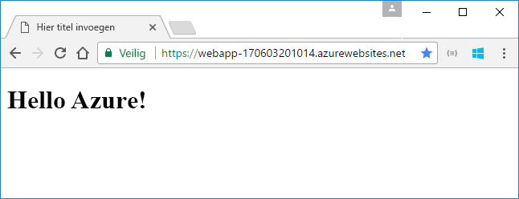
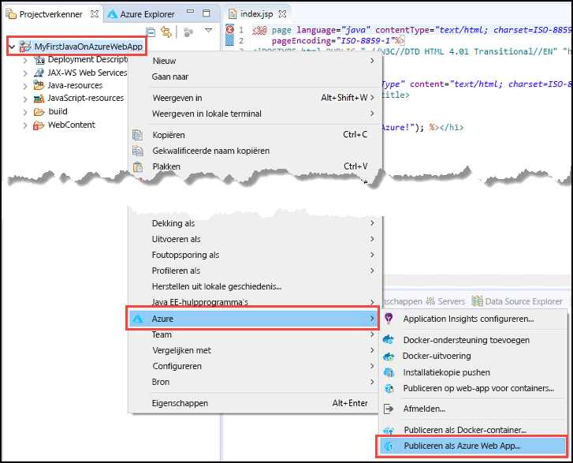
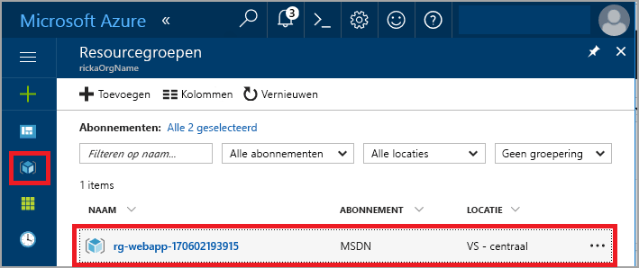
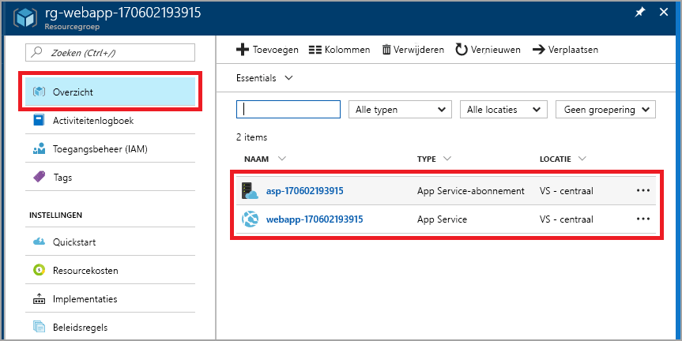

# <a name="create-your-first-java-web-app-in-azure"></a>Uw eerste Java-web-app in Azure maken

Azure [Web Apps](app-service-web-overview.md) biedt een uiterst schaalbare webhostingservice met self-patchfunctie. In deze quickstart leert u hoe u een Java-web-app implementeert in App Service met behulp van de [Eclipse IDE voor Java EE-ontwikkelaars](http://www.eclipse.org/).

Wanneer u deze quickstart hebt voltooid en uw toepassing in een webbrowser bekijkt, ziet uw toepassing er ongeveer als volgt uit:



## <a name="prerequisites"></a>Vereisten

Deze onderdelen moeten zijn geïnstalleerd om deze quickstart te kunnen voltooien:

* De gratis <a href="http://www.eclipse.org/downloads/" target="_blank">Eclipse IDE voor Java EE-ontwikkelaars</a>. Deze quickstart maakt gebruik van Eclipse Neon.
* De <a href="/java/azure/eclipse/azure-toolkit-for-eclipse-installation" target="_blank">Azure Toolkit voor Eclipse</a>.

[!INCLUDE [quickstarts-free-trial-note](../../includes/quickstarts-free-trial-note.md)]

## <a name="create-a-dynamic-web-project-in-eclipse"></a>Een dynamisch webproject maken in Eclipse

Selecteer in Eclipse **Bestand** > **Nieuw** > **Dynamisch webproject**.

Geef het project in het dialoogvenster **Nieuw dynamisch webproject** de naam **MyFirstJavaOnAzureWebApp** en selecteer **Voltooien**.
   


### <a name="add-a-jsp-page"></a>Een JSP-pagina toevoegen

Geef Projectverkenner weer als dat nu niet het geval is.


Vouw in Projectverkenner het project **MyFirstJavaOnAzureWebApp** uit.
Klik met de rechtermuisknop op **WebContent** en selecteer vervolgens **Nieuw** > **JSP-bestand**.


In het dialoogvenster **Nieuw JSP-bestand**:

* Noem het bestand **index.jsp**.
* Selecteer **Voltooien**.

  

Vervang in het bestand index.jsp het element `<body></body>` door de volgende code:

```jsp
<body>
<h1><% out.println("Hello Azure!"); %></h1>
</body>
```

Sla de wijzigingen op.

## <a name="publish-the-web-app-to-azure"></a>De web-app publiceren in Azure

Klik in Projectverkenner met de rechtermuisknop op het project en selecteer vervolgens **Azure** > **Publiceren als Azure Web App**.



Laat in het dialoogvenster **Azure-aanmelding** de optie **Interactief** ingeschakeld en selecteer **Aanmelden**.

Volg de instructies om u aan te melden.

### <a name="deploy-web-app-dialog-box"></a>Het dialoogvenster Web-app implementeren

Nadat u zich hebt aangemeld bij uw Azure-account, wordt het dialoogvenster **Web-app implementeren** weergegeven.

Selecteer **Maken**.


### <a name="create-app-service-dialog-box"></a>Het dialoogvenster App Service maken

Het dialoogvenster **App Service** wordt weergegeven met standaardwaarden. De numerieke waarde **170602185241** in de volgende afbeelding is anders in het dialoogvenster dat u ziet.


In het dialoogvenster **App Service maken**:

* Gebruik de gegenereerde naam voor de web-app. Deze naam moet uniek zijn binnen Azure. De naam is onderdeel van het URL-adres voor de web-app. Als de web-app bijvoorbeeld de naam **MyJavaWebApp** heeft, is de URL *myjavawebapp.azurewebsites.net*.
* Gebruik standaard-webcontainer.
* Selecteer een Azure-abonnement.
* Op het tabblad **App Service-plan**:

  * **Nieuwe maken**: gebruik de standaardwaarde, wat de naam van het App Service-plan is.
  * **Locatie**: selecteer **West-Europa** of een locatie bij u in de buurt.
  * **Prijscategorie**: selecteer een gratis variant. Voor een functiebeschrijving zie [App Service-prijzen](https://azure.microsoft.com/pricing/details/app-service/?ref=microsoft.com&utm_source=microsoft.com&utm_medium=docs&utm_campaign=visualstudio).

   

[!INCLUDE [app-service-plan](../../includes/app-service-plan.md)]

### <a name="resource-group-tab"></a>Het tabblad Resourcegroep

Selecteer het tabblad **Resourcegroep**. Gebruik de gegenereerde standaardwaarde voor de resourcegroep.


[!INCLUDE [resource-group](../../includes/resource-group.md)]

Selecteer **Maken**.

<!--
### The JDK tab

Select the **JDK** tab. Keep the default, and then select **Create**.


-->

De web-app wordt gemaakt in Azure Toolkit en de voortgang wordt in een dialoogvenster weergegeven.


### <a name="deploy-web-app-dialog-box"></a>Het dialoogvenster Web-app implementeren

Selecteer **Implementeren in hoofdmap** in het dialoogvenster **Web-app implementeren**. Als u een app-service hebt in *wingtiptoys.azurewebsites.net* en u niet in de hoofdmap implementeert, wordt de web-app met de naam **MyFirstJavaOnAzureWebApp** geïmplementeerd in *wingtiptoys.azurewebsites.net/MyFirstJavaOnAzureWebApp*.


In het dialoogvenster ziet u de selecties voor Azure, JDK en webcontainer.

Selecteer **Implementeren** om de web-app in Azure te publiceren.

Als het publiceren is voltooid, selecteert u de koppeling **Gepubliceerd** in het dialoogvenster **Azure-activiteitenlogboek**.


Gefeliciteerd. De web-app is nu geïmplementeerd in Azure. 


## <a name="update-the-web-app"></a>De web-app bijwerken

Wijzig de tekst van de JSP-voorbeeldcode.

```jsp
<body>
<h1><% out.println("Hello again Azure!"); %></h1>
</body>
```

Sla de wijzigingen op.

Klik in Projectverkenner met de rechtermuisknop op het project en selecteer vervolgens **Azure** > **Publiceren als Azure Web App**.

Het dialoogvenster **Web-app implementeren** wordt geopend, met de app-service die u eerder hebt gemaakt. 

> [!NOTE] 
> Selecteer **Implementeren in hoofdmap** telkens wanneer u gaat publiceren. 
> 

Selecteer de web-app en selecteer **Implementeren** om de wijzigingen te publiceren.

Wanneer de koppeling **Publiceren** wordt weergegeven, selecteert u deze om naar de web-app te bladeren en de wijzigingen te bekijken.

## <a name="manage-the-web-app"></a>De web-app beheren

Ga naar <a href="https://portal.azure.com" target="_blank">Azure Portal</a> om de web-app te zien die u hebt gemaakt.

Selecteer **Resourcegroepen** in het linkermenu.



Selecteer de resourcegroep. De pagina bevat de resources die u in deze quickstart hebt gemaakt.



Selecteer de web-app (**webapp 170602193915** in de voorgaande afbeelding).

De pagina **Overzicht** wordt weergegeven. Deze pagina geeft u een overzicht van hoe de app presteert. Hier kunt u algemene beheertaken uitvoeren, zoals bladeren, stoppen, starten, opnieuw starten en verwijderen. De tabbladen aan de linkerkant van de pagina tonen de verschillende configuraties die u kunt openen. 


[!INCLUDE [clean-up-section-portal-web-app](../../includes/clean-up-section-portal-web-app.md)]

## <a name="next-steps"></a>Volgende stappen

> [!div class="nextstepaction"]
> [Aangepast domein toewijzen](app-service-web-tutorial-custom-domain.md)
