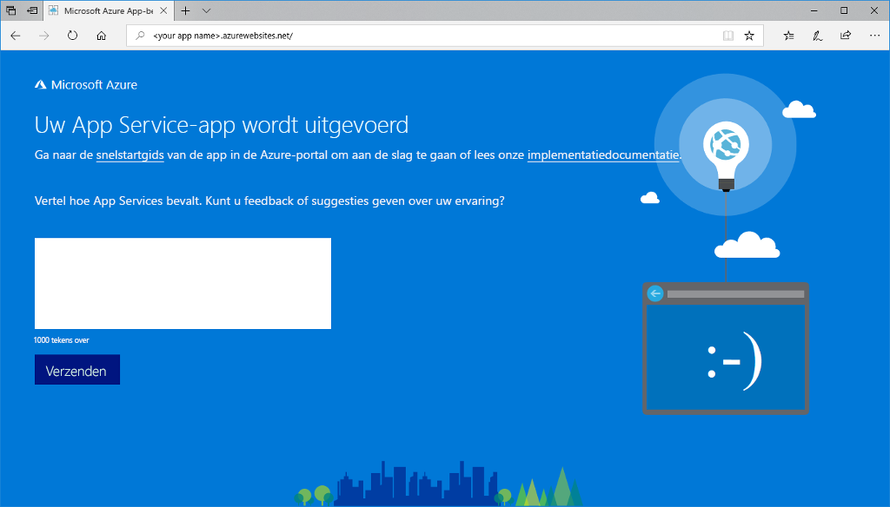

# <a name="create-a-nodejs-web-app-in-azure"></a>Een Node.js-web-app maken in Azure

> [!NOTE]
> In dit artikel gaat u een app implementeren in App Service onder Windows. Zie [Een Node.js-web-app maken en implementeren in Azure App Service onder Linux ](./containers/quickstart-nodejs.md) om een app te implementeren in App Service onder _Linux_.
>

[Azure Web Apps](app-service-web-overview.md) biedt een uiterst schaalbare webhostingservice met self-patchfunctie.  Deze Quickstart laat zien hoe u een Node.js-app naar Azure Web Apps implementeert. U maakt de web-app via de [Azure CLI](https://docs.microsoft.com/cli/azure/get-started-with-azure-cli), en gebruikt ZipDeploy om de voorbeeldcode van Node.js in de web-app te implementeren.


U kunt de onderstaande stappen volgen met behulp van een Mac-, Windows- of Linux-computer. Vanaf het moment dat de vereiste onderdelen zijn geïnstalleerd, duurt het ongeveer vijf minuten om de stappen uit te voeren.   

[!INCLUDE [quickstarts-free-trial-note](../../includes/quickstarts-free-trial-note.md)]

## <a name="prerequisites"></a>Vereisten

Dit zijn de vereisten voor het voltooien van deze snelstart:

* <a href="https://nodejs.org/" target="_blank">Node.js en NPM installeren</a>

## <a name="download-the-sample"></a>Het voorbeeld downloaden

Download het Node.js-voorbeeldproject in [https://github.com/Azure-Samples/nodejs-docs-hello-world/archive/master.zip](https://github.com/Azure-Samples/nodejs-docs-hello-world/archive/master.zip) en pak het ZIP-archief uit.

Open _index.js_ en zoek de volgende regel:

```javascript
var port = process.env.PORT || 1337;
```

App Service injecteert process.env.PORT in uw toepassing, zodat de code de variabele gebruikt om te weten naar welke poort moet worden geluisterd. 

Navigeer in een terminalvenster naar de hoofdmap van het Node.js-voorbeeldproject (de map die _index.js_ bevat).

## <a name="run-the-app-locally"></a>De app lokaal uitvoeren

Voer de toepassing lokaal uit zodat u kunt zien hoe deze eruit ziet wanneer u de toepassing implementeert naar Azure. Open een terminalvenster en gebruik het script `npm start` om de ingebouwde Node.js HTTP-server te starten.

```bash
npm start
```

Open een webbrowser en navigeer naar de voorbeeldapp op `http://localhost:1337`.

Het bericht **Hello World** uit de voorbeeld-app wordt weergegeven op de pagina.


Druk in uw terminalvenster op **Ctrl + C** om de webserver af te sluiten.

> [!NOTE]
> In Azure App Service wordt de app uitgevoerd in IIS met [iisnode](https://github.com/Azure/iisnode). Voor het uitvoeren van de app met iisnode staat er een web.config-bestand in de hoofdmap van de app. Dit bestand kan worden gelezen door IIS en de instellingen voor iisnode zijn beschreven in [de GitHub-opslagplaats voor iisnode](https://github.com/Azure/iisnode/blob/master/src/samples/configuration/web.config).

[!INCLUDE [Create ZIP file](../../includes/app-service-web-create-zip.md)]

[!INCLUDE [cloud-shell-try-it.md](../../includes/cloud-shell-try-it.md)]

[!INCLUDE [Create resource group](../../includes/app-service-web-create-resource-group-scus.md)] 

[!INCLUDE [Create app service plan](../../includes/app-service-web-create-app-service-plan-scus.md)] 

## <a name="create-a-web-app"></a>Een webtoepassing maken

Maak in Cloud Shell een web-app in het App Service-plan van `myAppServicePlan` met de opdracht [`az webapp create`](/cli/azure/webapp?view=azure-cli-latest#az-webapp-create). 

Vervang in het volgende voorbeeld `<app_name>` door een unieke naam (geldige tekens zijn `a-z`, `0-9`, en `-`).

```azurecli-interactive
# Bash and Powershell
az webapp create --resource-group myResourceGroup --plan myAppServicePlan --name <app_name>
```

Wanneer de web-app is gemaakt, toont de Azure CLI soortgelijke uitvoer als in het volgende voorbeeld:

```json
{
  "availabilityState": "Normal",
  "clientAffinityEnabled": true,
  "clientCertEnabled": false,
  "cloningInfo": null,
  "containerSize": 0,
  "dailyMemoryTimeQuota": 0,
  "defaultHostName": "<app_name>.azurewebsites.net",
  "enabled": true,
  < JSON data removed for brevity. >
}
```

### <a name="set-nodejs-runtime"></a>Node.js-runtime instellen

Stel de Node-runtime in op 8.11.1. Voer [`az webapp list-runtimes`](/cli/azure/webapp?view=azure-cli-latest#az-webapp-list-runtimes) uit als u alle ondersteunde runtimes wilt zien.

```azurecli-interactive
# Bash and Powershell
az webapp config appsettings set --resource-group myResourceGroup --name <app_name> --settings WEBSITE_NODE_DEFAULT_VERSION=8.11.1
```

Blader naar uw nieuwe web-app. Vervang _&lt;app-naam>_ door een unieke app-naam.

```bash
http://<app name>.azurewebsites.net
```

Zo zou uw nieuwe web-app er moeten uitzien:



[!INCLUDE [Deploy ZIP file](../../includes/app-service-web-deploy-zip.md)]

## <a name="browse-to-the-app"></a>Bladeren naar de app

Blader naar de geïmplementeerde toepassing via uw webbrowser.

```
http://<app_name>.azurewebsites.net
```

De Node.js-voorbeeldcode wordt uitgevoerd in een web-app van Azure App Service.


**Gefeliciteerd!** U hebt uw eerste Node.js-app geïmplementeerd in App Service.

## <a name="update-and-redeploy-the-code"></a>De code bijwerken en opnieuw implementeren

Open met een teksteditor het bestand `index.js` binnen de Node.js-app en breng een kleine wijziging aan in de tekst in de aanroep naar `response.end`:

```nodejs
response.end("Hello Azure!");
```

Navigeer in het lokale terminalvenster naar de hoofdmap van uw toepassing en maak een nieuw ZIP-bestand voor uw bijgewerkte project.

```
# Bash
zip -r myUpdatedAppFiles.zip .

# PowerShell
Compress-Archive -Path * -DestinationPath myUpdatedAppFiles.zip
```

Implementeer dit nieuwe ZIP-bestand in App Service, met behulp van dezelfde stappen als bij [Het ZIP-bestand implementeren](#deploy-zip-file).

Ga terug naar het browservenster dat is geopend in de stap **Bladeren naar de app** en vernieuw de pagina.


## <a name="manage-your-new-azure-web-app"></a>Uw nieuwe Azure-web-app beheren

Ga naar <a href="https://portal.azure.com" target="_blank">Azure Portal</a> om de web-app te beheren die u hebt gemaakt.

Klik in het linkermenu op **App Services** en klik op de naam van uw Azure-web-app.


De pagina Overzicht van uw web-app wordt weergegeven. Hier kunt u algemene beheertaken uitvoeren, zoals bladeren, stoppen, starten, opnieuw opstarten en verwijderen. 


Het linkermenu bevat een aantal pagina's voor het configureren van uw app. 

## <a name="video"></a>Video

Bekijk de video om de inhoud van deze snelstartgids in actie te zien en doorloop de stappen daarna zelf om uw eerste Node.js-app op Azure te publiceren.

> [!VIDEO https://channel9.msdn.com/Shows/Azure-for-Node-Developers/Create-a-Nodejs-app-in-Azure-Quickstart/player]   

[!INCLUDE [cli-samples-clean-up](../../includes/cli-samples-clean-up.md)]

## <a name="next-steps"></a>Volgende stappen

> [!div class="nextstepaction"]
> [Node.js met MongoDB](app-service-web-tutorial-nodejs-mongodb-app.md)
