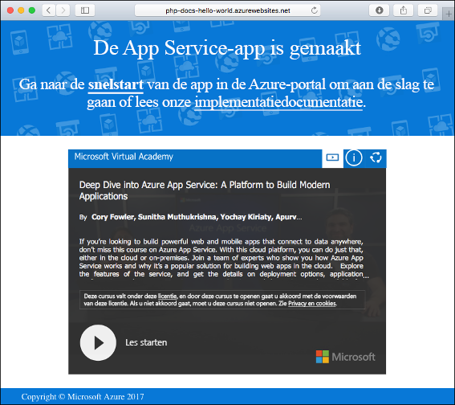
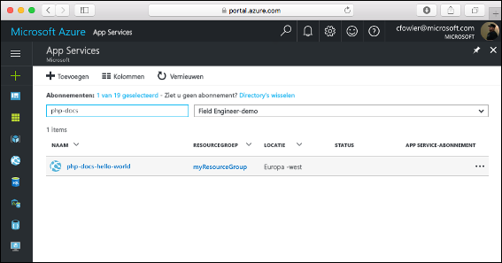
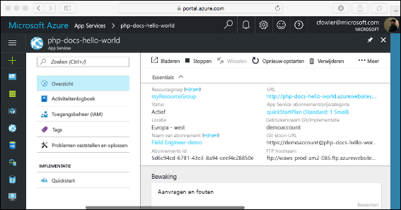

# <a name="create-a-php-web-app-in-azure"></a>Een PHP-web-app maken in Azure

> [!NOTE]
> In dit artikel gaat u een app implementeren in App Service onder Windows. Zie [Een PHP-web-app maken en implementeren in App Service onder Linux ](./containers/quickstart-php.md) om een app te implementeren in App Service onder _Linux_.
>

[Azure Web Apps](app-service-web-overview.md) biedt een uiterst schaalbare webhostingservice met self-patchfunctie.  Deze quickstart laat zien hoe u een PHP-app naar Azure Web Apps implementeert. U maakt de web-app via de [Azure CLI](https://docs.microsoft.com/cli/azure/get-started-with-azure-cli) in Cloud Shell en u gebruikt een [ZIP-bestand](app-service-deploy-zip.md) om PHP-voorbeeldcode in de web-app te implementeren.

![Voorbeeld-app die wordt uitgevoerd in Azure]](media/app-service-web-get-started-php/hello-world-in-browser.png)

U kunt de onderstaande stappen volgen met behulp van een Mac-, Windows- of Linux-computer. Vanaf het moment dat de vereiste onderdelen zijn geïnstalleerd, duurt het ongeveer vijf minuten om de stappen uit te voeren.

## <a name="prerequisites"></a>Vereisten

Dit zijn de vereisten voor het voltooien van deze quickstart:

* <a href="https://php.net" target="_blank">PHP installeren</a>

[!INCLUDE [quickstarts-free-trial-note](../../includes/quickstarts-free-trial-note.md)]

## <a name="download-the-sample-locally"></a>Het voorbeeld lokaal downloaden

Download het PHP-voorbeeldproject van [https://github.com/Azure-Samples/php-docs-hello-world/archive/master.zip](https://github.com/Azure-Samples/php-docs-hello-world/archive/master.zip) en pak het ZIP-bestand uit.

Navigeer in een terminalvenster naar de hoofdmap van het PHP-voorbeeldproject (de map die _index.php_ bevat).

## <a name="run-the-app-locally"></a>De app lokaal uitvoeren

Voer de toepassing lokaal uit door een terminalvenster te openen en de opdracht `php` te gebruiken om de ingebouwde PHP-webserver te starten.

```bash
php -S localhost:8080
```

Open een webbrowser en navigeer naar de voorbeeldapp op `http://localhost:8080`.

Het bericht **Hallo wereld** uit de voorbeeld-app wordt weergegeven op de pagina.


Druk in uw terminalvenster op **Ctrl + C** om de webserver af te sluiten.

[!INCLUDE [Create ZIP file](../../includes/app-service-web-create-zip.md)]

[!INCLUDE [cloud-shell-try-it.md](../../includes/cloud-shell-try-it.md)]

[!INCLUDE [Upload zip file](../../includes/app-service-web-upload-zip.md)]

[!INCLUDE [Create resource group](../../includes/app-service-web-create-resource-group.md)]

[!INCLUDE [Create app service plan](../../includes/app-service-web-create-app-service-plan.md)]

## <a name="create-a-web-app"></a>Een webtoepassing maken

Maak in de Cloud Shell een web-app in het `myAppServicePlan` App Service-plan met de opdracht [az webapp](/cli/azure/webapp?view=azure-cli-latest#az_webapp_create). 

Vervang in het volgende voorbeeld `<app_name>` door een unieke naam (geldige tekens zijn `a-z`, `0-9`, en `-`). De runtime is ingesteld op `PHP|7.0`. Voer [az webapp list-runtimes](/cli/azure/webapp?view=azure-cli-latest#az_webapp_list_runtimes) uit om alle ondersteunde runtimes te bekijken. 

```azurecli-interactive
az webapp create --resource-group myResourceGroup --plan myAppServicePlan --name <app_name> --runtime "PHP|7.0"
```

Wanneer de web-app is gemaakt, toont de Azure CLI soortgelijke uitvoer als in het volgende voorbeeld:

```json
{
  "availabilityState": "Normal",
  "clientAffinityEnabled": true,
  "clientCertEnabled": false,
  "cloningInfo": null,
  "containerSize": 0,
  "dailyMemoryTimeQuota": 0,
  "defaultHostName": "<app_name>.azurewebsites.net",
  "enabled": true,
  < JSON data removed for brevity. >
}
```

Blader naar uw nieuwe web-app. Vervang _&lt;app-naam>_ door een unieke app-naam.

```bash
http://<app name>.azurewebsites.net
```



[!INCLUDE [Deploy uploaded ZIP file](../../includes/app-service-web-deploy-zip.md)]

## <a name="browse-to-the-app"></a>Bladeren naar de app

Blader naar de geïmplementeerde toepassing via uw webbrowser.

```bash
http://<app_name>.azurewebsites.net
```

De PHP-voorbeeldcode wordt uitgevoerd in een web-app van Azure App Service.


**Gefeliciteerd!** U hebt uw eerste PHP-app geïmplementeerd in App Service.

## <a name="update-locally-and-redeploy-the-code"></a>De code lokaal bijwerken en opnieuw implementeren

Open met behulp van een lokale teksteditor het bestand `index.php` binnen de PHP-app en breng een kleine wijziging aan in de tekst in de tekenreeks naast `echo`:

```php
echo "Hello Azure!";
```

Navigeer in het lokale terminalvenster naar de hoofdmap van uw toepassing en maak een nieuw ZIP-bestand voor uw bijgewerkte project.

```
# Bash
zip -r myUpdatedAppFiles.zip .

# PowerShell
Compress-Archive -Path * -DestinationPath myUpdatedAppFiles.zip
``` 

Upload dit nieuwe ZIP-bestand naar Cloud Shell, met behulp van dezelfde stappen als bij [Het ZIP-bestand uploaden](#upload-the-zip-file).

Implementeer vervolgens het geüploade ZIP-bestand opnieuw in Cloud Shell.

```azurecli-interactive
az webapp deployment source config-zip --resource-group myResouceGroup --name <app_name> --src clouddrive/myUpdatedAppFiles.zip
```

Ga terug naar het browservenster dat is geopend in de stap **Bladeren naar de app** en vernieuw de pagina.


## <a name="manage-your-new-azure-web-app"></a>Uw nieuwe Azure-web-app beheren

Ga naar <a href="https://portal.azure.com" target="_blank">Azure Portal</a> om de web-app te beheren die u hebt gemaakt.

Klik in het linkermenu op **App Services** en klik op de naam van uw Azure-web-app.



De pagina Overzicht van uw web-app wordt weergegeven. Hier kunt u algemene beheertaken uitvoeren, zoals bladeren, stoppen, starten, opnieuw opstarten en verwijderen.



Het linkermenu bevat een aantal pagina's voor het configureren van uw app. 

[!INCLUDE [cli-samples-clean-up](../../includes/cli-samples-clean-up.md)]

## <a name="next-steps"></a>Volgende stappen

> [!div class="nextstepaction"]
> [PHP met MySQL](app-service-web-tutorial-php-mysql.md)
