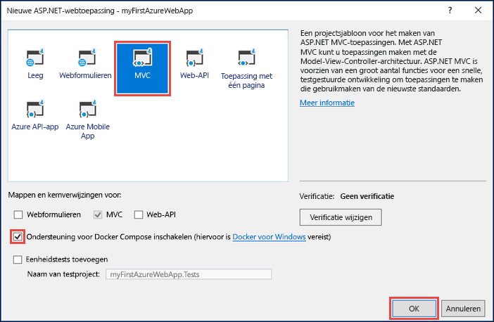
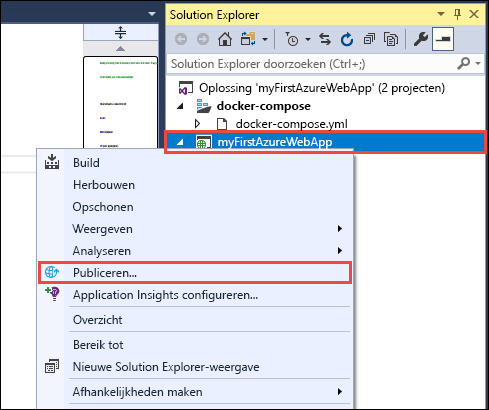
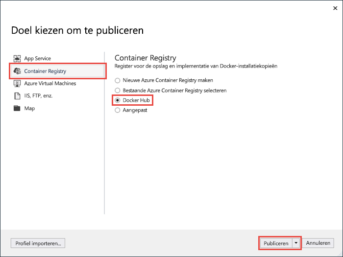
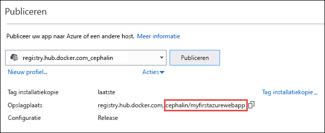
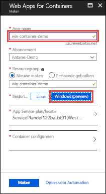
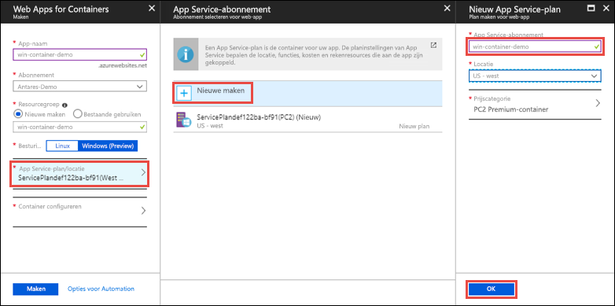
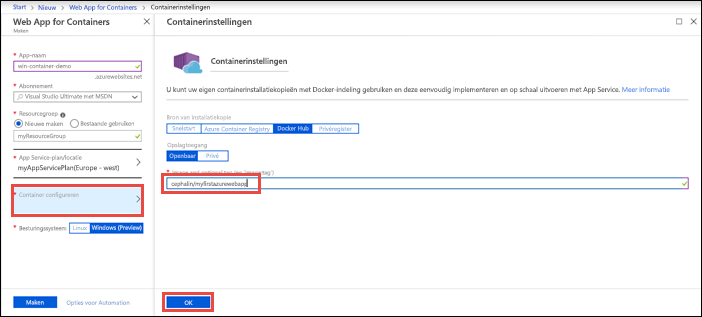
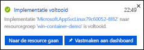
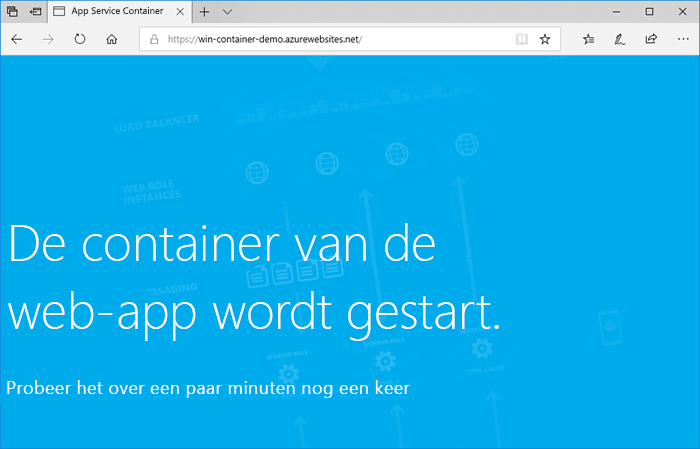
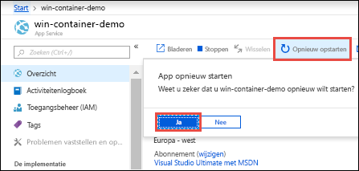

# <a name="run-a-custom-windows-container-in-azure-preview"></a>Een aangepaste Windows-container uitvoeren in Azure (Preview)

[Azure App Service](overview.md) biedt vooraf gedefinieerde toepassingsstacks in Windows, zoals ASP.NET of Node.js, die worden uitgevoerd in IIS. Met de vooraf geconfigureerde Windows-omgeving wordt het besturingssysteem vergrendeld voor beheerderstoegang, software-installaties, wijzigingen aan de Global Assembly Cache, enzovoort. (Zie [Functionaliteit van besturingssystemen in Azure App Service](operating-system-functionality.md).) Als voor uw toepassing meer toegang is vereist dan is toegestaan in de vooraf geconfigureerde omgeving, kunt u in plaats hiervan een aangepaste Windows-container implementeren. Deze snelstart laat zien hoe u een ASP.NET-app in een Windows-installatiekopie implementeert naar [Docker Hub](https://hub.docker.com/) vanuit Visual Studio en de app uitvoert in een aangepaste container in Azure App Service.


## <a name="prerequisites"></a>Vereisten

Vereisten voor het voltooien van deze zelfstudie:

- <a href="https://hub.docker.com/" target="_blank">Registreren voor een Docker Hub-account</a>
- <a href="https://docs.docker.com/docker-for-windows/install/" target="_blank">Docker voor Windows installeren</a>.
- <a href="https://docs.microsoft.com/virtualization/windowscontainers/quick-start/quick-start-windows-10" target="_blank">Docker instellen voor het uitvoeren van Windows-containers</a>.
- <a href="https://www.visualstudio.com/downloads/" target="_blank">Visual Studio 2017 installeren</a> met de workloads **ASP.NET and web development** en **Azure development**. Als u Visual Studio 2017 al hebt geïnstalleerd:
    - Installeer de nieuwste updates in Visual Studio door te klikken op **Help** > **Check for Updates**.
    - Voeg de workloads toe in Visual Studio door te klikken op **Tools** > **Get Tools and Features**.

## <a name="create-an-aspnet-web-app"></a>Een ASP.NET-web-app maken

Maak in Visual Studio een project door **Bestand > Nieuw > Project** te selecteren. 

Selecteer **Visual C# > Web > ASP.NET-webtoepassing (.NET Framework)** in het dialoogvenster **Nieuw project**.

Geef de toepassing de naam _myFirstAzureWebApp_ en selecteer vervolgens **OK**.
   


U kunt elk type ASP.NET-web-app implementeren in Azure. Voor deze Quickstart selecteert u de sjabloon **MVC** en stelt u de verificatie in op **Geen verificatie**.

Selecteer **Enable Docker Compose support**.

Selecteer **OK**.



Als het bestand _Dockerfile_ niet automatisch wordt geopend, opent u het vanuit **Solution Explorer**.

U moet een [ondersteunde bovenliggende installatiekopie](#use-a-different-parent-image) gebruiken. Wijzig de bovenliggende installatiekopie door de regel `FROM` ​​te vervangen door de volgende code en het bestand op te slaan:

```Dockerfile
FROM microsoft/aspnet:4.7.1
```

Selecteer in het menu **Fouten opsporen > Starten zonder foutopsporing** om de web-app lokaal uit te voeren.


## <a name="publish-to-docker-hub"></a>Publiceren naar Docker Hub

Klik in **Solution Explorer** met de rechtermuisknop op het project **myFirstAzureWebApp**-en selecteer **Publiceren**.



De publicatiewizard wordt automatisch gestart. Selecteer **Container Registry** > **Docker Hub** > **Publish**.



Geef de referenties voor uw Docker Hub-account op en klik op **Save**. 

Wacht totdat de installatie is voltooid. Op de pagina **Publish** ziet u nu de naam van de opslagplaats die u later in App Service gaat gebruiken.



Kopieer deze naam van de opslagplaats later gebruik.

## <a name="sign-in-to-azure"></a>Aanmelden bij Azure

Meld u aan bij Azure Portal op https://portal.azure.com.

## <a name="create-a-windows-container-app"></a>Een Windows-container-app maken

1. Kies in de linkerbovenhoek van Azure Portal **Een resource maken**.

2. Ga in het zoekvak boven de lijst met Azure Marketplace-resources naar **Web App for Containers** en selecteer dit.

3. Geef een app-naam op, zoals *win-container-demo*, accepteer de standaardwaarden om een nieuwe resourcegroep te maken en klik in de lijst **OS** op **Windows (Preview)**.

    

4. Maak een App Service-plan door te klikken op **App Service-plan/-locatie** > **Nieuwe maken**. Geef het nieuwe plan een naam, accepteer de standaardwaarden en klik op **OK**.

    

5. Klik op **Container configureren**. Gebruik voor **Image and optional tag** de naam van de opslagplaats die u hebt gekopieerd in [Publiceren naar Docker Hub](#publish-to-docker-hub) en klikt vervolgens op **OK**.

    

    Als u elders een aangepaste installatiekopie voor de webtoepassing hebt, bijvoorbeeld in [Azure Container Registry](/azure/container-registry/) of in een andere privéopslagplaats, kunt u deze hier configureren.

6. Klik op **Maken** en wacht tot de vereiste resources zijn gemaakt in Azure.

## <a name="browse-to-the-container-app"></a>Naar de container-app bladeren

Als de bewerking in Azure is voltooid, wordt er een melding weergegeven.



1. Klik op **Ga naar resource**.

2. Klik op de app-pagina onder **URL** op de koppeling.

Er wordt een nieuwe browserpagina geopend met de volgende pagina:



Wacht enkele minuten en probeer het opnieuw totdat u de startpagina van ASP.NET ziet:


**Gefeliciteerd!** U voert nu uw eerste aangepaste Windows-container uit in Azure App Service.

## <a name="see-container-start-up-logs"></a>Logboeken voor opstarten van containers bekijken

Het kan enige tijd duren voordat de Windows-container is geladen. Als u de voortgang wilt bekijken, gaat u naar de volgende URL en vervangt u *\<app_name>* door de naam van de app.
```
https://<app_name>.scm.azurewebsites.net/api/logstream
```

De gestreamde logboeken zien er ongeveer als volgt uit:

```
2018-07-27T12:03:11  Welcome, you are now connected to log-streaming service.
27/07/2018 12:04:10.978 INFO - Site: win-container-demo - Start container succeeded. Container: facbf6cb214de86e58557a6d073396f640bbe2fdec88f8368695c8d1331fc94b
27/07/2018 12:04:16.767 INFO - Site: win-container-demo - Container start complete
27/07/2018 12:05:05.017 INFO - Site: win-container-demo - Container start complete
27/07/2018 12:05:05.020 INFO - Site: win-container-demo - Container started successfully
```

## <a name="update-locally-and-redeploy"></a>Lokaal bijwerken en opnieuw implementeren

Open vanuit de **Solution Explorer** _Views\Home\Index.cshtml_.

Zoek ergens bovenaan de HTML-tag `<div class="jumbotron">` en vervang het volledige element door de volgende code:

```HTML
<div class="jumbotron">
    <h1>ASP.NET in Azure!</h1>
    <p class="lead">This is a simple app that we’ve built that demonstrates how to deploy a .NET app to Azure App Service.</p>
</div>
```

Als u opnieuw wilt implementeren naar Azure, klikt u in **Solution Explorer** met de rechtermuisknop op het project **myFirstAzureWebApp** en selecteert u **Publiceren**.

Selecteer op de pagina Publiceren de knop **Publiceren** en wacht tot het publiceren is voltooit.

Als u wilt dat App Service de nieuwe installatiekopie ophaalt uit Docker Hub, moet u de app opnieuw starten. Klik als u terugbent in de app-pagina in de portal op **Opnieuw starten** > **Ja**.



[Blader opnieuw naar de container-app](#browse-to-the-container-app). Nadat de webpagina is vernieuwd, moet de app eerst teruggaan naar de pagina 'Starting up' en dan na een paar minuten opnieuw de bijgewerkte webpagina weergeven.


## <a name="use-a-different-parent-image"></a>Een andere bovenliggende installatiekopie gebruiken

U mag ook een andere aangepaste Docker-installatiekopie gebruiken om de app uit te voeren. Kies echter wel de juiste [bovenliggende installatiekopie](https://docs.docker.com/develop/develop-images/baseimages/) voor het gewenste framework: 

- Als u .NET Framework-apps wilt implementeren, gebruikt u een bovenliggende installatiekopie op basis van de release Windows Server Core 2016 [LTSC (Implementatiestatus van het servicekanaal op de lange termijn)](https://docs.microsoft.com/windows-server/get-started/semi-annual-channel-overview#long-term-servicing-channel-ltsc). 
- Als u .NET Core-apps wilt implementeren, gebruikt u een bovenliggende installatiekopie op basis van de release Windows Server Nano 2016 [LTSC (Implementatiestatus van het servicekanaal op de lange termijn)](https://docs.microsoft.com/windows-server/get-started/semi-annual-channel-overview#long-term-servicing-channel-ltsc). 

Het duurt enige tijd om een bovenliggende installatiekopie te downloaden tijdens het opstarten van de app. U kunt deze opstarttijd echter verminderen door een van de volgende bovenliggende installatiekopieën te gebruiken die al in cache zijn opgeslagen in Azure App Service:

- [microsoft/iis](https://hub.docker.com/r/microsoft/iis/):windowsservercore-ltsc2016, nieuwste
- [microsoft/iis](https://hub.docker.com/r/microsoft/iis/):nanoserver-sac2016
- [microsoft/aspnet](https://hub.docker.com/r/microsoft/aspnet/):4.7.2-windowsservercore-ltsc2016, 4.7.2, nieuwste
- [microsoft/dotnet](https://hub.docker.com/r/microsoft/dotnet/):2.1-aspnetcore-runtime
- [microsoft/dotnet](https://hub.docker.com/r/microsoft/dotnet/):2.1-sdk

## <a name="next-steps"></a>Volgende stappen

> [!div class="nextstepaction"]
> [Migreren naar Windows-container in Azure](app-service-web-tutorial-windows-containers-custom-fonts.md)
