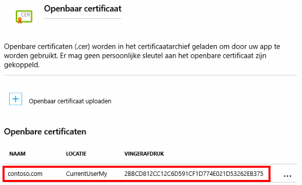
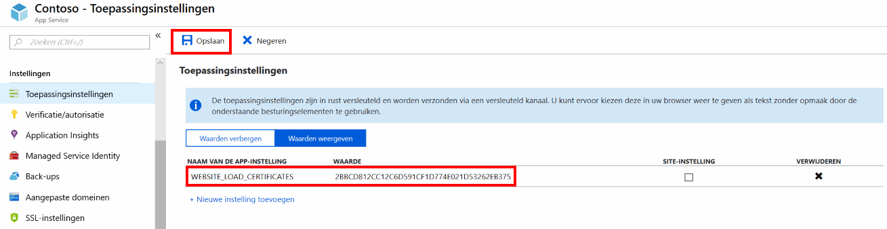

# <a name="use-an-ssl-certificate-in-your-application-code-in-azure-app-service"></a>Een SSL-certificaat gebruiken in uw toepassingscode in Azure App Service

Deze instructies handleiding beschrijft hoe een SSL-certificaten u hebt geüpload of geïmporteerd in uw App Service-app in uw toepassingscode te gebruiken. Een voorbeeld van het gebruiksvoorbeeld is een externe service waarvoor verificatie via certificaat heeft toegang tot uw app. 

Deze aanpak voor het gebruik van SSL-certificaten in uw code wordt gebruikgemaakt van de SSL-functionaliteit in App Service, die vereist dat uw app in **Basic** laag of hoger. Een alternatief is voor het certificaatbestand opname in uw toepassingsmap en rechtstreeks laden (Zie [alternatieve: load certificaat als een bestand](#file)). Echter, dit alternatief kunt u niet de persoonlijke sleutel in het certificaat van de toepassingscode of de ontwikkelaar verbergen. Bovendien is uw toepassingscode zich in een open-source-opslagplaats, houden van een certificaat met een persoonlijke sleutel in de opslagplaats niet als een optie.

Wanneer u App Service SSL-certificaten te beheren, kunt u afzonderlijk onderhouden van de certificaten en de toepassingscode en uw vertrouwelijke gegevens beveiligt.

## <a name="prerequisites"></a>Vereisten

Deze handleiding instructies voltooien:

- [Een App Service-app maken](/azure/app-service/)
- [Een aangepaste DNS-naam toegewezen aan uw web-app](app-service-web-tutorial-custom-domain.md)
- [Een SSL-certificaat uploaden](app-service-web-tutorial-custom-ssl.md) of [een App Service-certificaat importeren](web-sites-purchase-ssl-web-site.md) aan uw web-app


## <a name="load-your-certificates"></a>Laden van uw certificaten

Voor het gebruik van een certificaat dat is geüpload naar of geïmporteerd in App Service eerst deze toegankelijk maken voor uw toepassingscode. U doet dit met de `WEBSITE_LOAD_CERTIFICATES` app-instelling.

In de <a href="https://portal.azure.com" target="_blank">Azure-portal</a>, open de pagina van uw web-app.

Klik in het linkernavigatievenster op **SSL-certificaten**.



Alle uw geüpload en geïmporteerde SSL-certificaten voor deze web-app worden hier weergegeven met hun vingerafdrukken. Kopieer de vingerafdruk van het certificaat dat u wilt gebruiken.

Klik in het linkernavigatievenster op **toepassingsinstellingen**.

Een instelling app toevoegen `WEBSITE_LOAD_CERTIFICATES` en stel de waarde om de vingerafdruk van het certificaat. U kunt meerdere certificaten toegankelijk, vingerafdruk door komma's gescheiden waarden te gebruiken. U kunt alle certificaten toegankelijk maken, kunt u de waarde instelt op `*`. 



Wanneer u klaar bent, klikt u op **opslaan**.

Het certificaat is geconfigureerd, is nu gereed om te worden gebruikt door uw code.

## <a name="use-certificate-in-c-code"></a>Certificaat gebruiken in C#-code

Als uw certificaat toegankelijk is, toegang u hebt in C#-code door de vingerafdruk van het certificaat. De volgende code wordt een certificaat met de vingerafdruk van het geladen `E661583E8FABEF4C0BEF694CBC41C28FB81CD870`.

```csharp
using System;
using System.Security.Cryptography.X509Certificates;

...
X509Store certStore = new X509Store(StoreName.My, StoreLocation.CurrentUser);
certStore.Open(OpenFlags.ReadOnly);
X509Certificate2Collection certCollection = certStore.Certificates.Find(
                            X509FindType.FindByThumbprint,
                            // Replace below with your certificate's thumbprint
                            "E661583E8FABEF4C0BEF694CBC41C28FB81CD870",
                            false);
// Get the first cert with the thumbprint
if (certCollection.Count > 0)
{
    X509Certificate2 cert = certCollection[0];
    // Use certificate
    Console.WriteLine(cert.FriendlyName);
}
certStore.Close();
...
```

<a name="file"></a>
## <a name="alternative-load-certificate-as-a-file"></a>Alternatief: certificaat als een bestand laden

Deze sectie wordt beschreven hoe u en laden van een certificaatbestand dat zich in de toepassingsmap van uw. 

De volgende C#-voorbeeld wordt een certificaat genaamd geladen `mycert.pfx` van de `certs` map van uw app-opslagplaats.

```csharp
using System;
using System.Security.Cryptography.X509Certificates;

...
// Replace the parameter with "~/<relative-path-to-cert-file>".
string certPath = Server.MapPath("~/certs/mycert.pfx");

X509Certificate2 cert = GetCertificate(certPath, signatureBlob.Thumbprint);
...
```

