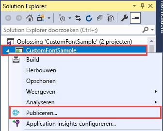
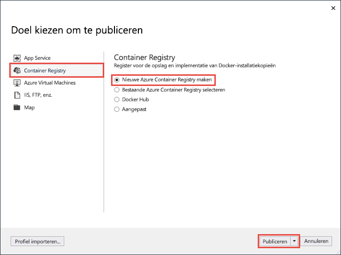
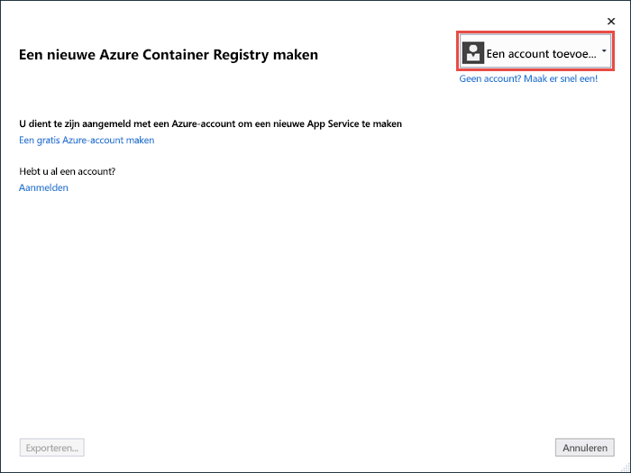
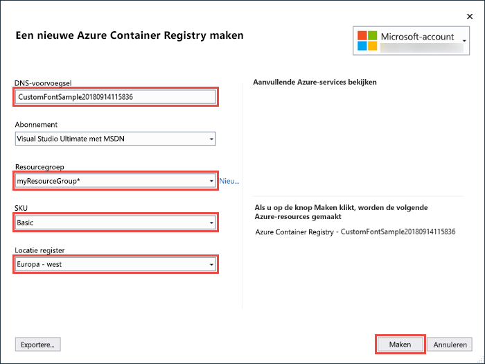
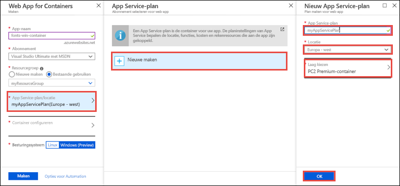
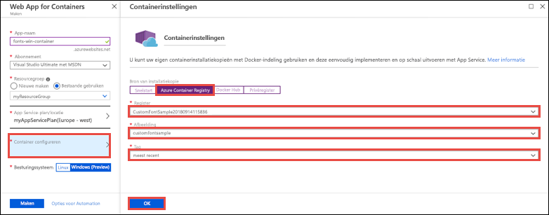
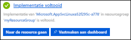

# <a name="migrate-an-aspnet-app-to-azure-app-service-using-a-windows-container-preview"></a>Een ASP.NET-app migreren naar Azure App Service met behulp van een Windows-container (preview)

[Azure App Service](app-service-web-overview.md) biedt vooraf gedefinieerde toepassingsstacks in Windows, zoals ASP.NET of Node.js, die worden uitgevoerd in IIS. Met de vooraf geconfigureerde Windows-omgeving wordt het besturingssysteem vergrendeld voor beheerderstoegang, software-installaties, wijzigingen aan de Global Assembly Cache, enzovoort. (Zie [Functionaliteit van besturingssystemen in Azure App Service](web-sites-available-operating-system-functionality.md).) Als u echter een aangepaste Windows-container in App Service gebruikt, kunt u besturingssysteemwijzigingen aanbrengen die uw app nodig heeft, zodat het eenvoudig is om een on-premises app te migreren waarvoor aangepaste besturingssysteem- en softwareconfiguraties nodig zijn. Dit zelfstudie laat zien hoe u een ASP.NET-app naar App Service migreert die aangepaste lettertypen gebruikt die zijn geïnstalleerd in de Windows-lettertypenbibliotheek. U implementeert een aangepaste geconfigureerde Windows-installatiekopie van Visual Studio naar [Azure Container Registry](https://docs.microsoft.com/azure/container-registry/) en voert deze vervolgens uit in de App-service.


## <a name="prerequisites"></a>Vereisten

Vereisten voor het voltooien van deze zelfstudie:

- <a href="https://hub.docker.com/" target="_blank">Registreren voor een Docker Hub-account</a>
- <a href="https://docs.docker.com/docker-for-windows/install/" target="_blank">Installeer Docker voor Windows</a>.
- <a href="https://docs.microsoft.com/virtualization/windowscontainers/quick-start/quick-start-windows-10#2-switch-to-windows-containers" target="_blank">Schakel Docker over op het uitvoeren van Windows-containers</a>.
- <a href="https://www.visualstudio.com/downloads/" target="_blank">Installeer Visual Studio 2017</a> met de werkbelastingen **ASP.NET- en webontwikkeling** en **Azure-ontwikkeling**. Als u Visual Studio 2017 al hebt geïnstalleerd:
    - Installeer de nieuwste updates in Visual Studio door te klikken op **Help** > **Check for Updates**.
    - Voeg de werkbelastingen toe in Visual Studio door te klikken op **Tools** > **Get Tools and Features**.

## <a name="set-up-the-app-locally"></a>De app lokaal instellen

### <a name="download-the-sample"></a>Het voorbeeld downloaden

In deze stap stelt u het lokale .NET-project in.

- [Download het voorbeeldproject](https://github.com/Azure-Samples/custom-font-win-container/archive/master.zip).
- Pak het bestand *custom-font-win-container.zip* uit (unzip).

Het voorbeeldproject bevat een eenvoudige ASP.NET toepassing die een aangepast lettertype gebruikt dat in de Windows-lettertypebibliotheek is geïnstalleerd. Het is niet nodig om lettertypen te installeren, maar het is een voorbeeld van een app die is geïntegreerd met het onderliggende besturingssysteem. Om een ​​dergelijke app naar App Service te migreren, wijzigt u uw code om de integratie te verwijderen of migreert u de code zoals ze is in een aangepaste Windows-container.

### <a name="install-the-font"></a>Het lettertype installeren

Navigeer in Windows Verkenner naar _custom-font-win-container-master/CustomFontSample_, klik met de rechtermuisknop op _FrederickatheGreat-Regular.ttf_ en selecteer **Installeren**.

Dit lettertype is openbaar beschikbaar via [Google Fonts](https://fonts.google.com/specimen/Fredericka+the+Great).

### <a name="run-the-app"></a>De app uitvoeren

Open het bestand *custom-font-win-container/CustomFontSample.sln* in Visual Studio. 

Typ `Ctrl+F5` voor het uitvoeren van de app zonder foutopsporing. De app wordt weergegeven in de standaardbrowser. 


Omdat de app een geïnstalleerd lettertype gebruikt, kan deze niet worden uitgevoerd in de sandbox van App Service. U kunt de app echter in plaats daarvan implementeren met behulp van een Windows-container, omdat u het lettertype in de Windows-container kunt installeren.

### <a name="configure-windows-container"></a>Windows-container configureren

Klik in Solution Explorer met de rechtermuisknop op het project **CustomFontSample** en selecteer **Add** > **Container Orchestration Support**.


Selecteer **Docker Compose** > **OK**.

Uw project is nu ingesteld om te worden uitgevoerd in een Windows-container. Er wordt een _Dockerfile_ toegevoegd aan het project **CustomFontSample**, en er wordt een **docker-compose**-project toegevoegd aan de oplossing. 

Open **Dockerfile** vanuit Solution Explorer.

U moet een [ondersteunde bovenliggende installatiekopie](app-service-web-get-started-windows-container.md#use-a-different-parent-image) gebruiken. Wijzig de bovenliggende installatiekopie door de regel `FROM` ​​te vervangen door de volgende code:

```Dockerfile
FROM microsoft/aspnet:4.7.1
```

Voeg aan het einde van het bestand de volgende regel toe en sla het bestand op:

```Dockerfile
RUN ${source:-obj/Docker/publish/InstallFont.ps1}
```

U kunt _InstallFont.ps1_ vinden in het project **CustomFontSample**. Het is een eenvoudig script waarmee het lettertype wordt geïnstalleerd. U vindt een complexere versie van het script in het [Script Center](https://gallery.technet.microsoft.com/scriptcenter/fb742f92-e594-4d0c-8b79-27564c575133).

## <a name="publish-to-azure-container-registry"></a>Publiceren naar Azure Container Registry

[Azure Container Registry](https://docs.microsoft.com/azure/container-registry/) kan uw afbeeldingen opslaan voor containerimplementaties. U kunt App Service configureren voor het gebruik van installatiekopieën die worden gehost in Azure Container Registry.

### <a name="open-publish-wizard"></a>Publicatie-wizard openen

Klik in Solution Explorer met de rechtermuisknop op het project **CustomFontSample** en selecteer **Publish** (publiceren).



### <a name="create-registry-and-publish"></a>Register maken en publiceren

Selecteer in de publicatiewizard **Container Registry** (containerregister) > **Create New Azure Container Registry** (nieuw Azure-containerregister maken) > **Publish** (publiceren).



### <a name="sign-in-with-azure-account"></a>Aanmelden met Azure-account

Selecteer **Add an account** (een account toevoegen) in het dialoogvenster **Create a new Azure Container Registry** (nieuw Azure-containerregister maken) en meld u vervolgens aan bij uw Azure-abonnement. Als u al bent aangemeld, selecteert u het account met het gewenste abonnement uit de vervolgkeuzelijst.



### <a name="configure-the-registry"></a>Het register configureren

Configureer het nieuwe containerregister op basis van de voorgestelde waarden in de volgende tabel. Klik op **Create** als u klaar bent.

| Instelling  | Voorgestelde waarde | Voor meer informatie |
| ----------------- | ------------ | ----|
|**DNS-voorvoegsel**| Behoud de gegenereerde registernaam of wijzig deze in een andere unieke naam. |  |
|**Resourcegroep**| Klik op **New** (nieuw), typ **myResourceGroup** en klik op **OK**. |  |
|**SKU**| Basic | [Prijscategorieën](https://azure.microsoft.com/pricing/details/container-registry/)|
|**Registerlocatie**| Europa -west | |



Er wordt een terminalvenster geopend waarin de voortgang van het implementeren van de installatiekopie wordt getoond. Wacht totdat de installatie is voltooid.

## <a name="sign-in-to-azure"></a>Aanmelden bij Azure

Meld u aan bij Azure Portal op https://portal.azure.com.

## <a name="create-a-web-app"></a>Een webtoepassing maken

Selecteer in het menu links **Create a resource** (een resource maken) > **Web** > **Web App for Containers**.

### <a name="configure-the-new-web-app"></a>De nieuwe web-app configureren

Configureer de instellingen in de interface volgens de volgende tabel:

| Instelling  | Voorgestelde waarde | Voor meer informatie |
| ----------------- | ------------ | ----|
|**Naam van app**| Typ een unieke naam. | De URL van de web-app is `http://<app_name>.azurewebsites.net`, waarbij `<app_name>` de naam van uw app is. |
|**Resourcegroep**| Selecteer **Bestaande gebruiken** en typ **myResourceGroup**. |  |
|**Besturingssysteem**| Windows (preview) | |

### <a name="configure-app-service-plan"></a>App Service-plan configureren

Klik op **App Service plan/Location** > **Create new** (nieuwe maken). Geef het nieuwe abonnement een naam, selecteer **Europa - west** als de locatie en klik op **OK**.



### <a name="configure-container"></a>Container configureren

Klik op **Configure container** > **Azure Container Registry**. Selecteer het register, de installatiekopie en de tag die u eerder hebt gemaakt in [Publish to Azure Container Registry](#publish-to-azure-container-registry) en klik op **OK**.



### <a name="complete-app-creation"></a>De app voltooien

Klik op **Maken** en wacht tot de vereiste resources zijn gemaakt in Azure.

## <a name="browse-to-the-web-app"></a>Bladeren naar de web-app

Als de bewerking in Azure is voltooid, wordt er een melding weergegeven.



1. Klik op **Ga naar resource**.

2. Klik op de app-pagina onder **URL** op de koppeling.

Er wordt een nieuwe browserpagina geopend met de volgende pagina:


Wacht een paar minuten en probeer het opnieuw, totdat u de startpagina krijgt met het mooie lettertype dat u verwacht:


**Gefeliciteerd!** U hebt een ASP.NET toepassing gemigreerd naar Azure App Service in een Windows-container.

## <a name="see-container-start-up-logs"></a>Logboeken voor opstarten van containers bekijken

Het kan enige tijd duren voordat de Windows-container is geladen. Als u de voortgang wilt bekijken, gaat u naar de volgende URL en vervangt u *\<app_name>* door de naam van de app.
```
https://<app_name>.scm.azurewebsites.net/api/logstream
```

De gestreamde logboeken zien er ongeveer als volgt uit:

```
14/09/2018 23:16:19.889 INFO - Site: fonts-win-container - Creating container for image: customfontsample20180914115836.azurecr.io/customfontsample:latest.
14/09/2018 23:16:19.928 INFO - Site: fonts-win-container - Create container for image: customfontsample20180914115836.azurecr.io/customfontsample:latest succeeded. Container Id 329ecfedbe370f1d99857da7352a7633366b878607994ff1334461e44e6f5418
14/09/2018 23:17:23.405 INFO - Site: fonts-win-container - Start container succeeded. Container: 329ecfedbe370f1d99857da7352a7633366b878607994ff1334461e44e6f5418
14/09/2018 23:17:28.637 INFO - Site: fonts-win-container - Container ready
14/09/2018 23:17:28.637 INFO - Site: fonts-win-container - Configuring container
14/09/2018 23:18:03.823 INFO - Site: fonts-win-container - Container ready
14/09/2018 23:18:03.823 INFO - Site: fonts-win-container - Container start-up and configuration completed successfully
```

