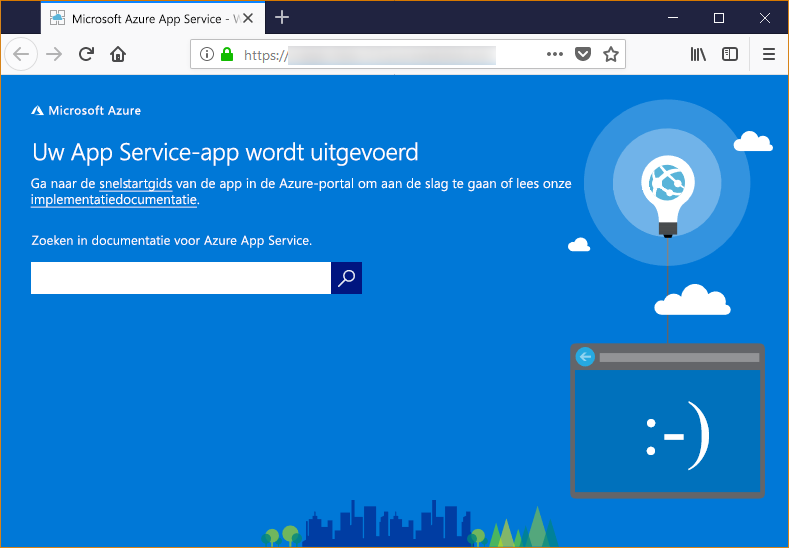

# <a name="configure-your-python-app-for-the-azure-app-service-on-linux"></a>Een Python-app configureren voor Azure App Service met Linux

In dit artikel wordt beschreven hoe Python-apps worden uitgevoerd in [Azure App Service in Linux](app-service-linux-intro.md) en hoe u het gedrag van Azure App Service zo nodig kunt aanpassen.

## <a name="container-characteristics"></a>Containerkenmerken

Python-apps die zijn geïmplementeerd in App Service met Linux worden uitgevoerd binnen een Docker-container die is gedefinieerd in de GitHub-opslagplaats [Azure-App-Service/python-container](https://github.com/Azure-App-Service/python/tree/master/3.7.0).

Deze container heeft de volgende kenmerken:

- De basisinstallatiekopie van de container is `python-3.7.0-slim-stretch`. Dat betekent dat apps worden uitgevoerd met Python 3.7. Als u een andere versie van Python nodig hebt, moet u in plaats daarvan uw eigen containerinstallatiekopie bouwen en implementeren. Voor meer informatie raadpleegt u [Een aangepaste Docker-installatiekopie voor Web App for Containers gebruiken](tutorial-custom-docker-image.md).

- Apps worden uitgevoerd met behulp van de [WSGI HTTP-server Gunicorn](http://gunicorn.org/), met de aanvullende argumenten `--bind=0.0.0.0 --timeout 600`.

- Standaard bevat de basisinstallatiekopie het Flask-webframework, maar de container ondersteunt andere frameworks die voldoen aan WSGI en compatibel zijn met Python 3.7, zoals Django.

- Voor het installeren van extra pakketten, zoals Django, maakt u met `pip freeze > requirements.txt` een bestand [*requirements.txt*](https://pip.pypa.io/en/stable/user_guide/#requirements-files) in de hoofdmap van uw project. Daarna publiceert u het project naar App Service met Git-implementatie. `pip install -r requirements.txt` wordt dan automatisch uitgevoerd in de container om de afhankelijkheden van uw app te installeren.

## <a name="container-startup-process-and-customizations"></a>Opstartprocessen en aanpassingen van container

Tijdens het opstarten voert de App Service met Linux-container de volgende stappen uit:

1. Controleer of er een aangepast opstartproces is en pas het in dat geval toe.
1. Controleer of er een *wsgi.py*-bestand voor de Django-app bestaat, en start Gunicorn in dat geval op met dat bestand.
1. Controleer of er een bestand is met de naam *application.py* en zo ja, start Gunicorn dan met `application:app`, ervan uitgaande dat het een Flask-app is.
1. Als er geen andere app wordt gevonden, start u een standaard-app die is ingebouwd in de container.

De volgende secties bevatten aanvullende informatie voor elke optie.

### <a name="django-app"></a>Django-app

Voor Django-apps zoekt App Service in uw app-code naar een bestand met de naam `wsgi.py`. Daarna wordt Gunicorn uitgevoerd met de volgende opdracht:

```bash
# <module> is the path to the folder containing wsgi.py
gunicorn --bind=0.0.0.0 --timeout 600 <module>.wsgi
```

Voor gedetailleerde controle over de opstartopdracht gebruikt u een [aangepaste opstartopdracht](#custom-startup-command) en vervangt u `<module>` door de naam van de module die *wsgi.py* bevat.

### <a name="flask-app"></a>Flask-app

Voor Flask zoekt App Service naar een bestand met de naam *application.py* en wordt Gunicorn als volgt gestart:

```bash
gunicorn --bind=0.0.0.0 --timeout 600 application:app
```

Als de hoofdmodule van de app in een ander bestand is opgenomen, gebruikt u een andere naam voor het app-object. Als u aanvullende argumenten wilt doorgeven aan Gunicorn, gebruikt u een [aangepaste opstartopdracht](#custom-startup-command). Deze sectie bevat een voorbeeld van Flask met toegangscode in *hello.py* en een Flask-app-object met de naam `myapp`.

### <a name="custom-startup-command"></a>Aangepaste opstartopdracht

U kunt het opstartgedrag van de container sturen door een aangepaste Gunicorn-opstartopdracht te geven. Als u bijvoorbeeld een Flask-app hebt waarvan *hello.py* de belangrijkste module is, en het Flask-app-object in dit bestand heet `myapp`, ziet de opdracht er als volgt uit:

```bash
gunicorn --bind=0.0.0.0 --timeout 600 hello:myapp
```

Als de belangrijkste module zich in een submap bevindt, zoals `website`, geeft u deze map op met het argument `--chdir`:

```bash
gunicorn --bind=0.0.0.0 --timeout 600 --chdir website hello:myapp
```

U kunt ook aanvullende argumenten voor Gunicorn aan de opdracht toevoegen, zoals `--workers=4`. Zie voor meer informatie [Running Gunicorn](http://docs.gunicorn.org/en/stable/run.html) (Gunicorn uitvoeren, docs.gunicorn.org).

Voer de volgende stappen uit als u een aangepaste opdracht wilt opgeven:

1. Navigeer naar de pagina [Toepassingsinstellingen](../web-sites-configure.md?toc=%2fazure%2fapp-service%2fcontainers%2ftoc.json) in de Azure Portal.

1. In de **Runtime**-instellingen stelt u de optie **Stack** in op **Python 3.7** en voert u de opdracht rechtstreeks in het **Opstartbestand** in.

    U kunt de opdracht ook opslaan in een tekstbestand in de hoofdmap van uw project, bijvoorbeeld met de naam als *startup.txt*. Implementeer dat bestand vervolgens in App Service en geef nu in het veld **Opstartbestand** de bestandsnaam op. Met deze optie kunt u de opdracht beheren in de opslagplaats van de broncode in plaats van via de Azure Portal.

1. Selecteer **Opslaan**. De App Service wordt automatisch opnieuw opgestart en na een paar seconden ziet u dat de aangepaste opstartopdracht is toegepast.

> [!Note]
> App Service negeert eventuele fouten die optreden tijdens de verwerking van een bestand met een aangepaste opstartopdracht en vervolgt het opstartproces door te zoeken naar Django- en Flask-apps. Als u het verwachte gedrag niet ziet, controleer dan of uw opstartbestand is toegepast op App Service en of het geen fouten bevat.

### <a name="default-behavior"></a>Standaardgedrag

Als de App Service geen aangepaste opdracht, Django-app of Flask-app vindt, wordt er een standaard alleen-lezen-app uitgevoerd. Deze bevindt zich in de map _opt/defaultsite_. De standaard-app wordt als volgt weergegeven:



## <a name="troubleshooting"></a>Problemen oplossen

- **U ziet de standaard-app nadat de code van uw eigen app is toegepast.**  De standaard-app wordt weergegeven omdat u de code van uw eigen app niet daadwerkelijk hebt toegepast op App Service, of omdat App Service uw app-code niet heeft kunnen vinden en daarom de standaard-app heeft uitgevoerd.
  - Start de App Service opnieuw op en wacht 15-20 seconden voordat u de app opnieuw controleert.
  - Zorg ervoor dat u App Service voor Linux gebruikt in plaats van een Windows-exemplaar. Voer vanuit de Azure CLI de opdracht `az webapp show --resource-group <resource_group_name> --name <app_service_name> --query kind` uit, waarbij u `<resource_group_name>` en `<app_service_name>` dienovereenkomstig vervangt. Als het goed is, ziet u `app,linux` als uitvoer. Als dit niet het geval is, maakt u de App Service opnieuw en kiest u Linux.
    - Gebruik SSH of de Kudu-console om rechtstreeks verbinding te maken met de App Service en controleer of uw bestanden in *site/wwwroot* staan. Als uw bestanden niet bestaan, controleert u uw implementatieproces en implementeert u de app opnieuw.
  - Als uw bestanden bestaan, heeft App Service uw specifieke opstartbestand niet kunnen identificeren. Controleer of de app is gestructureerd zoals App Service dat verwacht voor [Django](#django-app) of [Flask](#flask-app), of gebruik een [aangepast opstartopdracht](#custom-startup-command).
  
- **U ziet het bericht 'Service niet beschikbaar' in de browser.** De browser heeft een time-out gegenereerd in afwachting van een reactie van App Service. Dat betekent dat de App Service de Gunicorn-server heeft gestart, maar dat de argumenten die de app-code opgeeft onjuist zijn.
  - Vernieuw de browser, met name als u gebruikmaakt van de laagste prijscategorieën in uw App Service-plan. Het is bijvoorbeeld mogelijk dat het opstarten van de app langer duurt wanneer gebruik wordt gemaakt van de gratis prijscategorie en reageert na het vernieuwen van de browser.
  - Controleer of de app is gestructureerd zoals App Service dat verwacht voor [Django](#django-app) of [Flask](#flask-app), of gebruik een [aangepast opstartopdracht](#custom-startup-command).
  - Gebruik SSH of de Kudu-console om verbinding te maken met de App Service en bestudeer vervolgens de logboeken met diagnostische gegevens die zijn opgeslagen in de map *LogFiles*. Voor meer informatie over logboekregistratie raadpleegt u [Diagnostische logboekregistratie voor web-apps inschakelen in Azure App Service](../web-sites-enable-diagnostic-log.md).
