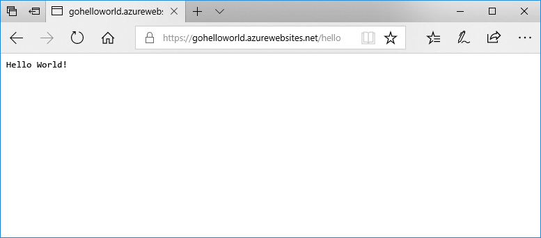

# <a name="deploy-a-dockergo-web-app-in-web-app-for-containers"></a>Een Docker/Go-web-app in Web App for Containers implementeren

[App Service Linux](app-service-linux-intro.md) biedt vooraf gedefinieerde toepassingsstacks op Linux met ondersteuning voor talen zoals .NET, PHP, Node.js en meer. U kunt een aangepaste Docker-installatiekopie ook gebruiken om uw web-app uit te voeren op een toepassingsstack die nog niet in Azure is gedefinieerd. Deze snelstartgids laat zien hoe u een web-app kunt maken en een Go-installatiekopie kunt implementeren uit Docker Hub. U maakt de web-app met behulp van [Azure CLI](https://docs.microsoft.com/cli/azure/get-started-with-azure-cli).



[!INCLUDE [quickstarts-free-trial-note](../../../includes/quickstarts-free-trial-note.md)]

[!INCLUDE [cloud-shell-try-it.md](../../../includes/cloud-shell-try-it.md)]

[!INCLUDE [Configure deployment user](../../../includes/configure-deployment-user.md)]

[!INCLUDE [Create resource group](../../../includes/app-service-web-create-resource-group.md)]

[!INCLUDE [Create app service plan](../../../includes/app-service-web-create-app-service-plan-linux.md)]

## <a name="create-a-web-app"></a>Een webtoepassing maken

Maak een [web-app](../app-service-web-overview.md) in het App Service-plan `myAppServicePlan` met de opdracht [az webapp create](/cli/azure/webapp?view=azure-cli-latest#az_webapp_create). Vergeet niet om `<app name>` te vervangen door een wereldwijd unieke app-naam.

```azurecli-interactive
az webapp create --resource-group myResourceGroup --plan myAppServicePlan --name <app name> --deployment-container-image-name microsoft/azure-appservices-go-quickstart
```

In de voorgaande opdracht verwijst `--deployment-container-image-name` naar de installatiekopie van de openbare Docker Hub [microsoft/azure-appservices-go-quickstart](https://hub.docker.com/r/microsoft/azure-appservices-go-quickstart/).

Wanneer de web-app is gemaakt, toont de Azure CLI soortgelijke uitvoer als in het volgende voorbeeld:

```json
{
  "availabilityState": "Normal",
  "clientAffinityEnabled": true,
  "clientCertEnabled": false,
  "cloningInfo": null,
  "containerSize": 0,
  "dailyMemoryTimeQuota": 0,
  "defaultHostName": "<app name>.azurewebsites.net",
  "deploymentLocalGitUrl": "https://<username>@<app name>.scm.azurewebsites.net/<app name>.git",
  "enabled": true,
  < JSON data removed for brevity. >
}
```

## <a name="browse-to-the-app"></a>Bladeren naar de app

```bash
http://<app_name>.azurewebsites.net/hello
```


**Gefeliciteerd!** U hebt een aangepaste Docker-installatiekopie waarop een Go-app wordt uitgevoerd naar Web App for Containers geïmplementeerd.

[!INCLUDE [Clean-up section](../../../includes/cli-script-clean-up.md)]

## <a name="next-steps"></a>Volgende stappen

> [!div class="nextstepaction"]
> [Een aangepaste Docker-installatiekopie gebruiken](tutorial-custom-docker-image.md)
