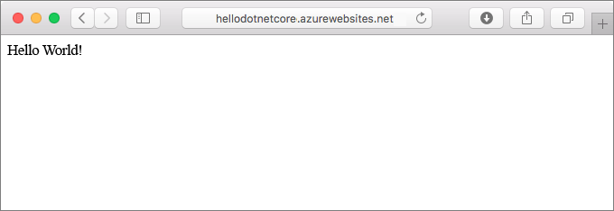
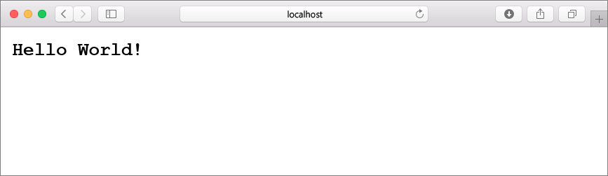
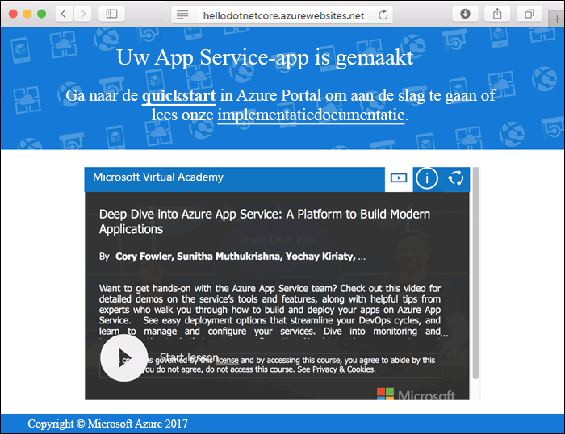
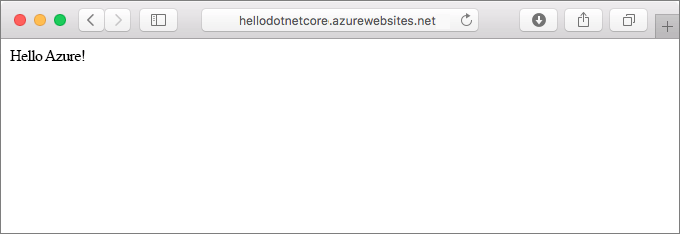
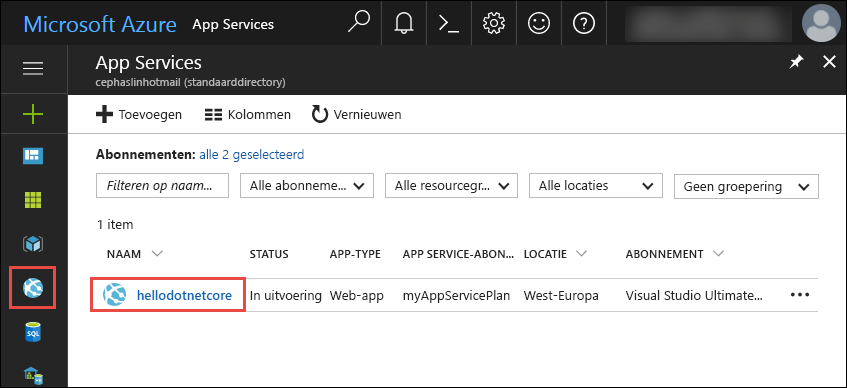
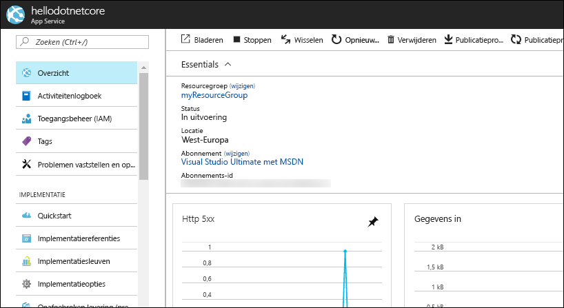

# <a name="create-a-net-core-web-app-in-app-service-on-linux"></a>Een .NET Core-web-app maken in App Service on Linux

> [!NOTE]
> In dit artikel gaat u een app implementeren in App Service onder Linux. Zie [Een ASP.NET Core-web-app maken in Azure](../app-service-web-get-started-dotnet.md) om een app te implementeren in App Service onder _Windows_.
>

[App Service onder Linux](app-service-linux-intro.md) biedt een uiterst schaalbare webhostingservice met self-patchfunctie onder het Linux-besturingssysteem. Deze quickstart laat zien hoe u een [.NET Core](https://docs.microsoft.com/aspnet/core/)-app maakt in App Service on Linux. U maakt de web-app via de [Azure CLI](https://docs.microsoft.com/cli/azure/get-started-with-azure-cli) en gebruikt Git om de .NET Core-code in de web-app te implementeren.



U kunt de stappen in dit artikel volgen met behulp van een Mac-, Windows- of Linux-computer.

[!INCLUDE [quickstarts-free-trial-note](../../../includes/quickstarts-free-trial-note.md)]

## <a name="prerequisites"></a>Vereisten

Dit zijn de vereisten voor het voltooien van deze snelstart:

* <a href="https://git-scm.com/" target="_blank">Git installeren</a>
* <a href="https://www.microsoft.com/net/core/" target="_blank">.NET Core installeren</a>

## <a name="create-the-app-locally"></a>De app lokaal maken

Maak in een terminalvenster op uw computer een map met de naam `hellodotnetcore` en wijzig de huidige map in die map.

```bash
md hellodotnetcore
cd hellodotnetcore
```

Maak een nieuwe .NET Core-web-app.

```bash
dotnet new web
```

## <a name="run-the-app-locally"></a>De app lokaal uitvoeren

Voer de toepassing lokaal uit zodat u kunt zien hoe deze eruit ziet wanneer u de toepassing implementeert naar Azure. 

Herstel de NuGet-pakketten en voer de app uit.

```bash
dotnet run
```

Open een webbrowser en navigeer naar de app op `http://localhost:5000`.

Het bericht **Hello World** uit de voorbeeld-app wordt weergegeven op de pagina.



Druk in uw terminalvenster op **Ctrl + C** om de webserver af te sluiten. Initialiseer een Git-opslagplaats voor het .NET Core-project.

```bash
git init
git add .
git commit -m "first commit"
```

[!INCLUDE [cloud-shell-try-it.md](../../../includes/cloud-shell-try-it.md)]

[!INCLUDE [Configure deployment user](../../../includes/configure-deployment-user.md)]

[!INCLUDE [Create resource group](../../../includes/app-service-web-create-resource-group-linux.md)]

[!INCLUDE [Create app service plan](../../../includes/app-service-web-create-app-service-plan-linux.md)]

## <a name="create-a-web-app"></a>Een webtoepassing maken

[!INCLUDE [Create web app](../../../includes/app-service-web-create-web-app-dotnetcore-linux-no-h.md)]

Blader naar uw nieuwe web-app. Vervang _&lt;app-naam>_ door de naam van uw web-app.

```bash
http://<app name>.azurewebsites.net
```

Zo zou uw nieuwe web-app er moeten uitzien:



[!INCLUDE [Push to Azure](../../../includes/app-service-web-git-push-to-azure.md)] 

```bash
Counting objects: 22, done.
Delta compression using up to 8 threads.
Compressing objects: 100% (18/18), done.
Writing objects: 100% (22/22), 51.21 KiB | 3.94 MiB/s, done.
Total 22 (delta 1), reused 0 (delta 0)
remote: Updating branch 'master'.
remote: Updating submodules.
remote: Preparing deployment for commit id '741f16d1db'.
remote: Generating deployment script.
remote: Project file path: ./hellodotnetcore.csproj
remote: Generated deployment script files
remote: Running deployment command...
remote: Handling ASP.NET Core Web Application deployment.
remote: ...............................................................................................
remote:   Restoring packages for /home/site/repository/hellodotnetcore.csproj...
remote: ....................................
remote:   Installing System.Xml.XPath 4.0.1.
remote:   Installing System.Diagnostics.Tracing 4.1.0.
remote:   Installing System.Threading.Tasks.Extensions 4.0.0.
remote:   Installing System.Reflection.Emit.ILGeneration 4.0.1.
remote:   ...
remote: Finished successfully.
remote: Running post deployment command(s)...
remote: Deployment successful.
To https://cephalin-dotnetcore.scm.azurewebsites.net/cephalin-dotnetcore.git
 * [new branch]      master -> master
```

## <a name="browse-to-the-app"></a>Bladeren naar de app

Blader naar de geïmplementeerde toepassing via uw webbrowser.

```bash
http://<app_name>.azurewebsites.net
```

De .NET Core-voorbeeldcode wordt uitgevoerd in een web-app met een ingebouwde installatiekopie.


**Gefeliciteerd!** U hebt uw eerste .NET Core-app geïmplementeerd in Azure App Service on Linux.

## <a name="update-and-redeploy-the-code"></a>De code bijwerken en opnieuw implementeren

Open het bestand _Startup.cs_ in de lokale map. Breng een kleine wijziging aan in de tekst in de methodeaanroep `context.Response.WriteAsync`:

```csharp
await context.Response.WriteAsync("Hello Azure!");
```

Leg uw wijzigingen vast in Git en push de codewijzigingen vervolgens naar Azure.

```bash
git commit -am "updated output"
git push azure master
```

Als de implementatie is voltooid, gaat u terug naar het browservenster dat is geopend in de stap **Bladeren naar de app** en klikt u op Vernieuwen.



## <a name="manage-your-new-azure-web-app"></a>Uw nieuwe Azure-web-app beheren

Ga naar <a href="https://portal.azure.com" target="_blank">Azure Portal</a> om de web-app te beheren die u hebt gemaakt.

Klik in het linkermenu op **App Services** en klik op de naam van uw Azure-web-app.



De pagina Overzicht van uw web-app wordt weergegeven. Hier kunt u algemene beheertaken uitvoeren, zoals bladeren, stoppen, starten, opnieuw opstarten en verwijderen. 



Het linkermenu bevat een aantal pagina's voor het configureren van uw app. 

[!INCLUDE [cli-samples-clean-up](../../../includes/cli-samples-clean-up.md)]

## <a name="next-steps"></a>Volgende stappen

> [!div class="nextstepaction"]
> [Een .NET Core- en SQL Database-web-app maken in Azure App Service on Linux](tutorial-dotnetcore-sqldb-app.md)
