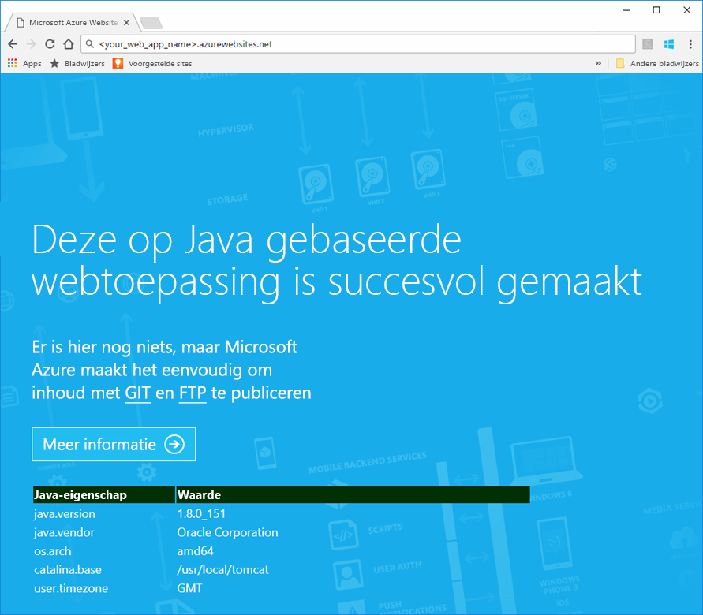
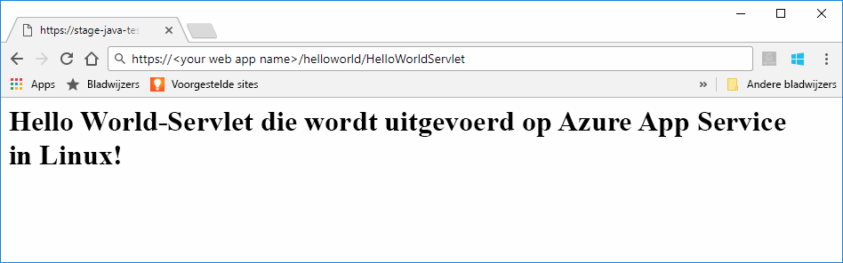

# <a name="preview-create-a-java-web-app-in-app-service-on-linux"></a>Preview: Een Java web-app maken in Azure App Service on Linux

App Service on Linux biedt momenteel een preview-functie ter ondersteuning van Java-web-apps. Zie de [aanvullende gebruiksvoorwaarden voor Microsoft Azure-previews](https://azure.microsoft.com/support/legal/preview-supplemental-terms/) voor meer informatie over previews. [Het implementeren van Java-web-apps in een Linux-container in de cloud met behulp van de Azure Toolkit voor IntelliJ](https://docs.microsoft.com/java/azure/intellij/azure-toolkit-for-intellij-hello-world-web-app-linux) is een alternatieve methode om uw Java-app te implementeren in uw eigen container.

> [!NOTE]
> In dit artikel gaat u een Java-web-app implementeren in App Service on Linux.
>

[App Service onder Linux](app-service-linux-intro.md) biedt een uiterst schaalbare webhostingservice met self-patchfunctie onder het Linux-besturingssysteem. In deze snelstart leert u hoe u een Java-app implementeert in Azure App Service on Linux met behulp van een ingebouwde installatiekopie. U maakt de web-app met de ingebouwde installatiekopie via de [Azure CLI](https://docs.microsoft.com/cli/azure/get-started-with-azure-cli) en vervolgens implementeert u de Java-app in de web-app.


[!INCLUDE [quickstarts-free-trial-note](../../../includes/quickstarts-free-trial-note.md)]


## <a name="prerequisites"></a>Vereisten

Dit zijn de vereisten voor het voltooien van deze Quickstart: 

* U hebt een abonnement op Azure nodig. Als u nog geen abonnement op Azure hebt, maak dan een [gratis account](https://azure.microsoft.com/free/?ref=microsoft.com&utm_source=microsoft.com&utm_medium=docs&utm_campaign=visualstudio) aan voordat u begint.
* [Installeer Git](https://git-scm.com/).
* Installeer [Eclipse](https://www.eclipse.org/downloads/).


[!INCLUDE [cloud-shell-try-it.md](../../../includes/cloud-shell-try-it.md)]

[!INCLUDE [Configure deployment user](../../../includes/configure-deployment-user.md)]

[!INCLUDE [Create resource group](../../../includes/app-service-web-create-resource-group-linux.md)]

[!INCLUDE [Create app service plan](../../../includes/app-service-web-create-app-service-plan-linux.md)]


## <a name="create-a-web-app"></a>Een webtoepassing maken

Maak in Cloud Shell een [web-app](../app-service-web-overview.md) in het `myAppServicePlan`App Service-plan. U kunt dit doen met behulp van de opdracht [`az webapp create`](/cli/azure/webapp?view=azure-cli-latest#az_webapp_create). Vervang in het volgende voorbeeld *\<app_name>* door een unieke naam (geldige tekens zijn `a-z`, `0-9` en `-`). 

```azurecli-interactive
# Bash
az webapp create --name <app_name> --resource-group myResourceGroup --plan myAppServicePlan --runtime "TOMCAT|8.5-jre8"
# PowerShell
az --% webapp create --name <app_name> --resource-group myResourceGroup --plan myAppServicePlan --runtime "TOMCAT|8.5-jre8"
```

Gebruik voor de parameter **runtime** een van de volgende runtimes:
 * TOMCAT|8.5-jre8
 * TOMCAT|9.0-jre8


Wanneer de web-app is gemaakt, toont de Azure CLI soortgelijke informatie als in het volgende voorbeeld:

```json
{
  "additionalProperties": {},
  "availabilityState": "Normal",
  "clientAffinityEnabled": true,
  "clientCertEnabled": false,
  "cloningInfo": null,
  "containerSize": 0,
  "dailyMemoryTimeQuota": 0,
  "defaultHostName": "<your web app name>.azurewebsites.net",
  "enabled": true,
  "enabledHostNames": [
    "<your web app name>.azurewebsites.net",
    "<your web app name>.scm.azurewebsites.net"
  ],
  "ftpPublishingUrl": "ftp://<your ftp URL>",  
  < JSON data removed for brevity. >
}
```

Kopieer de waarde voor **ftpPublishingUrl**. U gebruikt deze waarde later, als u kiest voor FTP-implementatie.

Blader naar de nieuwe web-app.

```
http://<app_name>.azurewebsites.net
```

Als de web-app online is en goed werkt, krijgt u een standaardscherm te zien dat vergelijkbaar is met deze afbeelding:




## <a name="download-the-sample-java-app"></a>De Java-voorbeeld-app downloaden

Voer in een terminalvenster op uw computer de volgende opdracht uit om de opslagplaats van de voorbeeld-app te klonen op uw lokale computer. U gaat deze voorbeeld-app in een later stadium implementeren.

```bash
git clone https://github.com/Azure-Samples/java-docs-hello-world
```


## <a name="deploying-the-java-app-to-app-service-on-linux"></a>De Java-app implementeren in App Service on Linux

Open het voorbeeldproject in [Eclipse](https://www.eclipse.org/downloads/) en [exporteer de java-app naar een WAR-bestand (Web Archive)](http://help.eclipse.org/kepler/index.jsp?topic=%2Forg.eclipse.wst.webtools.doc.user%2Ftopics%2Ftwcrewar.html) met de naam `helloworld.war`.

U kunt het WAR-bestand van de Java-app implementeren met WarDeploy (momenteel in [preview](https://azure.microsoft.com/support/legal/preview-supplemental-terms/)) of FTP.

Het relatieve pad om te bladeren naar uw Java-web-app verschilt iets naargelang de implementatiemethode die u gebruikt.

### <a name="deploy-with-wardeploy"></a>Implementeren met WarDeploy 

Als u het WAR-bestand wilt implementeren met WarDeploy, gebruikt u de volgende cURL-opdrachtregel om een POST-aanvraag te verzenden naar *https://<your app name>.scm.azurewebsites.net/api/wardeploy*. Het WAR-bestand moet zijn opgenomen in de hoofdtekst van de POST-aanvraag. De implementatiereferenties voor uw app moet u opgegeven in de aanvraag met behulp van HTTP-basisverificatie. Zie [Uw app implementeren in Azure App Service met een ZIP- of WAR-bestand](../app-service-deploy-zip.md) voor meer informatie over WarDeploy.

```bash
curl -X POST -u <username> --data-binary @"<war_file_path>" https://<app_name>.scm.azurewebsites.net/api/wardeploy
```

Pas de opdrachtregel als volgt aan:

* `username` - Geef hier de gebruikersnaam op die u eerder hebt gemaakt.
* `war_file_path` - Geef het pad naar het lokale WAR-bestand op.
* `app_name` - Geef de naam op van de app die u eerder hebt gemaakt.

Voer de opdracht uit. Als u hierom wordt gevraagd door cURL, typt u het wachtwoord voor uw implementatiereferentie.

Blader naar de geïmplementeerde toepassing door de volgende URL te volgen in uw webbrowser.

```bash
http://<app_name>.azurewebsites.net
```

De Java-voorbeeldcode wordt uitgevoerd in een web-app met een ingebouwde installatiekopie.


Blader in uw webbrowser naar de servlet.

```bash
http://<app_name>.azurewebsites.net/HelloWorldServlet
```

De servlet wordt uitgevoerd in een web-app met een ingebouwde installatiekopie.


**Gefeliciteerd!** U hebt uw eerste Java-app geïmplementeerd in App Service on Linux.


### <a name="ftp-deployment"></a>FTP-implementatie

U kunt ook FTP gebruiken om het WAR-bestand te implementeren. 

Verstuur het bestand via FTP naar de map */home/site/wwwroot/webapps* van uw web-app. In de volgende opdrachtregel wordt cURL gebruikt:

```bash
curl -T war_file_path -u "app_name\username" ftp://webappFTPURL/site/wwwroot/webapps/
```

Pas de opdrachtregel als volgt aan:

* `war_file_path` - Geef het pad naar het lokale WAR-bestand op.
* `app_name` - Geef de naam op van de app die u eerder hebt gemaakt.
* `username` - Geef hier de gebruikersnaam op die u eerder hebt gemaakt.
* `webappFTPURL` -Gebruik de waarde voor **FTP-hostnaam** voor uw web-app die u eerder hebt gekopieerd. De FTP-hostnaam wordt ook weergegeven op de blade **Overzicht** voor uw web-app in [Azure Portal](https://portal.azure.com/).

Voer de opdracht uit. Als u hierom wordt gevraagd door cURL, typt u het wachtwoord voor uw implementatiereferentie.


Blader naar de geïmplementeerde toepassing door de volgende URL te volgen in uw webbrowser.

```bash
http://<app_name>.azurewebsites.net/helloworld
```

De Java-voorbeeldcode wordt uitgevoerd in een web-app met een ingebouwde installatiekopie.


Blader in uw webbrowser naar de servlet.

```bash
http://<app_name>.azurewebsites.net/helloworld/HelloWorldServlet
```

De Java-voorbeeldcode wordt uitgevoerd in een web-app met een ingebouwde installatiekopie.




**Gefeliciteerd!** U hebt uw eerste Java-app geïmplementeerd in App Service on Linux.


[!INCLUDE [cli-samples-clean-up](../../../includes/cli-samples-clean-up.md)]


## <a name="next-steps"></a>Volgende stappen

Zie de volgende koppelingen voor meer informatie over het gebruik van Java met Azure:

* [Azure for Java Developers](https://docs.microsoft.com/java/azure/) (Azure voor Java-ontwikkelaars)
* [Deploy a Hello World web app to a Linux container in the cloud using the Azure Toolkit for IntelliJ](https://docs.microsoft.com/java/azure/intellij/azure-toolkit-for-intellij-hello-world-web-app-linux) (Een Hello World-web-app implementeren in een Linux-container in de cloud met behulp van de Azure Toolkit voor IntelliJ)
* [Java-hulpprogramma's voor Visual Studio Team Services](https://java.visualstudio.com/)
