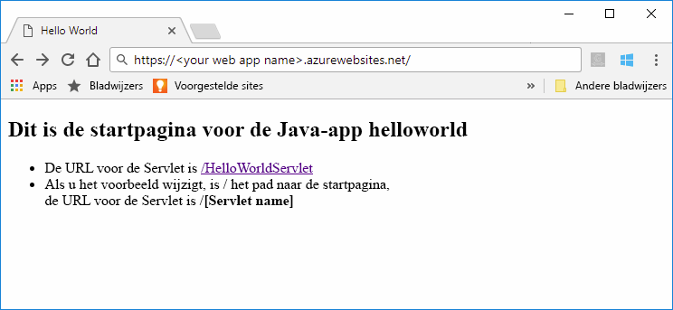
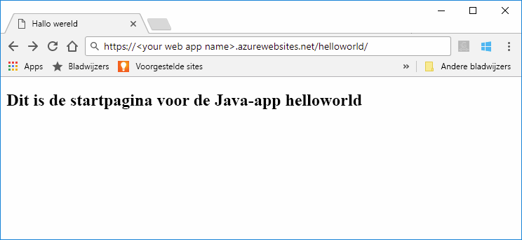

# <a name="quickstart-create-a-java-web-app-in-app-service-on-linux"></a>Quickstart: Een Java web-app maken in Azure App Service in Linux

[App Service in Linux](app-service-linux-intro.md) biedt een uiterst schaalbare webhostingservice met self-patchfunctie via het Linux-besturingssysteem. Deze snelstart laat u zien hoe u de [Azure CLI](https://docs.microsoft.com/cli/azure/get-started-with-azure-cli) met de [Maven-invoegtoepassing voor Azure Web Apps (preview)](https://github.com/Microsoft/azure-maven-plugins/tree/develop/azure-webapp-maven-plugin) gebruikt om een webarchiefbestand (WAR) voor een Java-web-app te implementeren.



[!INCLUDE [quickstarts-free-trial-note](../../../includes/quickstarts-free-trial-note.md)]

[!INCLUDE [cloud-shell-try-it.md](../../../includes/cloud-shell-try-it.md)]

## <a name="create-a-java-app"></a>Een Java-app maken

Voer de volgende Maven opdracht uit in de Cloud Shell-prompt om een ​​nieuwe web-app met de naam `helloworld` te maken:

```bash
mvn archetype:generate -DgroupId=example.demo -DartifactId=helloworld -DarchetypeArtifactId=maven-archetype-webapp
```

## <a name="configure-the-maven-plugin"></a>De Maven-invoegtoepassing configureren

Om te implementeren vanuit Maven, gebruikt u de code-editor in de Cloud Shell om het projectbestand `pom.xml` in de map `helloworld` te openen. 

```bash
code pom.xml
```

Voeg vervolgens de volgende invoegtoepassingsdefinitie toe aan het element `<build>` van het bestand `pom.xml`.

```xml
<plugins>
    <!--*************************************************-->
    <!-- Deploy to Tomcat in App Service Linux           -->
    <!--*************************************************-->
      
    <plugin>
        <groupId>com.microsoft.azure</groupId>
        <artifactId>azure-webapp-maven-plugin</artifactId>
        <version>1.4.0</version>
        <configuration>
   
            <!-- Web App information -->
            <resourceGroup>${RESOURCEGROUP_NAME}</resourceGroup>
            <appName>${WEBAPP_NAME}</appName>
            <region>${REGION}</region>
   
            <!-- Java Runtime Stack for Web App on Linux-->
            <linuxRuntime>tomcat 8.5-jre8</linuxRuntime>
   
        </configuration>
    </plugin>
</plugins>
```    


> [!NOTE] 
> In dit artikel werken we alleen met Java-apps die verpakt zijn in WAR-bestanden. De invoegtoepassing ondersteunt ook JAR-webtoepassingen. Gebruik de volgende alternatieve invoegtoepassingsdefinitie voor deze toepassingen. Deze configuratie implementeert een door Maven gebouwde JAR in `${project.build.directory}/${project.build.finalName}.jar` op uw lokale bestandssysteem.
>
>```xml
><plugin>
>            <groupId>com.microsoft.azure</groupId>
>            <artifactId>azure-webapp-maven-plugin</artifactId>
>            <version>1.4.0</version>
>            <configuration>
>                <deploymentType>jar</deploymentType>
>
>           <!-- Web App information -->
>            <resourceGroup>${RESOURCEGROUP_NAME}</resourceGroup>
>            <appName>${WEBAPP_NAME}</appName>
>            <region>${REGION}</region>  
>
>                <!-- Java Runtime Stack for Web App on Linux-->
>                <linuxRuntime>jre8</linuxRuntime>
>            </configuration>
>         </plugin>
>```    


Werk de volgende tijdelijke aanduidingen bij in de configuratie van de invoegtoepassing:

| Tijdelijke aanduiding | Beschrijving |
| ----------- | ----------- |
| `RESOURCEGROUP_NAME` | Naam voor de nieuwe resourcegroep waarin de web-app moet worden gemaakt. Door alle resources voor een app in een groep te plaatsen, kunt u ze samen beheren. Als u de resourcegroep verwijdert, worden bijvoorbeeld alle resources verwijderd die bij de app behoren. Wijzig deze waarde in een unieke nieuwe resourcegroepnaam, bijvoorbeeld *TestResources*. U gebruikt deze resourcegroepnaam om alle Azure-resources in een volgende sectie op te schonen. |
| `WEBAPP_NAME` | De app-naam maakt deel uit van de hostnaam voor de web-app wanneer deze in Azure is geïmplementeerd (NAAM_WEBAPP.azurewebsites.net). Wijzig deze waarde in een unieke naam voor de nieuwe Azure-web-app, die uw Java-app host, bijvoorbeeld *contoso*. |
| `REGION` | Een Azure-regio waar de web-app wordt gehost, bijvoorbeeld `westus2`. U kunt een lijst met regio's van de Cloud Shell of CLI ophalen met behulp van de opdracht `az account list-locations`. |

## <a name="deploy-the-app"></a>De app implementeren

Implementeer uw Java-app in Azure met de volgende opdracht:

```bash
mvn package azure-webapp:deploy
```

Zodra de implementatie is voltooid, bladert u naar de geïmplementeerde toepassing met behulp van de volgende URL in uw webbrowser, bijvoorbeeld `http://<webapp>.azurewebsites.net/helloworld`. 



**Gefeliciteerd!** U hebt uw eerste Java-app geïmplementeerd in App Service on Linux.


[!INCLUDE [cli-samples-clean-up](../../../includes/cli-samples-clean-up.md)]


## <a name="next-steps"></a>Volgende stappen

In deze snelstart hebt u Maven gebruikt om een ​​Java web-app te maken, de [Maven-invoegtoepassing voor Azure Web Apps (Preview)](https://github.com/Microsoft/azure-maven-plugins/tree/develop/azure-webapp-maven-plugin) geconfigureerd en vervolgens een in en webarchief verpakte Java-web-app geïmplementeerd naar App Service op Linux. Volg de onderstaande koppeling voor meer informatie over het gebruik van Java in Azure.

> [!div class="nextstepaction"]
> [Azure for Java Developers](https://docs.microsoft.com/java/azure/) (Azure voor Java-ontwikkelaars)

