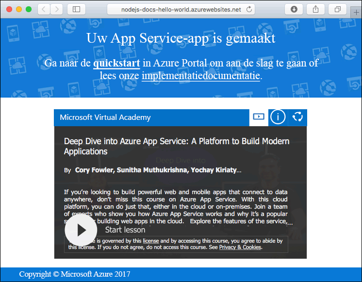
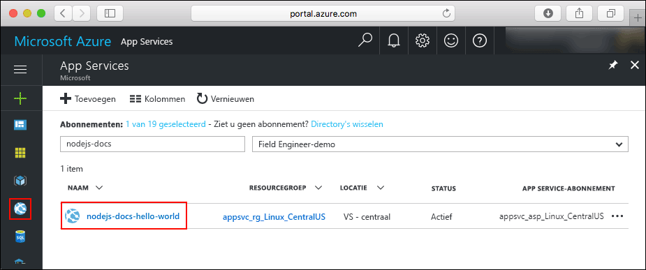
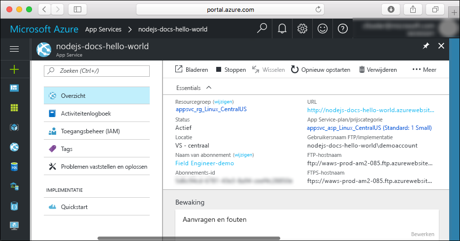

# <a name="create-a-nodejs-web-app-in-azure-app-service-on-linux"></a>Een Node.js-web-app maken in Azure App Service op Linux

> [!NOTE]
> In dit artikel gaat u een app implementeren in App Service onder Linux. Zie [Een Node.js-web-app maken in Azure](../app-service-web-get-started-nodejs.md) om een app te implementeren in App Service onder _Windows_.
>

[App Service on Linux](app-service-linux-intro.md) biedt een uiterst schaalbare webhostingservice met self-patchfunctie onder het Linux-besturingssysteem. Deze quickstart laat zien hoe u een Node.js-app implementeert in Azure App Service op Linux met een ingebouwde installatiekopie. U maakt de web-app met de ingebouwde installatiekopie via de [Azure CLI](https://docs.microsoft.com/cli/azure/get-started-with-azure-cli), en gebruikt Git om de code van Node.js in de web-app te implementeren.


U kunt de onderstaande stappen volgen met behulp van een Mac-, Windows- of Linux-computer.

## <a name="prerequisites"></a>Vereisten

Dit zijn de vereisten voor het voltooien van deze Quickstart:

* <a href="https://git-scm.com/" target="_blank">Git installeren</a>
* <a href="https://nodejs.org/" target="_blank">Node.js en NPM installeren</a>

[!INCLUDE [quickstarts-free-trial-note](../../../includes/quickstarts-free-trial-note.md)]

## <a name="download-the-sample"></a>Het voorbeeld downloaden

Voer in een terminalvenster op uw computer de volgende opdracht uit om de opslagplaats van de voorbeeld-app te klonen op uw lokale computer.

```bash
git clone https://github.com/Azure-Samples/nodejs-docs-hello-world
```

Dit terminalvenster gebruikt u om alle opdrachten in deze Quickstart uit te voeren.

Ga naar de map die de voorbeeldcode bevat.

```bash
cd nodejs-docs-hello-world
```

## <a name="run-the-app-locally"></a>De app lokaal uitvoeren

Voer de toepassing lokaal uit door een terminalvenster te openen en met het script `npm start` de ingebouwde Node.js HTTP-server te starten.

```bash
npm start
```

Open een webbrowser en navigeer naar de voorbeeldapp op `http://localhost:1337`.

Het bericht **Hello World** uit de voorbeeld-app wordt weergegeven op de pagina.


Druk in uw terminalvenster op **Ctrl + C** om de webserver af te sluiten.

[!INCLUDE [cloud-shell-try-it.md](../../../includes/cloud-shell-try-it.md)]

[!INCLUDE [Configure deployment user](../../../includes/configure-deployment-user.md)]

[!INCLUDE [Create resource group](../../../includes/app-service-web-create-resource-group.md)]

[!INCLUDE [Create app service plan](../../../includes/app-service-web-create-app-service-plan-linux.md)]

## <a name="create-a-web-app"></a>Een webtoepassing maken

[!INCLUDE [Create web app](../../../includes/app-service-web-create-web-app-nodejs-no-h.md)]

Blader naar uw nieuwe web-app. Vervang _&lt;app-naam>_ door de naam van uw web-app.

```bash
http://<app name>.azurewebsites.net
```



[!INCLUDE [Push to Azure](../../../includes/app-service-web-git-push-to-azure.md)]

```bash
Counting objects: 23, done.
Delta compression using up to 4 threads.
Compressing objects: 100% (21/21), done.
Writing objects: 100% (23/23), 3.71 KiB | 0 bytes/s, done.
Total 23 (delta 8), reused 7 (delta 1)
remote: Updating branch 'master'.
remote: Updating submodules.
remote: Preparing deployment for commit id 'bf114df591'.
remote: Generating deployment script.
remote: Generating deployment script for node.js Web Site
remote: Generated deployment script files
remote: Running deployment command...
remote: Handling node.js deployment.
remote: Kudu sync from: '/home/site/repository' to: '/home/site/wwwroot'
remote: Copying file: '.gitignore'
remote: Copying file: 'LICENSE'
remote: Copying file: 'README.md'
remote: Copying file: 'index.js'
remote: Copying file: 'package.json'
remote: Copying file: 'process.json'
remote: Deleting file: 'hostingstart.html'
remote: Ignoring: .git
remote: Using start-up script index.js from package.json.
remote: Node.js versions available on the platform are: 4.4.7, 4.5.0, 6.2.2, 6.6.0, 6.9.1.
remote: Selected node.js version 6.9.1. Use package.json file to choose a different version.
remote: Selected npm version 3.10.8
remote: Finished successfully.
remote: Running post deployment command(s)...
remote: Deployment successful.
To https://<app_name>.scm.azurewebsites.net:443/<app_name>.git
 * [new branch]      master -> master
```

## <a name="browse-to-the-app"></a>Bladeren naar de app

Blader naar de geïmplementeerde toepassing via uw webbrowser.

```bash
http://<app_name>.azurewebsites.net
```

De Node.js-voorbeeldcode wordt uitgevoerd in een web-app met een ingebouwde installatiekopie.


**Gefeliciteerd!** U hebt uw eerste Node.js-app geïmplementeerd in Azure App Service on Linux.

## <a name="update-and-redeploy-the-code"></a>De code bijwerken en opnieuw implementeren

Open in de lokale map het bestand `index.js` binnen de Node.js-app en breng een kleine wijziging aan in de tekst in de aanroep naar `response.end`:

```nodejs
response.end("Hello Azure!");
```

Leg uw wijzigingen vast in Git en push de codewijzigingen vervolgens naar Azure.

```bash
git commit -am "updated output"
git push azure master
```

Als de implementatie is voltooid, gaat u terug naar het browservenster dat is geopend in de stap **Bladeren naar de app** en klikt u op Vernieuwen.


## <a name="manage-your-new-azure-web-app"></a>Uw nieuwe Azure-web-app beheren

Ga naar <a href="https://portal.azure.com" target="_blank">Azure Portal</a> om de web-app te beheren die u hebt gemaakt.

Klik in het linkermenu op **App Services** en klik op de naam van uw Azure-web-app.



De pagina Overzicht van uw web-app wordt weergegeven. Hier kunt u algemene beheertaken uitvoeren, zoals bladeren, stoppen, starten, opnieuw opstarten en verwijderen. 



Het linkermenu bevat een aantal pagina's voor het configureren van uw app. 

[!INCLUDE [cli-samples-clean-up](../../../includes/cli-samples-clean-up.md)]

## <a name="next-steps"></a>Volgende stappen

> [!div class="nextstepaction"]
> [Node.js met MongoDB](tutorial-nodejs-mongodb-app.md)
