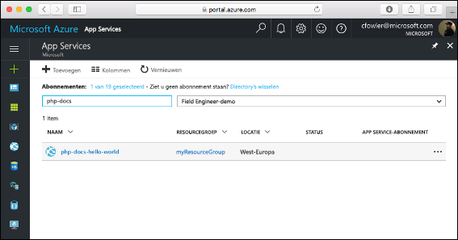
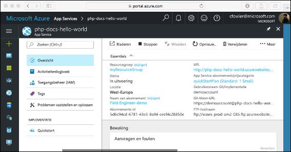

# <a name="create-a-php-web-app-in-app-service-on-linux"></a>Een PHP-web-app maken in App-Service op Linux

[App-Service op Linux](app-service-linux-intro.md) biedt een zeer schaalbaar, zelf patch webhosting-service met het Linux-besturingssysteem. Deze Quick Start-zelfstudie laat zien hoe een PHP-app implementeren in Azure App Service op Linux. U de web-app maken met de ingebouwde installatiekopie met de [Azure CLI](https://docs.microsoft.com/cli/azure/get-started-with-azure-cli) in Cloud-Shell en u Git gebruiken voor het implementeren van de PHP-code voor de web-app.

! [Voorbeeld-app in Azure wordt uitgevoerd]] (media/quickstart-php/hello-world-in-browser.png)

U kunt de onderstaande stappen volgen met behulp van een Mac-, Windows- of Linux-computer.

## <a name="prerequisites"></a>Vereisten

Dit zijn de vereisten voor het voltooien van deze Quickstart:

* [Git installeren](https://git-scm.com/)
* [PHP installeren](https://php.net)

[!INCLUDE [quickstarts-free-trial-note](../../../includes/quickstarts-free-trial-note.md)]

## <a name="download-the-sample"></a>Het voorbeeld downloaden

Voer de volgende opdrachten voor het klonen van de voorbeeldtoepassing op uw lokale computer en navigeer naar de map met de voorbeeldcode in een terminalvenster.

```bash
git clone https://github.com/Azure-Samples/php-docs-hello-world
cd php-docs-hello-world
```

## <a name="run-the-app-locally"></a>De app lokaal uitvoeren

Voer de toepassing lokaal uit door een terminalvenster te openen en de opdracht `php` te gebruiken om de ingebouwde PHP-webserver te starten.

```bash
php -S localhost:8080
```

Open een webbrowser en navigeer naar de voorbeeld-app op `http://localhost:8080`.

Het bericht **Hallo wereld** uit de voorbeeld-app wordt weergegeven op de pagina.


Druk in uw terminalvenster op **Ctrl + C** om de webserver af te sluiten.

[!INCLUDE [cloud-shell-try-it.md](../../../includes/cloud-shell-try-it.md)]

[!INCLUDE [Configure deployment user](../../../includes/configure-deployment-user.md)]

[!INCLUDE [Create resource group](../../../includes/app-service-web-create-resource-group.md)]

[!INCLUDE [Create app service plan](../../../includes/app-service-web-create-app-service-plan-linux.md)]

## <a name="create-a-web-app-with-built-in-image"></a>Een web-app maken met installatiekopie van het ingebouwde

[!INCLUDE [Create web app](../../../includes/app-service-web-create-web-app-php-no-h.md)] 

Blader naar de site om te zien van uw nieuwe web-app met ingebouwde installatiekopie. Vervang  _&lt;app-naam >_ met een unieke app-naam.

```bash
http://<app name>.azurewebsites.net
```


[!INCLUDE [Push to Azure](../../../includes/app-service-web-git-push-to-azure.md)] 

```bash
Counting objects: 2, done.
Delta compression using up to 4 threads.
Compressing objects: 100% (2/2), done.
Writing objects: 100% (2/2), 352 bytes | 0 bytes/s, done.
Total 2 (delta 1), reused 0 (delta 0)
remote: Updating branch 'master'.
remote: Updating submodules.
remote: Preparing deployment for commit id '25f18051e9'.
remote: Generating deployment script.
remote: Running deployment command...
remote: Handling Basic Web Site deployment.
remote: Kudu sync from: '/home/site/repository' to: '/home/site/wwwroot'
remote: Copying file: '.gitignore'
remote: Copying file: 'LICENSE'
remote: Copying file: 'README.md'
remote: Copying file: 'index.php'
remote: Ignoring: .git
remote: Finished successfully.
remote: Running post deployment command(s)...
remote: Deployment successful.
To https://<app_name>.scm.azurewebsites.net/<app_name>.git
   cc39b1e..25f1805  master -> master
```

## <a name="browse-to-the-app"></a>Bladeren naar de app

Blader naar de geïmplementeerde toepassing via uw webbrowser.

```bash
http://<app_name>.azurewebsites.net
```

De voorbeeldcode PHP wordt uitgevoerd in een web-app met ingebouwde installatiekopie.


**Gefeliciteerd!** U hebt uw eerste PHP-app geïmplementeerd in App Service op Linux.

## <a name="update-locally-and-redeploy-the-code"></a>De code lokaal bijwerken en opnieuw implementeren

Open met behulp van een lokale teksteditor het bestand `index.php` binnen de PHP-app en breng een kleine wijziging aan in de tekst in de tekenreeks naast `echo`:

```php
echo "Hello Azure!";
```

Leg uw wijzigingen vast in Git en push de codewijzigingen vervolgens naar Azure.

```bash
git commit -am "updated output"
git push azure master
```

Wanneer de implementatie is voltooid, gaat u terug naar het browservenster dat is geopend in de stap **Bladeren naar de app** en vernieuwt u de pagina.


## <a name="manage-your-new-azure-web-app"></a>Uw nieuwe Azure-web-app beheren

Ga naar <a href="https://portal.azure.com" target="_blank">Azure Portal</a> om de web-app te beheren die u hebt gemaakt.

Klik in het linkermenu op **App Services** en klik op de naam van uw Azure-web-app.



De pagina Overzicht van uw web-app wordt weergegeven. Hier kunt u algemene beheertaken uitvoeren, zoals bladeren, stoppen, starten, opnieuw opstarten en verwijderen.



Het linkermenu bevat een aantal pagina's voor het configureren van uw app. 

[!INCLUDE [cli-samples-clean-up](../../../includes/cli-samples-clean-up.md)]

## <a name="next-steps"></a>Volgende stappen

> [!div class="nextstepaction"]
> [PHP met MySQL](tutorial-php-mysql-app.md)
