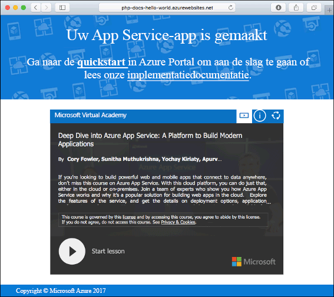
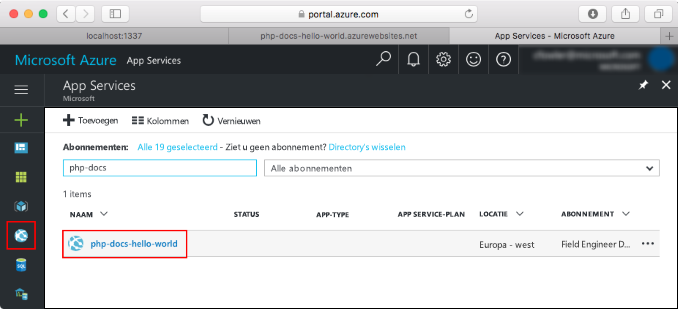

# <a name="create-a-python-web-app-in-azure-app-service-on-linux-preview"></a>Een Python-web-app maken in Azure App Service op Linux (preview)

[App Service onder Linux](app-service-linux-intro.md) biedt een uiterst schaalbare webhostingservice met self-patchfunctie onder het Linux-besturingssysteem. Deze snelstart laat zien hoe een Python-app bovenop de ingebouwde Python-installatiekopie (preview) in de App-service op Linux kan worden geïmplementeerd met behulp van de [Azure CLI](/cli/azure/install-azure-cli).

U kunt de stappen in dit artikel volgen met behulp van een Mac-, Windows- of Linux-computer.


[!INCLUDE [quickstarts-free-trial-note](../../../includes/quickstarts-free-trial-note.md)]

## <a name="prerequisites"></a>Vereisten

Dit zijn de vereisten voor het voltooien van deze snelstart:

* <a href="https://www.python.org/downloads/" target="_blank">Python 3.7 installeren</a>
* <a href="https://git-scm.com/" target="_blank">Git installeren</a>

## <a name="download-the-sample"></a>Het voorbeeld downloaden

Voer de volgende opdrachten uit in een terminalvenster. Hiermee wordt de voorbeeldtoepassing gekloond naar uw lokale machine en navigeert u naar de map met de voorbeeldcode.

```bash
git clone https://github.com/Azure-Samples/python-docs-hello-world
cd python-docs-hello-world
```

## <a name="run-the-app-locally"></a>De app lokaal uitvoeren

Voer de toepassing lokaal uit zodat u kunt zien hoe deze eruit ziet wanneer u de toepassing implementeert naar Azure. Open een terminalvenster en gebruik de opdrachten hieronder om de vereiste afhankelijkheden te installeren en de ingebouwde ontwikkelserver te starten. 

```bash
# In Bash
python3 -m venv venv
source venv/bin/activate
pip install -r requirements.txt
FLASK_APP=application.py flask run

# In PowerShell
py -3 -m venv env
env\scripts\activate
pip install -r requirements.txt
Set-Item Env:FLASK_APP ".\application.py"
flask run
```

Open een webbrowser en navigeer naar de voorbeeldapp op `http://localhost:5000/`.

Het bericht **Hallo wereld** uit de voorbeeld-app wordt weergegeven op de pagina.


Druk in uw terminalvenster op **Ctrl + C** om de webserver af te sluiten.

[!INCLUDE [cloud-shell-try-it.md](../../../includes/cloud-shell-try-it.md)]

[!INCLUDE [Configure deployment user](../../../includes/configure-deployment-user.md)]

[!INCLUDE [Create resource group](../../../includes/app-service-web-create-resource-group-linux.md)]

[!INCLUDE [Create app service plan](../../../includes/app-service-web-create-app-service-plan-linux.md)]

## <a name="create-a-web-app"></a>Een webtoepassing maken

[!INCLUDE [Create app service plan](../../../includes/app-service-web-create-web-app-python-linux-no-h.md)]

Blader naar de site om uw nieuwe web-app met de ingebouwde installatiekopie te bekijken. Vervang _&lt;app-naam>_ door de naam van uw web-app.

```bash
http://<app_name>.azurewebsites.net
```

Zo zou uw nieuwe web-app er moeten uitzien:



[!INCLUDE [Push to Azure](../../../includes/app-service-web-git-push-to-azure.md)] 

```bash
Counting objects: 42, done.
Delta compression using up to 8 threads.
Compressing objects: 100% (39/39), done.
Writing objects: 100% (42/42), 9.43 KiB | 0 bytes/s, done.
Total 42 (delta 15), reused 0 (delta 0)
remote: Updating branch 'master'.
remote: Updating submodules.
remote: Preparing deployment for commit id 'c40efbb40e'.
remote: Generating deployment script.
remote: Generating deployment script for python Web Site
.
.
.
remote: Finished successfully.
remote: Running post deployment command(s)...
remote: Deployment successful.
remote: App container will begin restart within 10 seconds.
To https://user2234@cephalin-python.scm.azurewebsites.net/cephalin-python.git
 * [new branch]      master -> master
 ```

## <a name="browse-to-the-app"></a>Bladeren naar de app

Blader naar de geïmplementeerde toepassing via uw webbrowser.

```bash
http://<app_name>.azurewebsites.net
```

De Python-voorbeeldcode wordt uitgevoerd in een web-app met een ingebouwde installatiekopie.


**Gefeliciteerd!** U hebt uw eerste Python-app geïmplementeerd naar App Service op Linux.

## <a name="update-locally-and-redeploy-the-code"></a>De code lokaal bijwerken en opnieuw implementeren

Open in de lokale opslagplaats het bestand `application.py` en breng een kleine wijziging aan in de tekst op de laatste regel:

```python
return "Hello Azure!"
```

Leg uw wijzigingen vast in Git en push de codewijzigingen vervolgens naar Azure.

```bash
git commit -am "updated output"
git push azure master
```

Wanneer de implementatie is voltooid, gaat u terug naar het browservenster dat is geopend in de stap **Bladeren naar de app** en vernieuwt u de pagina.


## <a name="manage-your-new-azure-web-app"></a>Uw nieuwe Azure-web-app beheren

Ga naar <a href="https://portal.azure.com" target="_blank">Azure Portal</a> om de web-app te beheren die u hebt gemaakt.

Klik in het linkermenu op **App Services** en klik op de naam van uw Azure-web-app.



De pagina Overzicht van uw web-app wordt weergegeven. Hier kunt u algemene beheertaken uitvoeren, zoals bladeren, stoppen, starten, opnieuw opstarten en verwijderen.


Het linkermenu bevat een aantal pagina's voor het configureren van uw app. 

[!INCLUDE [cli-samples-clean-up](../../../includes/cli-samples-clean-up.md)]

## <a name="next-steps"></a>Volgende stappen

De Python-installatiekopie die in App Service onder Linux is ingebouwd, is momenteel in preview. U kunt de opdracht voor het opstarten van uw app aanpassen. U kunt ook in plaats daarvan productie-Python-apps maken met behulp van een aangepaste container.

> [!div class="nextstepaction"]
> [Python met PostgreSQL](tutorial-python-postgresql-app.md)

> [!div class="nextstepaction"]
> [Een aangepaste opstartopdracht configureren](how-to-configure-python.md#custom-startup-command)

> [!div class="nextstepaction"]
> [Problemen oplossen](how-to-configure-python.md#troubleshooting)

> [!div class="nextstepaction"]
> [Aangepaste installatiekopieën gebruiken](tutorial-custom-docker-image.md)
