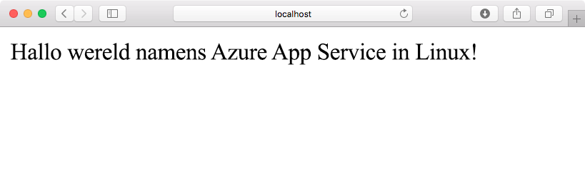
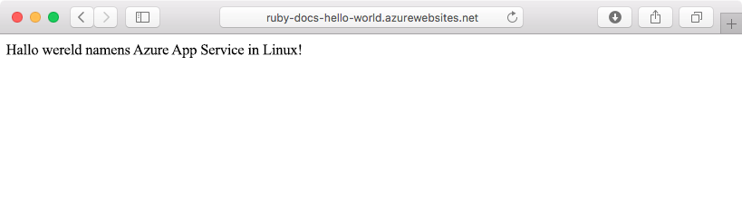
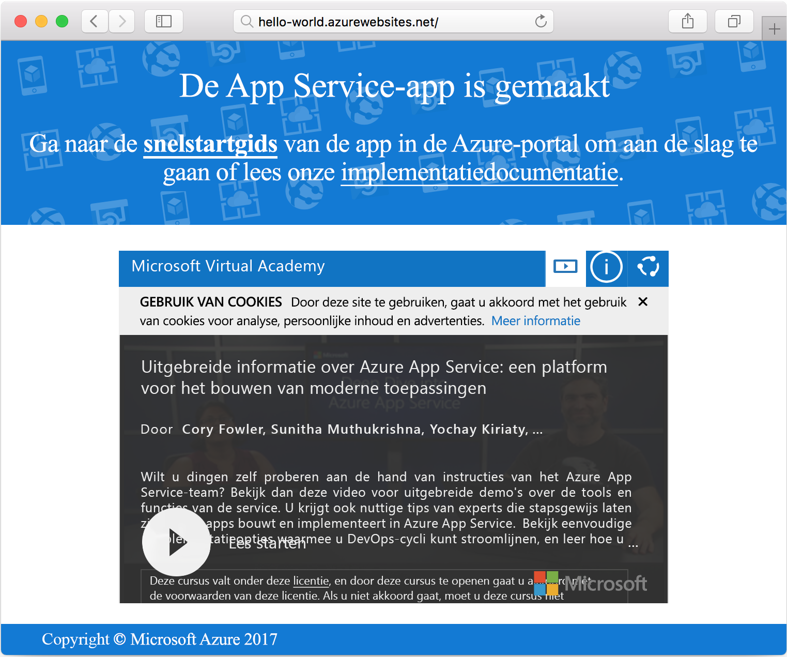

# <a name="create-a-ruby-app-in-app-service-on-linux"></a>Een Ruby-app maken in App Service on Linux

[App Service on Linux](app-service-linux-intro.md) biedt een uiterst schaalbare webhostingservice met self-patchfunctie. Deze snelstartgids laat zien hoe u een eenvoudige Ruby on Rails-toepassing maakt en implementeert als web-app in Azure Web App on Linux.



## <a name="prerequisites"></a>Vereisten

* <a href="https://www.ruby-lang.org/en/documentation/installation/#rubyinstaller" target="_blank">Ruby 2.4.1 of hoger installeren</a>
* <a href="https://git-scm.com/" target="_blank">Git installeren</a>

[!INCLUDE [quickstarts-free-trial-note](../../../includes/quickstarts-free-trial-note.md)]

## <a name="download-the-sample"></a>Het voorbeeld downloaden

Voer in een terminalvenster de volgende opdracht uit om de opslagplaats van de voorbeeld-app te klonen op uw lokale computer:

```bash
git clone https://github.com/Azure-Samples/ruby-docs-hello-world
```

## <a name="run-the-application-locally"></a>De toepassing lokaal uitvoeren

Zorg ervoor dat de Rails-server actief is, anders werkt de toepassing niet. Ga naar de map *hello-world*, en start de server met de opdracht `rails server`.

```bash
cd hello-world\bin
rails server
```

Navigeer naar `http://localhost:3000` met uw webbrowser om de app lokaal te testen.


## <a name="modify-app-to-display-welcome-message"></a>App wijzigen om welkomstbericht weer te geven

Wijzig de toepassing zo dat een welkomstbericht wordt weergegeven. Eerst moet u een route instellen door het bestand *~/workspace/ruby-docs-hello-world/config/routes.rb* te wijzigen. Neem er een route in op met de naam `hello`.

  ```ruby
  Rails.application.routes.draw do
      #For details on the DSL available within this file, see http://guides.rubyonrails.org/routing.html
      root 'application#hello'
  end
  ```

Wijzig de controller van de toepassing zo dat het bericht als HTML wordt geretourneerd naar de browser. 

Open *~/workspace/hello-world/app/controllers/application_controller.rb* voor bewerking. Wijzig de klasse `ApplicationController` zo dat deze eruitziet zoals in het volgende codevoorbeeld:

  ```ruby
  class ApplicationController > ActionController :: base
    protect_from_forgery with: :exception
    def hello
      render html: "Hello, world from Azure Web App on Linux!"
    end
  end
  ```

Uw app is nu geconfigureerd. Navigeer met behulp van uw webbrowser naar `http://localhost:3000` om de hoofdlandingspagina te controleren.



[!INCLUDE [Try Cloud Shell](../../../includes/cloud-shell-try-it.md)]

[!INCLUDE [Configure deployment user](../../../includes/configure-deployment-user.md)]

## <a name="create-a-ruby-web-app-on-azure"></a>Een Ruby web-app maken in Azure

Een resourcegroep is vereist voor de benodigde activa voor uw web-app. U kunt een resourcegroep maken met de opdracht [az group create]().

```azurecli-interactive
az group create --location westeurope --name myResourceGroup
```

Maak een App Service-plan met de opdracht [az appservice plan create](/cli/azure/appservice/plan?view=azure-cli-latest#az_appservice_plan_create).

```azurecli-interactive
az appservice plan create --name myAppServicePlan --resource-group myResourceGroup --is-linux
```

Gebruik vervolgens de opdracht [az webapp create](/cli/azure/webapp?view=azure-cli-latest#az_webapp_create) om de web-app te maken voor het zojuist gemaakte App Service-plan. Merk op dat de runtime is ingesteld op `ruby|2.3`. Vergeet niet om `<app name>` te vervangen door een unieke app-naam.

```azurecli-interactive
az webapp create --resource-group myResourceGroup --plan myAppServicePlan --name <app name> \
--runtime "ruby|2.3" --deployment-local-git
```

De uitvoer van de opdracht bevat informatie over de nieuwe web-app en de implementatie-URL. Deze URL moet er ongeveer uitzien als de URL in het volgende voorbeeld. Kopieer de URL voor later gebruik in deze zelfstudie.

```bash
https://<deployment user name>@<app name>.scm.azurewebsites.net/<app name>.git
```

Zodra de web-app is gemaakt, kunt u de pagina **Overzicht** weergeven. Navigeer naar die pagina. De volgende welkomstpagina wordt weergegeven:




## <a name="deploy-your-application"></a>Uw toepassing implementeren

Voer de volgende opdrachten uit om de lokale toepassing in uw Azure-website te implementeren:

```bash
git remote add azure <Git deployment URL from above>
git add -A
git commit -m "Initial deployment commit"
git push azure master
```

Controleer of de externe implementatiebewerkingen met succes voltooid zijn. De uitvoer van de opdrachten moet er ongeveer uitzien als de volgende tekst:

```bash
remote: Using sass-rails 5.0.6
remote: Updating files in vendor/cache
remote: Bundle gems are installed into ./vendor/bundle
remote: Updating files in vendor/cache
remote: ~site/repository
remote: Finished successfully.
remote: Running post deployment command(s)...
remote: Deployment successful.
To https://<your web app name>.scm.azurewebsites.net/<your web app name>.git
  579ccb....2ca5f31  master -> master
myuser@ubuntu1234:~workspace/<app name>$
```

Als de implementatie is voltooid, moet u de web-app opnieuw opstarten om de implementatie van kracht te laten worden. Hiertoe voert u de opdracht [az webapp restart](/cli/azure/webapp?view=azure-cli-latest#az_webapp_restart) uit, zoals in dit voorbeeld:

```azurecli-interactive
az webapp restart --name <app name> --resource-group myResourceGroup
```

Navigeer naar uw site en controleer de resultaten.

```bash
http://<app name>.azurewebsites.net
```


> [!NOTE]
> Als u probeert op de site te bladeren terwijl de app opnieuw wordt opgestart, wordt de HTTP-statuscode `Error 503 Server unavailable` geretourneerd. Het opnieuw opstarten kan een paar minuten duren.
>

[!INCLUDE [Clean-up section](../../../includes/cli-script-clean-up.md)]

## <a name="next-steps"></a>Volgende stappen

> [!div class="nextstepaction"]
> [Ruby on Rails met MySQL](tutorial-ruby-mysql-app.md)
