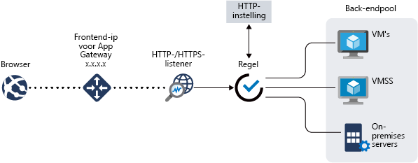

# Wat is Azure Application Gateway?

Azure Application Gateway is een load balancer voor webverkeer waarmee u het verkeer naar uw webapps kunt beheren. Traditionele load balancers werken op de transportlaag (OSI-laag 4 - TCP en UDP) en routeren verkeer op basis van IP-bronadres en een bronpoort naar een IP-doeladres en doelpoort.

Met Application Gateway, kunt u Routeringsbeslissingen op basis van aanvullende kenmerken van een HTTP-aanvraag, zoals URI-pad of de host-headers. U kunt bijvoorbeeld verkeer op basis van de binnenkomende URL routeren. Dus als `/images` de binnenkomende URL is, kunt u verkeer routeren naar een specifieke set servers (ook wel een pool genoemd) die is geconfigureerd voor installatiekopieën. Als `/video` is in de URL, dat verkeer wordt doorgestuurd naar een andere groep die geoptimaliseerd voor video's.

Dit type routering staat bekend al taakverdeling op de toepassingslaag (OSI-laag 7). Azure Application Gateway kan URL-gebaseerde routering en meer uitvoeren.

Azure Application Gateway bevat de volgende functies:

## SSL-beëindiging (Secure Sockets Layer)

Application Gateway ondersteunt SSL-beëindiging op de gateway, waarna het verkeer normaal gesproken onversleuteld naar de back-endservers wordt doorgeleid. Met deze functie voorkomt u prijzige overhead voor het versleutelen en ontsleutelen voor uw webservers. Maar soms is onversleutelde communicatie met de server echter geen aanvaardbare optie. Dit kan zijn vanwege beveiligingsvereisten, nalevingsvereisten, of de toepassing kan alleen via een beveiligde verbinding. Voor deze toepassingen ondersteunt Application Gateway end-to-end SSL-versleuteling.

## Automatisch schalen

Application Gateway of WAF-implementaties onder Standard_v2 of WAF_v2 SKU ondersteuning voor automatisch schalen en kunnen opschalen of omlaag op basis van veranderende verkeerspatronen load. Automatisch schalen heft ook de vereiste op om tijdens het inrichten een implementatiegrootte of het aantal instanties te kiezen. Zie voor meer informatie over de Application Gateway standard_v2 en WAF_v2 functies [automatisch schalen v2 SKU](application-gateway-autoscaling-zone-redundant.md).

## Zoneredundantie

Een Application Gateway of WAF-implementaties voor Standard_v2 of WAF_v2 SKU kunnen meerdere Beschikbaarheidszones, biedt betere tolerantie voor fouttolerantie en verwijderen van de noodzaak voor het inrichten van afzonderlijke Toepassingsgateways in elke zone omvatten.

## Statische VIP

De toepassingsgateway VIP op Standard_v2 of WAF_v2 SKU ondersteunt uitsluitend statische VIP-type. Dit zorgt ervoor dat het VIP-adres dat is gekoppeld aan application-gateway niet, zelfs tijdens de levensduur van de toepassingsgateway verandert.

## Web Application Firewall

Web Application Firewall (WAF) is een functie van Application Gateway die gecentraliseerde beveiliging van uw webtoepassingen tegen algemene aanvallen en beveiligingsproblemen biedt. WAF is gebaseerd op regels uit de [Core Rule Set 3.0 of 2.2.9 van OWASP (Open Web Application Security Project)](https://www.owasp.org/index.php/Category:OWASP_ModSecurity_Core_Rule_Set_Project). 

Webtoepassingen zijn in toenemende mate het doel van aanvallen die gebruikmaken van veelvoorkomende bekende beveiligingsproblemen. Veelvoorkomende aanvallen zijn hierbij onder andere aanvallen met SQL-injecties en aanvallen via scripting op meerdere sites. Het kan een hele uitdaging zijn om dergelijke aanvallen in toepassingscode te voorkomen en dit kan tevens veel onderhoud, patching en controle vereisen op meerdere lagen van de toepassingstopologie. Een gecentraliseerde firewall voor webtoepassingen maakt het beveiligingsbeheer veel eenvoudiger en biedt toepassingsbeheerders meer veiligheid tegen bedreigingen of aanvallen. Een WAF-oplossing kan ook sneller reageren op een beveiligingsrisico door een patch voor een bekend beveiligingsprobleem toe te passen op een centrale locatie in plaats van elke afzonderlijke webtoepassing te beveiligen. Bestaande toepassingsgateways kunnen eenvoudig worden geconverteerd naar een toepassingsgateway met Web Application Firewall.

Zie voor meer informatie, [Web application firewall (WAF) in Application Gateway](https://docs.microsoft.com/azure/application-gateway/waf-overview)).

## URL-gebaseerde routering

Met op URL-pad gebaseerde routering kunt u verkeer routeren naar back-endserverpools die zijn gebaseerd op de URL-paden van de aanvraag. Een van de scenario's is het routeren van aanvragen voor verschillende inhoudstypen naar een andere pool.

Aanvragen voor `http://contoso.com/video/*` worden bijvoorbeeld doorgestuurd naar VideoServerPool en aanvragen voor `http://contoso.com/images/*` worden doorgestuurd naar ImageServerPool. Als geen van de padpatronen overeenkomen, wordt DefaultServerPool geselecteerd.

Zie voor meer informatie, [met Application Gateway URL-gebaseerde routering](https://docs.microsoft.com/azure/application-gateway/url-route-overview).

## Hosting van meerdere sites

Door meerdere sites te hosten, kunt u meer dan een website configureren op dezelfde instantie van de toepassingsgateway. Met deze functie kunt u een efficiëntere topologie voor uw implementaties configureren door maximaal 100 websites toe te voegen aan één toepassingsgateway. Elke website kan worden omgeleid naar een eigen pool. Application Gateway kan bijvoorbeeld verkeer regelen voor `contoso.com` en `fabrikam.com` vanaf twee servergroepen genaamd ContosoServerPool en FabrikamServerPool.

Aanvragen voor `http://contoso.com` worden gerouteerd naar ContoServerPool en aanvragen voor `http://fabrikam.com` worden gerouteerd naar FabrikamServerPool.

Op dezelfde manier kunnen twee subdomeinen van hetzelfde bovenliggende domein worden gehost op dezelfde implementatie van een toepassingsgateway. Voorbeelden van subdomeinen die worden gehost op één toepassingsgateway-implementatie, zijn `http://blog.contoso.com` en `http://app.contoso.com`.

Zie voor meer informatie, [meerdere sites hosten met Application Gateway](https://docs.microsoft.com/azure/application-gateway/multiple-site-overview).

## Omleiding

Een veelvoorkomend scenario voor veel webtoepassingen is de ondersteuning van automatische HTTP-naar-HTTPS-omleiding zodat alle communicatie tussen een toepassing en gebruikers plaatsvindt via een versleuteld pad.

In het verleden ligt en hebt u gebruikt, zoals de toegewezen groep maken met als enig doel is ontvangen van HTTP naar HTTPS aanvragen omleiden. Application Gateway ondersteunt het omleiden van verkeer op de Application Gateway. Dit vereenvoudigt de configuratie van toepassingen, optimaliseert het resourcegebruik en biedt ondersteuning voor nieuwe omleidingsscenario's, waaronder de globale en op pad gebaseerde omleidingen. Application Gateway-omleiding ondersteuning is niet beperkt tot HTTP naar HTTPS-omleiding alleen. Dit is een algemeen omleidingsmechanisme, zodat u op basis van regels kunt omleiden van en naar elke poort die u gebruikt. Ook omleiding naar een externe site wordt ondersteund.

Ondersteuning voor Application Gateway-omleiding biedt de volgende mogelijkheden:

- Globale omleiding van de ene poort naar de andere poort op de Gateway. Hierdoor is HTTP-naar-HTTPS-omleiding op een site mogelijk.
- Padgebaseerde omleiding. Dit type omleiding maakt HTTP-naar-HTTPS-omleiding alleen mogelijk op een specifiek sitegebied, bijvoorbeeld een winkelwagengebied aangegeven door `/cart/*`.
- Omleiden naar een externe site.

Zie voor meer informatie, [omleiden van verkeer](https://docs.microsoft.com/azure/application-gateway/redirect-overview) met Application Gateway.

## Sessieaffiniteit

De functie Sessieaffiniteit op basis van cookies is handig als u een gebruikerssessie op dezelfde server wilt behouden. Met behulp van de gatewaybeheerde cookies kan de Application Gateway het daarop volgende verkeer van een gebruikerssessie naar dezelfde server leiden voor verwerking. Dit is belangrijk wanneer de sessiestatus lokaal wordt opgeslagen op de server voor een gebruikerssessie.

## Websocket- en HTTP-/2-verkeer

Application Gateway biedt systeemeigen ondersteuning voor de WebSocket- en HTTP-/2-protocollen. Er is geen door de gebruiker configureerbare instelling om selectief WebSocket-ondersteuning in of uit te schakelen.

De WebSocket- en HTTP-/2-protocollen maken full-duplex-communicatie tussen een server en een client mogelijk via een langdurige TCP-verbinding. Dit maakt een meer interactieve communicatie mogelijk tussen de webserver en de client, die bidirectioneel kan zijn zonder dat hiervoor polling nodig is, zoals vereist in implementaties op basis van HTTP. Deze protocollen zijn lage overhead, in tegenstelling tot HTTP, en dezelfde TCP-verbinding voor meerdere aanvragen/antwoorden, wat resulteert in een efficiënter gebruik van resources kunnen hergebruiken. Deze protocollen zijn ontworpen om te werken via de traditionele HTTP-poorten: 80 en 443.

Zie voor meer informatie, [WebSocket-ondersteuning](https://docs.microsoft.com/azure/application-gateway/application-gateway-websocket) en [ondersteuning voor HTTP/2](https://docs.microsoft.com/azure/application-gateway/configuration-overview#http2-support).

## Ingangscontroller van Azure Kubernetes Service (AKS) (preview) 

De ingangscontroller van Application Gateway wordt uitgevoerd als een pod binnen het AKS-cluster en zorgt ervoor dat de Gateway-toepassing kan fungeren als ingang voor een AKS-cluster. Dit wordt ondersteund met Application Gateway alleen v2.

Zie [Azure Application Gateway Ingress Controller](https://azure.github.io/application-gateway-kubernetes-ingress/) voor meer informatie.

## Verwerkingsstop voor verbindingen

Verwerkingsstop voor verbindingen helpt u om back-endgroepsleden zonder problemen te verwijderen tijdens geplande service-updates. Deze instelling wordt ingeschakeld via de HTTP-instelling van de back-end en kan tijdens het maken van de regel worden toegepast op alle leden van een back-endgroep. Eenmaal is ingeschakeld, Application Gateway zorgt ervoor dat alle ongedaan maken registreren exemplaren van een back-endpool wordt een nieuwe aanvraag niet terwijl bestaande aanvragen om te voltooien binnen een geconfigureerde tijdslimiet. Dit geldt voor zowel back-end-exemplaren die expliciet zijn verwijderd uit de back-endpool door een API-aanroep als back-end-exemplaren die worden gerapporteerd als beschadigd zoals wordt bepaald door de statuscontroles.

## Aangepaste foutpagina's

Met Application Gateway kunt u aangepaste foutpagina's maken in plaats van standaardfoutpagina's weer te geven. U kunt uw eigen huisstijl en lay-out hanteren door een aangepaste foutpagina te gebruiken.

Zie voor meer informatie, [Herschrijf de HTTP-headers](rewrite-http-headers.md).

## HTTP-headers opnieuw genereren

HTTP-headers kunnen de client en server om door te geven aanvullende informatie met de aanvraag of het antwoord. Voor het herschrijven van deze HTTP-headers, kunt u verschillende belangrijke scenario's, zoals uitvoeren:

- Toe te voegen beveiligingsgerelateerde kopvelden, zoals HSTS / X-XSS-beveiliging.
- Antwoord-headervelden kunnen gevoelige informatie onthullen verwijderd.
- Informatie over de poort van de koptekst X doorgestuurd voor verwijdering.

Application Gateway ondersteunt de mogelijkheid voor het toevoegen, verwijderen of bijwerken van HTTP-aanvraag- en reactieheaders, terwijl de aanvraag en respons pakketten tussen de client en de back-end-pools verplaatsen. Het biedt u ook de mogelijkheid om toe te voegen voorwaarden om te controleren of dat de opgegeven headers worden herschreven alleen als aan bepaalde voorwaarden wordt voldaan.

Zie voor meer informatie, [Herschrijf de HTTP-headers](rewrite-http-headers.md).

## Grootte aanpassen

Application Gateway Standard_v2 en WAF_v2 SKU kan worden geconfigureerd voor automatisch schalen of vaste grootte implementaties. Deze SKU's bieden verschillende instantiegrootten niet.

De Application Gateway standaard en WAF-Voorraadeenheid wordt momenteel aangeboden in drie grootten: **Kleine**, **gemiddeld**, en **grote**. Kleine exemplaargrootten zijn bedoeld voor het ontwikkelen en testen van scenario's.

Zie [Servicelimieten voor Application Gateway](../azure-subscription-service-limits.md?toc=%2fazure%2fapplication-gateway%2ftoc.json#application-gateway-limits) voor een volledige lijst van toepassingsgateway-limieten.

In de volgende tabel staan gemiddelde doorvoerprestaties voor elk toepassingsgateway-exemplaar waarvoor SSL-offload is uitgeschakeld:

| Gemiddelde grootte van een antwoord van de back-endpagina | Klein | Gemiddeld | Groot |
| --- | --- | --- | --- |
| 6 kB |7,5 Mbps |13 Mbps |50 Mbps |
| 100 kB |35 Mbps |100 Mbps |200 Mbps |

> [!NOTE]
> Deze waarden zijn geschatte waarden voor de doorvoer van een toepassingsgateway. De werkelijke doorvoer hangt af van verschillende details van de omgeving, zoals de gemiddelde paginagrootte, locatie van back-endexemplaren en de verwerkingstijd voor een pagina. Voor nauwkeurige prestatiecijfers moet u uw eigen tests uitvoeren. Deze waarden worden alleen geboden als richtlijn voor de capaciteitsplanning.

## Volgende stappen

Afhankelijk van uw vereisten en omgeving, kunt u een Application Gateway voor testdoeleinden maken met behulp van de Azure Portal, Azure PowerShell of Azur CLI:

- [Snelstart: Directe webverkeer met Azure Application Gateway - Azure portal](quick-create-portal.md)
- [Snelstart: Webverkeer omleiden met Azure Application Gateway - Azure PowerShell](quick-create-powershell.md)
- [Snelstart: Webverkeer omleiden met Azure Application Gateway - Azure CLI](quick-create-cli.md)