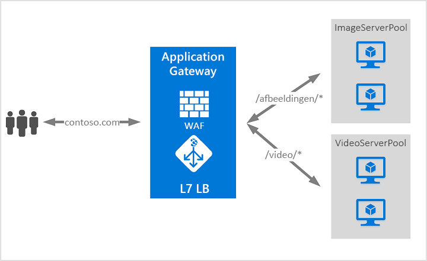

# Wat is Azure Application Gateway?

Azure Application Gateway is een load balancer voor webverkeer waarmee u het verkeer naar uw webapps kunt beheren. 

Traditionele load balancers werken op de transportlaag (OSI-laag 4 - TCP en UDP) en routeren verkeer op basis van IP-bronadres en een bronpoort naar een IP-doeladres en doelpoort. Maar met de Application Gateway kunt u nog specifieker zijn. U kunt bijvoorbeeld verkeer op basis van de binnenkomende URL routeren. Dus als `/images` de binnenkomende URL is, kunt u verkeer routeren naar een specifieke set servers (ook wel een pool genoemd) die is geconfigureerd voor installatiekopieën. Als `/video` zich in de URL bevindt, wordt dat verkeer gerouteerd naar een andere pool die geoptimaliseerd is voor video's.

Dit type routering staat bekend al taakverdeling op de toepassingslaag (OSI-laag 7). Azure Application Gateway kan URL-gebaseerde routering en meer uitvoeren. 

Azure Application Gateway bevat de volgende functies: 

## SSL-beëindiging (Secure Sockets Layer)

Application Gateway ondersteunt SSL-beëindiging op de gateway, waarna het verkeer normaal gesproken onversleuteld naar de back-endservers wordt doorgeleid. Met deze functie voorkomt u prijzige overhead voor het versleutelen en ontsleutelen voor uw webservers. Soms is onversleutelde communicatie met de server echter geen aanvaardbare optie. Dit kan komen door de beveiligings- of nalevingsvereisten, of misschien kan de toepassing alleen worden gebruikt via een beveiligde verbinding. Voor zulke toepassingen ondersteunt Application Gateway end-to-end SSL-versleuteling.

## Web Application Firewall

Web Application Firewall (WAF) is een functie van Application Gateway die gecentraliseerde beveiliging van uw webtoepassingen tegen algemene aanvallen en beveiligingsproblemen biedt. WAF is gebaseerd op regels uit de [Core Rule Set 3.0 of 2.2.9 van OWASP (Open Web Application Security Project)](https://www.owasp.org/index.php/Category:OWASP_ModSecurity_Core_Rule_Set_Project). 

Webtoepassingen zijn in toenemende mate het doel van aanvallen die gebruikmaken van veelvoorkomende bekende beveiligingsproblemen. Veelvoorkomende aanvallen zijn hierbij onder andere aanvallen met SQL-injecties en aanvallen via scripting op meerdere sites. Het kan een hele uitdaging zijn om dergelijke aanvallen in toepassingscode te voorkomen en dit kan tevens veel onderhoud, patching en controle vereisen op meerdere lagen van de toepassingstopologie. Een gecentraliseerde firewall voor webtoepassingen maakt het beveiligingsbeheer veel eenvoudiger en biedt toepassingsbeheerders meer veiligheid tegen bedreigingen of aanvallen. Een WAF-oplossing kan ook sneller reageren op een beveiligingsrisico door een patch voor een bekend beveiligingsprobleem toe te passen op een centrale locatie in plaats van elke afzonderlijke webtoepassing te beveiligen. Bestaande toepassingsgateways kunnen eenvoudig worden geconverteerd naar een toepassingsgateway met Web Application Firewall.

## URL-gebaseerde routering

Met op URL-pad gebaseerde routering kunt u verkeer routeren naar back-endserverpools die zijn gebaseerd op de URL-paden van de aanvraag. Een van de scenario's is het routeren van aanvragen voor verschillende inhoudstypen naar een andere pool.

Aanvragen voor `http://contoso.com/video/*` worden bijvoorbeeld doorgestuurd naar VideoServerPool en aanvragen voor `http://contoso.com/images/*` worden doorgestuurd naar ImageServerPool. Als geen van de padpatronen overeenkomen, wordt DefaultServerPool geselecteerd.

## Hosting van meerdere sites

Door meerdere sites te hosten, kunt u meer dan een website configureren op dezelfde instantie van de toepassingsgateway. Met deze functie kunt u een efficiëntere topologie voor uw implementaties configureren door maximaal 20 websites toe te voegen aan één toepassingsgateway. Elke website kan worden omgeleid naar een eigen pool. Application Gateway kan bijvoorbeeld verkeer regelen voor `contoso.com` en `fabrikam.com` vanaf twee servergroepen genaamd ContosoServerPool en FabrikamServerPool.

Aanvragen voor `http://contoso.com` worden gerouteerd naar ContoServerPool en aanvragen voor `http://fabrikam.com` worden gerouteerd naar FabrikamServerPool.

Op dezelfde manier kunnen twee subdomeinen van hetzelfde bovenliggende domein worden gehost op dezelfde implementatie van een toepassingsgateway. Voorbeelden van subdomeinen die worden gehost op één toepassingsgateway-implementatie, zijn `http://blog.contoso.com` en `http://app.contoso.com`.

## Omleiding

Een veelvoorkomend scenario voor veel webtoepassingen is de ondersteuning van automatische HTTP-naar-HTTPS-omleiding zodat alle communicatie tussen een toepassing en gebruikers plaatsvindt via een versleuteld pad. 

In het verleden hebt u mogelijk gebruikgemaakt van technieken zoals het maken van een specifieke pool met als enige doel het omleiden van aanvragen die worden ontvangen op een HTTP-naar-HTTPS. Application Gateway ondersteunt het omleiden van verkeer op de Application Gateway. Dit vereenvoudigt de configuratie van toepassingen, optimaliseert het resourcegebruik en biedt ondersteuning voor nieuwe omleidingsscenario's, waaronder de globale en op pad gebaseerde omleidingen. Ondersteuning voor Application Gateway-omleiding is niet beperkt tot uitsluitend HTTP-naar-HTTPS-omleiding. Dit is een algemeen omleidingsmechanisme, zodat u op basis van regels kunt omleiden van en naar elke poort die u gebruikt. Ook omleiding naar een externe site wordt ondersteund.

Ondersteuning voor Application Gateway-omleiding biedt de volgende mogelijkheden:

- Globale omleiding van de ene poort naar de andere poort op de Gateway. Hierdoor is HTTP-naar-HTTPS-omleiding op een site mogelijk.
- Padgebaseerde omleiding. Dit type omleiding maakt HTTP-naar-HTTPS-omleiding alleen mogelijk op een specifiek sitegebied, bijvoorbeeld een winkelwagengebied aangegeven door `/cart/*`.
- Omleiden naar een externe site.

## Sessieaffiniteit

De functie Sessieaffiniteit op basis van cookies is handig als u een gebruikerssessie op dezelfde server wilt behouden. Met behulp van de gatewaybeheerde cookies kan de Application Gateway het daarop volgende verkeer van een gebruikerssessie naar dezelfde server leiden voor verwerking. Dit is belangrijk wanneer de sessiestatus lokaal wordt opgeslagen op de server voor een gebruikerssessie.

## Websocket- en HTTP-/2-verkeer

Application Gateway biedt systeemeigen ondersteuning voor de WebSocket- en HTTP-/2-protocollen. Er is geen door de gebruiker configureerbare instelling om selectief WebSocket-ondersteuning in of uit te schakelen. HTTP-/2-ondersteuning kan worden ingeschakeld met Azure PowerShell.
 
De WebSocket- en HTTP-/2-protocollen maken full-duplex-communicatie tussen een server en een client mogelijk via een langdurige TCP-verbinding. Dit maakt een meer interactieve communicatie mogelijk tussen de webserver en de client, die bidirectioneel kan zijn zonder dat hiervoor polling nodig is, zoals vereist in implementaties op basis van HTTP. Deze protocollen hebben weinig overhead, in tegenstelling tot HTTP, en kunnen dezelfde TCP-verbinding gebruiken voor meerdere aanvragen/reacties. Dit resulteert in een efficiënter gebruik van resources. Deze protocollen zijn ontworpen om te werken via de traditionele HTTP-poorten: 80 en 443.

## Volgende stappen

Afhankelijk van uw vereisten en omgeving, kunt u een Application Gateway voor testdoeleinden maken met behulp van de Azure Portal, Azure PowerShell of Azur CLI:

- [Snelstart: Webverkeer omleiden met Azure Application Gateway - Azure Portal](quick-create-portal.md)
- [Snelstart: Webverkeer omleiden met Azure Application Gateway - Azure PowerShell](quick-create-powershell.md)
- [Snelstart: Webverkeer omleiden met Azure Application Gateway - Azure CLI](quick-create-cli.md)
