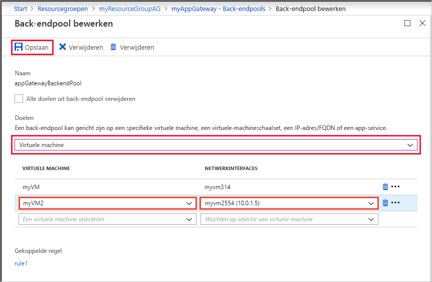
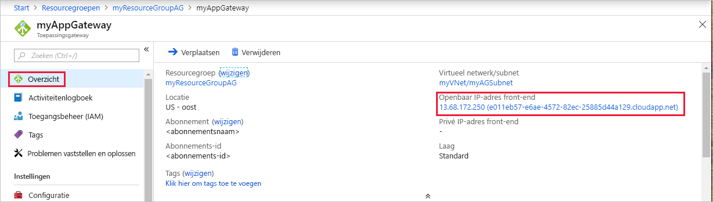

# <a name="quickstart-direct-web-traffic-with-azure-application-gateway---azure-portal"></a>Snelstart: Webverkeer omleiden met Azure Application Gateway - Azure Portal

Deze quickstart laat zien hoe u Azure portal gebruiken om een toepassingsgateway te maken.  Nadat de toepassingsgateway is gemaakt, testen u deze om te controleren of dat deze correct werkt. Met Azure Application Gateway, kunt u uw toepassing beveiligd webverkeer specifieke resources sturen door listeners toewijzen aan poorten, het maken van regels en resources toe te voegen aan een back-endpool. Om het eenvoudig, te worden in dit artikel wordt een eenvoudige configuratie met een openbaar front-end-IP-adres, een basislistener naar één site op deze application gateway-host, twee virtuele machines die worden gebruikt voor de back endpool en een regel voor het doorsturen van een algemene aanvraag.

Als u nog geen abonnement op Azure hebt, maak dan een [gratis account](https://azure.microsoft.com/free/?WT.mc_id=A261C142F) aan voordat u begint.


[!INCLUDE [updated-for-az](../../includes/updated-for-az.md)]

## <a name="sign-in-to-azure"></a>Aanmelden bij Azure

Meld u met uw Azure-account aan bij [Azure Portal](https://portal.azure.com).

## <a name="create-an-application-gateway"></a>Een toepassingsgateway maken

Er is een virtueel netwerk nodig voor communicatie tussen de resources die u maakt. U kunt een nieuw virtueel netwerk maken of gebruik een bestaande resourcegroep. In dit voorbeeld maken we een nieuw virtueel netwerk. U kunt een virtueel netwerk maken op hetzelfde moment dat u de toepassingsgateway maakt. Application Gateway-instanties worden gemaakt in afzonderlijke subnetten. In dit voorbeeld maakt u twee subnetten: één voor de toepassingsgateway en één voor de back-endservers.

1. Selecteer **Een resource maken** in het linkermenu van de Azure-portal. Het venster **Nieuw** wordt weergegeven.

2. Selecteer **Netwerken** en vervolgens **Application Gateway** in de lijst **Aanbevolen**.

### <a name="basics-page"></a>De pagina Basisinformatie

1. Op de pagina **Basisinformatie** voert u deze waarden in voor de volgende toepassingsgateway-instellingen:

   - **Naam**: Typ *myAppGateway* als naam voor de toepassingsgateway.
   - **Resourcegroep**: Selecteer **myResourceGroupAG** als de resourcegroep. Als deze nog niet bestaat, selecteert u **Nieuwe maken** om deze te maken.

     

2. Accepteer de standaardwaarden voor de overige instellingen en selecteer **OK**.

### <a name="settings-page"></a>De pagina Instellingen

1. Op de pagina **Instellingen**, onder **Subnetconfiguratie**, selecteert u **Een virtueel netwerk kiezen**. <br>

2. Op de pagina **Virtueel netwerk kiezen** selecteert u **Nieuwe maken** en voert u waarden in voor de volgende instellingen voor het virtuele netwerk:

   - **Naam**: Typ *myVnet* als naam voor het virtuele netwerk.

   - **Adresruimte**: Voer *10.0.0.0/16* in als de adresruimte van het virtuele netwerk.

   - **Subnetnaam**: Typ *myAGSubnet* als naam voor het subnet.<br>Het subnet van de toepassingsgateway kan alleen bestaan uit toepassingsgateways. Andere resources zijn niet toegestaan.

   - **Subnetadresbereik**: Voer *10.0.0.0/24* in als het adresbereik van het subnet.

     

3. Selecteer **OK** om terug te gaan naar de pagina **Instellingen**.

4. Kies de **Frontend-IP-configuratie**. Controleer onder **Frontend-IP-configuratie** of **Type IP-adres** is ingesteld op **Openbaar**. Controleer onder **Openbaar IP-adres** of **Nieuw** is geselecteerd. <br>U kunt configureren dat de Frontend-IP om openbare of particuliere aan de hand van uw situatie. In dit voorbeeld kiezen we een openbare front-end-IP-adres. 

5. Typ *myAGPublicIPAddress* als naam voor het openbare IP-adres. 

6. Accepteer de standaardwaarden voor de overige instellingen en selecteer **OK**.<br>We kiezen standaardwaarden in dit artikel voor het gemak, maar u kunt aangepaste waarden voor de overige instellingen configureren, afhankelijk van uw situatie 

### <a name="summary-page"></a>Overzichtspagina

Controleer de instellingen op de **overzichtspagina** en selecteer **OK** om het virtuele netwerk, het openbare IP-adres en de toepassingsgateway te maken. Het kan enkele minuten duren om de toepassingsgateway te maken in Azure. Wacht totdat de implementatie is voltooid voordat u doorgaat met de volgende sectie.

## <a name="add-backend-pool"></a>Een back-endpool toevoegen

De back-endpool wordt gebruikt voor het routeren van aanvragen naar de back-endservers die behoeve van de aanvraag. Back-endpools kunnen bestaan uit NIC's, virtuele-machineschaalsets, openbare IP-adressen, namen van interne IP-adressen, de volledig gekwalificeerde domeinnaam (FQDN) en multitenant back-ends, zoals Azure Appservice. U moet de doelen van uw back-end toevoegen aan een back-endpool.

In dit voorbeeld gebruiken we virtuele machines als de doel-back-end. We kunnen bestaande virtuele machines gebruiken of nieuwe labels maken. In dit voorbeeld maken we twee virtuele machines die Azure als back-endservers voor application gateway gebruikt. Wij zullen u doet dit door:

1. Maak een nieuw subnet *myBackendSubnet*, waarin de nieuwe virtuele machines wordt gemaakt. 
2. 2 nieuwe virtuele machines maken *myVM* en *myVM2*moet worden gebruikt als back-endservers.
3. IIS installeren op de virtuele machines om te controleren of de application gateway is gemaakt.
4. De back-endservers toevoegen aan de back-endpool.

### <a name="add-a-subnet"></a>Een subnet toevoegen

Voeg een subnet toe aan het virtuele netwerk dat u zojuist hebt gemaakt door de volgende stappen uit te voeren:

1. Selecteer **Alle resources** in het linkermenu van de Azure-portal, zoek *myVNet* in het zoekvak en selecteer vervolgens **myVNet** in de lijst met zoekresultaten.

2. Selecteer **Subnetten** in het linkermenu en selecteer **+ Subnet**. 

   

3. Typ op de pagina **Subnet toevoegen** *myBackendSubnet* in het vak **Naam** voor het subnet en selecteer **OK**.

### <a name="create-a-virtual-machine"></a>Een virtuele machine maken

1. Selecteer **Een resource maken** in de Azure-portal. Het venster **Nieuw** wordt weergegeven.
2. Selecteer **Compute** en selecteer vervolgens **Windows Server 2016 Datacenter** in de lijst **Aanbevolen**. De pagina **Een virtuele machine maken** wordt weergegeven.<br>Application Gateway het verkeer omleiden naar een virtuele machine die wordt gebruikt in de back-endpool. In dit voorbeeld gebruikt u een Windows Server 2016 Datacenter.
3. Voer deze waarden in op het tabblad **Basisinformatie** voor de volgende instellingen voor de virtuele machine:

    - **Resourcegroep**: Selecteer **myResourceGroupAG** als naam van de resourcegroep.
    - **Naam van virtuele machine**: Typ *myVM* als naam voor de virtuele machine.
    - **Gebruikersnaam**: Typ *azureuser* als gebruikersnaam van de beheerder.
    - **Wachtwoord**: Typ *Azure123456!* als beheerderswachtwoord.
4. Accepteer de overige standaardwaarden en klik op **Volgende: Schijven**.  
5. Accepteer de standaardwaarden op het tabblad **Schijven** en selecteer **Volgende: Netwerken**.
6. Zorg ervoor dat, op het tabblad **Netwerken**, **myVNet** is geselecteerd bij **Virtueel netwerk** en dat **Subnet** is ingesteld op **myBackendSubnet**. Accepteer de overige standaardwaarden en klik op **Volgende: Beheer**.<br>Application Gateway kan communiceren met exemplaren buiten het virtuele netwerk dat deel uitmaakt van, maar we wilt controleren of er een IP-verbinding is. 
7. Op het tabblad **Beheer** stelt u **Diagnostische gegevens over opstarten** in op **Uit**. Accepteer de overige standaardwaarden en selecteer **Beoordelen en maken**.
8. Controleer de instellingen op het tabblad **Beoordelen en maken**, corrigeer eventuele validatiefouten en selecteer vervolgens **Maken**.
9. Wacht tot de virtuele machine is gemaakt voordat u verder gaat.

### <a name="install-iis-for-testing"></a>IIS installeren voor het testen

In dit voorbeeld zijn we IIS installeren op de virtuele machines alleen voor het controleren van dat Azure application gateway is gemaakt. 

1. Open [Azure PowerShell](https://docs.microsoft.com/azure/cloud-shell/quickstart-powershell). Hiertoe selecteert u **Cloud Shell** in de bovenste navigatiebalk van de Azure-portal en vervolgens **PowerShell** in de vervolgkeuzelijst. 

    

2. Voer de volgende opdracht uit om IIS op de virtuele machine te installeren: 

    ```azurepowershell-interactive
    Set-AzVMExtension `
      -ResourceGroupName myResourceGroupAG `
      -ExtensionName IIS `
      -VMName myVM `
      -Publisher Microsoft.Compute `
      -ExtensionType CustomScriptExtension `
      -TypeHandlerVersion 1.4 `
      -SettingString '{"commandToExecute":"powershell Add-WindowsFeature Web-Server; powershell Add-Content -Path \"C:\\inetpub\\wwwroot\\Default.htm\" -Value $($env:computername)"}' `
      -Location EastUS
    ```

3. Maak een tweede virtuele machine en installeer IIS met behulp van de stappen die u zojuist hebt voltooid. Gebruik *myVM2* voor de naam van de virtuele machine en de **VMName** instellen van de **Set AzVMExtension** cmdlet.

### <a name="add-backend-servers-to-backend-pool"></a>Back-endservers aan back-endpool toevoegen

1. Selecteer **Alle resources** en vervolgens **myAppGateway**.

2. Selecteer **Back-endpools** in het linkermenu. Bij het maken van de toepassingsgateway wordt automatisch de standaardpool **appGatewayBackendPool** gemaakt. 

3. Selecteer **appGatewayBackendPool**.

4. Onder **Doelen** selecteert u **Virtuele machine** in de vervolgkeuzelijst.

5. Onder **VIRTUELE MACHINE** en **NETWERKINTERFACES** selecteert u de virtuele machines **myVM** en **myVM2** en de bijbehorende netwerkinterfaces in de vervolgkeuzelijsten.

    

6. Selecteer **Opslaan**.

## <a name="test-the-application-gateway"></a>De toepassingsgateway testen

Het is niet nodig IIS te installeren om de toepassingsgateway te maken, maar u hebt het in deze quickstart geïnstalleerd om te controleren of het maken van de toepassingsgateway in Azure is geslaagd. Gebruik IIS om de toepassingsgateway te testen:

1. Het openbare IP-adres vinden voor de toepassingsgateway op de **overzicht** pagina.u kunt ook selecteren **alle resources**, voer *myAGPublicIPAddress* in het zoekvak vak en selecteert u deze in de zoekopdracht resultaten. Het openbare IP-adres wordt weergegeven op de pagina **Overzicht**.
2. Kopieer het openbare IP-adres en plak het in de adresbalk van de browser.
3. Controleer het antwoord. Een geldige reactie wordt gecontroleerd of de application gateway is gemaakt en uitgevoerd wordt om verbinding te maken met de back-end.


## <a name="clean-up-resources"></a>Resources opschonen

Wanneer u de bij de toepassingsgateway gemaakte resources niet meer nodig hebt, verwijdert u de resourcegroep. Als u de resourcegroep verwijdert, worden ook de toepassingsgateway en alle gerelateerde resources verwijderd. 

Ga als volgt te werk om de resourcegroep te verwijderen:
1. Selecteer **Resourcegroepen** in het linkermenu van de Azure-portal.
2. Zoek en selecteer **myResourceGroupAG** in de lijst op de pagina **Resourcegroepen**.
3. Selecteer **Resourcegroep verwijderen** op de **pagina van de resourcegroep**.
4. Voer *myResourceGroupAG* in bij **TYP DE RESOURCEGROEPNAAM** en selecteer vervolgens **Verwijderen**

## <a name="next-steps"></a>Volgende stappen

> [!div class="nextstepaction"]
> [Webverkeer met een toepassingsgateway beheren met behulp van Azure CLI](./tutorial-manage-web-traffic-cli.md)
