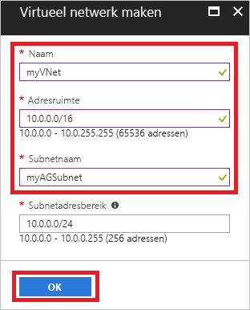
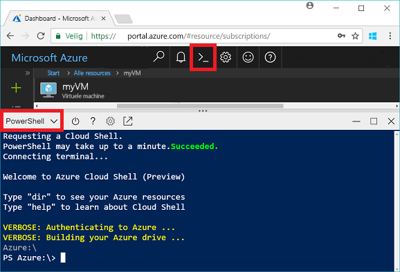
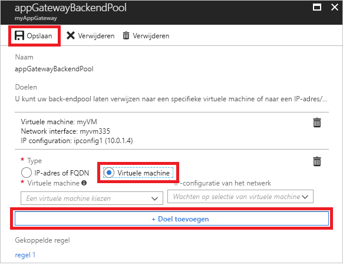
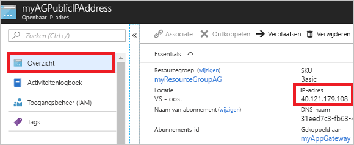

# <a name="quickstart-direct-web-traffic-with-azure-application-gateway---azure-portal"></a>Snelstart: Webverkeer omleiden met Azure Application Gateway - Azure Portal

Met Azure Application Gateway kunt u het webverkeer van uw toepassing omleiden naar specifieke resources door listeners toe te wijzen aan poorten, regels te maken en resources toe te voegen aan een back-endpool.

In deze snelstart wordt beschreven hoe u Azure Portal kunt gebruiken om snel de toepassingsgateway te maken met twee virtuele machines in zijn back-endpool. Vervolgens test u de gateway om er zeker van te zijn dat deze correct werkt.

Als u nog geen abonnement op Azure hebt, maak dan een [gratis account](https://azure.microsoft.com/free/?WT.mc_id=A261C142F) aan voordat u begint.

## <a name="log-in-to-azure"></a>Aanmelden bij Azure

Aanmelden bij Azure Portal op [http://portal.azure.com](http://portal.azure.com)

## <a name="create-an-application-gateway"></a>Een toepassingsgateway maken

U moet een virtueel netwerk maken om de toepassingsgateway in staat te stellen te communiceren met andere resources. U kunt een virtueel netwerk maken op hetzelfde moment dat u de toepassingsgateway maakt. In dit voorbeeld worden twee subnetten gemaakt: één voor de toepassingsgateway en het andere voor de virtuele machines. 

1. Klik in de linkerbovenhoek van Azure Portal op **Een resource maken**.
2. Selecteer **Netwerken** en vervolgens **Application Gateway** in de lijst Aanbevolen.
3. Voer deze waarden in voor de toepassingsgateway:

    - *myAppGateway* als de naam van de toepassingsgateway.
    - *myResourceGroupAG* als de nieuwe resourcegroep.

    

4. Accepteer de standaardwaarden voor de overige instellingen en klik op **OK**.
5. Klik op **Een virtueel netwerk kiezen** > **Nieuw maken**, en voer deze waarden in voor het virtuele netwerk:

    - *myVnet* als de naam van het virtuele netwerk.
    - *10.0.0.0/16* als de adresruimte van het virtuele netwerk.
    - *myAGSubnet* als de naam van het subnet.
    - *10.0.0.0/24* als de adresruimte van het subnet.

    

6. Klik op **OK** om het virtuele netwerk en subnet te maken.
6. Klik op **Openbaar IP-adres kiezen** > **Nieuw maken**, en voer vervolgens de naam van het openbare IP-adres in. In dit voorbeeld is de naam van het openbare IP-adres *myAGPublicIPAddress*. Accepteer de standaardwaarden voor de overige instellingen en klik op **OK**.
8. Accepteer de standaardwaarden voor de listener-configuratie, laat de firewall voor de webtoepassing uitgeschakeld en klik op **OK**.
9. Controleer de instellingen op de overzichtspagina en klik op **OK** om het virtuele netwerk, het openbare IP-adres en de toepassingsgateway te maken. Het kan tot 30 minuten duren voordat de toepassingsgateway is gemaakt. Wacht totdat de implementatie is voltooid voordat u doorgaat met de volgende sectie.

### <a name="add-a-subnet"></a>Een subnet toevoegen

1. Klik in het menu links op **Alle resources** en vervolgens in de lijst met resources op **myVNet**.
2. Klik op **Subnetten** > **Subnet**.

    

3. Voer *myBackendSubnet* in als naam van het subnet en klik op **OK**.

## <a name="create-backend-servers"></a>Back-endservers maken

In dit voorbeeld maakt u twee virtuele machines die worden gebruikt als back-endservers voor de toepassingsgateway. 

### <a name="create-a-virtual-machine"></a>Een virtuele machine maken

1. Klik op **Nieuw**.
2. Selecteer **Compute** en selecteer vervolgens **Windows Server 2016 Datacenter** in de lijst Aanbevolen.
3. Voer deze waarden in voor de virtuele machine:

    - *myVM* als naam van de virtuele machine.
    - *azureuser* als gebruikersnaam van de beheerder.
    - *Azure123456!* als het wachtwoord.
    - Selecteer **Bestaande gebruiken** en selecteer *myResourceGroupAG*.

4. Klik op **OK**.
5. Selecteer **DS1_V2** als grootte van de virtuele machine en klik op **Selecteren**.
6. Zorg ervoor dat **myVNet** is geselecteerd voor het virtuele netwerk en dat het subnet **myBackendSubnet** is. 
7. Klik op **Uitgeschakeld** om diagnostische gegevens over opstarten uit te schakelen.
8. Klik op **OK**, controleer de instellingen op de overzichtspagina en klik op **Maken**.

### <a name="install-iis"></a>IIS installeren

U installeert IIS op de virtuele machines om te controleren of de toepassingsgateway is gemaakt.

1. Open de interactieve shell en zorg ervoor dat deze is ingesteld op **PowerShell**.

    

2. Voer de volgende opdracht uit om IIS op de virtuele machine te installeren: 

    ```azurepowershell-interactive
    Set-AzureRmVMExtension `
      -ResourceGroupName myResourceGroupAG `
      -ExtensionName IIS `
      -VMName myVM `
      -Publisher Microsoft.Compute `
      -ExtensionType CustomScriptExtension `
      -TypeHandlerVersion 1.4 `
      -SettingString '{"commandToExecute":"powershell Add-WindowsFeature Web-Server; powershell Add-Content -Path \"C:\\inetpub\\wwwroot\\Default.htm\" -Value $($env:computername)"}' `
      -Location EastUS
    ```

3. Maak een tweede virtuele machine en installeer IIS met behulp van de stappen die u zojuist hebt voltooid. Voer *myVM2* in als de naam ervan en als VMName in Set-AzureRmVMExtension.

### <a name="add-backend-servers"></a>Back-endservers toevoegen

Nadat u de virtuele machines hebt gemaakt, moet u deze toevoegen aan de back-endpool in de toepassingsgateway.

1. Klik op **Alle resources** > **myAppGateway**.
2. Klik op **Back-endpools**. Er is automatisch een standaardpool gemaakt met de toepassingsgateway. Klik op **appGatewayBackendPool**.
3. Klik op **Doel toevoegen** > **Virtuele machine** en selecteer *myVM* . Selecteer **Doel toevoegen** > **Virtuele machine** en selecteer *myVM2*.

    

4. Klik op **Opslaan**.

## <a name="test-the-application-gateway"></a>De toepassingsgateway testen

Het is niet nodig IIS te installeren om de toepassingsgateway te maken, maar u hebt het in deze snelstart geïnstalleerd om te controleren of het maken van de toepassingsgateway is geslaagd.

1. Zoek op het scherm Overzicht het openbare IP-adres voor de toepassingsgateway. Klik op **Alle resources** > **myAGPublicIPAddress**.

    

2. Kopieer het openbare IP-adres en plak het in de adresbalk van de browser.

    

Als u de browser vernieuwt, ziet u de naam van de andere VM.

## <a name="clean-up-resources"></a>Resources opschonen

Bekijk eerst de resources die met de toepassingsgateway zijn gemaakt en wanneer u deze niet meer nodig hebt, kunt u de resourcegroep, de toepassingsgateway en alle gerelateerde resources verwijderen. Selecteer hiertoe de resourcegroep met de toepassingsgateway en klik op **Verwijderen**.

## <a name="next-steps"></a>Volgende stappen

> [!div class="nextstepaction"]
> [Webverkeer met een toepassingsgateway beheren met behulp van Azure CLI](./tutorial-manage-web-traffic-cli.md)
