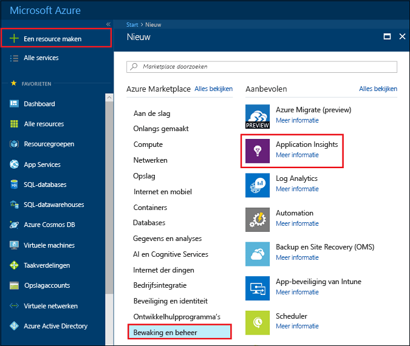
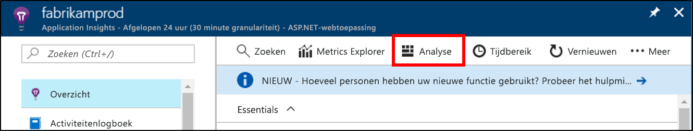
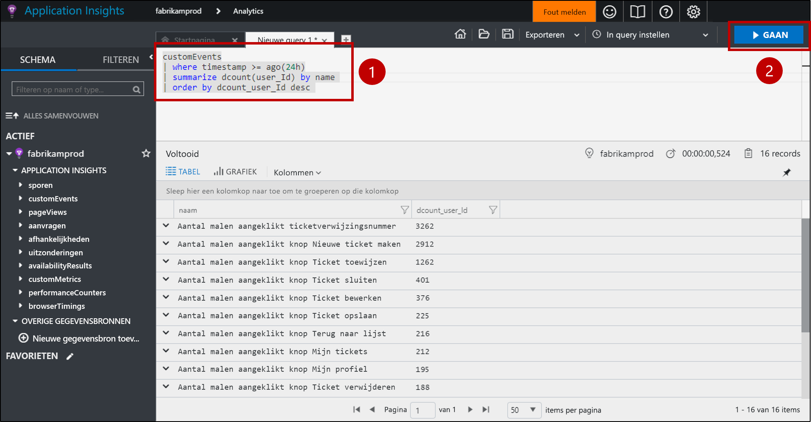
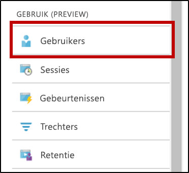
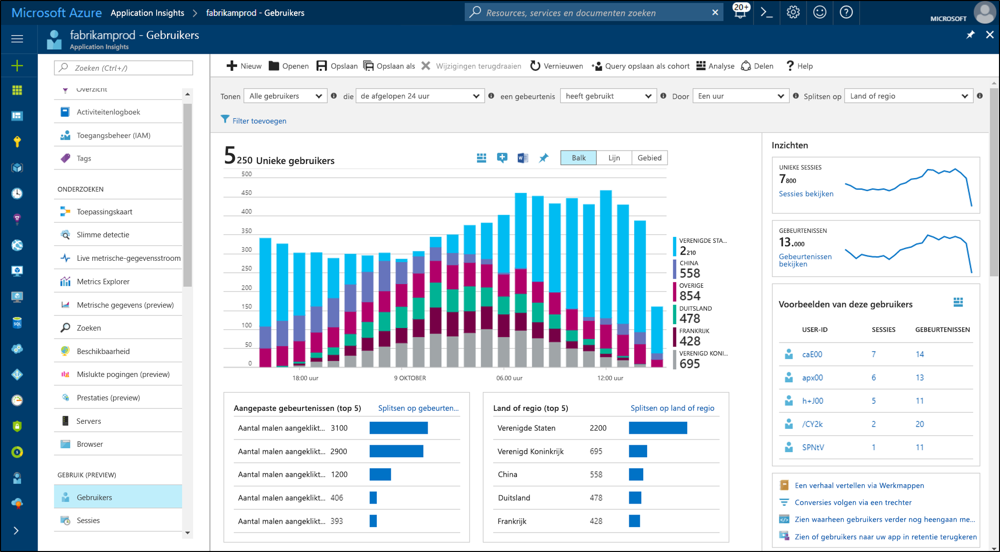
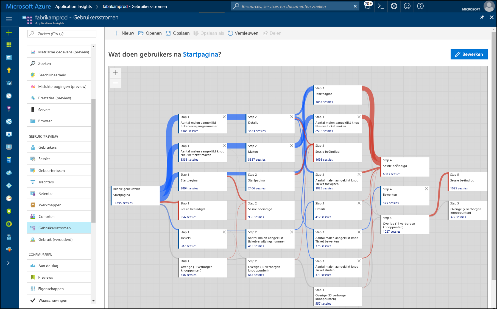

# <a name="start-analyzing-your-mobile-app-with-app-center-and-application-insights"></a>Mobiele app analyseren met App Center en Application Insights

In deze quickstart wordt stapsgewijs uitgelegd hoe u het App Center-App-exemplaar van uw app verbindt met Application Insights. Met Application Insights kunt u uw telemetriegegevens opvragen, segmenteren filteren en analyseren van met krachtigere tools dan die beschikbaar zijn via de service [Analyse](https://docs.microsoft.com/mobile-center/analytics/) van App Center.

## <a name="prerequisites"></a>Vereisten

U hebt het volgende nodig om deze quickstart te voltooien:

- Een Azure-abonnement.
- Een app voor iOS, Android, Xamarin, Universal Windows of React Native.
 
Als u nog geen Azure-abonnement hebt, maakt u een [gratis account](https://azure.microsoft.com/free/) voordat u begint.

## <a name="onboard-to-app-center"></a>Onboarden in App Center

Voordat u Application Insights kunt gebruiken met uw mobiele app, moet u de app onboarden in [App Center](https://docs.microsoft.com/mobile-center/). Application Insights kan namelijk niet rechtstreeks telemetriegegevens ontvangen van uw mobiele app. Uw app stuurt daarom telemetrie van aangepaste gebeurtenissen naar App Center. App Center exporteert deze aangepaste gebeurtenissen vervolgens direct naar Application Insights zodra ze worden ontvangen.

U kunt uw app onboarden door de quickstart voor App Center uit te voeren voor elk platform dat uw app ondersteunt. Maak afzonderlijke App Center-exemplaren voor elk platform:

* [iOS](https://docs.microsoft.com/mobile-center/sdk/getting-started/ios)
* [Android](https://docs.microsoft.com/mobile-center/sdk/getting-started/android)
* [Xamarin](https://docs.microsoft.com/mobile-center/sdk/getting-started/xamarin)
* [Universal Windows](https://docs.microsoft.com/mobile-center/sdk/getting-started/uwp)
* [React Native](https://docs.microsoft.com/mobile-center/sdk/getting-started/react-native)

## <a name="track-events-in-your-app"></a>Gebeurtenissen bijhouden in uw app

Nadat de onboarding van uw in App Center is voltooid, moet de appe worden aangepast voor om telemetrie van aangepaste gebeurtenissen te versturen met de SDK van App Center. Aangepaste gebeurtenissen zijn het enige type telemetrie van App Center dat wordt geëxporteerd naar Application Insights.

Als u aangepaste gebeurtenissen wilt versturen vanuit iOS-apps, gebruikt u de methode `trackEvent` of `trackEvent:withProperties` in de SDK van App Center. [Meer informatie over het bijhouden van gebeurtenissen van iOS-apps.](https://docs.microsoft.com/mobile-center/sdk/analytics/ios)

```Swift
MSAnalytics.trackEvent("Video clicked")
```

Als u aangepaste gebeurtenissen wilt versturen vanuit Android-apps, gebruikt u de methode `trackEvent` in de SDK van App Center. [Meer informatie over het bijhouden van gebeurtenissen van Android-apps.](https://docs.microsoft.com/mobile-center/sdk/analytics/android)

```Java
Analytics.trackEvent("Video clicked")
```

Als u aangepaste gebeurtenissen wilt versturen vanaf andere platforms, gebruikt u de methoden `trackEvent` in de App Center-SDK van het platform.

Om er zeker van te zijn dat uw aangepaste gebeurtenissen worden ontvangen, gaat u naar het tabblad **Gebeurtenissen** in de sectie **Analytics** van App Center. Het kan enkele minuten duren voordat gebeurtenissen worden weergegeven nadat deze zijn verzonden vanuit uw app.

## <a name="create-an-application-insights-resource"></a>Een Application Insights-resource maken

Wanneer uw app aangepaste gebeurtenissen verzendt en deze gebeurtenissen worden ontvangen door App Center, moet u in Azure Portal een Application Insights-resource van het type App Center maken:

1. Meld u aan bij [Azure Portal](https://portal.azure.com/).
2. Selecteer **Nieuw** > **Controle + Beheer** > **Application Insights**.

    

    Er verschijnt een configuratievenster. Gebruik de onderstaande tabel om de velden in te vullen.

    | Instellingen        |  Waarde           | Beschrijving  |
   | ------------- |:-------------|:-----|
   | **Naam**      | Een volledig unieke waarde, zoals 'mijnApp-iOS' | Naam die de app beschrijft die u wilt controleren |
   | **Toepassingstype** | App Center-toepassing | Type app dat u wilt controleren |
   | **Resourcegroep**     | Maak een nieuwe resourcegroep of selecteer een groep in het menu. | De resourcegroep waarin u de nieuwe Application Insights-resource wilt maken |
   | **Locatie** | Een locatie in het menu | Kies een locatie in uw buurt of in de buurt van waar de app wordt gehost |

3. Klik op **Create**.

Als uw app meerdere platforms ondersteunt (iOS, Android, enz.), is het raadzaam afzonderlijke Application Insights-resources te maken, één voor elk platform.

## <a name="export-to-application-insights"></a>Exporteren naar Application Insights

Ga in de nieuwe Application Insights-resource op de pagina **Overzicht** naar de sectie **Essentials** aan de bovenkant en kopieer de instrumentatiesleutel voor deze resource.

Ga als volgt te werk in het App Center-exemplaar voor uw app:

1. Klik op de pagina **Instellingen** op **Exporteren**.
2. Kies **Nieuwe export**, kies **Application Insights** en klik vervolgens op **Aanpassen**.
3. Plak de instrumentatiesleutel van Application Insights in het vak.
4. Geef toestemming voor toenemen van het gebruik van het Azure-abonnement met de Application Insights-resource. Elke resource van Application Insights is gratis voor de eerste 1 GB gegevens die per maand worden ontvangen. [Meer informatie over de prijzen van Application Insights.](https://azure.microsoft.com/pricing/details/application-insights/)

Vergeet niet om dit proces te herhalen voor elk platform dat uw app ondersteunt.

Als het [exporteren](https://docs.microsoft.com/mobile-center/analytics/export) is ingesteld, wordt elke aangepaste gebeurtenis die wordt ontvangen door App Center, naar Application Insights gekopieerd. Het kan een paar minuten duren voordat gebeurtenissen aankomen bij Application Insights, dus als ze niet direct worden weergegeven, is het beter om even te wachten voordat u een diagnose start.

Om u toegang te geven tot meer gegevens wanneer u voor het eerst verbinding maakt, worden de meest recente aangepaste gebeurtenissen voor de afgelopen 48 uur in App Center automatisch naar Application Insights geëxporteerd.

## <a name="start-monitoring-your-app"></a>Uw app gaan controleren

Met Application Insights kunt u de telemetriegegevens van aangepaste gebeurtenissen van uw apps opvragen, segmenteren, filteren en analyseren. Deze mogelijkheden zijn uitgebreider dan die de analysetools van App Center kunnen bieden.

1. **Vraag de telemetriegegevens van aangepaste gebeurtenissen op.** Kies op de pagina **Overzicht** van Application Insights de optie **Analyse**. 

   

   De analyseportal van Application Insights wordt geopend met gegevens die zijn gekoppeld aan uw Application Insights-resource. In de portal kunt u rechtstreeks query's uitvoeren op uw gegevens via de querytaal Log Analytics. Dit betekent dat u willekeurig complexe vragen over uw app en de gebruikers kunt stellen.
   
   Open een nieuw tabblad in de analyseportal en plak vervolgens de volgende query. De query retourneert een telling van het aantal unieke gebruikers die aangepaste gebeurtenissen hebben verzonden vanuit uw app in de afgelopen 24 uur, gesorteerd op deze unieke aantallen.

   ```AIQL
   customEvents
   | where timestamp >= ago(24h)
   | summarize dcount(user_Id) by name 
   | order by dcount_user_Id desc 
   ```

   

   1. Selecteer de query door ergens in de query in de teksteditor te klikken.
   2. Klik vervolgens op **Go** om de query uit te voeren. 

   Lees hier meer over [Application Insights Analytics](app-insights-analytics.md) en de [querytaal Log Analytics](https://docs.loganalytics.io/docs/Language-Reference).


2. **Segmenteer en filter de telemetrie van uw aangepaste gebeurtenissen.** Kies op de pagina **Overzicht** van Application Insights de optie **Gebruikers** in de inhoudsopgave.

   

   In het hulpprogramma Gebruikers ziet u hoeveel gebruikers van uw app op bepaalde knoppen hebben geklikt, bepaalde schermen hebben weergegeven of een andere actie hebben uitgevoerd die u als een gebeurtenis bijhoudt met de SDK van App Center. Als u op zoekt bent naar een manier om gebeurtenissen van App Center te segmenteren en te filteren, is het hulpprogramma Gebruikers een uitstekende keuze.

    

   Zo kunt u het gebruik bijvoorbeeld geografisch segmenteren door **Land of regio** te kiezen in de vervolgkeuzelijst **Splitsen op**.

3. **Analyseer conversie, retentie en navigatiepatronen in uw app.** Kies op de pagina **Overzicht** van Application Insights de optie **Gebruikersstromen** in de inhoudsopgave.

   

   Het hulpprogramma Gebruikersstromen laat zien welke gebeurtenissen gebruikers versturen na een bepaalde begingebeurtenis. Dit is handig om een algemeen beeld te krijgen van de manier waarop gebruikers door de app navigeren. U kunt zo ook de plekken zien waar het verloop van gebruikers groot is of waar steeds dezelfde acties worden herhaald.

   Naast het hulpprogramma Gebruikersstromen, beschikt u met Application Insights over verschillende andere tools voor gebruiksanalyse om specifieke vragen te beantwoorden:

   * **Trechters** voor het analyseren en controleren van conversies.
   * **Retentie** voor het analyseren van hoe goed een app gebruikers vasthoudt tijdens een bepaalde periode.
   * **Workbooks** voor het combineren van visualisaties en tekst in een deelbaar rapport.
   * **Cohorten** voor naamgeving en het opslaan van specifieke groepen gebruikers of gebeurtenissen, zodat er gemakkelijk naar deze entiteiten kan worden verwezen vanuit andere analysehulpmiddelen.

## <a name="clean-up-resources"></a>Resources opschonen

Als u Application Insights niet wilt blijven gebruiken met App Center, schakelt u de exportfunctie uit in App Center en verwijdert u de Application Insights-resource. Hiermee voorkomt u dat er verdere kosten voor Application Insights in rekening worden gebracht voor deze resource.

Exportfunctie uitschakelen in App Center:

1. Ga in App Center naar **Instellingen** en kies **Exporteren**.
2. Klik op de exportbewerking van Application Insights die u wilt verwijderen en klik vervolgens onderaan op **Export verwijderen** om dit te bevestigen.

De Application Insights-resource verwijderen:

1. Klik in het menu aan de linkerkant van Azure Portal op **Resourcegroepen** en kies de resourcegroep waarin uw Application Insights-resource is gemaakt.
2. Open de Application Insights-resource die u wilt verwijderen. Klik vervolgens in het bovenste menu van de resource op **Verwijderen** en bevestig dit. De kopie van de gegevens die is geëxporteerd naar Application Insights wordt hierdoor permanent verwijderd.

## <a name="next-steps"></a>Volgende stappen

> [!div class="nextstepaction"]
> [Inzicht krijgen in hoe klanten uw app gebruiken](app-insights-usage-overview.md)