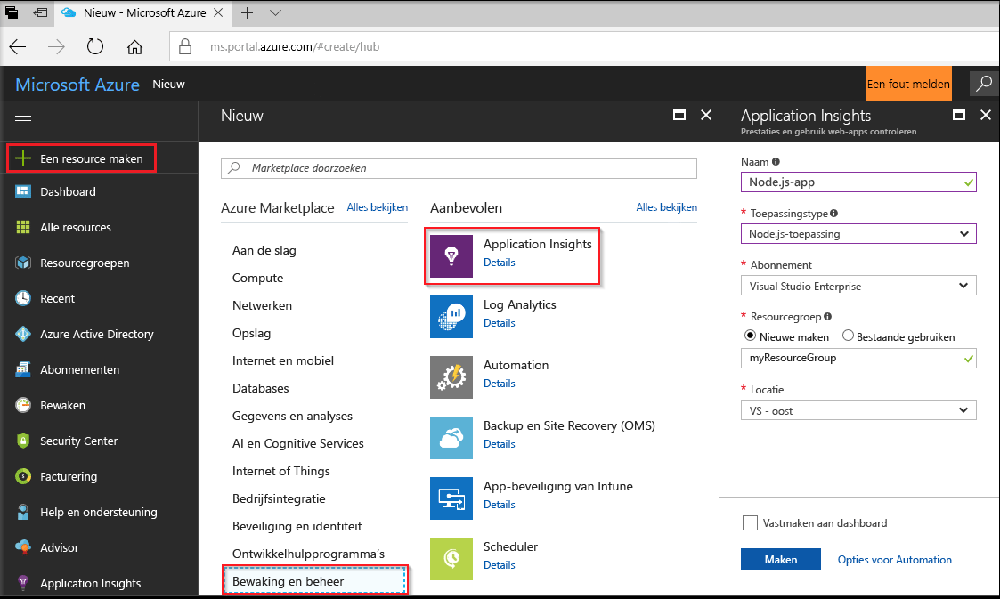
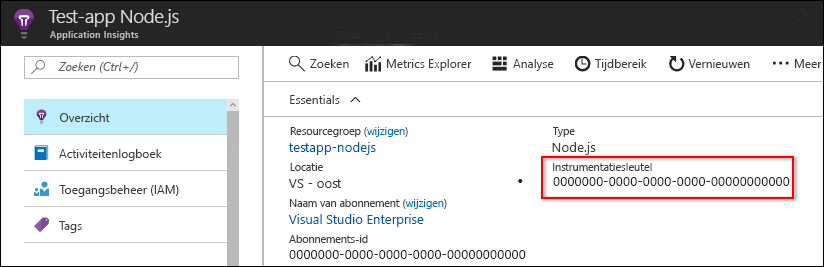
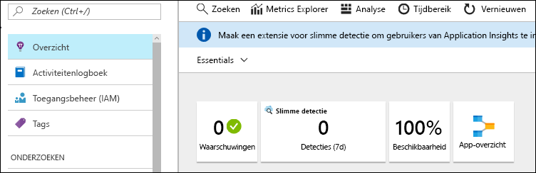
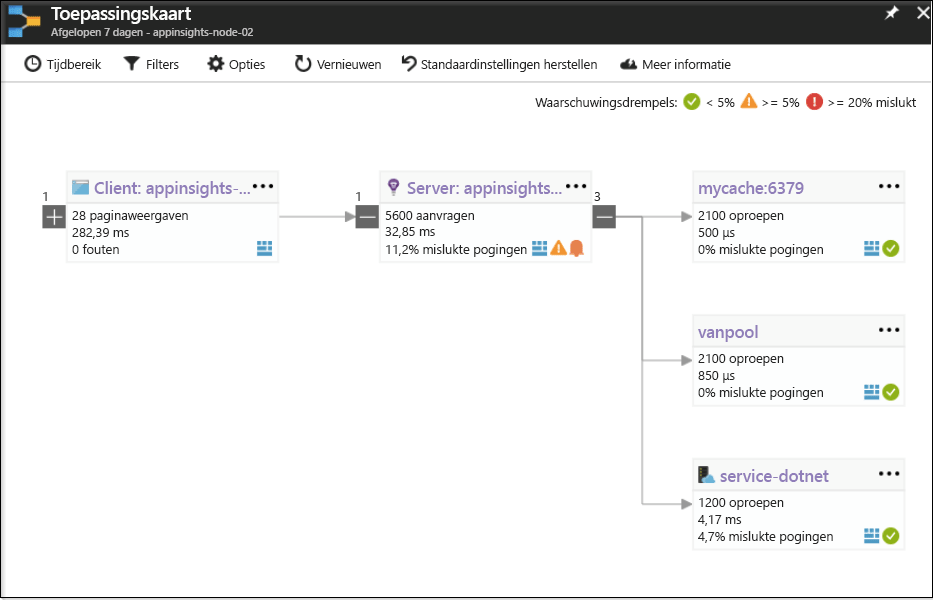
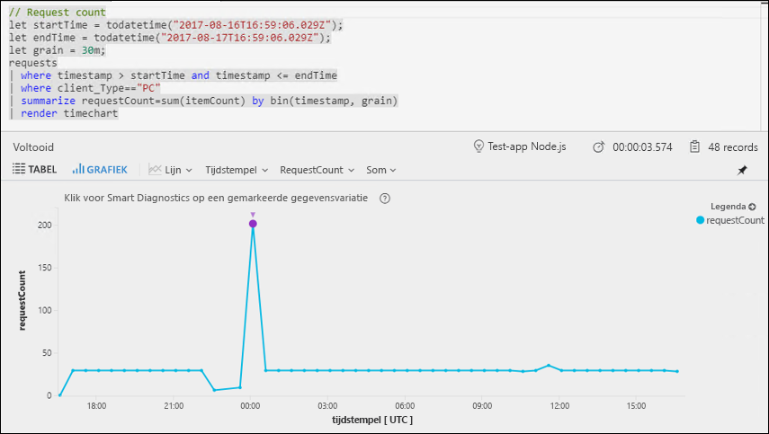
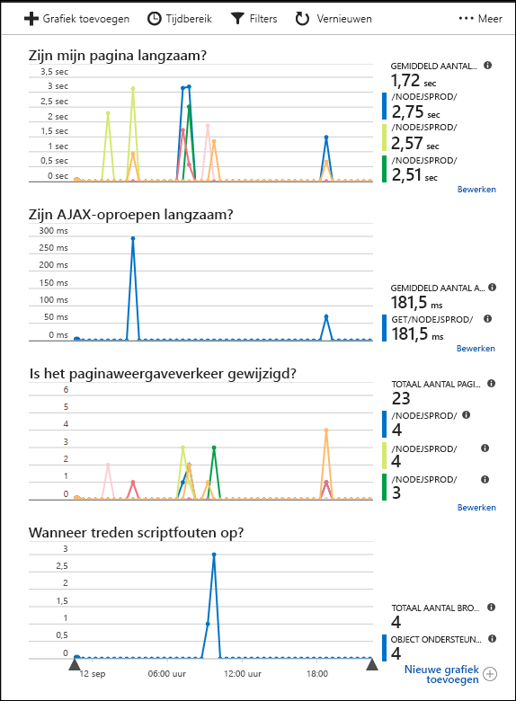

# <a name="start-monitoring-your-nodejs-web-application"></a>Beginnen met controleren van de Node.js-webtoepassing

Met Azure Application Insights kunt u eenvoudig de beschikbaarheid, de prestaties en het gebruik van een webtoepassing controleren. U kunt ook snel fouten in de toepassing identificeren en er een diagnose voor uitvoeren, zonder dat u hoeft te wachten totdat een gebruiker ze heeft gerapporteerd. Vanaf de release van versie 0.20 van de SDK kunt u veelgebruikte pakketten van derden controleren, inclusief MongoDB, MySQL en Redis.

Deze snelstartgids helpt u Application Insights SDK versie 0.22 voor Node.js toe te voegen aan een bestaande Node.js-webtoepassing.

## <a name="prerequisites"></a>Vereisten

Dit zijn de vereisten voor het voltooien van deze snelstartgids:

- U hebt een Azure-abonnement en een bestaande Node.js-webtoepassing nodig.

Als u geen Node.js-webtoepassing hebt, kunt u er een maken door de snelstartgids [Een Node.js-webapp maken](https://docs.microsoft.com/azure/app-service/app-service-web-get-started-nodejs) te volgen.
 
Als u nog geen Azure-abonnement hebt, maakt u een [gratis account](https://azure.microsoft.com/free/) voordat u begint.

## <a name="log-in-to-the-azure-portal"></a>Aanmelden bij Azure Portal

Meld u aan bij [Azure Portal](https://portal.azure.com/).

## <a name="enable-application-insights"></a>Application Insights inschakelen

Met Application Insights kunnen telemetriegegevens worden verzameld vanuit elke toepassing met een internetverbinding, ongeacht of deze on-premises wordt uitgevoerd of in de cloud. Gebruik de volgende stappen om deze gegevens te bekijken.

1. Selecteer **Nieuw** > **Controle + Beheer** > **Application Insights**.

   

   Er wordt een configuratiescherm weergegeven. Gebruik de onderstaande tabel om de invoervelden in te vullen.

    | Instellingen        | Waarde           | Beschrijving  |
   | ------------- |:-------------|:-----|
   | **Naam**      | Globaal unieke waarde | Naam die de app beschrijft die u wilt controleren |
   | **Toepassingstype** | Node.js-toepassing | Type app dat u wilt controleren |
   | **Resourcegroep**     | myResourceGroup      | Naam voor de nieuwe resourcegroep waarin App Insights-gegevens worden gehost |
   | **Locatie** | VS - oost | Kies een locatie in uw buurt of in de buurt van waar de app wordt gehost |

2. Klik op **Create**.

## <a name="configure-app-insights-sdk"></a>App Insights-SDK configureren

1. Selecteer **Overzicht** > **Essentials** > kopieer de **Instrumentatiesleutel** van uw toepassing.

   

2. Voeg de Application Insights-SDK voor Node.js toe aan uw toepassing. Voer deze opdracht uit vanuit de hoofdmap van uw app:

   ```bash
   npm install applicationinsights --save
   ```

3. Bewerk het eerste .js-bestand van uw app en voeg de twee onderstaande regels toe aan het bovenste deel van uw script. Als u de [Node.js Quick Start-app](https://docs.microsoft.com/azure/app-service/app-service-web-get-started-nodejs) gebruikt, wijzigt u het bestand index.js. Vervang &lt;instrumentation_key&gt; door de instrumentatiesleutel van de toepassing. 

   ```JavaScript
   const appInsights = require('applicationinsights');
   appInsights.setup('<instrumentation_key>').start();
   ```

4. Start de app opnieuw.

> [!NOTE]
> Het duurt 3-5 minuten voordat de gegevens worden weergegeven in de portal. Als deze app een test-app met weinig verkeer is, houd er dan rekening mee dat de meeste metrische gegevens alleen vastgelegd wanneer er actieve aanvragen en bewerkingen zijn.

## <a name="start-monitoring-in-the-azure-portal"></a>Beginnen met controleren in Azure Portal

1. U kunt de pagina **Overzicht** van Application Insights in Azure Portal, waar u de instrumentatiesleutel hebt opgehaald, nu opnieuw openen om de details te bekijken van de toepassing die momenteel wordt uitgevoerd.

   

2. Klik op **App-kaart** voor een visueel overzicht van de afhankelijkheidsrelaties tussen de onderdelen van de toepassing. Voor elk onderdeel worden KPI's weergegeven, zoals belasting, prestaties, fouten en waarschuwingen.

   

3. Klik op het **App Analytics**-pictogram .  Hierdoor wordt **Application Insights Analytics** geopend. Dit biedt een querytaal met opmaak voor het analyseren van alle gegevens die zijn verzameld met Application Insights. In dit geval wordt er een query gegenereerd waarmee het aantal aanvragen wordt weergegeven als een grafiek. U kunt uw eigen query's schrijven om andere gegevens te analyseren.

   

4. Ga terug naar de pagina **Overzicht** en bekijk de **tijdlijn voor het Statusoverzicht**.  Dit dashboard biedt statistische gegevens over de toepassingsstatus, waaronder het aantal inkomende aanvragen, de duur van deze aanvragen en eventuele fouten die optreden. 

   

   Als u de grafiek **Laadtijd voor paginaweergave** wilt vullen met **telemetriegegevens aan de clientzijde**, voegt u dit script toe aan elke pagina die u wilt bijhouden:

   ```HTML
   <!-- 
   To collect end-user usage analytics about your application, 
   insert the following script into each page you want to track.
   Place this code immediately before the closing </head> tag,
   and before any other scripts. Your first data will appear 
   automatically in just a few seconds.
   -->
   <script type="text/javascript">
     var appInsights=window.appInsights||function(config){
       function i(config){t[config]=function(){var i=arguments;t.queue.push(function(){t[config].apply(t,i)})}}var t={config:config},u=document,e=window,o="script",s="AuthenticatedUserContext",h="start",c="stop",l="Track",a=l+"Event",v=l+"Page",y=u.createElement(o),r,f;y.src=config.url||"https://az416426.vo.msecnd.net/scripts/a/ai.0.js";u.getElementsByTagName(o)[0].parentNode.appendChild(y);try{t.cookie=u.cookie}catch(p){}for(t.queue=[],t.version="1.0",r=["Event","Exception","Metric","PageView","Trace","Dependency"];r.length;)i("track"+r.pop());return i("set"+s),i("clear"+s),i(h+a),i(c+a),i(h+v),i(c+v),i("flush"),config.disableExceptionTracking||(r="onerror",i("_"+r),f=e[r],e[r]=function(config,i,u,e,o){var s=f&&f(config,i,u,e,o);return s!==!0&&t["_"+r](config,i,u,e,o),s}),t
       }({
           instrumentationKey:"<insert instrumentation key>"
       });
       
       window.appInsights=appInsights;
       appInsights.trackPageView();
   </script>
   ```

5. Klik onder de koptekst **Onderzoeken** op **Browser**. Hier vindt u metrische gegevens die betrekking hebben op de prestaties van de app-pagina's. U kunt op **Nieuwe grafiek toevoegen** klikken om aanvullende aangepaste weergaven te maken, of **Bewerken** selecteren om type, hoogte, kleurenpalet, groeperingen en metrische gegevens van bestaande grafieken te wijzigen.

   

Bekijk de [extra Node./js-documentatie voor App Insights](app-insights-nodejs.md) voor meer informatie over het controleren van Node.js.

## <a name="clean-up-resources"></a>Resources opschonen

Als u van plan bent om door te gaan met andere snelstartgidsen of met de zelfstudies, verwijdert u de resources die u in deze snelstartgids hebt gemaakt niet. Als u niet wilt doorgaan, gebruikt u de volgende stappen om alle resources te verwijderen die door deze Quick Start in Azure Portal zijn gemaakt.

1. Klik in het menu links in Azure Portal op **Resourcegroepen** en klik vervolgens op **myResourceGroup**.
2. Klik op de pagina van uw resourcegroep op **Verwijderen**, typ **myResourceGroup** in het tekstvak en klik vervolgens op **Verwijderen**.

## <a name="next-steps"></a>Volgende stappen

> [!div class="nextstepaction"]
> [Prestatieproblemen zoeken en diagnoses uitvoeren](https://docs.microsoft.com/azure/application-insights/app-insights-analytics)
