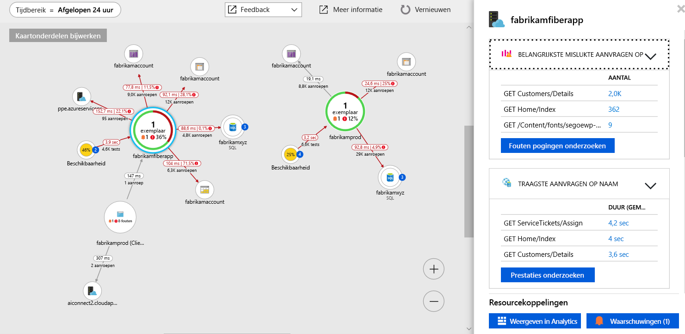

# <a name="collect-distributed-traces-from-python-preview"></a>Gedistribueerde traceringen verzamelen van Python (Preview)

Application Insights nu ondersteunt tracering van Python-toepassingen door de integratie met gedistribueerde [OpenCensus](https://opencensus.io) en onze nieuwe [lokale doorstuurserver](./opencensus-local-forwarder.md). In dit artikel begeleidt u stapsgewijs door het proces van het instellen van OpenCensus voor Python en het ophalen van uw traceringsgegevens naar Application Insights.

## <a name="prerequisites"></a>Vereisten

- U hebt een Azure-abonnement nodig.
- Python moet worden geïnstalleerd, in dit artikel wordt gebruikgemaakt van [Python 3.7.0](https://www.python.org/downloads/), hoewel eerdere versies waarschijnlijk met kleine aanpassing werkt.
- Volg de instructies voor het installeren van de [lokale doorstuurserver als een Windows-service](./opencensus-local-forwarder.md#windows-service)

Als u nog geen Azure-abonnement hebt, maakt u een [gratis account](https://azure.microsoft.com/free/) voordat u begint.

## <a name="sign-in-to-the-azure-portal"></a>Aanmelden bij Azure Portal

Meld u aan bij [Azure Portal](https://portal.azure.com/).

## <a name="create-application-insights-resource"></a>Application Insights-resource maken

U moet eerst maken van een Application Insights-resource die een key(ikey) instrumentatie wordt gegenereerd. De ikey wordt vervolgens gebruikt voor het configureren van de lokale doorstuurserver voor het verzenden van gedistribueerde traceringen van uw toepassing OpenCensus geïnstrumenteerd met Application Insights.   

1. Selecteer **een resource maken** > **hulpprogramma's voor ontwikkelaars** > **Application Insights**.

   

   Er wordt een configuratiescherm weergegeven. Gebruik de volgende tabel om de invoervelden in te vullen.

    | Instellingen        | Waarde           | Beschrijving  |
   | ------------- |:-------------|:-----|
   | **Naam**      | Globaal unieke waarde | Naam die de app beschrijft die u wilt controleren |
   | **Toepassingstype** | Algemeen | Type app dat u wilt controleren |
   | **Resourcegroep**     | myResourceGroup      | Naam voor de nieuwe resourcegroep waarin App Insights-gegevens worden gehost |
   | **Locatie** | US - oost | Kies een locatie in uw buurt of in de buurt van waar de app wordt gehost |

2. Klik op **Create**.

## <a name="configure-local-forwarder"></a>Lokale forwarder configureren

1. Selecteer **Overzicht** > **Essentials** > kopieer de **Instrumentatiesleutel** van uw toepassing.

   

2. Bewerk uw `LocalForwarder.config` bestand en voeg de instrumentatiesleutel toe. Als u de instructies in de gevolgd de [vereiste](./opencensus-local-forwarder.md#windows-service) het bestand bevindt zich in `C:\LF-WindowsServiceHost`

    ```xml
      <OpenCensusToApplicationInsights>
        <!--
          Instrumentation key to track telemetry to.
          -->
        <InstrumentationKey>{enter-instrumentation-key}</InstrumentationKey>
      </OpenCensusToApplicationInsights>
    
      <!-- Describes aspects of processing Application Insights telemetry-->
      <ApplicationInsights>
        <LiveMetricsStreamInstrumentationKey>{enter-instrumentation-key}</LiveMetricsStreamInstrumentationKey>
      </ApplicationInsights>
    </LocalForwarderConfiguration>
    ```

3. De toepassing opnieuw hebt gestart **lokale doorstuurserver** service.

## <a name="opencensus-python-package"></a>OpenCensus Python-pakket

1. Installeer het pakket Open telling voor Python met pip of pipenv vanaf de opdrachtregel:

    ```python
    python -m pip install opencensus
    # pip env install opencensus
    ```

    > [!NOTE]
    > `python -m pip install opencensus` wordt ervan uitgegaan dat u een omgevingsvariabele PATH is ingesteld voor uw Python-installatie hebt. Als u dit niet hebt geconfigureerd, moet u het volledige pad om aan te geven waar uw Python uitvoerbare bestand zich bevindt die resulteren in een opdracht wilt: `C:\Users\Administrator\AppData\Local\Programs\Python\Python37-32\python.exe -m pip install opencensus`.

2. Eerst gaan we enkele traceringsgegevens lokaal genereren. In Python niet actief of uw editor naar keuze, voer de volgende code:

    ```python
    from opencensus.trace.tracer import Tracer
    
    def main():
        while True:
            valuePrompt()
    
    def valuePrompt():
        tracer = Tracer()
        with tracer.span(name="test") as span:
            line = input("Enter a value: ")
            print(line)
    
    if __name__ == "__main__":
        main()
    
    ```

3. De code uitvoeren vraagt herhaaldelijk u een waarde in te voeren. De waarde waarbij elk item worden afgedrukt op de shell, en een bijbehorende stukje **SpanData** worden gegenereerd door de OpenCensus Python-Module. Het project OpenCensus definieert een [ _trace als een boomstructuur van reeksen_](https://opencensus.io/core-concepts/tracing/).
    
    ```python
    Enter a value: 4
    4
    [SpanData(name='test', context=SpanContext(trace_id=1f07f062ac394c50925f2ae61e635e14, span_id=None, trace_options=TraceOptions(enabled=True), tracestate=None), span_id='5c17a4ad6ba14299', parent_span_id=None, attributes={}, start_time='2018-09-15T20:42:15.847292Z', end_time='2018-09-15T20:42:17.615664Z', child_span_count=0, stack_trace=None, time_events=[], links=[], status=None, same_process_as_parent_span=None, span_kind=0)]
    Enter a value: 25
    25
    [SpanData(name='test', context=SpanContext(trace_id=c71b4e88a22a495da61df52ce3eee3e1, span_id=None, trace_options=TraceOptions(enabled=True), tracestate=None), span_id='51547c0af5f046eb', parent_span_id=None, attributes={}, start_time='2018-09-15T20:42:17.615664Z', end_time='2018-09-15T20:48:11.160314Z', child_span_count=0, stack_trace=None, time_events=[], links=[], status=None, same_process_as_parent_span=None, span_kind=0)]
    Enter a value: 100
    100
    [SpanData(name='test', context=SpanContext(trace_id=b4cdcc9e6df44a8fbb6e8ddeccc1351c, span_id=None, trace_options=TraceOptions(enabled=True), tracestate=None), span_id='f2caacf7892744d1', parent_span_id=None, attributes={}, start_time='2018-09-15T20:48:11.175931Z', end_time='2018-09-15T20:48:12.629178Z', child_span_count=0, stack_trace=None, time_events=[], links=[], status=None, same_process_as_parent_span=None, span_kind=0)]
    ```

4. Dit is handig voor demonstratiedoeleinden te gebruiken, uiteindelijk willen we introduceren het SpanData op een manier die deze kan worden opgehaald door onze **lokale doorstuurserver** en verzonden naar Application Insights. Wijzig de code uit de vorige stap op het volgende:

    ```python
    from opencensus.trace.tracer import Tracer
    from opencensus.trace import config_integration
    from opencensus.trace.exporters.ocagent import trace_exporter
    from opencensus.trace import tracer as tracer_module
    
    import os
    
    def main():        
        while True:
            valuePrompt()
    
    def valuePrompt():
        export_LocalForwarder = trace_exporter.TraceExporter(
        service_name=os.getenv('SERVICE_NAME', 'python-service'),
        endpoint=os.getenv('OCAGENT_TRACE_EXPORTER_ENDPOINT'))
        
        tracer = Tracer(exporter=export_LocalForwarder)
        with tracer.span(name="test") as span:
            line = input("Enter a value: ")
            print(line)
    
    if __name__ == "__main__":
        main()
    ```

5. Als u opslaan en probeer de bovenstaande module uitvoert, ontvangt u mogelijk een `ModuleNotFoundError` voor `grpc`. Als dit gebeurt, voert u het volgende voor het installeren van de [grpcio pakket](https://pypi.org/project/grpcio/) met:

    ```
    python -m pip install grpcio
    ```

6. Nu tijdens het uitvoeren van de Python-script van bovenstaande u moet nog steeds gevraagd waarden op te geven, maar nu alleen de waarde in de shell wordt afgedrukt.

7. Om te bevestigen dat de **lokale doorstuurserver** ophaalt van de controle traceringen het `LocalForwarder.config` bestand. Als u de stappen in de [vereiste](https://docs.microsoft.com/azure/application-insights/local-forwarder#windows-service), deze bevindt zich `C:\LF-WindowsServiceHost`.

    In onderstaande afbeelding van het logboekbestand, kunt u zien dat vóór het uitvoeren van het tweede script waar we een uitvoerder toegevoegd `OpenCensus input BatchesReceived` is 0. Zodra we begonnen met het bijgewerkte script is uitgevoerd `BatchesReceived` verhoogd gelijk is aan het aantal waarden dat we ingevoerd:
    
    

## <a name="start-monitoring-in-the-azure-portal"></a>Beginnen met controleren in Azure Portal

1. U kunt nu opnieuw openen met de Application Insights **overzicht** pagina in de Azure-portal om weer te geven details over de toepassing die momenteel wordt uitgevoerd. Selecteer **metrische Stream Live**.

   

2. Als u de tweede Python-script opnieuw uit en start u waarden invoert uitvoert, ziet u live traceringsgegevens wanneer ze in Application Insights worden ontvangen van de lokale-doorstuurserver.

   

3. Ga terug naar de **overzicht** pagina en selecteer **Toepassingsoverzicht** voor een visueel overzicht van de afhankelijkheidsrelaties tussen en de timing van de oproep tussen onderdelen van uw toepassing.

    

    Omdat we alleen een methodeaanroep traceren zijn, is onze overzicht van de toepassing niet zo interessant. Maar overzicht van de toepassing kunt schalen om te visualiseren veel gedistribueerde toepassingen:

   

4. Selecteer **prestaties onderzoeken** gedetailleerde prestatieanalyse uitvoeren en de hoofdoorzaak van trage prestaties vast.

    

5. Selecteren **voorbeelden** en vervolgens te klikken op een van de voorbeelden die worden weergegeven in het rechter deelvenster op de ervaring van de details van end-to-end-transactie wordt gestart. Hoewel onze voorbeeld-app ons slechts één gebeurtenis leert, zou een complexere toepassing kunt u de end-to-end-transactie op niveau van een afzonderlijke gebeurtenis aanroepstack verkennen.

     

## <a name="opencensus-trace-for-python"></a>OpenCensus tracering voor Python

We alleen behandeld de basisprincipes van bedrading van OpenCensus voor Python met de lokale doorstuurserver en Application Insights. De officiële gebruiksrichtlijnen bevat informatie over meer geavanceerde onderwerpen, zoals:

* [Karakteriseren](https://opencensus.io/api/python/trace/usage.html#samplers)
* [Flask-integratie](https://opencensus.io/api/python/trace/usage.html#flask)
* [Django-integratie](https://opencensus.io/api/python/trace/usage.html#django)
* [MySQL-integratie](https://opencensus.io/api/python/trace/usage.html#service-integration)
* [PostgreSQL](https://opencensus.io/api/python/trace/usage.html#postgresql)
  
## <a name="next-steps"></a>Volgende stappen

* [OpenCensus Python (Engelstalig)](https://opencensus.io/api/python/trace/usage.html)
* [Overzicht van de toepassing](./app-insights-app-map.md)
* [End-to-end-prestaties controleren](./app-insights-tutorial-performance.md)