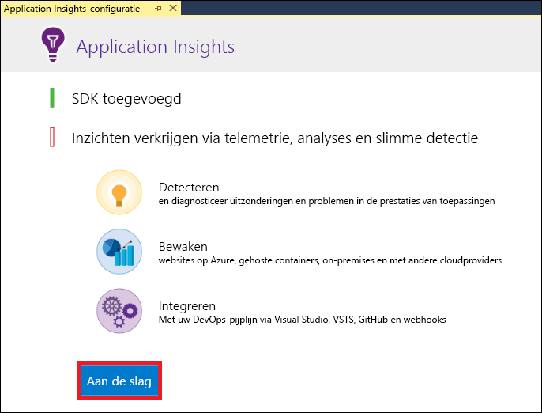
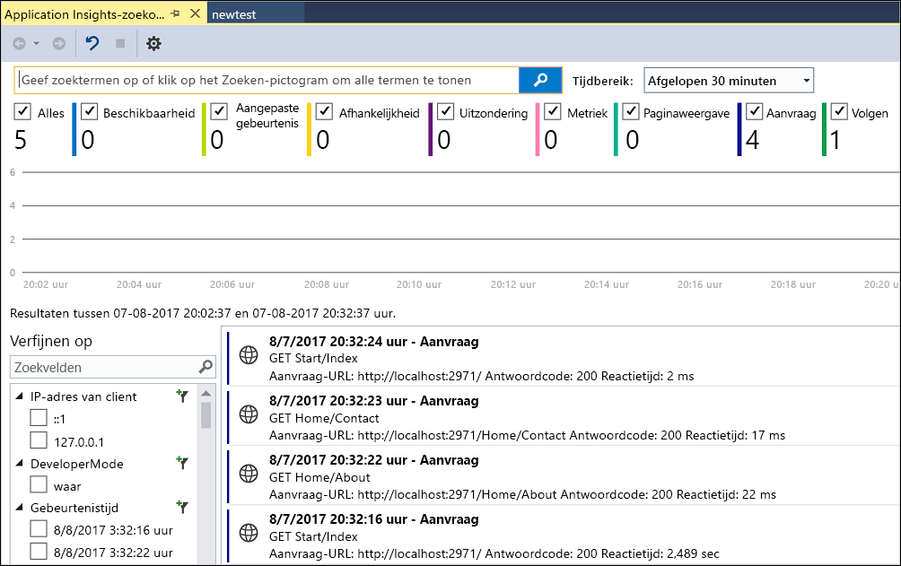
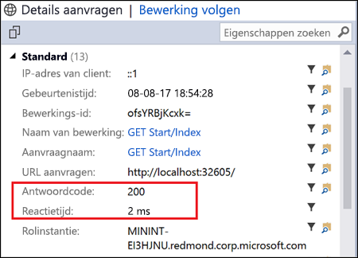
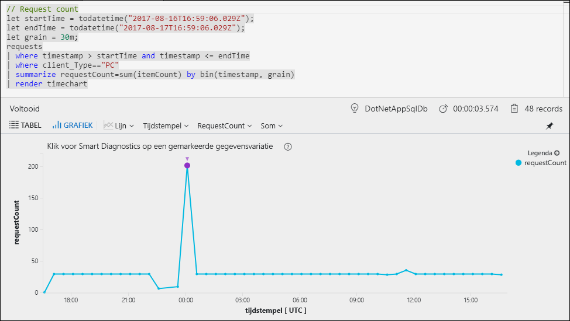
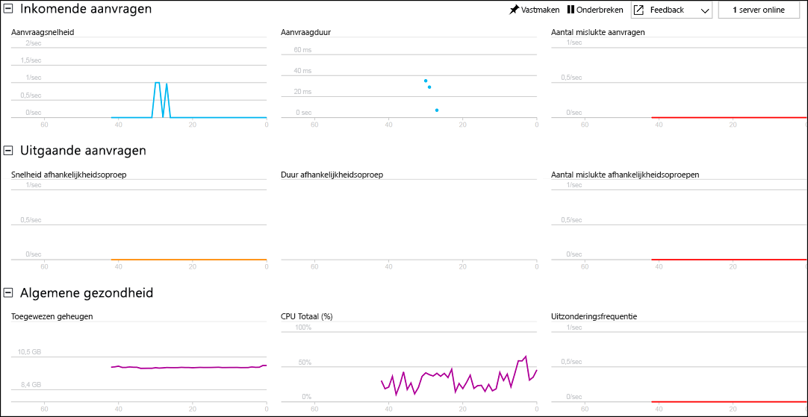

# Begin uw ASP.NET-webtoepassing te controleren

Met Azure Application Insights kunt u eenvoudig de beschikbaarheid, de prestaties en het gebruik van een webtoepassing controleren.  U kunt ook snel fouten in de toepassing identificeren en er een diagnose voor uitvoeren, zonder dat u hoeft te wachten totdat een gebruiker ze heeft gerapporteerd.  Met de informatie die u met Application Insights verzamelt over de prestaties en de effectiviteit van uw app, kunt u weloverwogen keuzes maken bij het onderhouden en verbeteren van uw toepassing.

Deze snelstartgids laat zien hoe u Application Insights kunt toevoegen aan een bestaande ASP.NET-webtoepassing en live statistieken kunt analyseren, wat slechts een van de diverse methoden is die u kunt gebruiken om uw toepassing te analyseren. Als u geen ASP.NET-webtoepassing hebt, kunt u er een maken door de [Create a ASP.NET Web App quickstart](../app-service/app-service-web-get-started-dotnet-framework.md) (Snelstartgids voor het maken van een ASP.NET-webapp) te volgen.

## Vereisten
Dit zijn de vereisten voor het voltooien van deze snelstart:

- Installeer [Visual Studio 2017](https://www.visualstudio.com/downloads/) met de volgende workloads:
    - ASP.NET-ontwikkeling en webontwikkeling
    - Azure-ontwikkeling

Als u nog geen Azure-abonnement hebt, maakt u een [gratis account](https://azure.microsoft.com/free/) voordat u begint.

## Application Insights inschakelen

1. Open uw project in Visual Studio 2017.
2. Selecteer **Configure Application Insights** in het menu Project. De Application Insights-SDK wordt toegevoegd aan uw toepassing.

    > [!IMPORTANT]
    > Het proces voor het toevoegen van Application Insights hangt af van het type ASP.NET-sjabloon. Als u de sjabloon **Leeg** of **Azure mobile app** gebruikt, selecteer dan **Project** > **Application Insights Telemetry toevoegen**. Raadpleeg voor alle andere ASP.NET-sjablonen de instructies in de stap hierboven. 

3. Klik op **Aan de slag** (eerdere versies van Visual Studio hebben in plaats daarvan de knop **Gratis beginnen**).

    

4. Selecteer uw abonnement en klik op **Registreren**.

5. Voer uw toepassing uit door **Start Debugging** (Foutopsporing starten) te selecteren in het menu **Debug** (Foutopsporing) of door op de F5-toets te drukken.

## App-configuratie bevestigen

Application Insights verzamelt telemetriegegevens voor uw toepassing, ongeacht waar deze wordt uitgevoerd. Gebruik de volgende stappen om deze gegevens te bekijken.

1. Open Application Insights door op **Beeld** -> **Andere vensters** -> **Application Insights-zoekopdracht** te klikken.  U ziet de telemetrie van uw huidige sessie.  

2. Klik op de eerste aanvraag in de lijst (in dit voorbeeld GET Home/Index) om de aanvraagdetails te bekijken. U ziet dat de statuscode en de reactietijd beide worden opgenomen, samen met andere waardevolle informatie over de aanvraag.  

## Beginnen met controleren in Azure Portal

U kunt nu Application Insights openen in Azure Portal om allerlei gegevens over uw actieve toepassing weer te geven.

1. Klik met de rechtermuisknop op de map **Connected Services Application Insights** in Solution Explorer en klik op **Open Application Insights Portal**.  U ziet een aantal gegevens over uw toepassing en allerlei opties.

    

2. Klik op **Toepassingsoverzicht** voor een visueel overzicht van de afhankelijkheidsrelaties tussen de onderdelen van de toepassing.  Voor elk onderdeel worden KPI's weergegeven, zoals belasting, prestaties, fouten en waarschuwingen.

    

3. Klik op het pictogram  van **App-analyse** bij een van de toepassingsonderdelen.  Hierdoor wordt **Application Insights Analytics** geopend. Dit biedt een querytaal met opmaak voor het analyseren van alle gegevens die zijn verzameld met Application Insights.  In dit geval wordt er een query gegenereerd waarmee het aantal aanvragen wordt weergegeven als een grafiek.  U kunt uw eigen query's schrijven om andere gegevens te analyseren.

    

4. Ga terug naar de pagina **Overzicht** en klik op **Live Stream**.  Hier worden live statistieken weergegeven over uw toepassing terwijl deze wordt uitgevoerd.  Dit zijn onder andere gegevens over het aantal inkomende aanvragen, de duur van deze aanvragen en eventuele fouten die optreden.  U kunt ook kritieke prestatiegegevens inspecteren, zoals de processor en het geheugen.

    

Als u klaar bent om uw toepassing in Azure te hosten, kunt u deze nu publiceren. Volg de stappen [Create an ASP.NET Web App Quickstart](../app-service/app-service-web-get-started-dotnet.md#update-the-app-and-redeploy) (Snelstartgids voor het maken van een ASP.NET-webapp).

## Volgende stappen
Aan de hand van deze snelstartgids hebt u uw toepassing ingesteld voor bewaking met Azure Application Insights.  Ga verder met de zelfstudies om te leren hoe u dit kunt gebruiken om statistieken bij te houden en problemen in uw toepassing te detecteren.

> [!div class="nextstepaction"]
> [Zelfstudies voor Azure Application Insights](app-insights-tutorial-runtime-exceptions.md)
