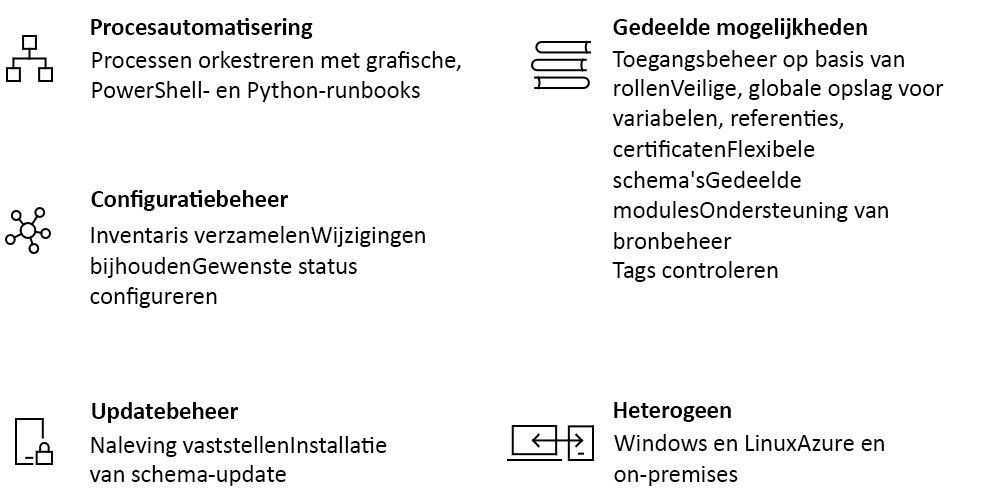

# Een inleiding tot Azure Automation

Azure Automation biedt een cloud-gebaseerde automatiserings- en configuratieservice die voor consistent beheer in uw Azure- en niet-Azure-omgevingen zorgt. De service omvat procesautomatisering, updatebeheer en configuratie van onderdelen. Azure Automation biedt volledige controle tijdens de implementatie, bewerkingen en het buiten gebruik stellen van werkbelastingen en bronnen.
In dit artikel wordt een kort overzicht gegeven van Azure Automation en worden enkele veelgestelde vragen beantwoord. Gebruik de koppelingen in dit overzicht voor meer informatie over de verschillende mogelijkheden.

## Mogelijkheden van Azure Automation

### Procesautomatisering

Azure Automation biedt u de mogelijkheid om regelmatig terugkerende, tijdrovende en foutgevoelige taken voor cloudbeheer te automatiseren. Met Azure Automation kunt u zich concentreren op werk dat bedrijfswaarde toevoegt. Door het aantal fouten te reduceren en de efficiëntie te verbeteren, kunt u uw operationele kosten drukken. U kunt Azure-services en andere openbare systemen integreren die vereist zijn voor het implementeren, configureren en beheren van uw end-to-end-processen. Met de service kunt u [runbooks in grafische vorm ontwerpen](automation-runbook-types.md) in PowerShell of Python. Met behulp van een hybride Runbook-worker kunt u het beheer combineren door on-premises omgevingen te organiseren. [Webhooks](automation-webhooks.md) bieden een manier om te voldoen aan aanvragen en zorgen voor doorlopende levering en bewerkingen door automatisering vanuit ITSM, DevOps en controlesystemen te activeren.

### Configuratiebeheer

[Configuratie van gewenste status](automation-dsc-overview.md) van Azure Automation is een cloudoplossing voor PowerShell DSC waarmee services worden geboden die zijn vereist voor bedrijfsomgevingen. Beheer uw DSC-resources in Azure Automation en pas configuraties toe op virtuele of fysieke machines vanaf een DSC-pull-server in de Azure-cloud. Dit biedt uitgebreide rapporten waarmee u wordt geïnformeerd over belangrijke gebeurtenissen zoals wanneer knooppunten zijn afgeweken van de toegewezen configuratie. U kunt machineconfiguraties controleren en automatisch bijwerken voor fysieke en virtuele machines, Windows of Linux, in de cloud of on-premises.

U kunt de inventarisatie opvragen van in-guest resources voor zichtbaarheid van de geïnstalleerde toepassingen en andere configuratie-items. Er zijn uitgebreide rapportage- en zoekmogelijkheden beschikbaar om snel gedetailleerde informatie te vinden voor informatie over wat er binnen het besturingssysteem is geconfigureerd. U kunt wijzigingen bijhouden voor services, daemons, software, register en bestanden om snel te oorzaak van de problemen vast te stellen. Bovendien kunt u met DSC nader onderzoek doen en waarschuwingen geven wanneer er ongewenste wijzigingen in uw omgeving plaatsvinden.

### Updatebeheer

Windows-en Linux bijwerken in hybride omgevingen met Azure Automation. U krijgt een beeld van de updatevereisten in Azure, on-premises en andere clouds. U kunt planningsimplementaties maken voor het organiseren van de installatie van updates binnen een gedefinieerd onderhoudsvenster. Als een update niet op een computer moet worden geïnstalleerd, kunt u die updates uitsluiten van een implementatie.

### Gedeelde functionaliteit

Azure Automation bestaat uit een set gedeelde bronnen waarmee u uw omgevingen eenvoudiger op schaal kunt automatiseren en configureren.

* **[Toegangsbeheer op basis van rollen](automation-role-based-access-control.md)** : beheer toegang tot het account met de rol van Automation-operator waarmee taken kunnen worden uitgevoerd zonder ontwerpmogelijkheden te verschaffen.
* **[Variabelen](automation-variables.md)** : deze bieden een manier om inhoud te gebruiken die kan worden gebruikt in runbooks en configuraties. U kunt waarden wijzigen zonder een van de runbooks en configuraties die ernaar verwijzen te moeten veranderen.
* **[Referenties](automation-credentials.md)** : hiermee kunt u vertrouwelijke informatie veilig opslaan die vervolgens kan worden gebruikt door runbooks en configuraties tijdens runtime.
* **[Certificaten](automation-certificates.md)** : deze kunt u opslaan en beschikbaar stellen tijdens runtime, zodat ze kunnen worden gebruikt voor verificatie en beveiliging van geïmplementeerde resources.
* **[Verbindingen](automation-connections.md)** : sla een naam of waardepaar met informatie op waarin algemene informatie is opgenomen wanneer u verbinding maakt met systemen in verbindingsresources. Verbindingen worden gedefinieerd door de module-auteur voor gebruik tijdens runtime in runbooks en configuraties.
* **[Schema's](automation-schedules.md)** : worden gebruikt in de service om automatisering op vooraf gedefinieerde tijden te activeren.
* **[Integratie met broncodebeheer](automation-source-control-integration.md)** : gebruikt configuratie als code waar runbooks of configuraties in een bronbeheersysteem kunnen worden ingecheckt.
* **[PowerShell-modules](automation-integration-modules.md)** : modules worden gebruikt voor het beheren van Azure en andere systemen. Importeer gegevens in het Automation-account voor cmdlets en DSC-resources van Microsoft, van derden of uit de community, of voor aangepaste gedefinieerde cmdlets en DSC-resources.

### Windows en Linux

Azure Automation is ontworpen voor gebruik in uw hybride cloudomgeving, maar ook voor Windows en Linux. Het systeem biedt een consistente manier voor het automatiseren en configureren van geïmplementeerde werkbelastingen en van het besturingssysteem waarop ze worden uitgevoerd.

### Community-galerie

Doorzoek de [Automation-galerie](automation-runbook-gallery.md) op runbooks en modules om snel aan de slag te gaan met het integreren en ontwerpen van uw processen vanuit de PowerShell-galerie en Microsoft Script Center.

## Algemene scenario's voor Automation

Azure Automation beheert de gehele levenscyclus van uw infrastructuur en toepassingen. Voorzie het systeem van informatie over de manier waarop de organisatie werkbelastingen levert en onderhoudt. Ontwerp in algemene talen zoals PowerShell, de configuratie van de gewenste status, Python en grafische runbooks. Genereer een volledige inventarisatie van geïmplementeerde resources voor doelitems, rapportage en naleving. Stel de wijzigingen vast die kunnen leiden tot een onjuiste configuratie en die kunnen zorgen voor een betere operationele naleving.

* **Resources bouwen/implementeren**: implementeer virtuele machines in een hybride omgeving met behulp van Runbooks en Azure Resource Manager-sjablonen. Integreer met ontwikkelingsprogramma's zoals Jenkins en Visual Studio Team-services.
* **VM's configureren**: evalueer en configureer Windows- en Linux-machines met de gewenste configuratie voor infrastructuur en toepassing.
* **Controle**: stel wijzigingen op machines vast die problemen veroorzaken en die oplossingen bieden voor of escaleren met beheersystemen.
* **Beveiliging**: plaats virtuele machines in quarantaine als er een beveiligingswaarschuwing wordt gegeven. Stel in-guest vereisten in.
* **Reguleren**: stel toegangsbeheer op basis van rollen in voor klanten. Herstel niet-gebruikte resources.

## Prijzen voor Automation

U kunt de prijs voor Azure Automation bekijken op de pagina [Prijzen](https://azure.microsoft.com/pricing/details/automation/).

## Volgende stappen

> [!div class="nextstepaction"]
> [Een Automation-account maken](automation-quickstart-create-account.md)
