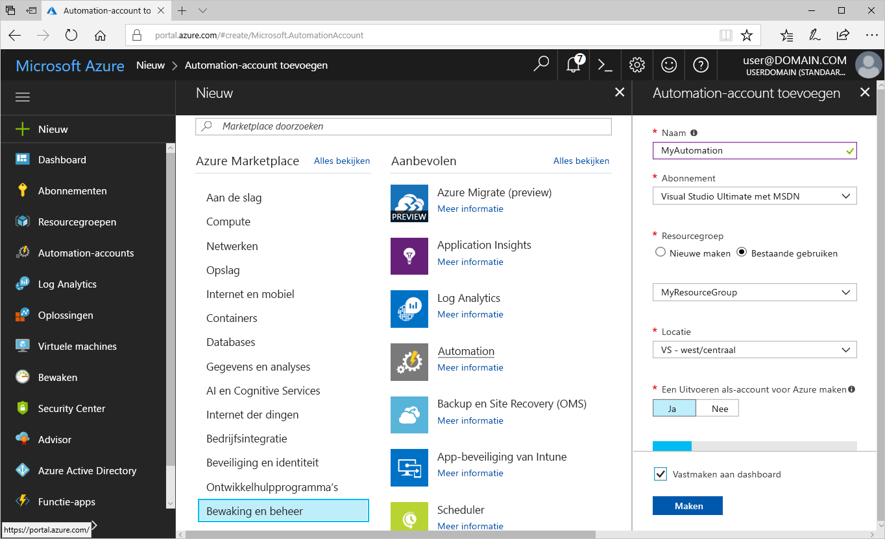
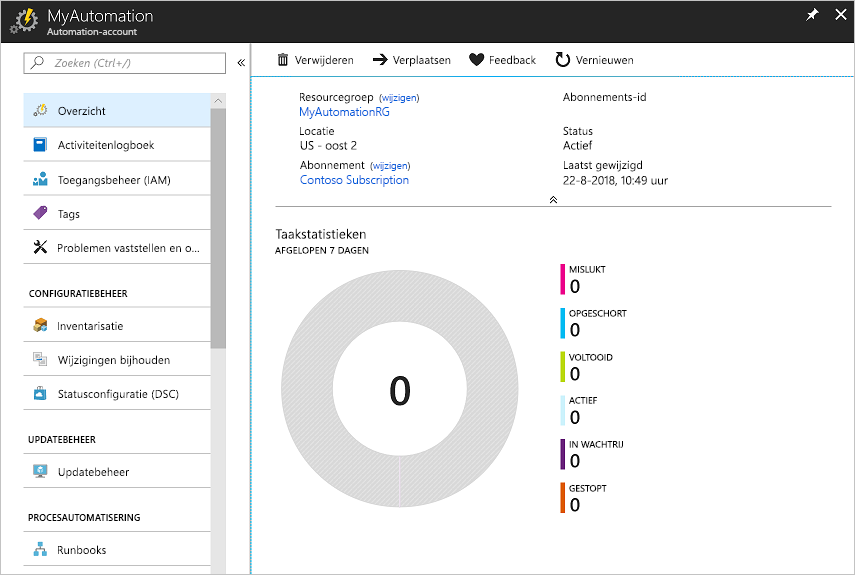
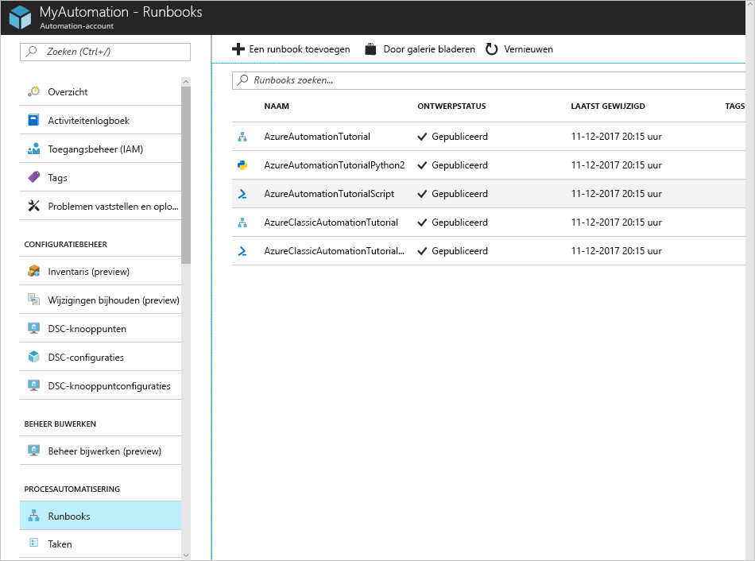
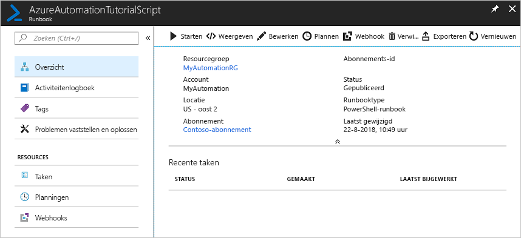
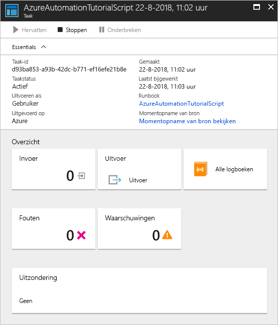

# Een Azure Automation-account maken

Azure Automation-accounts kunnen via Azure worden gemaakt. Deze methode biedt een gebruikersinterface op basis van een browser voor het maken en configureren van Automation-accounts en verwante resources. Deze quickstart laat u stapsgewijs zien hoe u een Automation-account kunt maken en een runbook in het account kunt uitvoeren.

Als u nog geen abonnement op Azure hebt, maak dan een [gratis Azure-account](https://azure.microsoft.com/free/?WT.mc_id=A261C142F) aan voordat u begint.

## Meld u aan bij Azure.

Meld u aan bij Azure via https://portal.azure.com.

## Automation-account maken

1. Klik op de knop **Nieuw** in de linkerbovenhoek van Azure.

1. Selecteer **Controle en beheer** en vervolgens **Automation**.

1. Voer de accountgegevens in. Kies bij **Een Uitvoeren als-account voor Azure maken**, de optie **Ja** zodat de artefacten die verificatie bij Azure vereenvoudigen, automatisch worden ingeschakeld. Als u daarmee klaar bent, klikt u op **Maken** om met de implementatie van het Automation-account te beginnen.

      

1. Het Automation-account is vastgemaakt aan het Azure-dashboard. Nadat de implementatie is voltooid, wordt het overzicht van het Automation-account automatisch geopend.

    

## Een runbook uitvoeren

Voer een van de zelfstudierunbooks uit.

1. Klik op **Runbooks** onder **PROCESAUTOMATISERING**. De lijst met runbooks wordt weergegeven. Verschillende zelfstudierunbooks zijn standaard ingeschakeld in het account.

    

1. Selecteer het runbook **AzureAutomationTutorialScript**. Met deze actie wordt de overzichtspagina van het runbook geopend.

    

1. Klik op **Starten** en klik op de pagina **Runbook starten** op **OK** om het runbook te starten.

    

1. Nadat de **Taakstatus** in **In uitvoering** verandert, klikt u op **Uitvoer** of **Alle logboeken** om de uitvoer van de runbooktaak weer te geven. Voor dit zelfstudierunbook bestaat de uitvoer uit een lijst van uw Azure-resources.

## Resources opschonen

Als u de resources niet meer nodig hebt, verwijdert u de resourcegroep, het Automation-account en alle gerelateerde resources. Hiervoor selecteert u de resourcegroep voor het Automation-account en klikt u op **Verwijderen**.

## Volgende stappen

In het kader van deze quickstart hebt u een Automation-account geïmplementeerd, een runbooktaak gestart en de resultaten van een taak weergegeven. Als u meer wilt weten over Azure Automation, gaat u verder met de quickstart om een eerste runbook te maken.

> [!div class="nextstepaction"]
> [Automation-quickstart: runbook maken](./automation-quickstart-create-runbook.md)
