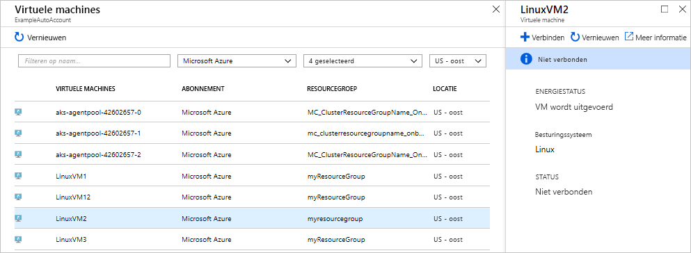
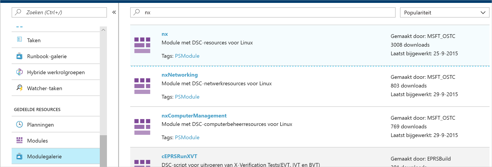
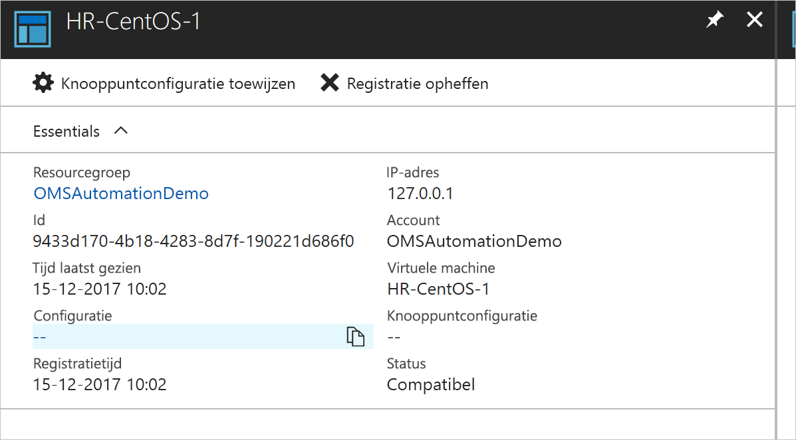
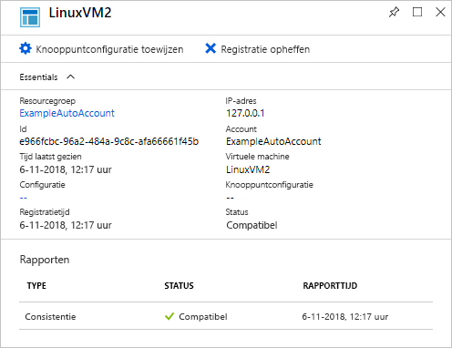
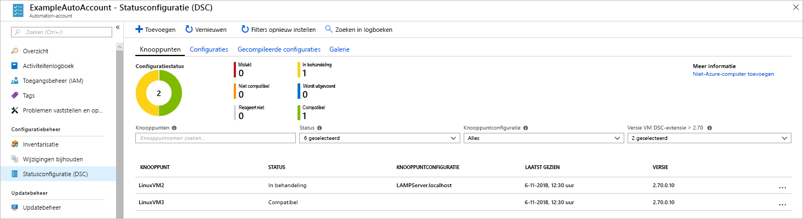

# <a name="configure-a-linux-virtual-machine-with-desired-state-configuration"></a>Een virtuele Linux-machine met Desired State Configuration configureren

Door Desired State Configuration (DSC) in te schakelen, kunt u de configuraties van uw Windows- en Linux-servers beheren en controleren. Configuraties die van de gewenste configuratie beginnen af te wijken, kunnen worden geïdentificeerd of automatisch worden gecorrigeerd. Deze quickstart bevat stappen voor het onboarden van een virtuele Linux-machine en voor de configuratie van een LAMP-stack met DSC.

## <a name="prerequisites"></a>Vereisten

U hebt het volgende nodig om deze snelstartgids te voltooien:

* Een Azure-abonnement. Als u nog geen abonnement op Azure hebt, [maak dan een gratis account](https://azure.microsoft.com/free/).
* Een Azure Automation-account. Zie [Azure Uitvoeren-als-account](automation-sec-configure-azure-runas-account.md) voor instructies over het maken van een Azure Automation Uitvoeren-als-account.
* Een virtuele Azure Resource Manager-machine (niet Klassiek) waarop Red Hat Enterprise Linux, CentOS of Oracle Linux wordt uitgevoerd. Zie [Uw eerste virtuele Linux-machine maken met behulp van Azure Portal](../virtual-machines/linux/quick-create-portal.md) voor instructies voor het maken van een VM.

## <a name="log-in-to-azure"></a>Meld u aan bij Azure.
Meld u aan bij Azure via https://portal.azure.com.

## <a name="onboard-a-virtual-machine"></a>Een virtuele machine onboarden
Er zijn veel verschillende methoden voor het uitvoeren van onboarding op een machine en om Desired State Configuration in te schakelen. Deze quickstart bevat informatie over onboarding via een Automation-account. Lees het artikel over [onboarding](https://docs.microsoft.com/azure/automation/automation-dsc-onboarding) voor meer informatie over de verschillende methoden voor de onboarding van uw machines naar Desired State Configuration.

1. Selecteer in het linkerdeelvenster van Azure Portal de optie **Automation-accounts**. Als die niet in het linkerdeelvenster wordt weergegeven, klikt u op **Alle services** en zoekt u ernaar in de weergave die u dan ziet.
1. Selecteer een Automation-account in de lijst.
1. Selecteer in het linkerdeelvenster van het Automation-account de optie **DSC-knooppunten**.
1. Klik op de menuoptie **Azure VM toevoegen**.
1. Zoek naar de virtuele machine waarvoor u DSC wilt inschakelen DSC. U kunt het zoekveld en de filteropties gebruiken om een specifieke virtuele machine te vinden.
1. Klik op de virtuele machine en selecteer vervolgens **Verbinden**
1. Selecteer de juiste DSC-instellingen voor de virtuele machine. Als u al een configuratie hebt voorbereid, kunt u deze opgeven als *knooppuntconfiguratienaam*. U kunt de [configuratiemodus](https://docs.microsoft.com/powershell/dsc/metaconfig) instellen om het configuratiegedrag voor de machine te bepalen.
1. Klik op **OK**



Terwijl de Desired State Configuration-extensie naar de virtuele machine wordt geïmplementeerd, wordt *Verbinding maken* weergegeven.

## <a name="import-modules"></a>Modules importeren

Modules bevatten DSC-resources en vele daarvan kunnen worden gevonden in [PowerShell Gallery](https://www.powershellgallery.com). Alle resources die worden gebruikt in uw configuraties moeten voor het compileren worden geïmporteerd in het Automation-account. Voor deze zelfstudie is de module met de naam **nx** vereist.

1. Selecteer in het linkerdeelvenster van het Automation-account **Modulegalerie** (onder Gedeelde bronnen).
1. Zoek naar de module die u wilt importeren door deel van de naam ervan te typen: *nx*.
1. Klik op de module die u wilt importeren.
1. Klik op **Importeren**.



## <a name="import-the-configuration"></a>De configuratie importeren

In deze quickstart wordt gebruikgemaakt van een DSC-configuratie waarmee Apache HTTP Server, MySQL en PHP op de computer worden geconfigureerd.

Zie [DSC-configuraties](https://docs.microsoft.com/powershell/dsc/configurations) voor meer informatie over DSC-configuraties.

Typ het volgende in een teksteditor en sla het bestand lokaal op als `LAMPServer.ps1`.

```powershell-interactive
configuration LAMPServer {
   Import-DSCResource -module "nx"

   Node localhost {

        $requiredPackages = @("httpd","mod_ssl","php","php-mysql","mariadb","mariadb-server")
        $enabledServices = @("httpd","mariadb")

        #Ensure packages are installed
        ForEach ($package in $requiredPackages){
            nxPackage $Package{
                Ensure = "Present"
                Name = $Package
                PackageManager = "yum"
            }
        }

        #Ensure daemons are enabled
        ForEach ($service in $enabledServices){
            nxService $service{
                Enabled = $true
                Name = $service
                Controller = "SystemD"
                State = "running"
            }
        }
   }
}
```

De configuratie importeren:

1. Selecteer in het linkerdeelvenster van het Automation-account de optie **DSC-configuraties**.
1. Klik op de menuoptie om een **configuratie toe te voegen**.
1. Selecteer het *configuratiebestand* dat u hebt opgeslagen tijdens de vorige stap.
1. Klik op **OK**

## <a name="compile-a-configuration"></a>Een configuratie compileren

DSC-configuraties moeten worden gecompileerd naar een knooppuntconfiguratie (MOF-document) voordat deze aan een knooppunt worden toegewezen. Tijdens de compilatie wordt de configuratie gevalideerd en is het mogelijk parameterwaarden in te voeren. Zie [Compiling Configurations in Azure Automation DSC](https://docs.microsoft.com/azure/automation/automation-dsc-compile) (Configuraties compileren in Azure Automation DSC) voor meer informatie over het compileren van een configuratie.

De configuratie compileren:

1. Selecteer in het linkerdeelvenster van het Automation-account de optie **DSC-configuraties**.
1. Selecteer de configuratie die u tijdens een eerdere stap hebt geïmporteerd, namelijk 'LAMPServer'.
1. Klik bij de menuopties op **Compileren** en vervolgens op **Ja**
1. In de configuratieweergave ziet u een nieuwe *compilatietaak* in de wachtrij. Wanneer de taak is voltooid, bent u klaar om door te gaan met de volgende stap. Als er fouten zijn, kunt u op de compilatietaak klikken voor meer informatie.



## <a name="assign-a-node-configuration"></a>Een knooppuntconfiguratie toewijzen

Aan DSC-knooppunten kan een gecompileerde *knooppuntconfiguratie* worden toegewezen. Door deze toe te wijzen, wordt de configuratie op de computer toegepast en wordt gecontroleerd of er van die configuratie wordt afgeweken (of wordt deze automatisch gecorrigeerd).

1. Selecteer in het linkerdeelvenster van het Automation-account de optie **DSC-knooppunten**.
1. Selecteer het knooppunt waar u een configuratie wilt toewijzen.
1. Klik op **Een knooppuntconfiguratie toewijzen**.
1. Selecteer de *knooppuntconfiguratie* - **LAMPServer.localhost** - om deze toe te wijzen en klik op **OK**
1. De gecompileerde configuratie is nu toegewezen aan het knooppunt en de status van het knooppunt is gewijzigd in *In behandeling*. Tijdens de volgende periodieke controle wordt de configuratie door het knooppunt opgehaald, toegepast en wordt de status teruggerapporteerd. Afhankelijk van de instellingen van het knooppunt kan het wel 30 minuten duren voordat het knooppunt de configuratie heeft opgehaald. Als u een onmiddellijke controle wilt afdwingen, kunt u de volgende opdracht lokaal uitvoeren op de virtuele Linux-machine: `sudo /opt/microsoft/dsc/Scripts/PerformRequiredConfigurationChecks.py`



## <a name="viewing-node-status"></a>De knooppuntstatus weergeven

De status van alle beheerde knooppunten vindt u in de weergave **DSC-knooppunten** van het Automation-account. U kunt de weergave filteren op status, knooppuntconfiguratie of naam. 



## <a name="next-steps"></a>Volgende stappen

In deze quickstart hebt u een onboarding uitgevoerd voor een virtuele Linux-machine naar DSC, hebt u een configuratie gemaakt voor een LAMP-stack en deze naar de virtuele machine geïmplementeerd. Voor meer informatie over hoe u Automation DSC kunt gebruiken om continue implementatie in te schakelen, kunt u het volgende artikel raadplegen:

> [!div class="nextstepaction"]
> [Continuous deployment to a VM using DSC and Chocolatey](./automation-dsc-cd-chocolatey.md) (Continue implementatie naar een virtuele machine met behulp van DSC en Chocolatey)

* Zie voor meer informatie over PowerShell Desired State Configuration, [PowerShell Desired State Configuration Overview](https://docs.microsoft.com/powershell/dsc/overview) (Overzicht van PowerShell Desired Configuration).
* Zie [Azure PowerShell](https://docs.microsoft.com/powershell/module/azurerm.automation/?view=azurermps-5.0.0) voor meer informatie over het beheren van Automation DSC vanuit PowerShell.
* Zie [Forwarding DSC Reporting to Log Analytics](https://docs.microsoft.com/azure/automation/automation-dsc-diagnostics) (DSC-rapporten doorsturen naar Log Analytics) voor informatie over het doorsturen van DSC-rapporten naar Log Analytics voor rapportage- en waarschuwingsdoeleinden. 
