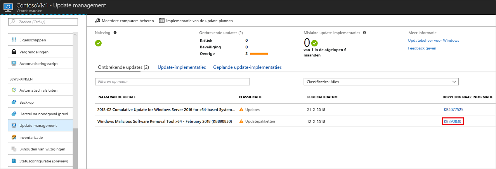
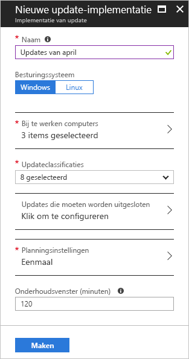
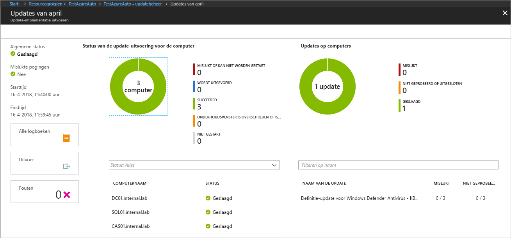

# Windows-updates beheren met Azure Automation

Met Updatebeheer kunt u updates en patches voor uw virtuele machines beheren.
In deze zelfstudie leert u hoe snel de status van de beschikbare updates beoordeelt, de installatie van vereiste updates plant en de implementatieresultaten bekijken om te controleren of updates correct zijn toegepast.

Zie [Automation-prijzen voor updatebeheer](https://azure.microsoft.com/pricing/details/automation/) voor prijsinformatie.

In deze zelfstudie leert u het volgende:

> [!div class="checklist"]
> * Een VM onboarden voor updatebeheer
> * Een update-evaluatie bekijken
> * Een update-implementatie plannen
> * De resultaten van een implementatie bekijken

## Vereisten

Voor deze zelfstudie hebt u het volgende nodig:

* Een Azure-abonnement. Als u nog geen abonnement hebt, kunt u [uw voordelen als MSDN-abonnee activeren](https://azure.microsoft.com/pricing/member-offers/msdn-benefits-details/) of u aanmelden voor een [gratis account](https://azure.microsoft.com/free/?WT.mc_id=A261C142F).
* Een [Automation-account](automation-offering-get-started.md) voor opslag van de Watcher- en actie-runbooks en de Watcher-taak.
* Een [virtuele machine](../virtual-machines/windows/quick-create-portal.md) voor de onboarding.

## Meld u aan bij Azure.

Meld u via http://portal.azure.com aan bij Azure Portal.

## Updatebeheer inschakelen

Voor deze zelfstudie moet u eerst updatebeheer inschakelen voor uw virtuele machine. Als u eerder een andere automatiseringsoplossing voor een VM hebt ingeschakeld, is deze stap niet nodig.

1. Selecteer in het menu links **Virtuele machines** en selecteer een virtuele machine in de lijst.
2. Klik in het menu links in het gedeelte **Bewerkingen** op **Updatebeheer**. De pagina **Updatebeheer inschakelen** wordt geopend.

Er wordt een validatie uitgevoerd om te bepalen of updatebeheer is ingeschakeld voor deze virtuele machine.
De validatie bevat controles voor een Log Analytics-werkruimte en het gekoppelde Automation-account en controleert of de oplossing zich in de werkruimte bevindt.

Een [Log Analytics](../log-analytics/log-analytics-overview.md?toc=%2fazure%2fautomation%2ftoc.json)-werkruimte wordt gebruikt om gegevens te verzamelen die worden gegenereerd door functies en services zoals Updatebeheer.
De werkruimte biedt één locatie om gegevens uit meerdere bronnen te bekijken en te analyseren.
Als u aanvullende bewerkingen wilt uitvoeren op virtuele machines die updates vereisen, biedt Azure Automation de mogelijkheid runbooks uit te voeren met VM's, zoals updates downloaden en toepassen.

Tijdens het validatieproces wordt ook gecontroleerd of de VM is ingericht met Microsoft Monitoring Agent (MMA) en Automation Hybrid Runbook Worker.
Deze agent wordt gebruikt om te communiceren met de VM en om informatie op te vragen over de status van de update.

Als niet aan deze vereisten wordt voldaan, verschijnt er een banner waarin u de optie krijgt de oplossing in te schakelen.

Klik op de banner om de oplossing in te schakelen.
Als een van de volgende vereiste onderdelen ontbreekt na de validatie, wordt dit automatisch toegevoegd:

* [Log Analytics](../log-analytics/log-analytics-overview.md?toc=%2fazure%2fautomation%2ftoc.json)-werkruimte
* [Automatisering](./automation-offering-get-started.md)
* Een [Hybrid Runbook Worker](./automation-hybrid-runbook-worker.md) wordt ingeschakeld op de VM.

Het scherm **Updatebeheer** wordt geopend. Configureer de locatie, de Log Analytics-werkruimte en het Automation-account dat moet worden gebruikt en klik op **Inschakelen**. Als de velden lichtgrijs zijn, betekent dit dat een andere automatiseringsoplossing is ingeschakeld voor de VM en dat dezelfde werkruimte en hetzelfde Automation-account moeten worden gebruikt.

Het inschakelen van de oplossing kan maximaal 15 minuten duren. Gedurende deze tijd mag u het browservenster niet sluiten.
Nadat de oplossing is ingeschakeld, wordt informatie over ontbrekende updates op de VM naar Log Analytics verzonden.
Het duurt tussen 30 minuten en 6 uur voordat de gegevens beschikbaar zijn voor analyse.

## Update-evaluatie bekijken

Na **Updatebeheer** is ingeschakeld, wordt het scherm **Updatebeheer** weergegeven.
Als er updates ontbreken, ziet u een lijst met ontbrekende updates op het tabblad **Ontbrekende updates**.

Selecteer **KOPPELING NAAR INFORMATIE** voor een update om het ondersteuningsartikel voor de update in een nieuw venster te openen. Hier vindt u belangrijke informatie over de update.

Als u ergens anders op de update klikt, wordt het venster **Zoeken in logboeken** geopend voor de geselecteerde update. De query voor zoeken in logboeken is vooraf gedefinieerd voor die specifieke update. U kunt deze query wijzigen of uw eigen query maken om gedetailleerde informatie over de geïmplementeerde of ontbrekende updates in uw omgeving weer te geven.

## Een update-implementatie plannen

U weet nu dat er updates ontbreken in uw virtuele machine. Als u updates wilt installeren, plant u een implementatie na uw release-planning en servicevenster.
U kunt kiezen welke typen updates moeten worden opgenomen in de implementatie.
Zo kunt u belangrijke updates of beveiligingsupdates opnemen en updatepakketten uitsluiten.

> [!WARNING]
> Wanneer updates vereisen dat de VM opnieuw moet worden opgestart, wordt deze automatisch opnieuw opgestart.

Plan een nieuwe update-implementatie voor de VM door terug te gaan naar **Updatebeheer** en **Implementatie van de update plannen**, bovenaan op het scherm, te selecteren.

Geef de volgende gegevens op in het scherm **Nieuwe update-implementatie**:

* **Naam**: geef een unieke naam op voor de update-implementatie.
* **Updateclassificatie**: selecteer de typen software die de update-implementatie moet opnemen in de implementatie. Voor deze zelfstudie laat u alle typen geselecteerd.

  De classificatietypen zijn:

  * Essentiële updates
  * Beveiligingsupdates
  * Updatepakketten
  * Functiepakketten
  * Servicepacks
  * Definitie-updates
  * Hulpprogramma's
  * Updates

* **Schema-instellingen**: stel de tijd in op 5 minuten in de toekomst. U kunt ook de standaardwaarde van 30 minuten na de huidige tijd accepteren.
U kunt ook opgeven of de implementatie eenmaal moet worden uitgevoerd of een planning met meerdere implementaties instellen.
Selecteer **Terugkerend** onder **Terugkeerpatroon**. Laat de standaardwaarde op 1 dag staan en klik op **OK**. Hiermee stelt u een terugkerend schema in.

* **Onderhoudsvenster (minuten)**: laat deze waarde op de standaardwaarde staan. U kunt opgeven binnen welke periode de update-implementatie moet plaatsvinden. Met deze instelling zorgt u ervoor dat wijzigingen worden uitgevoerd binnen de gedefinieerde onderhoudsperioden (vensters).

Nadat u de planning hebt geconfigureerd, klikt u op de knop **Maken**. U keert terug naar het statusdashboard. Selecteer **Geplande update-implementaties** om de gemaakte implementatieplanning weer te geven.

## Resultaten van een update-implementatie weergeven

Nadat de geplande implementatie is gestart, ziet u de status van deze implementatie op het tabblad **Update-implementaties** in het scherm **Updatebeheer**.
De status wordt weergegeven als **Wordt uitgevoerd** terwijl de implementatie wordt uitgevoerd.
Nadat deze is voltooid, verandert de status in **Geslaagd**.
Als er fouten optreden met één of meer updates in de implementatie, verandert de status in **Gedeeltelijk mislukt**.
Klik op de voltooide update-implementatie om het dashboard voor de betreffende update-implementatie te bekijken.

Op de tegel **Updateresultaten** ziet u een overzicht van het totale aantal updates en van de implementatieresultaten op de VM.
In de tabel aan de rechterkant vindt u gedetailleerde informatie over elke update en het resultaat van de installatie.
De volgende lijst toont de beschikbare waarden:

* **Niet geprobeerd**: de update is niet geïnstalleerd omdat er onvoldoende tijd beschikbaar was op basis van de opgegeven onderhoudsperiode.
* **Geslaagd**: de update is voltooid.
* **Mislukt**: de update is mislukt.

Klik op **Alle logboeken** voor een overzicht van alle logboekvermeldingen die tijdens de implementatie zijn gemaakt.

Klik op de tegel **Uitvoer** om de taakstroom te bekijken van het runbook dat verantwoordelijk is voor het beheer van de implementatie van de updates op de doel-VM.

Klik op **Fouten** voor gedetailleerde informatie over fouten die zijn opgetreden tijdens de implementatie.

## Volgende stappen

In deze zelfstudie heeft u het volgende geleerd:

> [!div class="checklist"]
> * Een VM onboarden voor updatebeheer
> * Een update-evaluatie bekijken
> * Een update-implementatie plannen
> * De resultaten van een implementatie bekijken

Ga door naar het overzicht van de oplossing voor updatebeheer.

> [!div class="nextstepaction"]
> [Oplossing voor updatebeheer](../operations-management-suite/oms-solution-update-management.md?toc=%2fazure%2fautomation%2ftoc.json)
