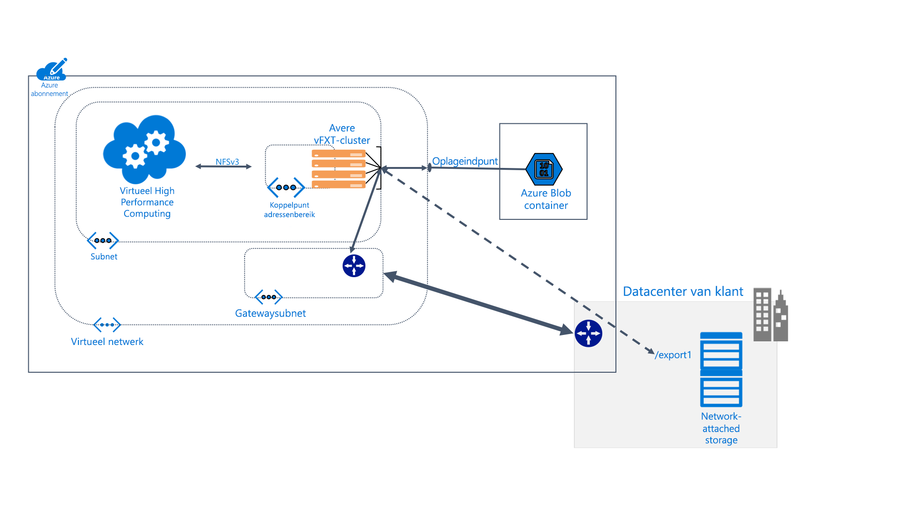

# Wat is Avere vFXT for Azure? 

Avere vFXT for Azure is een oplossing voor bestandssysteemcaching voor gegevensintensieve high performance computing (HPC)-taken. Hiermee kunt u profiteren van de schaalbaarheid van cloudcomputing om uw gegevens toegankelijk te maken waar en wanneer ze nodig zijn; ook voor gegevens die zijn opgeslagen op uw eigen on-premises hardware.

Avere vFXT ondersteunt de volgende veelvoorkomende computerscenario's: 

* Hybride cloud-architectuur: Avere vFXT voor Azure kunt werken met een hardware-opslagsysteem, waarmee u het voordeel van cloud computing zonder om bestanden te verplaatsen. 
* Cloudbursting: Avere vFXT voor Azure kunt u uw gegevens te verplaatsen naar de cloud voor een enkel project, of ' lift and shift ' de volledige werkstroom definitief. 

Avere vFXT for Azure is het geschiktst voor deze situaties: 

* Leesintensieve bewerkingen voor HPC-workloads
* Toepassingen die gebruikmaken van het NFS-protocol
* Serverfarms met 1000 tot 40.000 CPU-cores
* Integratie met on-premises hardware NAS, Azure Blob-opslag of beide

Zie <https://azure.microsoft.com/services/storage/avere-vfxt/> voor meer informatie

## Wie gebruiken Avere vFXT for Azure? 

Avere vFXT is handig bij het lezen van allerlei soorten leesintensieve rekentaken:

### Rendering van visuele effecten 

In media en entertainment kan het Avere vFXT-cluster de gegevenstoegang voor tijdgebonden renderingprojecten versnellen. Omdat u in Azure meer cacheruimte kunt toevoegen evenals meer rekenknooppunten, beschikt u over de flexibiliteit grote projecten efficiënt te kunnen afhandelen. 

### Biowetenschappen 

Met Avere vFXT kunnen onderzoekers hun secundaire analysewerkstromen in Azure Compute uitvoeren en genetische gegevens openen, ongeacht de locatie ervan.

Bij farmaceutisch onderzoek kunnen Avere vFXT-clusters worden gebruikt om het vinden van nieuwe geneesmiddelen te versnellen doordat onderzoekers interacties tussen geneesmiddel en doel kunnen voorspellen en onderzoeksgegevens analyseren.

### Analyse voor financiële dienstverlening

Met een Avere vFXT-cluster kunnen kwantitatieve analyses worden versneld, waardoor financiële dienstverleners beter inzicht kunnen krijgen bij het maken van strategische besluiten. 

## Functies en specificaties

Het Avere vFXT-systeem bestaat uit drie of meer virtuele Edge-filerknooppunten die in een cluster zijn geconfigureerd. Het kan in de buurt van de clients worden geplaatst, waaraan het cluster wordt gekoppeld, in plaats van de opslag rechtsreeks. 

In het Avere vFXT-cluster worden bestanden in de cache opgeslagen terwijl ze worden aangevraagd. Herhaalde aanvragen kunnen in meer dan tachtig procent van de tijd worden uitgevoerd vanuit de cache.

### Compatibiliteit 

* Compatibel met hardware NAS-systemen van NetApp of Dell EMC Isilon
* Compatibel met Azure Blob
* Gebruikt het NFSv3- of SMB2-protocol

De Avere vFXT gebruikt de volgende Azure-resources: 

|Azure-onderdeel|   |
|----------|-----------|
|Virtuele machines|3 of meer E32s_v3|
|Premium SSD-opslag|200 GB ruimte in het besturingssysteem plus 1 tot 4 TB ruimte in de cache per knooppunt |
|Opslagaccount (optioneel) |v2|
|Back-endopslag van gegevens (optioneel) | Eén lege LRS Blob-container |

## Volgende stappen

Hier volgen enkele koppelingen om uw eigen Avere vFXT-implementatie te starten. 

* [Het systeem plannen](avere-vfxt-deploy-plan.md)
* [Implementatie-overzicht](avere-vfxt-deploy-overview.md)
* [vFXT maken](avere-vfxt-deploy.md)
