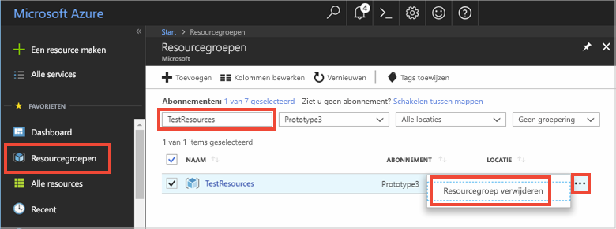

# <a name="quickstart-use-azure-cache-for-redis-with-a-net-core-app"></a>Snelstart: Azure Cache voor Redis gebruiken met een .NET Core-app


In deze snelstart wordt beschreven hoe u met behulp van .NET Core aan de slag gaat met Microsoft Azure Cache voor Redis. Microsoft Azure Cache voor Redis is gebaseerd op de populaire open source Azure Cache voor Redis. Hiermee krijgt u toegang tot een beveiligde, toegewezen Azure Cache voor Redis, die wordt beheerd door Microsoft. Een cache die u met Azure Cache voor Redis hebt gemaakt, is toegankelijk vanuit elke toepassing in Microsoft Azure.

In deze snelstart gebruikt u de client [StackExchange.Redis](https://github.com/StackExchange/StackExchange.Redis) met C\#-code in een .NET Core-console-app. U gaat een cache maken en de client-app van .NET Core configureren. Daarna gaat u objecten toevoegen en bijwerken in de cache. 

U kunt elke code-editor gebruiken om de stappen in deze snelstart uit te voeren. [Visual Studio Code](https://code.visualstudio.com/) is een uitstekende optie die beschikbaar is op de Windows-, macOS- en Linux-platforms.


[!INCLUDE [quickstarts-free-trial-note](../../includes/quickstarts-free-trial-note.md)]

## <a name="prerequisites"></a>Vereisten

* [.NET SDK 2.0](https://www.microsoft.com/net/learn/get-started/windows) of hoger.
* Voor de StackExchange.Redis-client is [.NET Framework 4 of hoger](https://www.microsoft.com/net/download/dotnet-framework-runtime) vereist.

## <a name="create-a-cache"></a>Een cache maken
[!INCLUDE [redis-cache-create](../../includes/redis-cache-create.md)]

[!INCLUDE [redis-cache-access-keys](../../includes/redis-cache-access-keys.md)]

Noteer de **hostnaam** en de **primaire** toegangssleutel. U hebt deze waarden later nodig om het *CacheConnection*-geheim samen te stellen.


## <a name="create-a-console-app"></a>Een console-app maken

Open een nieuw opdrachtvenster en voer de volgende opdracht uit om een nieuwe .NET Core-consoletoepassing te maken:

```
dotnet new console -o Redistest
```

Ga in het opdrachtvenster naar de nieuwe projectmap *Redistest*.


## <a name="add-secret-manager-to-the-project"></a>Secret Manager toevoegen aan het project

In dit gedeelte voegt u het [hulpprogramma Secret Manager](https://docs.microsoft.com/aspnet/core/security/app-secrets) toe aan uw project. Dit hulpprogramma slaat gevoelige gegevens voor ontwikkeltaken op buiten de projectstructuur. Deze aanpak voorkomt dat er per ongeluk appgeheimen worden gedeeld in de broncode.

Open het bestand *Redistest.csproj*. Voeg een element `DotNetCliToolReference` toe voor *Microsoft.Extensions.SecretManager.Tools*. Voeg ook een element `UserSecretsId` toe zoals hieronder wordt weergegeven en sla het bestand daarna op.

```xml
<Project Sdk="Microsoft.NET.Sdk">

  <PropertyGroup>
    <OutputType>Exe</OutputType>
    <TargetFramework>netcoreapp2.0</TargetFramework>
    <UserSecretsId>Redistest</UserSecretsId>
  </PropertyGroup>
  <ItemGroup>
    <DotNetCliToolReference Include="Microsoft.Extensions.SecretManager.Tools" Version="2.0.0" />
  </ItemGroup>
</Project>
```

Voer de volgende opdracht uit om het pakket *Microsoft.Extensions.Configuration.UserSecrets* toe te voegen aan het project:

```
dotnet add package Microsoft.Extensions.Configuration.UserSecrets
```

Voer de volgende opdracht uit om uw pakketten te herstellen:

```
dotnet restore
```

Voer in het opdrachtvenster de volgende opdracht uit om een nieuw geheim met de naam *CacheConnection* op te slaan, nadat u de tijdelijke aanduidingen (inclusief vierkante haken) hebt vervangen door uw cachenaam en de primaire toegangssleutel:

```
dotnet user-secrets set CacheConnection "<cache name>.redis.cache.windows.net,abortConnect=false,ssl=true,password=<primary-access-key>"
```

Voeg de volgende `using`-instructie toe aan *Program.cs*:

```csharp
using Microsoft.Extensions.Configuration;
```

Voeg de volgende leden toe aan de `Program`-klasse in *Program.cs*. Met deze code initialiseert u een configuratie voor toegang tot het geheim van de gebruiker voor de verbindingsreeks van Azure Cache voor Redis.

```csharp
        private static IConfigurationRoot Configuration { get; set; }
        const string SecretName = "CacheConnection";

        private static void InitializeConfiguration()
        {
            var builder = new ConfigurationBuilder()
                .AddUserSecrets<Program>();

            Configuration = builder.Build();
        }
```

## <a name="configure-the-cache-client"></a>De cacheclient configureren

In deze sectie configureert u de consoletoepassing voor het gebruik van de client [StackExchange.Redis](https://github.com/StackExchange/StackExchange.Redis) voor .NET.

Voer in het opdrachtvenster de volgende opdracht uit in de projectmap *Redistest*:

```
dotnet add package StackExchange.Redis
```

Zodra de installatie is voltooid, kan de *StackExchange.Redis*-cacheclient met uw project worden gebruikt.


## <a name="connect-to-the-cache"></a>Verbinding maken met de cache

Voeg de volgende `using`-instructie toe aan *Program.cs*:

```csharp
using StackExchange.Redis;
```

De verbinding met de Azure Redis-cache wordt beheerd door de klasse `ConnectionMultiplexer`. Deze klasse moet worden gedeeld en hergebruikt in uw clienttoepassing. Maak geen nieuwe verbinding voor elke bewerking. 

Voeg in *Program.cs* de volgende leden toe aan de klasse `Program` van uw consoletoepassing:

```csharp
        private static Lazy<ConnectionMultiplexer> lazyConnection = new Lazy<ConnectionMultiplexer>(() =>
        {
            string cacheConnection = Configuration[SecretName];
            return ConnectionMultiplexer.Connect(cacheConnection);
        });

        public static ConnectionMultiplexer Connection
        {
            get
            {
                return lazyConnection.Value;
            }
        }
```

Deze benadering om een exemplaar van `ConnectionMultiplexer` in uw toepassing te delen, gebruikt een statische eigenschap die een verbonden exemplaar retourneert. De code biedt een thread-veilige manier om slechts één verbonden exemplaar van `ConnectionMultiplexer` te initialiseren. `abortConnect` is ingesteld op false. Dat betekent dat de aanroep slaagt, zelfs als er geen verbinding is gemaakt met de Azure Cache voor Redis. Een belangrijke functie van `ConnectionMultiplexer` is dat deze de verbinding met de cache automatisch herstelt als het netwerkprobleem of de andere oorzaken zijn opgelost.

De waarde van het *CacheConnection*-geheim kan worden geopend met behulp van de configuratieprovider van Secret Manager geheim en kan worden gebruikt als wachtwoordparameter.

## <a name="executing-cache-commands"></a>Cache-opdrachten uitvoeren

Voeg in *Program.cs* de volgende code toe voor de procedure `Main` van de klasse `Program` voor uw consoletoepassing:

```csharp
        static void Main(string[] args)
        {
            InitializeConfiguration();

            // Connection refers to a property that returns a ConnectionMultiplexer
            // as shown in the previous example.
            IDatabase cache = lazyConnection.Value.GetDatabase();

            // Perform cache operations using the cache object...

            // Simple PING command
            string cacheCommand = "PING";
            Console.WriteLine("\nCache command  : " + cacheCommand);
            Console.WriteLine("Cache response : " + cache.Execute(cacheCommand).ToString());

            // Simple get and put of integral data types into the cache
            cacheCommand = "GET Message";
            Console.WriteLine("\nCache command  : " + cacheCommand + " or StringGet()");
            Console.WriteLine("Cache response : " + cache.StringGet("Message").ToString());

            cacheCommand = "SET Message \"Hello! The cache is working from a .NET Core console app!\"";
            Console.WriteLine("\nCache command  : " + cacheCommand + " or StringSet()");
            Console.WriteLine("Cache response : " + cache.StringSet("Message", "Hello! The cache is working from a .NET Core console app!").ToString());

            // Demostrate "SET Message" executed as expected...
            cacheCommand = "GET Message";
            Console.WriteLine("\nCache command  : " + cacheCommand + " or StringGet()");
            Console.WriteLine("Cache response : " + cache.StringGet("Message").ToString());

            // Get the client list, useful to see if connection list is growing...
            cacheCommand = "CLIENT LIST";
            Console.WriteLine("\nCache command  : " + cacheCommand);
            Console.WriteLine("Cache response : \n" + cache.Execute("CLIENT", "LIST").ToString().Replace("id=", "id="));

            lazyConnection.Value.Dispose();
        }
```

Sla *Program.cs* op.

Azure Cache voor Redis-instanties hebben een configureerbaar aantal databases (standaard 16) die kunnen worden gebruikt om de gegevens in Azure Cache voor Redis logisch te scheiden. De code maakt verbinding met de standaarddatabase, DB 0. Zie [Wat zijn Redis-databases?](cache-faq.md#what-are-redis-databases) en [Standaardconfiguratie voor Redis-server](cache-configure.md#default-redis-server-configuration) voor meer informatie.

Cache-items kunnen worden opgeslagen en opgehaald met behulp van de methoden `StringSet` en `StringGet`.

Redis slaat de meeste gegevens op als Redis-tekenreeksen, maar deze tekenreeksen kunnen veel soorten gegevens bevatten, waaronder geserialiseerde binaire gegevens die kunnen worden gebruikt voor het opslaan van .NET-objecten in de cache.

Voer de volgende opdracht in het opdrachtvenster uit om de app te compileren:

```
dotnet build
```

Voer daarna de app uit met de volgende opdracht:

```
dotnet run
```

In het onderstaande voorbeeld ziet u dat de `Message`-sleutel eerder een waarde in de cache had, die was ingesteld met behulp van de Redis Console in Azure Portal. De app heeft die waarde in de cache bijgewerkt. De app heeft ook de opdrachten `PING` en `CLIENT LIST` uitgevoerd.


## <a name="work-with-net-objects-in-the-cache"></a>Werken met .NET-objecten in de cache

Azure Cache voor Redis kan zowel .NET-objecten als oudere gegevenstypen opslaan in de cache. Voordat een .NET-object in de cache kan worden opgeslagen, moet het echter worden geserialiseerd. Deze serialisatie van het .NET-object is de verantwoordelijkheid van de ontwikkelaar van de toepassing. Het geeft de ontwikkelaar flexibiliteit bij de keuze van de serializer.

Een eenvoudige manier om objecten te serialiseren is met de serialisatiemethoden `JsonConvert` in [Newtonsoft.Json](https://www.nuget.org/packages/Newtonsoft.Json/). Hiermee serialiseert u van en naar JSON. In deze sectie voegt u een .NET-object toe aan de cache.

Voer de volgende opdracht uit om het pakket *Newtonsoft.json* toe te voegen aan de app:

```
dotnet add package Newtonsoft.json
```

Voeg de volgende `using`-instructie toe aan *Program.cs*:

```charp
using Newtonsoft.Json;
```

Voeg de volgende `Employee`-klassedefinitie toe aan *Program.cs*:

```csharp
        class Employee
        {
            public string Id { get; set; }
            public string Name { get; set; }
            public int Age { get; set; }

            public Employee(string EmployeeId, string Name, int Age)
            {
                this.Id = EmployeeId;
                this.Name = Name;
                this.Age = Age;
            }
        }
```

Voeg onderaan procedure `Main()` in *Program.cs* en vóór de aanroep van `Dispose()` de volgende regels code toe om een geserialiseerd .NET-object op te slaan in de cache en op te halen:

```csharp
            // Store .NET object to cache
            Employee e007 = new Employee("007", "Davide Columbo", 100);
            Console.WriteLine("Cache response from storing Employee .NET object : " + 
                cache.StringSet("e007", JsonConvert.SerializeObject(e007)));

            // Retrieve .NET object from cache
            Employee e007FromCache = JsonConvert.DeserializeObject<Employee>(cache.StringGet("e007"));
            Console.WriteLine("Deserialized Employee .NET object :\n");
            Console.WriteLine("\tEmployee.Name : " + e007FromCache.Name);
            Console.WriteLine("\tEmployee.Id   : " + e007FromCache.Id);
            Console.WriteLine("\tEmployee.Age  : " + e007FromCache.Age + "\n");
```

Sla *Program.cs* op en compileer de app opnieuw met de volgende opdracht:

```
dotnet build
```

Voer de app uit met de volgende opdracht om de serialisatie van .NET-objecten te testen:

```
dotnet run
```


## <a name="clean-up-resources"></a>Resources opschonen

Als u verder wilt gaan met de volgende zelfstudie, kunt u de resources die in deze snelstart zijn gemaakt behouden en opnieuw gebruiken.

Als u niet verder wilt met de voorbeeldtoepassing uit de snelstart, kunt u de Azure-resources verwijderen die in deze snelstart zijn gemaakt om kosten te voorkomen. 

> [!IMPORTANT]
> Het verwijderen van een resourcegroep kan niet ongedaan worden gemaakt. De resourcegroep en alle bijbehorende resources worden permanent verwijderd. Zorg ervoor dat u niet per ongeluk de verkeerde resourcegroep of resources verwijdert. Als u de resources voor het hosten van dit voorbeeld in een bestaande resourcegroep hebt gemaakt en deze groep ook resources bevat die u wilt behouden, kunt u elke resource afzonderlijk verwijderen via hun respectievelijke blade.
>

Meld u aan bij [Azure Portal](https://portal.azure.com) en klik op **Resourcegroepen**.

Typ de naam van de resourcegroep in het tekstvak **Filteren op naam...**. In de instructies voor dit artikel is een resourcegroep met de naam *TestResources* gebruikt. Klik in de resourcegroep in de lijst met resultaten op **...** en vervolgens op **Resourcegroep verwijderen**.



U wordt gevraagd om het verwijderen van de resourcegroep te bevestigen. Typ de naam van de resourcegroep om te bevestigen en klik op **Verwijderen**.

Na enkele ogenblikken worden de resourcegroep en alle resources in de groep verwijderd.


<a name="next-steps"></a>

## <a name="next-steps"></a>Volgende stappen

In deze snelstartgids hebt u geleerd hoe u Azure Cache voor Redis gebruikt vanuit een .NET Core-toepassing. Ga verder met de volgende snelstart om Azure Cache voor Redis te gebruiken met een ASP.NET-web-app.

> [!div class="nextstepaction"]
> [Maak een ASP.NET-web-app die gebruikmaakt van Azure Cache voor Redis.](./cache-web-app-howto.md)


