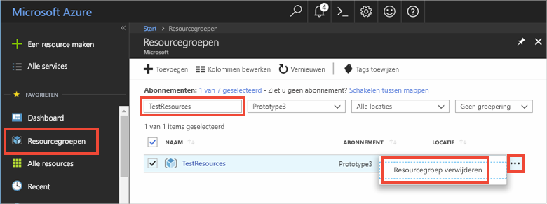

# <a name="quickstart-how-to-use-azure-cache-for-redis-with-nodejs"></a>Snelstart: Azure Cache voor Redis gebruiken met Node.js


Azure Cache voor Redis geeft u toegang tot een beveiligde, toegewezen Azure Cache voor Redis, die wordt beheerd door Microsoft. Uw cache is toegankelijk vanuit elke toepassing in Microsoft Azure.

In dit onderwerp wordt beschreven hoe u aan de slag kunt met Azure Cache voor Redis met gebruik van Node.js. 

U kunt elke code-editor gebruiken om de stappen in deze snelstart uit te voeren. [Visual Studio Code](https://code.visualstudio.com/) is een uitstekende optie die beschikbaar is op de Windows-, macOS- en Linux-platforms.


[!INCLUDE [quickstarts-free-trial-note](../../includes/quickstarts-free-trial-note.md)]


## <a name="prerequisites"></a>Vereisten
[node_redis](https://github.com/mranney/node_redis) installeren:

    npm install redis

In deze zelfstudie wordt gebruikgemaakt van [node_redis](https://github.com/mranney/node_redis). Voor voorbeelden van het gebruik van andere Node.js-clients, verwijzen wij u naar de afzonderlijke documentatie voor de Node.js-clients die staat vermeld op [Node.js Redis-clients](https://redis.io/clients#nodejs).


## <a name="create-a-cache"></a>Een cache maken
[!INCLUDE [redis-cache-create](../../includes/redis-cache-create.md)]

[!INCLUDE [redis-cache-access-keys](../../includes/redis-cache-access-keys.md)]


Voeg omgevingsvariabelen toe voor **HOST NAME** en **Primary** (primaire toegangssleutel). U gebruikt deze variabelen vanuit uw code in plaats van de gevoelige gegevens rechtstreeks op te nemen in uw code.

```
set REDISCACHEHOSTNAME=contosoCache.redis.cache.windows.net
set REDISCACHEKEY=XXXXXXXXXXXXXXXXXXXXXXXXXXXXXXXXXXXXXXXXXXXX
```


## <a name="connect-to-the-cache"></a>Verbinding maken met de cache

De meest recente versies van [node_redis](https://github.com/mranney/node_redis) bieden ondersteuning voor het via SSL maken van verbinding met Azure Cache voor Redis. Het volgende voorbeeld laat zien hoe u via het SSL-eindpunt 6380 verbinding maakt met Azure Cache voor Redis. 

```js
var redis = require("redis");

// Add your cache name and access key.
var client = redis.createClient(6380, process.env.REDISCACHEHOSTNAME,
    {auth_pass: process.env.REDISCACHEKEY, tls: {servername: process.env.REDISCACHEHOSTNAME}});
```

Maak geen nieuwe verbindingen voor elke bewerking in uw code. Probeer verbindingen zo veel mogelijk te hergebruiken. 

## <a name="create-a-new-nodejs-app"></a>Een nieuwe Node.js-app maken

Maak een nieuw scriptbestand met de naam *redistest.js*.

Voeg het volgende voorbeeld van JavaScript toe aan het bestand. Deze code laat zien hoe u verbinding kunt maken met een exemplaar van Azure Cache voor Redis via de omgevingsvariabelen voor hostnaam en sleutel. Met de code wordt ook een tekenreekswaarde opgeslagen in de cache en daaruit opgehaald. De opdrachten `PING` en `CLIENT LIST` worden ook uitgevoerd. Zie [https://redis.js.org/](https://redis.js.org/) voor meer voorbeelden van het gebruik van Redis met de [node_redis](https://github.com/mranney/node_redis)-client.

```js
var redis = require("redis");
var bluebird = require("bluebird");

bluebird.promisifyAll(redis.RedisClient.prototype);
bluebird.promisifyAll(redis.Multi.prototype);

async function testCache() {

    // Connect to the Azure Cache for Redis over the SSL port using the key.
    var cacheConnection = redis.createClient(6380, process.env.REDISCACHEHOSTNAME, 
        {auth_pass: process.env.REDISCACHEKEY, tls: {servername: process.env.REDISCACHEHOSTNAME}});
        
    // Perform cache operations using the cache connection object...

    // Simple PING command
    console.log("\nCache command: PING");
    console.log("Cache response : " + await cacheConnection.pingAsync());

    // Simple get and put of integral data types into the cache
    console.log("\nCache command: GET Message");
    console.log("Cache response : " + await cacheConnection.getAsync("Message"));    

    console.log("\nCache command: SET Message");
    console.log("Cache response : " + await cacheConnection.setAsync("Message",
        "Hello! The cache is working from Node.js!"));    

    // Demonstrate "SET Message" executed as expected...
    console.log("\nCache command: GET Message");
    console.log("Cache response : " + await cacheConnection.getAsync("Message"));    

    // Get the client list, useful to see if connection list is growing...
    console.log("\nCache command: CLIENT LIST");
    console.log("Cache response : " + await cacheConnection.clientAsync("LIST"));    
}

testCache();
```

Voer het script uit met Node.js.

```
node redistest.js
```

In het onderstaande voorbeeld ziet u dat de `Message`-sleutel eerder een waarde in de cache had, die was ingesteld met behulp van de Redis Console in Azure Portal. De app heeft die waarde in de cache bijgewerkt. De app heeft ook de opdrachten `PING` en `CLIENT LIST` uitgevoerd.


## <a name="clean-up-resources"></a>Resources opschonen

Als u verder wilt gaan met de volgende zelfstudie, kunt u de resources die in deze snelstart zijn gemaakt behouden en opnieuw gebruiken.

Als u niet verder wilt met de voorbeeldtoepassing uit de snelstart, kunt u de Azure-resources verwijderen die in deze snelstart zijn gemaakt om kosten te voorkomen. 

> [!IMPORTANT]
> Het verwijderen van een resourcegroep kan niet ongedaan worden gemaakt. De resourcegroep en alle bijbehorende resources worden permanent verwijderd. Zorg ervoor dat u niet per ongeluk de verkeerde resourcegroep of resources verwijdert. Als u de resources voor het hosten van dit voorbeeld in een bestaande resourcegroep hebt gemaakt en deze groep ook resources bevat die u wilt behouden, kunt u elke resource afzonderlijk verwijderen via hun respectievelijke blade.
>

Meld u aan bij [Azure Portal](https://portal.azure.com) en klik op **Resourcegroepen**.

Typ de naam van de resourcegroep in het tekstvak **Filteren op naam...**. In de instructies voor dit artikel is een resourcegroep met de naam *TestResources* gebruikt. Klik in de resourcegroep in de lijst met resultaten op **...** en vervolgens op **Resourcegroep verwijderen**.



U wordt gevraagd om het verwijderen van de resourcegroep te bevestigen. Typ de naam van de resourcegroep om te bevestigen en klik op **Verwijderen**.

Na enkele ogenblikken worden de resourcegroep en alle resources in de groep verwijderd.


## <a name="next-steps"></a>Volgende stappen

In deze snelstartgids hebt u geleerd hoe u Azure Cache voor Redis gebruikt vanuit een Node.js-toepassing. Ga verder met de volgende snelstart om Azure Cache voor Redis te gebruiken met een ASP.NET-web-app.

> [!div class="nextstepaction"]
> [Maak een ASP.NET-web-app die gebruikmaakt van Azure Cache voor Redis.](./cache-web-app-howto.md)


