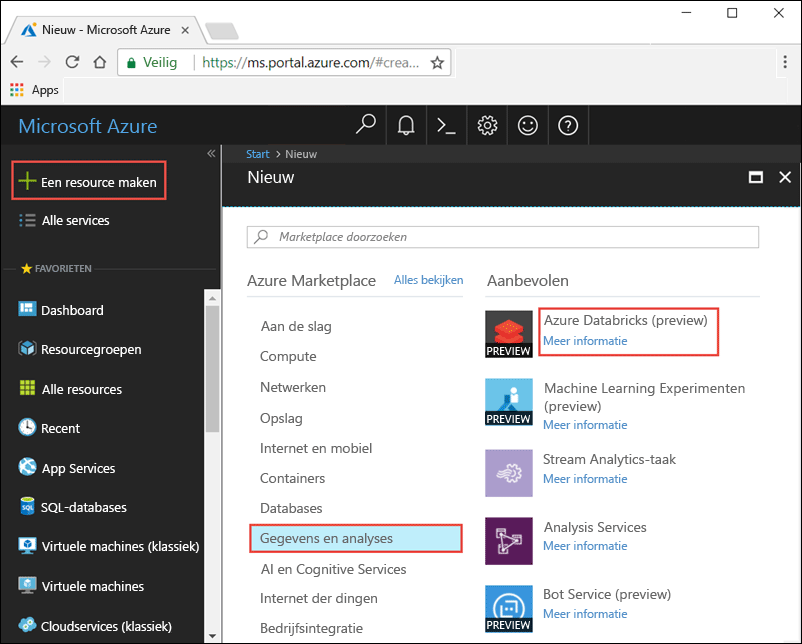
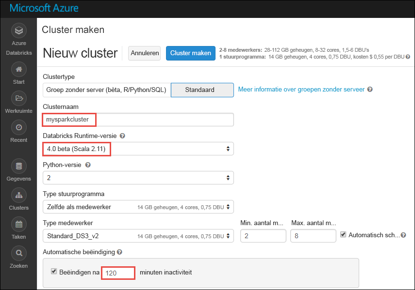

# <a name="tutorial-sentiment-analysis-on-streaming-data-using-azure-databricks"></a>Zelfstudie: Sentimentanalyse voor streaminggegevens met behulp van Azure Databricks

In deze zelfstudie leert u hoe u sentimentanalyse kunt uitvoeren voor een bijna-realtime gegevensstroom met behulp van Azure Databricks. Met behulp van Azure Event Hubs gaat u een systeem van gegevensopname instellen. U importeert de berichten vanuit Event Hubs naar Azure Databricks met behulp van de Spark Event Hubs-connector. Tot slot gaat u gebruikmaken van Microsoft Cognitive Service API's om sentimentanalyse uit te voeren op de gestreamde gegevens.

Aan het einde van deze zelfstudie hebt u gestreamde tweets van Twitter waarin de term 'Azure' is opgenomen en hebt u een sentimentanalyse voor de tweets uitgevoerd.

In de volgende afbeelding wordt de stroom van de toepassing weergegeven:


Deze zelfstudie bestaat uit de volgende taken:

> [!div class="checklist"]
> * Een Azure Databricks-werkruimte maken
> * Een Apache Spark-cluster in Azure Databricks maken
> * Een Twitter-app voor toegang tot streaminggegevens maken
> * Notitieblokken maken in Azure Databricks
> * Bibliotheken koppelen voor Event Hubs en Twitter API
> * Een Microsoft Cognitive Services-account maken en de toegangssleutel ophalen
> * Tweets verzenden naar Event Hubs
> * Tweets lezen van Event Hubs
> * Sentimentanalyse voor tweets uitvoeren

Als u geen abonnement op Azure hebt, maakt u een [gratis account](https://azure.microsoft.com/free/) voordat u begint.

## <a name="prerequisites"></a>Vereisten

Zorg ervoor dat u aan de volgende vereisten voldoet voordat u met deze zelfstudie begint:
- Een Azure Event Hubs-naamruimte.
- Een Event Hub in de naamruimte.
- De verbindingsreeks voor toegang tot de Event Hubs-naamruimte. De verbindingsreeks moet een vergelijkbare bestandsindeling hebben als `Endpoint=sb://<namespace>.servicebus.windows.net/;SharedAccessKeyName=<key name>;SharedAccessKey=<key value>`.
- Beleid voor gedeelde toegang en beleidssleutel voor Event Hubs.

U kunt aan deze vereisten voldoen via de stappen in het artikel [Een Azure Event Hubs-naamruimte en een event hub maken](../event-hubs/event-hubs-create.md).

## <a name="log-in-to-the-azure-portal"></a>Aanmelden bij Azure Portal

Meld u aan bij [Azure Portal](https://portal.azure.com/).

## <a name="create-an-azure-databricks-workspace"></a>Een Azure Databricks-werkruimte maken

In deze sectie gaat u een Azure Databricks-werkruimte maken met behulp van Azure Portal.

1. Selecteer in Azure Portal **Een resource maken** > **Gegevens en analyses** > **Azure Databricks**.

    

3. Geef bij **Azure Databricks Service** de waarden op voor het maken van een Databricks-werkruimte.

    

    Geef de volgende waarden op:

    |Eigenschap  |Beschrijving  |
    |---------|---------|
    |**Werkruimtenaam**     | Geef een naam op voor uw Databricks-werkruimte.        |
    |**Abonnement**     | Selecteer uw Azure-abonnement in de vervolgkeuzelijst.        |
    |**Resourcegroep**     | Geef aan of u een nieuwe resourcegroep wilt maken of een bestaande groep wilt gebruiken. Een resourcegroep is een container met gerelateerde resources voor een Azure-oplossing. Zie [Overzicht van Azure Resource Manager](../azure-resource-manager/resource-group-overview.md) voor meer informatie. |
    |**Locatie**     | Selecteer **US - oost 2**. Zie [Producten beschikbaar per regio](https://azure.microsoft.com/regions/services/) voor andere beschikbare regio's.        |
    |**Prijscategorie**     |  U kunt kiezen tussen **Standard** en **Premium**. Bekijk de pagina [Prijzen voor Databricks](https://azure.microsoft.com/pricing/details/databricks/) voor meer informatie over deze categorieën.       |

    Selecteer **Vastmaken aan dashboard** en selecteer **Maken**.

4. Het duurt enkele minuten om het account te maken. Tijdens het maken van het account wordt rechts in de portal de tegel **Implementatie verzenden voor Azure Databricks** weergegeven. Mogelijk moet u op uw dashboard naar rechts scrollen om de tegel te zien. Bovenaan het scherm wordt ook een voortgangsbalk weergegeven. U kunt beide gebieden bekijken voor de voortgang.

    

## <a name="create-a-spark-cluster-in-databricks"></a>Een Spark-cluster maken in Databricks

1. Ga in Azure Portal naar de Databricks-werkruimte die u hebt gemaakt en selecteer **Werkruimte starten**.

2. U wordt omgeleid naar de Azure Databricks-portal. Klik in de portal op **Cluster**.

    

3. Op de pagina **Nieuw cluster** geeft u de waarden op waarmee een nieuw cluster wordt gemaakt.

    

    Accepteer alle andere standaardwaarden, anders dan de volgende:

    * Voer een naam in voor het cluster.
    * Voor dit artikel maakt u een cluster met een **4.0 (bèta)**-runtime.
    * Zorg ervoor dat u het selectievakje **Beëindigen na\_\_ minuten van inactiviteit** inschakelt. Geef een duur (in minuten) op waarna het cluster moet worden beëindigd als het niet wordt gebruikt.

    Selecteer **Cluster maken**. Zodra het cluster wordt uitgevoerd, kunt u notitieblokken koppelen aan het cluster en Spark-taken uitvoeren.

## <a name="create-a-twitter-application"></a>Een Twitter-toepassing maken

Als u een stream van tweets wilt ontvangen, moet u een toepassing in Twitter maken. Volg de stappen om een Twitter-toepassing te maken en de waarden vast te leggen die u nodig hebt om deze zelfstudie te voltooien.

1. Ga vanuit een webbrowser naar [Twitter Application Management](https://apps.twitter.com/) en selecteer **Create New App**.

    

2. Voer op de pagina **Create an application** de gegevens voor de nieuwe app in en selecteer **Create your Twitter application**.

    

3. Selecteer op de toepassingspagina het tabblad **Keys and Access Tokens** en kopieer de waarden voor **Consumer Key** en **Consumer Secret**. Selecteer ook **Create my access token** om de toegangstokens te genereren. Kopieer de waarden voor **Access Token** en **Access Token Secret**.

    

Sla de waarden op die u hebt opgehaald voor de Twitter-toepassing. U hebt deze waarden later in de zelfstudie nodig.

## <a name="attach-libraries-to-spark-cluster"></a>Bibliotheken koppelen aan een Apache Spark-cluster

In deze zelfstudie gebruikt u de Twitter-API's om tweets te verzenden naar Event Hubs. U gebruikt ook de [Apache Spark Event Hubs-connector](https://github.com/Azure/azure-event-hubs-spark) om gegevens naar Azure Event Hubs te lezen en schrijven. Als u deze API's wilt gebruiken als onderdeel van uw cluster, kunt u ze als bibliotheken toevoegen aan Azure Databricks en ze vervolgens aan uw Apache Spark-cluster koppelen. De volgende instructies laten zien hoe de bibliotheek wordt toegevoegd aan de map **Gedeeld** in uw werkruimte.

1.  Selecteer **Werkruimte** in de Azure Databricks-werkruimte en klik vervolgens met de rechtermuisknop op **Gedeeld**. Selecteer **Bibliotheek** > **maken** in het contextmenu.

    

2. Op de pagina Nieuwe bibliotheek selecteert u bij **Bron** de optie **Maven-coördinaat**. Voer bij **Coördinaat** de coördinaat in voor het pakket dat u wilt toevoegen. Dit zijn de Maven-coördinaten voor de bibliotheken die in deze zelfstudie worden gebruikt:

    * Apache Spark Event Hubs-connector - `com.microsoft.azure:azure-eventhubs-spark_2.11:2.3.5`
    * Twitter API - `org.twitter4j:twitter4j-core:4.0.6`

    

3. Selecteer **Bibliotheek maken**.

4. Selecteer de map waaraan u de bibliotheek hebt toegevoegd en selecteer vervolgens de naam van de bibliotheek.

    

5. Selecteer op de bibliotheekpagina het cluster waar u de bibliotheek wilt gebruiken. Nadat de bibliotheek aan het cluster is gekoppeld, verandert de status onmiddellijk in **Toegevoegd**.

    

6. Herhaal deze stappen voor het Twitter-pakket, `twitter4j-core:4.0.6`.

## <a name="get-a-cognitive-services-access-key"></a>Een Cognitive Services-toegangssleutel ophalen

In deze zelfstudie gebruikt u de [Microsoft Cognitive Services Text Analytics-API's](../cognitive-services/text-analytics/overview.md) om sentimentanalyse uit te voeren op een bijna-realtime stream van tweets. Voordat u de API's gebruikt, moet u een Microsoft Cognitive Services-account in Azure maken en een toegangssleutel ophalen om de Text Analytics-API's te gebruiken.

1. Meld u aan bij [Azure Portal](https://portal.azure.com/).

2. Selecteer **+ Een resource maken**.

3. Selecteer bij Azure Marketplace **AI en Cognitive Services** > **Text Analytics-API**.

    

4. Geef in het dialoogvenster **Maken** de volgende waarden op:

    

    - Voer een naam voor de Cognitive Services-account in.
    - Selecteer het Azure-abonnement waarmee het account wordt gemaakt.
    - Selecteer een Azure-locatie.
    - Selecteer een prijscategorie voor de service. Zie de [pagina met prijzen](https://azure.microsoft.com/pricing/details/cognitive-services/) voor meer informatie over prijzen voor Cognitive Services.
    - Geef aan of u een nieuwe resourcegroep wilt maken of een bestaande groep wilt gebruiken.

    Selecteer **Maken**.

5. Nadat het account is gemaakt, selecteert u op het tabblad **Overzicht** de optie **Toegangssleutels weergeven**.

    

    Kopieer ook een deel van de eindpunt-URL, zoals weergegeven in de schermafbeelding. Deze URL hebt u nodig in de zelfstudie.

6. Onder **Sleutels beheren** selecteert u het pictogram voor kopiëren op basis van de sleutel die u wilt gebruiken.

    

7. Sla de waarden voor de eindpunt-URL en de toegangssleutel op die u in deze stap hebt opgehaald. U hebt deze verderop in deze zelfstudie nodig.

## <a name="create-notebooks-in-databricks"></a>Notitieblokken maken in Databricks

In deze sectie gaat u in de Databricks-werkruimte twee notitieblokken met de volgende namen maken

- **SendTweetsToEventHub**: een notitieblok voor producenten waarmee u tweets kunt ophalen uit Twitter die u kunt streamen naar Event Hubs.
- **ReadTweetsFromEventHub**: een notitieblok voor consumenten waarmee u de tweets uit Event Hubs kunt lezen en sentimentanalyses kunt uitvoeren.

1. Selecteer **Werkruimte** in het linkerdeelvenster. Selecteer **Maken** in de vervolgkeuzelijst **Werkruimte** en selecteer **Notitieblok**.

    

2. Voer in het dialoogvenster **Notitieblok maken** als naam **SendTweetsToEventHub** in, selecteer **Scala** als taal en selecteer het Apache Spark-cluster dat u eerder hebt gemaakt.

    

    Selecteer **Maken**.

3. Herhaal de stappen om het notitieblok **AnalyzeTweetsFromEventHub** te maken.

## <a name="send-tweets-to-event-hubs"></a>Tweets verzenden naar Event Hubs

Plak in het notitieblok **SendTweetsToEventHub** de volgende code en vervang de tijdelijke aanduiding door waarden voor uw Event Hubs-naamruimte en Twitter-toepassing die u eerder hebt gemaakt. Dit notitieblok streamt tweets met het sleutelwoord 'Azure' in realtime naar Event Hubs.

```scala
import java.util._
import scala.collection.JavaConverters._
import com.microsoft.azure.eventhubs._
import java.util.concurrent._

val namespaceName = "<EVENT HUBS NAMESPACE>"
val eventHubName = "<EVENT HUB NAME>"
val sasKeyName = "<POLICY NAME>"
val sasKey = "<POLICY KEY>"
val connStr = new ConnectionStringBuilder()
            .setNamespaceName(namespaceName)
            .setEventHubName(eventHubName)
            .setSasKeyName(sasKeyName)
            .setSasKey(sasKey)

val pool = Executors.newFixedThreadPool(1)
val eventHubClient = EventHubClient.create(connStr.toString(), pool)

def sendEvent(message: String) = {
  val messageData = EventData.create(message.getBytes("UTF-8"))
  eventHubClient.get().send(messageData)
  System.out.println("Sent event: " + message + "\n")
}

import twitter4j._
import twitter4j.TwitterFactory
import twitter4j.Twitter
import twitter4j.conf.ConfigurationBuilder

// Twitter configuration!
// Replace values below with yours

val twitterConsumerKey = "<CONSUMER KEY>"
val twitterConsumerSecret = "<CONSUMER SECRET>"
val twitterOauthAccessToken = "<ACCESS TOKEN>"
val twitterOauthTokenSecret = "<TOKEN SECRET>"

val cb = new ConfigurationBuilder()
  cb.setDebugEnabled(true)
  .setOAuthConsumerKey(twitterConsumerKey)
  .setOAuthConsumerSecret(twitterConsumerSecret)
  .setOAuthAccessToken(twitterOauthAccessToken)
  .setOAuthAccessTokenSecret(twitterOauthTokenSecret)

val twitterFactory = new TwitterFactory(cb.build())
val twitter = twitterFactory.getInstance()

// Getting tweets with keyword "Azure" and sending them to the Event Hub in realtime!

val query = new Query(" #Azure ")
query.setCount(100)
query.lang("en")
var finished = false
while (!finished) {
  val result = twitter.search(query)
  val statuses = result.getTweets()
  var lowestStatusId = Long.MaxValue
  for (status <- statuses.asScala) {
    if(!status.isRetweet()){
      sendEvent(status.getText())
    }
    lowestStatusId = Math.min(status.getId(), lowestStatusId)
    Thread.sleep(2000)
  }
  query.setMaxId(lowestStatusId - 1)
}

// Closing connection to the Event Hub
 eventHubClient.get().close()
```

Voor het uitvoeren van het notitieblok drukt u op **SHIFT + ENTER**. De volgende uitvoer wordt weergegeven. Elke gebeurtenis in de uitvoer is een tweet die in Event Hubs wordt opgenomen.

    Sent event: @Microsoft and @Esri launch Geospatial AI on Azure https://t.co/VmLUCiPm6q via @geoworldmedia #geoai #azure #gis #ArtificialIntelligence

    Sent event: Public preview of Java on App Service, built-in support for Tomcat and OpenJDK
    https://t.co/7vs7cKtvah
    #cloudcomputing #Azure

    Sent event: 4 Killer #Azure Features for #Data #Performance https://t.co/kpIb7hFO2j by @RedPixie

    Sent event: Migrate your databases to a fully managed service with Azure SQL Database Managed Instance | #Azure | #Cloud https://t.co/sJHXN4trDk

    Sent event: Top 10 Tricks to #Save Money with #Azure Virtual Machines https://t.co/F2wshBXdoz #Cloud

    ...
    ...

## <a name="read-tweets-from-event-hubs"></a>Tweets lezen van Event Hubs

Plak in het notitieblok **AnalyzeTweetsFromEventHub** de volgende code en vervang de tijdelijke aanduiding door waarden voor uw Azure Event Hubs die u eerder hebt gemaakt. Dit notitieblok leest de tweets die u eerder naar Event Hubs hebt gestreamd met behulp van het notitieblok **SendTweetsToEventHub**.

```scala
import org.apache.spark.eventhubs._

// Build connection string with the above information
val connectionString = ConnectionStringBuilder("<EVENT HUBS CONNECTION STRING>")
  .setEventHubName("<EVENT HUB NAME>")
  .build

val customEventhubParameters =
  EventHubsConf(connectionString)
  .setMaxEventsPerTrigger(5)

val incomingStream = spark.readStream.format("eventhubs").options(customEventhubParameters.toMap).load()

incomingStream.printSchema

// Sending the incoming stream into the console.
// Data comes in batches!
incomingStream.writeStream.outputMode("append").format("console").option("truncate", false).start().awaitTermination()
```

U krijgt de volgende uitvoer:

    root
     |-- body: binary (nullable = true)
     |-- offset: long (nullable = true)
     |-- seqNumber: long (nullable = true)
     |-- enqueuedTime: long (nullable = true)
     |-- publisher: string (nullable = true)
     |-- partitionKey: string (nullable = true)

    -------------------------------------------
    Batch: 0
    -------------------------------------------
    +------+------+--------------+---------------+---------+------------+
    |body  |offset|sequenceNumber|enqueuedTime   |publisher|partitionKey|
    +------+------+--------------+---------------+---------+------------+
    |[50 75 62 6C 69 63 20 70 72 65 76 69 65 77 20 6F 66 20 4A 61 76 61 20 6F 6E 20 41 70 70 20 53 65 72 76 69 63 65 2C 20 62 75 69 6C 74 2D 69 6E 20 73 75 70 70 6F 72 74 20 66 6F 72 20 54 6F 6D 63 61 74 20 61 6E 64 20 4F 70 65 6E 4A 44 4B 0A 68 74 74 70 73 3A 2F 2F 74 2E 63 6F 2F 37 76 73 37 63 4B 74 76 61 68 20 0A 23 63 6C 6F 75 64 63 6F 6D 70 75 74 69 6E 67 20 23 41 7A 75 72 65]                              |0     |0             |2018-03-09 05:49:08.86 |null     |null        |
    |[4D 69 67 72 61 74 65 20 79 6F 75 72 20 64 61 74 61 62 61 73 65 73 20 74 6F 20 61 20 66 75 6C 6C 79 20 6D 61 6E 61 67 65 64 20 73 65 72 76 69 63 65 20 77 69 74 68 20 41 7A 75 72 65 20 53 51 4C 20 44 61 74 61 62 61 73 65 20 4D 61 6E 61 67 65 64 20 49 6E 73 74 61 6E 63 65 20 7C 20 23 41 7A 75 72 65 20 7C 20 23 43 6C 6F 75 64 20 68 74 74 70 73 3A 2F 2F 74 2E 63 6F 2F 73 4A 48 58 4E 34 74 72 44 6B]            |168   |1             |2018-03-09 05:49:24.752|null     |null        |
    +------+------+--------------+---------------+---------+------------+

    -------------------------------------------
    Batch: 1
    -------------------------------------------
    ...
    ...

Omdat de uitvoer in een binaire modus is, gebruikt u het volgende fragment om de uitvoer te converteren naar een tekenreeks.

```scala
import org.apache.spark.sql.types._
import org.apache.spark.sql.functions._

// Event Hub message format is JSON and contains "body" field
// Body is binary, so we cast it to string to see the actual content of the message
val messages =
  incomingStream
  .withColumn("Offset", $"offset".cast(LongType))
  .withColumn("Time (readable)", $"enqueuedTime".cast(TimestampType))
  .withColumn("Timestamp", $"enqueuedTime".cast(LongType))
  .withColumn("Body", $"body".cast(StringType))
  .select("Offset", "Time (readable)", "Timestamp", "Body")

messages.printSchema

messages.writeStream.outputMode("append").format("console").option("truncate", false).start().awaitTermination()
```

De uitvoer lijkt nu op die in het volgende codefragment:

    root
     |-- Offset: long (nullable = true)
     |-- Time (readable): timestamp (nullable = true)
     |-- Timestamp: long (nullable = true)
     |-- Body: string (nullable = true)

    -------------------------------------------
    Batch: 0
    -------------------------------------------
    +------+-----------------+----------+-------+
    |Offset|Time (readable)  |Timestamp |Body
    +------+-----------------+----------+-------+
    |0     |2018-03-09 05:49:08.86 |1520574548|Public preview of Java on App Service, built-in support for Tomcat and OpenJDK
    https://t.co/7vs7cKtvah
    #cloudcomputing #Azure          |
    |168   |2018-03-09 05:49:24.752|1520574564|Migrate your databases to a fully managed service with Azure SQL Database Managed Instance | #Azure | #Cloud https://t.co/sJHXN4trDk    |
    |0     |2018-03-09 05:49:02.936|1520574542|@Microsoft and @Esri launch Geospatial AI on Azure https://t.co/VmLUCiPm6q via @geoworldmedia #geoai #azure #gis #ArtificialIntelligence|
    |176   |2018-03-09 05:49:20.801|1520574560|4 Killer #Azure Features for #Data #Performance https://t.co/kpIb7hFO2j by @RedPixie                                                    |
    +------+-----------------+----------+-------+
    -------------------------------------------
    Batch: 1
    -------------------------------------------
    ...
    ...

U hebt nu in bijna realtime gegevens van Azure Event Hubs naar Azure Databricks gestreamd met behulp van de Event Hubs-connector voor Apache Spark. Raadpleeg voor meer informatie over het gebruik van de Event Hubs-connector voor Spark de [connector-documentatie](https://github.com/Azure/azure-event-hubs-spark/tree/master/docs).

## <a name="run-sentiment-analysis-on-tweets"></a>Sentimentanalyse voor tweets uitvoeren

In deze sectie voert u sentimentanalyse uit op de tweets die werden ontvangen met de Twitter-API. Voor deze sectie voegt u de codefragmenten aan hetzelfde **AnalyzeTweetsFromEventHub**-notitieblok toe.

Begin met het toevoegen van een nieuwe codecel in het notitieblok en plak het onderstaande codefragment. Dit codefragment definieert gegevenstypen voor het werken met de Language and Sentiment-API.

```scala
import java.io._
import java.net._
import java.util._

case class Language(documents: Array[LanguageDocuments], errors: Array[Any]) extends Serializable
case class LanguageDocuments(id: String, detectedLanguages: Array[DetectedLanguages]) extends Serializable
case class DetectedLanguages(name: String, iso6391Name: String, score: Double) extends Serializable

case class Sentiment(documents: Array[SentimentDocuments], errors: Array[Any]) extends Serializable
case class SentimentDocuments(id: String, score: Double) extends Serializable

case class RequestToTextApi(documents: Array[RequestToTextApiDocument]) extends Serializable
case class RequestToTextApiDocument(id: String, text: String, var language: String = "") extends Serializable
```

Voeg een nieuwe codecel toe en plak het onderstaande codefragment. Dit fragment definieert een object dat functies bevat voor het aanroepen van de Tekstanalyse-API om taaldetetectie en sentimentanalyse uit te voeren. Zorg ervoor dat u de tijdelijke aanduidingen `<PROVIDE ACCESS KEY HERE>` en `<PROVIDE REGION HERE>` vervangt door de waarden die u voor uw Cognitive Services-account hebt opgehaald.

```scala
import javax.net.ssl.HttpsURLConnection
import com.google.gson.Gson
import com.google.gson.GsonBuilder
import com.google.gson.JsonObject
import com.google.gson.JsonParser
import scala.util.parsing.json._

object SentimentDetector extends Serializable {

    // Cognitive Services API connection settings
    val accessKey = "<PROVIDE ACCESS KEY HERE>"
    val host = "https://<PROVIDE REGION HERE>.api.cognitive.microsoft.com"
    val languagesPath = "/text/analytics/v2.0/languages"
    val sentimentPath = "/text/analytics/v2.0/sentiment"
    val languagesUrl = new URL(host+languagesPath)
    val sentimenUrl = new URL(host+sentimentPath)
    val g = new Gson

    def getConnection(path: URL): HttpsURLConnection = {
        val connection = path.openConnection().asInstanceOf[HttpsURLConnection]
        connection.setRequestMethod("POST")
        connection.setRequestProperty("Content-Type", "text/json")
        connection.setRequestProperty("Ocp-Apim-Subscription-Key", accessKey)
        connection.setDoOutput(true)
        return connection
    }

    def prettify (json_text: String): String = {
        val parser = new JsonParser()
        val json = parser.parse(json_text).getAsJsonObject()
        val gson = new GsonBuilder().setPrettyPrinting().create()
        return gson.toJson(json)
    }

    // Handles the call to Cognitive Services API.
    def processUsingApi(request: RequestToTextApi, path: URL): String = {
        val requestToJson = g.toJson(request)
        val encoded_text = requestToJson.getBytes("UTF-8")
        val connection = getConnection(path)
        val wr = new DataOutputStream(connection.getOutputStream())
        wr.write(encoded_text, 0, encoded_text.length)
        wr.flush()
        wr.close()

        val response = new StringBuilder()
        val in = new BufferedReader(new InputStreamReader(connection.getInputStream()))
        var line = in.readLine()
        while (line != null) {
            response.append(line)
            line = in.readLine()
        }
        in.close()
        return response.toString()
    }

    // Calls the language API for specified documents.
    def getLanguage (inputDocs: RequestToTextApi): Option[Language] = {
        try {
            val response = processUsingApi(inputDocs, languagesUrl)
            // In case we need to log the json response somewhere
            val niceResponse = prettify(response)
            // Deserializing the JSON response from the API into Scala types
            val language = g.fromJson(niceResponse, classOf[Language])
            if (language.documents(0).detectedLanguages(0).iso6391Name == "(Unknown)")
                return None
            return Some(language)
        } catch {
            case e: Exception => return None
        }
    }

    // Calls the sentiment API for specified documents. Needs a language field to be set for each of them.
    def getSentiment (inputDocs: RequestToTextApi): Option[Sentiment] = {
        try {
            val response = processUsingApi(inputDocs, sentimenUrl)
            val niceResponse = prettify(response)
            // Deserializing the JSON response from the API into Scala types
            val sentiment = g.fromJson(niceResponse, classOf[Sentiment])
            return Some(sentiment)
        } catch {
            case e: Exception => return None
        }
    }
}
```

Voeg nog een cel toe om een Spark UDF (door de gebruiker gedefinieerde functie) te definiëren waarmee het sentiment wordt bepaald.

```scala
// User Defined Function for processing content of messages to return their sentiment.
val toSentiment =
    udf((textContent: String) =>
        {
            val inputObject = new RequestToTextApi(Array(new RequestToTextApiDocument(textContent, textContent)))
            val detectedLanguage = SentimentDetector.getLanguage(inputObject)
            detectedLanguage match {
                case Some(language) =>
                    if(language.documents.size > 0) {
                        inputObject.documents(0).language = language.documents(0).detectedLanguages(0).iso6391Name
                        val sentimentDetected = SentimentDetector.getSentiment(inputObject)
                        sentimentDetected match {
                            case Some(sentiment) => {
                                if(sentiment.documents.size > 0) {
                                    sentiment.documents(0).score.toString()
                                }
                                else {
                                    "Error happened when getting sentiment: " + sentiment.errors(0).toString
                                }
                            }
                            case None => "Couldn't detect sentiment"
                        }
                    }
                    else {
                        "Error happened when getting language" + language.errors(0).toString
                    }
                case None => "Couldn't detect language"
            }
        }
    )
```

Voeg een laatste codecel toe om een dataframe voor te bereiden met de inhoud van de tweet en het sentiment dat aan de tweet verbonden is.

```scala
// Prepare a dataframe with Content and Sentiment columns
val streamingDataFrame = incomingStream.selectExpr("cast (body as string) AS Content").withColumn("Sentiment", toSentiment($"Content"))

// Display the streaming data with the sentiment
streamingDataFrame.writeStream.outputMode("append").format("console").option("truncate", false).start().awaitTermination()
```

Als het goed is, wordt ongeveer het volgende codefragment weergegeven:

    -------------------------------------------
    Batch: 0
    -------------------------------------------
    +--------------------------------+------------------+
    |Content                         |Sentiment         |
    +--------------------------------+------------------+
    |Public preview of Java on App Service, built-in support for Tomcat and OpenJDK
    https://t.co/7vs7cKtvah   #cloudcomputing #Azure          |0.7761918306350708|
    |Migrate your databases to a fully managed service with Azure SQL Database Managed Instance | #Azure | #Cloud https://t.co/sJHXN4trDk    |0.8558163642883301|
    |@Microsoft and @Esri launch Geospatial AI on Azure https://t.co/VmLUCiPm6q via @geoworldmedia #geoai #azure #gis #ArtificialIntelligence|0.5               |
    |4 Killer #Azure Features for #Data #Performance https://t.co/kpIb7hFO2j by @RedPixie                                                    |0.5               |
    +--------------------------------+------------------+

Een waarde dichter bij **1** in de kolom **Sentiment** duidt op een geweldige ervaring met Azure. Een waarde dichter bij **0** duidt op problemen waarmee gebruikers te maken hadden tijdens het werken met Microsoft Azure.

Dat is alles. Met behulp van Azure Databricks hebt u gegevens gestreamd naar Azure Event Hubs, de streaming-gegevens gebruikt met behulp van de Event Hubs-connector en vervolgens sentimentanalyse uitgevoerd op streaminggegevens in bijna-realtime.

## <a name="clean-up-resources"></a>Resources opschonen

Nadat u de zelfstudie hebt voltooid, kunt u het cluster beëindigen. Dit doet u door vanuit de Azure Databricks-werkruimte in het linkerdeelvenster **Clusters** te selecteren. Voor het cluster dat u wilt beëindigen, plaatst u de cursor op het weglatingsteken onder de kolom **Acties** en selecteert u het **beëindigingspictogram**.


Als u het cluster niet handmatig beëindigt, stopt het cluster automatisch, op voorwaarde dat het selectievakje **Beëindigen na \_\_ minuten inactiviteit** is ingeschakeld tijdens het maken van het cluster. In dat geval stopt het cluster automatisch als het gedurende de opgegeven tijd inactief is geweest.

## <a name="next-steps"></a>Volgende stappen
In deze zelfstudie hebt u geleerd hoe u Azure Databricks kunt gebruiken om gegevens naar Azure Event Hubs te streamen, waarna u de streaming-gegevens vanuit Event Hubs in realtime hebt gelezen. U hebt geleerd hoe u:
> [!div class="checklist"]
> * Een Azure Databricks-werkruimte maken
> * Een Apache Spark-cluster in Azure Databricks maken
> * Een Twitter-app voor toegang tot streaminggegevens maken
> * Notitieblokken maken in Azure Databricks
> * Bibliotheken toevoegen en koppelen voor Event Hubs en Twitter-API
> * Een Microsoft Cognitive Services-account maken en de toegangssleutel ophalen
> * Tweets verzenden naar Event Hubs
> * Tweets lezen van Event Hubs
> * Sentimentanalyse voor tweets uitvoeren

Ga verder met de volgende zelfstudie voor informatie over het uitvoeren van machine learning-taken met behulp van Azure Databricks.

> [!div class="nextstepaction"]
>[Machine learning met behulp van Azure Databricks ](https://docs.azuredatabricks.net/spark/latest/mllib/decision-trees.html)
