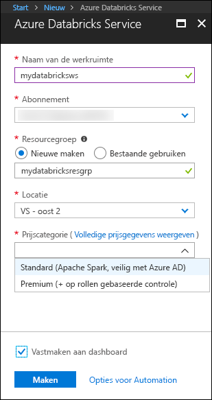
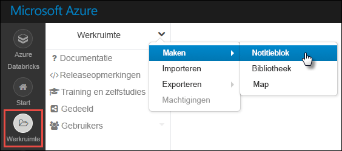
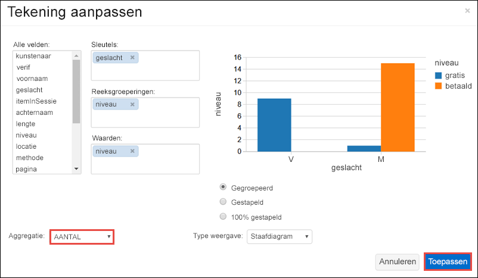

# <a name="quickstart-run-a-spark-job-on-azure-databricks-using-the-azure-portal"></a>Quickstart: Een Spark-taak uitvoeren op Azure Databricks met Azure portal

Deze quickstart laat zien hoe een Azure Databricks-werkruimte wordt gemaakt en hoe binnen die werkruimte een Apache Spark-cluster kan worden gemaakt. Tot slot leert u hoe u een Spark-taak op het Databricks-cluster kunt uitvoeren. Zie [Wat is Azure Databricks?](what-is-azure-databricks.md) voor meer informatie over Azure Databricks.

## <a name="log-in-to-the-azure-portal"></a>Aanmelden bij Azure Portal

Meld u aan bij [Azure Portal](https://portal.azure.com).

## <a name="create-a-databricks-workspace"></a>Een Databricks-werkruimte maken

In deze sectie gaat u een Azure Databricks-werkruimte maken met behulp van Azure Portal. 

1. Klik in Azure Portal op **+**, klik op **Gegevens en analyses** en klik vervolgens op **Azure Databricks (preview)**. 

    

2. Onder **Azure Databricks (preview)** klikt u op **Maken**.

3. Geef onder **Azure Databricks-service** de volgende waarden op:

    

    * Geef bij **Werkruimtenaam** een naam op voor uw Databricks-werkruimte.
    * Selecteer in de vervolgkeuzelijst bij **Abonnement** het Azure-abonnement dat u hebt.
    * Geef bij **Resourcegroep** op of u een nieuwe resourcegroep wilt maken of een bestaande wilt gebruiken. Een resourcegroep is een container met gerelateerde resources voor een Azure-oplossing. Zie [Overzicht van Azure Resource Manager](../azure-resource-manager/resource-group-overview.md) voor meer informatie.
    * Selecteer bij **Locatie** **VS - oost 2**. Zie [Producten beschikbaar per regio](https://azure.microsoft.com/regions/services/) voor andere beschikbare regio's.

4. Klik op **Create**.

## <a name="create-a-spark-cluster-in-databricks"></a>Een Spark-cluster maken in Databricks

1. In Azure Portal gaat u naar de Databricks-werkruimte die u hebt gemaakt en klikt u vervolgens op **Werkruimte initialiseren**.

2. U wordt omgeleid naar de Azure Databricks-portal. Klik in de portal op **Cluster**.

    

3. Op de pagina **Nieuw cluster** geeft u de waarden op waarmee een nieuw cluster wordt gemaakt.

    

    * Voer een naam in voor het cluster.
    * Zorg ervoor dat u het selectievakje **Beëindigen na ___ minuten van activiteit** is ingeschakeld. Geef een duur (in minuten) op waarna het cluster moet worden beëindigd als het niet wordt gebruikt.
    * Accepteer alle overige standaardwaarden. 
    * Klik op **Cluster maken**. Zodra het cluster wordt uitgevoerd, kunt u notitieblokken koppelen aan het cluster en Spark-taken uitvoeren.

Zie [Een Spark-cluster maken in Azure Databricks](https://docs.azuredatabricks.net/user-guide/clusters/create.html) voor meer informatie over het maken van clusters.

## <a name="run-a-spark-sql-job"></a>Een Spark SQL-taak uitvoeren

Voordat u met deze sectie begint, moet u eerst het volgende doen:

* [Maak een Azure Storage-account](../storage/common/storage-create-storage-account.md#create-a-storage-account). 
* Download een voorbeeld-JSON-bestand [vanuit Github](https://github.com/Azure/usql/blob/master/Examples/Samples/Data/json/radiowebsite/small_radio_json.json). 
* Upload het voorbeeld-JSON-bestand naar het Azure Storage-account dat u hebt gemaakt. U kunt [Microsoft Azure Storage Explorer](../vs-azure-tools-storage-manage-with-storage-explorer.md) gebruiken om bestanden te uploaden.

Voer de volgende stappen uit om een notitieblok in Databricks te maken. Configureer het notitieblok om de gegevens te lezen uit een Azure Blob-opslagaccount en voer vervolgens een Spark SQL-taak uit op de gegevens.

1. Klik in het linkerdeelvenster op **Werkruimte**. Klik in de vervolgkeuzelijst **Werkruimte** op **Maken** en klik vervolgens op **Notitieblok**.

    

2. Voer in het dialoogvenster **Notitieblok maken** een naam in, selecteer **Scala** als taal en selecteer het Spark-cluster dat u eerder hebt gemaakt.

    

    Klik op **Create**.

3. Vervang in het volgende codefragment `{YOUR STORAGE ACCOUNT NAME}` door de naam van het Azure Storage-account dat u hebt gemaakt en `{YOUR STORAGE ACCOUNT ACCESS KEY}` door de toegangssleutel voor uw opslagaccount. Plak het volgende codefragment in een lege cel en druk op Shift+Enter om de codecel uit te voeren. Dit codefragment configureert het notitieblok zodat hiermee gegevens uit een Azure Blob Storage kunnen worden gelezen.

       spark.conf.set("fs.azure.account.key.{YOUR STORAGE ACCOUNT NAME}.blob.core.windows.net", "{YOUR STORAGE ACCOUNT ACCESS KEY}")
    
    Zie [Toegangssleutels beheren voor uw opslagaccount](../storage/common/storage-create-storage-account.md#manage-your-storage-account) voor instructies over het ophalen van de toegangssleutel voor uw opslagaccount.

    > [!NOTE]
    > U kunt ook Azure Data Lake Store met een Spark-cluster in Azure Databricks gebruiken. Zie [Data Lake Store met Azure Databricks gebruiken](https://go.microsoft.com/fwlink/?linkid=864084) voor instructies.

4. Voer een SQL-instructie uit om een tijdelijke tabel te maken met gegevens uit het JSON-voorbeeldgegevensbestand, **small_radio_json.json**. Vervang in het volgende codefragment de tijdelijke aanduidingen voor waarden door de containernaam en de naam van het opslagaccount. Plak het codefragment in een lege codecel in het notitieblok en druk op Shift+Enter. In het codefragment duidt `path` de locatie aan van het voorbeeld-JSON-bestand dat u hebt geüpload naar uw Azure Storage-account.

    ```sql
    %sql 
    CREATE TEMPORARY TABLE radio_sample_data
    USING json
    OPTIONS (
     path "wasbs://{YOUR CONTAINER NAME}@{YOUR STORAGE ACCOUNT NAME}.blob.core.windows.net/small_radio_json.json"
    )
    ```

    Zodra de opdracht is voltooid, hebt u alle gegevens van het JSON-bestand als een tabel in het Databricks-cluster.

    De magic-opdracht in de taal `%sql` stelt u in staat u SQL-code uit te voeren vanuit het notitieblok, zelfs als het notitieblok van een ander type is. Zie [Talen combineren in een notitieblok](https://docs.azuredatabricks.net/user-guide/notebooks/index.html#mixing-languages-in-a-notebook) voor meer informatie.

5. Laten we eens een momentopname bekijken van de voorbeeld-JSON-gegevens om een beter begrip te krijgen van de query die wordt uitgevoerd. Plak het volgende codefragment in de codecel en druk op **Shift+Enter**.

    ```sql
    %sql 
    SELECT * from radio_sample_data
    ```

6. U ziet uitvoer in tabelvorm zoals weergegeven in de volgende schermafbeelding (alleen bepaalde kolommen worden weergegeven):

    

    Naast andere gegevens, worden in de voorbeeldgegevens ook het geslacht van de doelgroep van een radiokanaal vastgelegd (kolomnaam **geslacht**) en of het een gratis of een betaald abonnement is (kolomnaam **niveau**).

7. U gaat nu een visuele weergave van deze gegevens maken om voor elk geslacht te zien kunnen hoeveel gebruikers een gratis account hebben en hoeveel een betaald. Klik onder in de tabel met uitvoer op het pictogram voor het **staafdiagram** en klik vervolgens op **Tekenopties**.

    

8. In **Tekening aanpassen** sleept en zet u de waarden neer zoals in de schermafbeelding wordt weergegeven.

    

    * Stel **Sleutels** in op **geslacht**.
    * Stel **Reeksgroeperingen** in op **niveau**.
    * Stel **Waarden** in op **niveau**.
    * Stel **Aggregatie** in op **AANTAL**.

    Klik op **Toepassen**.

9. De uitvoer toont de visuele weergave zoals de volgende schermafbeelding laat zien:

     

## <a name="clean-up-resources"></a>Resources opschonen

Als u tijdens het maken van het Spark-cluster het selectievakje **Beëindigen na ___ minuten van activiteit** hebt ingeschakeld, wordt het cluster automatisch beëindigd als dit gedurende de opgegeven tijd niet actief is geweest.

Als u het selectievakje niet hebt ingeschakeld, moet u het cluster handmatig beëindigen. Dit doet u door vanuit de Azure Databricks-werkruimte in het linkerdeelvenster op **Clusters** te klikken. Voor het cluster dat u wilt beëindigen, plaatst u de cursor op het weglatingsteken onder de kolom **Acties** en klikt u op het **beëindigingspictogram**.


## <a name="next-steps"></a>Volgende stappen

In dit artikel hebt u een Spark-cluster in Azure Databricks gemaakt en een Spark-taak met gegevens in Azure Storage uitgevoerd. U kunt ook zoeken op [Spark gegevensbronnen](https://docs.azuredatabricks.net/spark/latest/data-sources/index.html) voor meer informatie over het importeren van gegevens uit andere gegevensbronnen in Azure Databricks. Ga naar het volgende artikel voor meer informatie over hoe u Azure Data Lake Store met Azure Databricks kunt gebruiken.

> [!div class="nextstepaction"]
>[Data Lake Store met Azure Databricks gebruiken](https://go.microsoft.com/fwlink/?linkid=864084)
