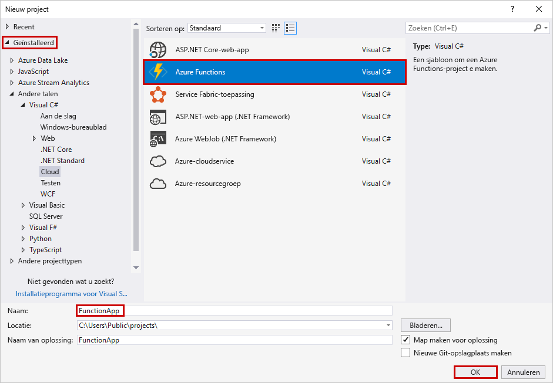
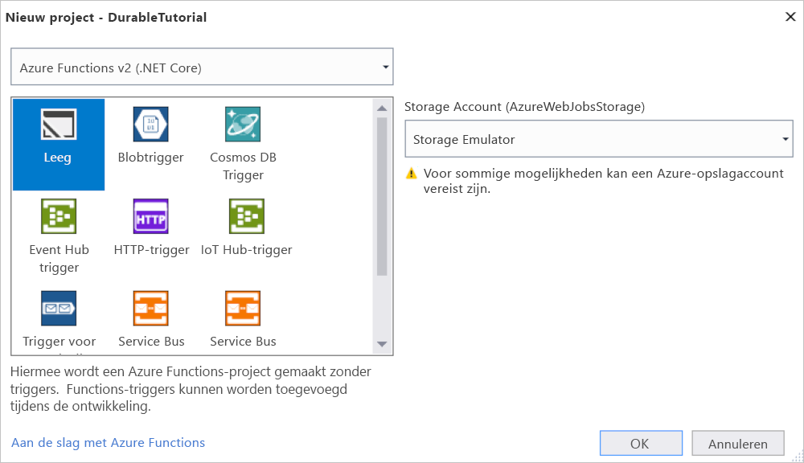
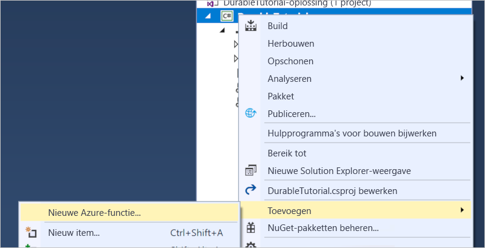
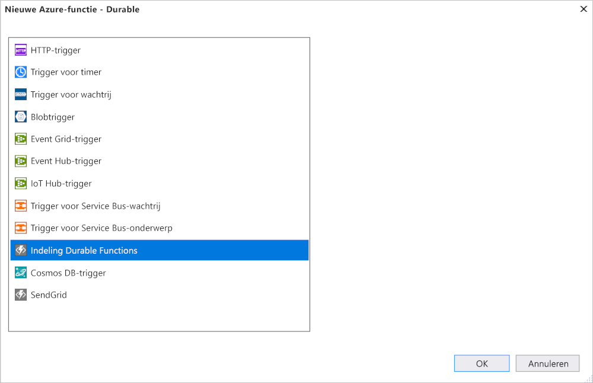

# <a name="create-your-first-durable-function-in-c"></a>Uw eerste Durable Function maken in C\#

*Durable Functions* is een extensie van [Azure Functions](../functions-overview.md) waarmee u stateful functies kunt schrijven in een serverloze omgeving. De extensie beheert status, controlepunten en het opnieuw opstarten voor u.

In dit artikel leert u hoe u met de Visual Studio 2017-hulpprogramma’s voor Azure Functions lokaal een ‘Hallo wereld’-functie kunt maken en testen.  Deze functie deelt aanroepen naar andere functies in en koppelt ze aan elkaar. Vervolgens publiceert u de functiecode op Azure. Deze hulpprogramma's zijn beschikbaar als onderdeel van de Azure-ontwikkelworkload in Visual Studio 2017.


## <a name="prerequisites"></a>Vereisten

Vereisten voor het voltooien van deze zelfstudie:

* Installeer [Visual Studio 2017](https://azure.microsoft.com/downloads/) en zorg ervoor dat de werkbelasting **Azure development** ook wordt geïnstalleerd.

* Zorg ervoor dat u beschikt over de [nieuwste versie van de hulpprogramma's van Azure Functions](../functions-develop-vs.md#check-your-tools-version).

* Controleer of de [Azure Storage Emulator](../../storage/common/storage-use-emulator.md) is geïnstalleerd en wordt uitgevoerd.

[!INCLUDE [quickstarts-free-trial-note](../../../includes/quickstarts-free-trial-note.md)]

## <a name="create-a-function-app-project"></a>Een functie-appproject maken

De Azure Functions-projectsjabloon in Visual Studio maakt een project dat kan worden gepubliceerd in een functie-app in Azure. Met een functie-app kunt u functies groeperen in een logische eenheid, zodat u resources kunt beheren, implementeren en delen.

1. Selecteer **Nieuw** > **Project** in het menu **Bestand** in Visual Studio.

2. Selecteer **Geïnstalleerd** in het dialoogvenster **Nieuw project**, breid **Visual C#** > **Cloud** uit, selecteer **Azure Functions**, typ een **Naam** voor uw project en klik op **OK**. De functie-appnaam moet geldig zijn als een C#-naamruimte. Gebruik dus geen onderstrepingstekens, afbreekstreepjes of andere niet-alfanumerieke tekens.

    

3. Gebruik de instellingen die zijn weergegeven in de tabel onder de afbeelding.

    

    | Instelling      | Voorgestelde waarde  | Beschrijving                      |
    | ------------ |  ------- |----------------------------------------- |
    | **Versie** | Azure Functions 2.x <br />(.NET Core) | Hiermee wordt een functieproject gemaakt dat gebruikmaakt van versie 2.x van de runtime van Azure Functions, die ondersteuning biedt voor .NET Core. Azure Functions 1.x ondersteunt .NET Framework. Zie [Een versie kiezen voor de runtime van Azure Functions](../functions-versions.md) voor meer informatie.   |
    | **Sjabloon** | Leeg | Hiermee wordt een lege functie-app gemaakt. |
    | **Opslagaccount**  | Opslagemulator | Een opslagaccount is vereist voor het statusbeheer van Durable Functions. |

4. Klik op **OK** om een leeg Function-project te maken.

## <a name="add-functions-to-the-app"></a>Functies toevoegen aan de app

Visual Studio maakt een leeg Function-app-project.  Het bevat wel de elementaire configuratiebestanden die nodig zijn voor een app, maar nog geen functies.  Er moet een Durable Function-sjabloon aan het project worden toegevoegd.

1. Klik met de rechtermuisknop op het project in Visual Studio en selecteer **Toevoegen** > **Nieuwe Azure-functie**.

    

2. Controleer of **Azure Function** is geselecteerd in het menu Toevoegen en geef het C#-bestand een naam.  Klik op **Toevoegen**.

3. Selecteer de sjabloon **Durable Functions Orchestration** en klik op **OK**

      

Een nieuwe Durable Function wordt toegevoegd aan de app.  Open het nieuwe bestand om de inhoud weer te geven.  Deze Durable Function is een eenvoudig voorbeeld van het koppelen van functies.  

* De `RunOrchestrator`-methode is gekoppeld aan de Orchestrator-functie.  Deze functie wordt gestart, maakt een lijst en voegt het resultaat van drie functieaanroepen toe aan de lijst.  Wanneer de drie functieaanroepen zijn voltooid, wordt de lijst geretourneerd.  De functie die wordt aangeroepen, is de `SayHello`-methode (standaard wordt deze aangeroepen als '<NameOfFile>_Hello').
* De `SayHello`-functie geeft als resultaat een Hello.
* De `HttpStart`-methode beschrijft de functie waarmee exemplaren van de orchestrator worden gestart.  Deze is gekoppeld aan een [HTTP-trigger](../functions-bindings-http-webhook.md) die een nieuw exemplaar van de orchestrator start en de statuscontrole retourneert.

Nu u uw functieproject en een Durable Function hebt gemaakt, kunt u deze testen op uw lokale computer.

## <a name="test-the-function-locally"></a>De functie lokaal testen

Met Azure Functions Core-hulpprogramma's kunt u een Azure Functions-project uitvoeren op uw lokale ontwikkelcomputer. De eerste keer dat u een functie vanuit Visual Studio start, wordt u gevraagd deze hulpprogramma's te installeren.

1. Druk op F5 om de functie testen. Accepteer desgevraagd de aanvraag van Visual Studio om Azure Functions Core (CLI)-hulpprogramma's te downloaden en installeren. Mogelijk moet u ook een firewall-uitzondering inschakelen, zodat de hulpprogramma's HTTP-aanvragen kunnen afhandelen.

2. Kopieer de URL van uw functie vanuit de uitvoer van de Azure Functions-runtime.

    

3. Plak de URL van de HTTP-aanvraag in de adresbalk van uw browser en voer de aanvraag uit. Hieronder ziet u de reactie op de lokale GET-aanvraag die door de functie wordt geretourneerd, weergegeven in de browser: 

    

    De reactie is het eerste resultaat van de HTTP-functie waarmee wordt aangegeven dat de orchestrator is gestart.  Dit is nog niet het eindresultaat van de orchestrator.  De reactie bevat enkele nuttige URL's.  Maar eerst gaan we de status van de orchestrator opvragen.

4. Kopieer de URL-waarde voor `statusQueryGetUri`, plak deze in de adresbalk van de browser en voer de aanvraag uit.

    De aanvraag voert een query uit op het orchestrator-exemplaar voor de status. U moet uiteindelijk een reactie krijgen die lijkt op de volgende.  Dit laat zien dat het exemplaar is voltooid en dat het de uitvoer of resultaten van de Durable Function bevat.

    ```json
    {
        "instanceId": "d495cb0ac10d4e13b22729c37e335190",
        "runtimeStatus": "Completed",
        "input": null,
        "customStatus": null,
        "output": [
            "Hello Tokyo!",
            "Hello Seattle!",
            "Hello London!"
        ],
        "createdTime": "2018-11-08T07:07:40Z",
        "lastUpdatedTime": "2018-11-08T07:07:52Z"
    }
    ```

5. Als u wilt stoppen met fouten opsporen, drukt u op **Shift + F5**.

Nadat u hebt gecontroleerd of de functie correct wordt uitgevoerd op uw lokale computer, is het tijd om het project te publiceren naar Azure.

## <a name="publish-the-project-to-azure"></a>Het project naar Azure publiceren

Voordat u uw project kunt publiceren, moet u een functie-app in uw Azure-abonnement hebben. U kunt rechtstreeks vanuit Visual Studio een functie-app maken.

[!INCLUDE [Publish the project to Azure](../../../includes/functions-vstools-publish.md)]

## <a name="test-your-function-in-azure"></a>Uw functie testen in Azure

1. Kopieer de basis-URL van de functie-app van de pagina Profiel publiceren. Vervang het `localhost:port`-deel van de URL dat u hebt gebruikt bij het lokaal testen van de functie door de nieuwe basis-URL.

    De URL die de HTTP-trigger van uw Durable Function aanroept, moet de volgende indeling hebben:

        http://<APP_NAME>.azurewebsites.net/api/<FUNCTION_NAME>_HttpStart

2. Plak deze nieuwe URL van de HTTP-aanvraag in de adresbalk van uw browser. U krijgt dezelfde statusreactie als eerder, toen u de gepubliceerde app gebruikte.

## <a name="next-steps"></a>Volgende stappen

U hebt Visual Studio gebruikt om een Durable Function-app in C# te maken en te publiceren.

> [!div class="nextstepaction"]
> [Meer informatie over algemene patronen van Durable Functions](durable-functions-overview.md)
