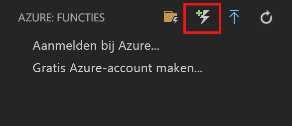
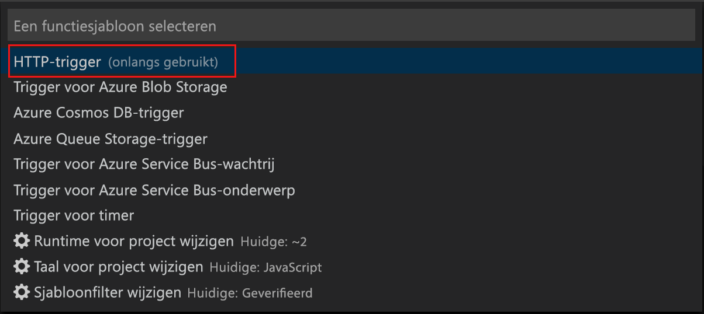
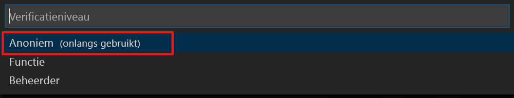

# <a name="create-your-first-durable-function-in-javascript"></a>Uw eerste duurzame functie maken in JavaScript

*Durable Functions* is een extensie van [Azure Functions](../functions-overview.md) waarmee u stateful functies kunt schrijven in een serverloze omgeving. Met de extensie worden status, controlepunten en het opnieuw opstarten voor u beheerd.

In dit artikel leert u hoe u de Azure Functions-extensie van Visual Studio Code kunt gebruiken om lokaal een duurzame ‘Hallo wereld’-functie te maken en te testen.  Met deze functie worden aanroepen naar andere functies ingedeeld en aan elkaar gekoppeld. Vervolgens publiceert u de functiecode op Azure.


## <a name="prerequisites"></a>Vereisten

Vereisten voor het voltooien van deze zelfstudie:

* Installeer [Visual Studio Code](https://code.visualstudio.com/download).

* Zorg ervoor dat u hebt de nieuwste versie van de [Azure Functions Core Tools](../functions-run-local.md).

* Op een Windows-computer controleert u of de [Azure Storage-emulator](../../storage/common/storage-use-emulator.md) is geïnstalleerd en wordt uitgevoerd. Op een Mac- of Linux-computer moet u daadwerkelijk een Azure-opslagaccount gebruiken.

* Zorg ervoor dat versie 8.0 of een latere versie van [Node.js](https://nodejs.org/) is geïnstalleerd.

[!INCLUDE [quickstarts-free-trial-note](../../../includes/quickstarts-free-trial-note.md)]

[!INCLUDE [functions-install-vs-code-extension](../../../includes/functions-install-vs-code-extension.md)]

[!INCLUDE [functions-create-function-app-vs-code](../../../includes/functions-create-function-app-vs-code.md)]

## <a name="install-the-durable-functions-npm-package"></a>Het NPM-pakket voor Durable Functions installeren

1. Installeer het `durable-functions` NPM-pakket met duurzame functies door `npm install durable-functions` uit te voeren in de hoofdmap van de functie-app.

## <a name="creating-your-functions"></a>Het maken van uw functies

We gaan nu de drie functies die u wilt aan de slag met duurzame functies maken: een HTTP-starter, een orchestrator en de functie van een activiteit. De gehele oplossing wordt geïnitieerd door de HTTP-starter en de orchestrator werken aan verschillende activiteitsfuncties wordt verzonden.

### <a name="http-starter"></a>HTTP-starter

Maak eerst een HTTP-geactiveerde functie waarmee de indeling voor een duurzame functie wordt gestart.

1. In *Azure: Functies*, kiest u de **Create Function** pictogram.

    

2. Selecteer de map met uw functie-app-project en selecteer de **duurzame functies HTTP-Starter** functiesjabloon.

    

3. Laat de standaardnaam als `DurableFunctionsHttpStart` en druk op *** Enter **, selecteer vervolgens **anoniem** verificatie.

    

U hebt nu een ingangspunt gemaakt in de duurzame functie. Nu gaan we een orchestrator toevoegen.

### <a name="orchestrator"></a>Orchestrator

Nu maken we een orchestrator voor het coördineren van activiteitsfuncties.

1. In *Azure: Functies*, kiest u de **Create Function** pictogram.

    

2. Selecteer de map met uw functie-app-project en selecteer de **duurzame functies orchestrator** functiesjabloon. Laat u de naam als de standaard "DurableFunctionsOrchestrator"

    

Er is een orchestrator toegevoegd om de activiteitsfuncties te coördineren. Nu gaan we de activiteitsfunctie toevoegen waarnaar wordt verwezen.

### <a name="activity"></a>Activiteit

Nu maken we een functie van de activiteit daadwerkelijk uit te voeren het werk van de oplossing.

1. In *Azure: Functies*, kiest u de **Create Function** pictogram.

    

2. Selecteer de map met uw functie-app-project en selecteer de **activiteit duurzame functies** functiesjabloon. Laat u de naam als de standaard "Hallo".

    

Nu zijn alle benodigde onderdelen toegevoegd voor het starten van een indeling en om activiteitsfuncties te koppelen.

## <a name="test-the-function-locally"></a>De functie lokaal testen

Met Azure Functions Core-hulpprogramma's kunt u een Azure Functions-project uitvoeren op uw lokale ontwikkelcomputer. De eerste keer dat u een functie vanuit Visual Studio Code start, wordt u gevraagd deze hulpprogramma's te installeren.

1. Op een Windows-computer, start u de Azure-Opslagemulator en zorg ervoor dat de **AzureWebJobsStorage** eigenschap van *local.settings.json* is ingesteld op `UseDevelopmentStorage=true`.

    Voor Storage Emulator 5.8 Zorg ervoor dat de **AzureWebJobsSecretStorageType** eigenschap van local.settings.json is ingesteld op `files`. Op een Mac of Linux-computer, moet u instellen de **AzureWebJobsStorage** eigenschap op de verbindingstekenreeks van een bestaand Azure storage-account. Later in dit artikel maakt u een opslagaccount.

2. U kunt de functie testen door een onderbrekingspunt in de functiecode in te stellen en op F5 te drukken om het functie-appproject te starten. De uitvoer van Core Tools wordt weergegeven in het deelvenster **Terminal**. Als dit de eerste keer is dat u Durable Functions gebruikt, wordt de Durable Functions-extensie geïnstalleerd. Het bouwen kan enkele seconden duren.

    > [!NOTE]
    > Voor JavaScript Durable Functions is versie **1.7.0** of hoger van de extensie **Microsoft.Azure.WebJobs.Extensions.DurableTask** vereist. Voer de volgende opdracht vanuit de hoofdmap van uw app in Azure Functions voor het installeren van de extensie duurzame functies `func extensions install -p Microsoft.Azure.WebJobs.Extensions.DurableTask -v 1.7.0`

3. Kopieer het URL-eindpunt van de door HTTP getriggerde functie in het deelvenster **Terminal**.

    

4. Vervang `{functionName}` door `DurableFunctionsOrchestrator`.

5. Met behulp van een hulpprogramma zoals [Postman](https://www.getpostman.com/) of [cURL](https://curl.haxx.se/), een HTTP POST-aanvraag verzenden naar de URL-eindpunt.

   De reactie is het eerste resultaat van de HTTP-functie waarmee wordt aangegeven dat de orchestrator is gestart. Dit is nog niet het eindresultaat van de orchestrator. De reactie bevat enkele nuttige URL's. Maar eerst gaan we de status van de orchestrator opvragen.

6. Kopieer de URL-waarde voor `statusQueryGetUri` en plak deze in de adresbalk van de browser en voer de aanvraag uit. U kunt ook kunt u ook blijven gebruiken Postman om uit te geven van de GET-aanvraag.

   De aanvraag voert een query uit op het orchestrator-exemplaar voor de status. U moet een uiteindelijke-antwoord dat zien laat door de instantie is voltooid en de uitvoer of resultaten van de duurzame functie bevat. Het lijkt: 

    ```json
    {
        "instanceId": "d495cb0ac10d4e13b22729c37e335190",
        "runtimeStatus": "Completed",
        "input": null,
        "customStatus": null,
        "output": [
            "Hello Tokyo!",
            "Hello Seattle!",
            "Hello London!"
        ],
        "createdTime": "2018-11-08T07:07:40Z",
        "lastUpdatedTime": "2018-11-08T07:07:52Z"
    }
    ```

7. Als u wilt stoppen met fouten opsporen, drukt u op **Shift + F5** in VS Code.

Nadat u hebt gecontroleerd of de functie correct wordt uitgevoerd op uw lokale computer, is het tijd om het project te publiceren in Azure.

[!INCLUDE [functions-create-function-app-vs-code](../../../includes/functions-sign-in-vs-code.md)]

[!INCLUDE [functions-publish-project-vscode](../../../includes/functions-publish-project-vscode.md)]

## <a name="test-your-function-in-azure"></a>Uw functie testen in Azure

1. Kopieer de URL van de HTTP-trigger vanuit het deelvenster **Output** (Uitvoer). De URL die uw HTTP-geactiveerde functie aanroept, moet de volgende indeling hebben:

        http://<functionappname>.azurewebsites.net/orchestrators/<functionname>

2. Plak deze nieuwe URL van de HTTP-aanvraag in de adresbalk van uw browser. U krijgt dezelfde statusreactie als eerder, toen u de gepubliceerde app gebruikte.

## <a name="next-steps"></a>Volgende stappen

U hebt Visual Studio Code gebruikt om een duurzame JavaScript-functie-app te maken en te publiceren.

> [!div class="nextstepaction"]
> [Meer informatie over algemene patronen van duurzame functies](durable-functions-concepts.md)
