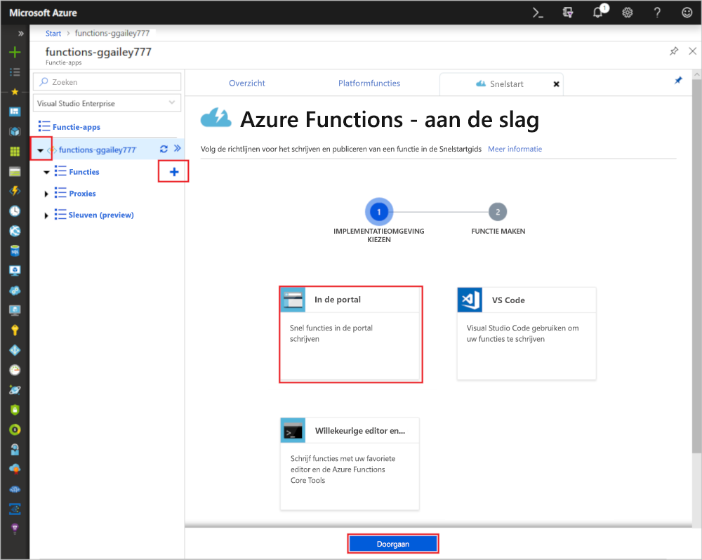

# Uw eerste functie maken in Azure Portal

Met Azure Functions kunt u uw code in een [serverloze](https://azure.microsoft.com/solutions/serverless/) omgeving uitvoeren zonder dat u eerst een virtuele machine moet maken of een webtoepassing publiceren. In dit onderwerp leert u hoe met Azure Functions een 'Hallo wereld-functie' in Azure Portal kunt maken.

[!INCLUDE [quickstarts-free-trial-note](../../includes/quickstarts-free-trial-note.md)]

> [!NOTE]
> C#-ontwikkelaars dienen te overwegen [de eerste functie in Visual Studio 2017 te maken](functions-create-your-first-function-visual-studio.md) in plaats van in de portal. 

## Meld u aan bij Azure.

Meld u met uw Azure-account aan bij Azure Portal op <https://portal.azure.com>.

## Een functie-app maken

U moet een functie-app hebben die als host fungeert voor de uitvoering van uw functies. Met een functie-app kunt u functies groeperen in een logische eenheid, zodat u resources eenvoudiger kunt beheren, implementeren en delen. 

[!INCLUDE [Create function app Azure portal](../../includes/functions-create-function-app-portal.md)]

Vervolgens maakt u een functie in de nieuwe functie-app.

## Een door HTTP geactiveerde functie maken

1. Vouw uw nieuwe functie-app uit en selecteer vervolgens de **+**-knop naast **Functies**, kies **In de portal** en selecteer **Doorgaan**.

    

1. Kies **WebHook + API** en selecteer vervolgens **Maken**.

    

Een functie wordt gemaakt met een taalspecifieke sjabloon voor een door HTTP getriggerde functie.

U kunt de nieuwe functie nu uitvoeren door een HTTP-aanvraag te verzenden.

## De functie testen

1. Klik in de nieuwe functie rechtsboven op **</> Functie-URL ophalen**, selecteer **Standaard (functietoets)** en klik vervolgens op **Kopiëren**. 

    

2. Plak de URL van de functie in de adresbalk van uw browser. Voeg waarde `&name=<yourname>` voor de querytekenreeks toe aan het einde van deze URL, en druk op de toets `Enter` op het toetsenbord om de aanvraag uit te voeren. U ziet het geretourneerde antwoord van de functie nu in de browser.  

    Het volgende voorbeeld toont het antwoord in de browser:

    

    De aanvraag-URL bevat een sleutel die standaard is vereist, en waarmee u via HTTP toegang hebt tot de functie.

3. Wanneer uw functie wordt uitgevoerd, wordt traceringsinformatie naar de logboeken geschreven. Als u de traceringsuitvoer van de vorige uitvoering wilt zien, gaat u terug naar de functie in de portal en klikt u op de pijl onder aan het scherm om de **logboeken** uit te vouwen.

   

## Resources opschonen

[!INCLUDE [Clean-up resources](../../includes/functions-quickstart-cleanup.md)]

## Volgende stappen

U hebt een functie-app met een eenvoudige door HTTP geactiveerde functie gemaakt.  

[!INCLUDE [Next steps note](../../includes/functions-quickstart-next-steps.md)]

Zie [Azure Functions HTTP bindings](functions-bindings-http-webhook.md) (Azure Functions-HTTP-bindingen) voor meer informatie.
