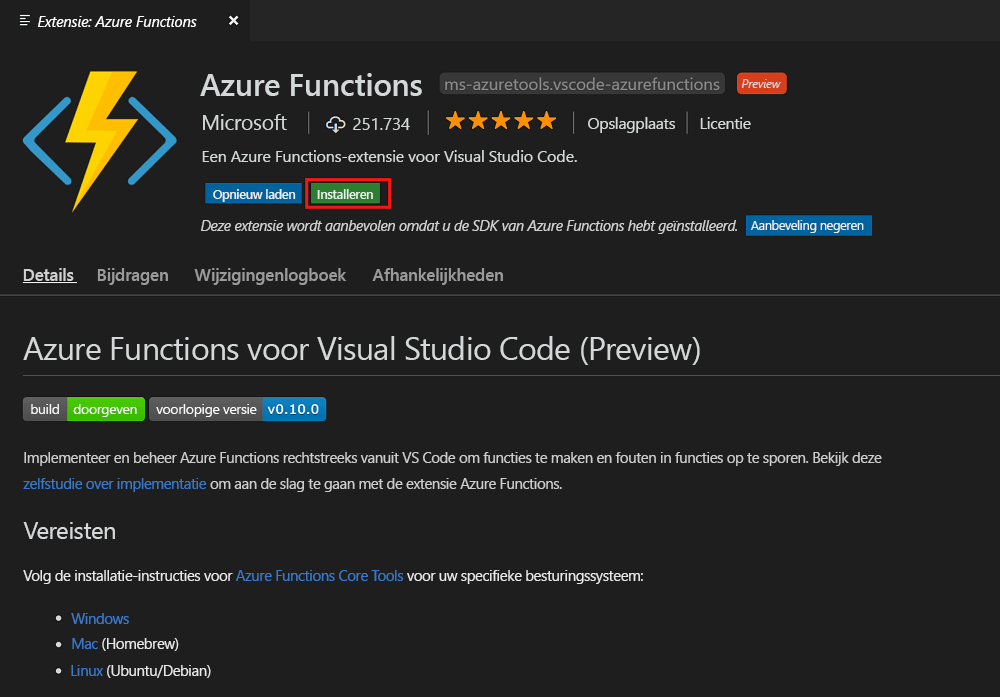
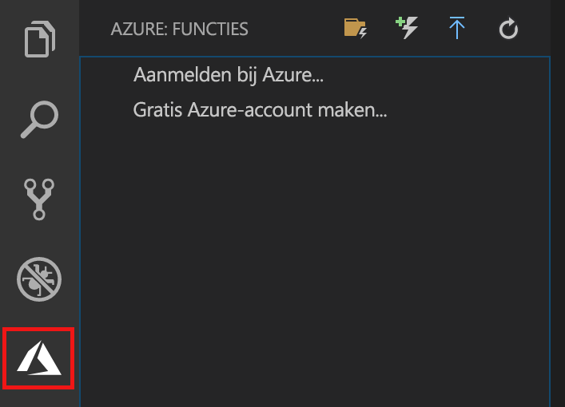
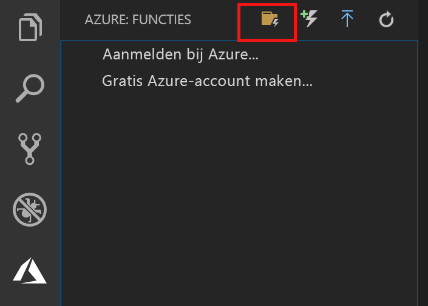
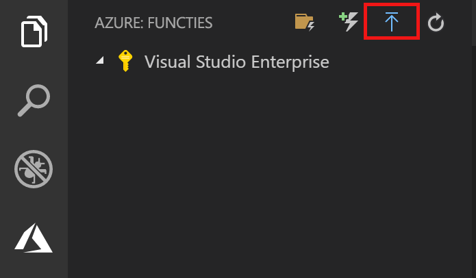
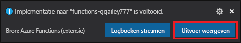
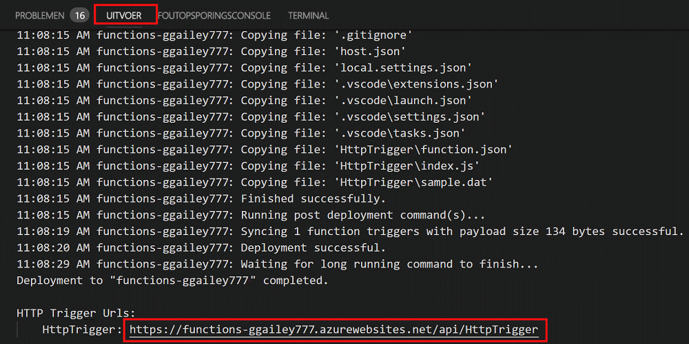

# Uw eerste functie maken met Visual Studio Code

Met Azure Functions kunt u uw code in een [serverloze](https://azure.microsoft.com/solutions/serverless/) omgeving uitvoeren zonder dat u eerst een virtuele machine moet maken of een webtoepassing publiceren.

In dit artikel leert u hoe u de [Azure Functions extension for Visual Studio Code] (Azure Functions-extensie voor Visual Studio Code) gebruikt om met Microsoft Visual Studio Code een 'hello world'-functie op uw lokale computer te maken en te testen. Vervolgens publiceert u de functiecode vanuit Visual Studio Code op Azure.

De extensie ondersteunt momenteel C#-, JavaScript- en Java-functies. De stappen in dit artikel kunnen enigszins afwijken, afhankelijk van de taal die u kiest voor het Azure Functions-project. De extensie is momenteel beschikbaar als preview-product. Zie de uitbreidingspagina [Azure Functions extension for Visual Studio Code] (Azure Functions-extensie voor Visual Studio Code) voor meer informatie.

## Vereisten

Dit zijn de vereisten voor het voltooien van deze snelstart:

* Installeer [Visual Studio Code](https://code.visualstudio.com/) op een van de [ondersteunde platforms](https://code.visualstudio.com/docs/supporting/requirements#_platforms). Dit artikel is ontwikkeld en getest op een apparaat met MacOS (High Sierra).

* Installeer versie 2.x van [Azure Functions Core Tools](functions-run-local.md#v2). Deze bevindt zich nog steeds in preview.

* Installeer de specifieke vereisten voor de taal van uw keuze:

    | Taal | Toestelnummer |
    | -------- | --------- |
    | **C#** | [C# voor Visual Studio Code](https://marketplace.visualstudio.com/items?itemName=ms-vscode.csharp) [.NET Core CLI-hulpprogramma's](https://docs.microsoft.com/dotnet/core/tools/?tabs=netcore2x)*   |
    | **Java** | [Foutopsporingsprogramma voor Java](https://marketplace.visualstudio.com/items?itemName=vscjava.vscode-java-debug) [JDK 1.8](http://www.oracle.com/technetwork/java/javase/downloads/index.html) [Maven 3+](https://maven.apache.org/) |
    | **JavaScript** | [Node 8.0+](https://nodejs.org/)  |

    \* Ook vereist voor Core Tools.

[!INCLUDE [quickstarts-free-trial-note](../../includes/quickstarts-free-trial-note.md)]

## De Azure Function-extensie installeren

De Azure Functions-extensie wordt gebruikt om functies in Azure te maken, testen en implementeren.

1. Open in Visual Studio Code de optie **Extensions** (Extensies) en zoek `azure functions` of [open deze koppeling in Visual Studio Code](vscode:extension/ms-azuretools.vscode-azurefunctions).

1. Selecteer **Install** (Installeren) om de extensie in Visual Studio Code te installeren. 

    

1. Start Visual Studio Code opnieuw en selecteer het Azure-pictogram in de balk Activiteit. Het gebied Azure Functions moet nu in de zijbalk worden weergegeven.

    

## Een Azure Functions-project maken

De Azure Functions-projectsjabloon in Visual Studio Code maakt een project dat kan worden gepubliceerd in een functie-app in Azure. Met een functie-app kunt u functies groeperen in een logische eenheid, zodat u resources kunt beheren, implementeren en delen.

1. Selecteer in Visual Studio Code het Azure-logo om het gebied **Azure: Functions** weer te geven. Selecteer vervolgens het pictogram Create New Project (Nieuw project maken).

    

1. Kies een locatie voor de werkruimte van uw project en kies **Select** (Selecteren).

    > [!NOTE]
    > Dit artikel is bedoeld om buiten een werkruimte te worden voltooid. Selecteer in dit geval geen projectmap die deel uitmaakt van een werkruimte.

1. Selecteer de taal voor uw functie-appproject. In dit artikel wordt JavaScript gebruikt.
    

1. Kies **Add to workspace** (Aan werkruimte toevoegen) als daarom wordt gevraagd.

Het functie-appproject wordt in een nieuwe werkruimte gemaakt. Het project bevat de configuratiebestanden [host.json](functions-host-json.md) en [local.settings.json](functions-run-local.md#local-settings-file), plus eventuele taalspecifieke projectbestanden. In de projectmap ziet u ook een nieuwe Git-opslagplaats.

## Een door HTTP geactiveerde functie maken

1. Kies vanuit **Azure: Functions** het pictogram Create Function (Functie maken).

    

1. Selecteer de map met uw functie-appproject en selecteer de functiesjabloon **HTTP trigger**.

    

1. Typ `HTTPTrigger` voor de functienaam en druk op Enter. Selecteer vervolgens **Anonymous** (Anoniem) bij verificatie.

    

    Een functie wordt gemaakt in de door u gekozen taal met de sjabloon voor een door HTTP getriggerde functie.

    

U kunt invoer- en uitvoerbindingen aan de functie toevoegen door het bestand function.json te wijzigen. Zie [Concepten van Azure Functions-triggers en -bindingen](functions-triggers-bindings.md) voor meer informatie.

Nu u uw functieproject en een HTTP-geactiveerde functie hebt gemaakt, kunt u deze testen op uw lokale computer.

## De functie lokaal testen

Met Azure Functions Core-hulpprogramma's kunt u een Azure Functions-project uitvoeren op uw lokale ontwikkelcomputer. De eerste keer dat u een functie vanuit Visual Studio Code start, wordt u gevraagd deze hulpprogramma's te installeren.  

1. U kunt de functie testen door een onderbrekingspunt in de functiecode in te stellen en op F5 te drukken om het functie-appproject te starten. De uitvoer van Core Tools wordt weergegeven in het deelvenster **Terminal**.

1. Kopieer het URL-eindpunt van de door HTTP getriggerde functie in het deelvenster **Terminal**.

    

1. Plak de URL van de HTTP-aanvraag in de adresbalk van uw browser. Voeg de queryreeks `?name=<yourname>` toe aan de URL en voer de aanvraag uit. De uitvoering wordt onderbroken als het onderbrekingspunt wordt bereikt.

    

1. Hieronder ziet u het antwoord op de GET-aanvraag weergegeven in de browser als u met de uitvoering doorgaat:

    

1. Als u wilt stoppen met fouten opsporen, drukt u op Shift+F1.

Nadat u hebt gecontroleerd of de functie correct wordt uitgevoerd op uw lokale computer, is het tijd om het project te publiceren in Azure.

## Aanmelden bij Azure

Voordat u de app kunt publiceren, moet u zich aanmelden bij Azure.

1. Ga naar het gebied **Azure: Functions** en kies **Sign in to Azure...** (Aanmelden bij Azure...). Hier kunt u **een gratis Azure-account** aanmaken als u dat nog niet hebt.

    

1. Selecteer **Copy & Open** (Kopiëren en openen) of kopieer de weergegeven code en open <https://aka.ms/devicelogin> in de browser.

1. Plak de gekopieerde code op de pagina **Device Login** (Apparaataanmelding), controleer de aanmelding voor Visual Studio Code en selecteer **Continue** (Doorgaan).  

1. Voltooi het aanmelden met de referenties voor uw Azure-account. Nadat u bent aangemeld, kunt u de browser sluiten.

## Het project naar Azure publiceren

In Visual Studio Code kunt u uw functieproject rechtstreeks in Azure publiceren. In dit proces maakt u een functie-app en de bijbehorende resources in uw Azure-abonnement. De functie-app biedt een context waar u uw functies kunt uitvoeren. Het project wordt in uw Azure-abonnement verpakt en geïmplementeerd in de nieuwe functie-app. 

In dit artikel wordt ervan uitgegaan dat u een nieuwe functie-app maakt. Als u in een bestaande functie-app publiceert, wordt de inhoud van die app in Azure overschreven.

1. Ga naar het gebied **Azure: Functions** en selecteer het pictogram Deploy to Function App (Implementeren naar functie-app).

    

1. Kies de projectmap. Dit is uw huidige werkruimte.

1. Als u meerdere abonnementen hebt, kies dan het abonnement dat u voor het hosten van uw functie-app wilt gebruiken, kies vervolgens **+ Create New Function App** (+ Nieuwe functie-app maken).

1. Typ een unieke naam waarmee de functie-app wordt geïdentificeerd en druk op Enter. Geldige tekens voor de naam van en functie-app zijn `a-z`, `0-9` en `-`.

1. Kies **+ Create New Resource Group** (+ Nieuwe resourcegroep maken), typ de naam van een resourcegroep, bijvoorbeeld `myResourceGroup`, en druk op Enter. U kunt ook een bestaande resourcegroep gebruiken.

1. Kies **+Create New Storage Account** (+ Nieuw opslagaccount maken), typ een unieke naam voor het nieuwe opslagaccount dat door de functie-app wordt gebruikt en druk op Enter. Namen van opslagaccounts moeten tussen 3 en 24 tekens lang zijn en mogen alleen cijfers en kleine letters bevatten. U kunt ook een bestaand account gebruiken.

1. Kies een locatie in een [regio](https://azure.microsoft.com/regions/) bij u in de buurt of in de buurt van andere services die door uw functies worden gebruikt.

    De functie-app wordt gemaakt nadat u de locatie hebt gekozen. Nadat de functie-app is gemaakt en het implementatiepakket is toegepast, wordt er een melding weergegeven.

1. Selecteer in de meldingen de optie **View Output** (Uitvoer weergeven) om de resultaten van het maken en implementeren te bekijken, inclusief de Azure-resources die u hebt gemaakt.

    

1. Noteer de URL van de nieuwe functie-app in Azure. U gebruikt deze om de functie te testen nadat het project in Azure is gepubliceerd.

    

1. Weer terug in het gebied **Azure: Functions** ziet u de nieuwe functie weergegeven onder uw abonnement. Als u dit knooppunt uitvouwt, ziet u de functies in de functie-app, evenals de instellingen voor de toepassing en de functieproxy's.

    

    Vanuit het knooppunt van de functie-app typt u Ctrl en klikt u met de rechtermuisknop zodat u verschillende beheer- en configuratietaken kunt uitvoeren voor de functie-app in Azure. U kunt de functie-app ook bekijken in de Azure-portal.

## Uw functie testen in Azure

1. Kopieer de URL van de HTTP-trigger vanuit het deelvenster **Output** (Uitvoer). Zorg ervoor dat u net als eerder de queryreeks `?name=<yourname>` toevoegt aan het eind van deze URL en de aanvraag uitvoert.

    De URL die uw HTTP-geactiveerde functie aanroept, moet de volgende indeling hebben:

        http://<functionappname>.azurewebsites.net/api/<functionname>?name=<yourname> 

1. Plak deze nieuwe URL van de HTTP-aanvraag in de adresbalk van uw browser. Hieronder ziet u het antwoord op de externe GET-aanvraag dat door de functie wordt geretourneerd, weergegeven in de browser: 

    

## Volgende stappen

U hebt een functie-app met een eenvoudige HTTP-geactiveerde functie gemaakt in Visual Studio Code. Zie de naslaggids over talen voor [JavaScript](functions-reference-node.md), [.NET](functions-dotnet-class-library.md) of [Java](functions-reference-java.md) voor meer informatie over het ontwikkelen van functies in een bepaalde taal.

U kunt ook meer informatie krijgen over lokaal testen en fouten opsporen vanaf de terminal of opdrachtprompt met Azure Functions Core Tools.

> [!div class="nextstepaction"]
> [Lokaal coderen en testen](functions-run-local.md)

[Azure Functions Core Tools]: functions-run-local.md
[Azure Functions extension for Visual Studio Code]: https://marketplace.visualstudio.com/items?itemName=ms-azuretools.vscode-azurefunctions (Azure Functions-extensie voor Visual Studio Code)
