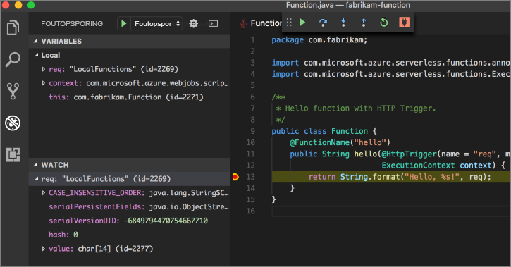

# <a name="create-your-first-function-with-java-and-maven-preview"></a>Maken van uw eerste functie met Java en Maven (Preview)

Deze snelstartgids helpt bij het maken een [zonder server](https://azure.microsoft.com/overview/serverless-computing/) functie project met Maven, lokaal te testen en deze implementeert in Azure Functions. Wanneer u bent klaar, hebt u een HTTP-geactiveerde functie-app in Azure wordt uitgevoerd.

 

[!INCLUDE [quickstarts-free-trial-note](../../includes/quickstarts-free-trial-note.md)]

## <a name="prerequisites"></a>Vereisten
Om te zetten met behulp van Java-functies app, hebt u het volgende zijn geïnstalleerd:

-  [.NET core](https://www.microsoft.com/net/core), meest recente versie.
-  [Java Developer Kit](https://www.azul.com/downloads/zulu/), versie 1.8.
-  [Azure CLI](https://docs.microsoft.com/cli/azure)
-  [Apache Maven](https://maven.apache.org), versie 3.0 of hoger.
-  [Node.js](https://nodejs.org/download/), 8,6 of hoger.

> [!IMPORTANT] 
> De omgevingsvariabele JAVA_HOME moet worden ingesteld naar de installatielocatie van de JDK die op het voltooien van deze snelstartgids.

## <a name="install-the-azure-functions-core-tools"></a>De Azure Functions Core hulpprogramma's installeren

De [Azure Functions Core extra 2.0](https://www.npmjs.com/package/azure-functions-core-tools) voorzien in een lokale ontwikkelingsomgeving schrijven, uitvoeren en Azure-functies voor foutopsporing. Installeer de's met [npm](https://www.npmjs.com/), opgenomen in [Node.js](https://nodejs.org/).

```
npm install -g azure-functions-core-tools@core
```

> [!NOTE]
> Als u problemen ondervindt bij het installeren van hulpprogramma's voor Azure Functions Core versie 2.0, Zie [versie 2.x runtime](/azure/azure-functions/functions-run-local#version-2x-runtime).

## <a name="generate-a-new-functions-project"></a>Genereren van een nieuw project van functies

Voer de volgende opdracht voor het genereren van het project functies uit in een lege map een [Maven archetype](https://maven.apache.org/guides/introduction/introduction-to-archetypes.html).

### <a name="linuxmacos"></a>Linux/Mac OS

```bash
mvn archetype:generate \
    -DarchetypeGroupId=com.microsoft.azure \
    -DarchetypeArtifactId=azure-functions-archetype 
```

### <a name="windows-cmd"></a>Windows (CMD)
```cmd
mvn archetype:generate ^
    -DarchetypeGroupId=com.microsoft.azure ^
    -DarchetypeArtifactId=azure-functions-archetype
```

Maven vraagt u om de waarden die nodig zijn voor het maken van het project te voltooien. Voor _groupId_, _artefact-id_, en _versie_ waarden, Zie de [Maven naamconventies](https://maven.apache.org/guides/mini/guide-naming-conventions.html) verwijzing. De _appName_ waarde moet uniek zijn voor Azure, zodat Maven een appnaam op basis van de eerder opgegeven genereert _artefact-id_ standaard. De _packageName_ waarde bepaalt de Java-pakket voor de gegenereerde functiecode.

```Output
Define value for property 'groupId': com.fabrikam.functions
Define value for property 'artifactId' : fabrikam-functions
Define value for property 'version' 1.0-SNAPSHOT : 
Define value for property 'package': com.fabrikam.functions
Define value for property 'appName' fabrikam-functions-20170927220323382:
Confirm properties configuration: Y
```

Maven maakt de project-bestanden in een nieuwe map met de naam _artefact-id_. De gegenereerde code in het project is een eenvoudige [HTTP geactiveerd](/azure/azure-functions/functions-bindings-http-webhook) functie die de hoofdtekst van de aanvraag een echo:

```java
public class Function {
    @FunctionName("hello")
    public String hello(@HttpTrigger(name = "req", methods = {"get", "post"}, authLevel = AuthorizationLevel.ANONYMOUS) String req,
                        ExecutionContext context) {
        return String.format("Hello, %s!", req);
    }
}
```

## <a name="run-the-function-locally"></a>De functie lokaal uitvoeren

Wijzig map in de zojuist gemaakte projectmap en bouwen en uitvoeren van de functie met Maven:

```
cd fabrikam-function
mvn clean package 
mvn azure-functions:run
```

U ziet deze uitvoer wanneer de functie wordt uitgevoerd:

```Output
Listening on http://localhost:7071
Hit CTRL-C to exit...

Http Functions:

   hello: http://localhost:7071/api/hello
```

De functie vanaf de opdrachtregel met curl in een nieuwe terminal activeren:

```
curl -w '\n' -d LocalFunction http://localhost:7071/api/hello
```

```Output
Hello LocalFunction!
```

Gebruik `Ctrl-C` in de terminal de functiecode stoppen.

## <a name="deploy-the-function-to-azure"></a>De functie implementeren in Azure

Het proces implementeren naar Azure Functions maakt gebruik van accountreferenties van de Azure CLI. [Meld u aan met de Azure CLI](/cli/azure/authenticate-azure-cli?view=azure-cli-latest) en vervolgens uw code te implementeren in een nieuwe functie app via de `azure-functions:deploy` Maven-doel.

```
az login
mvn azure-functions:deploy
```

Wanneer de implementeren voltooid is, ziet u de URL die u gebruiken kunt voor toegang tot uw Azure-functie-app:

```output
[INFO] Successfully deployed Function App with package.
[INFO] Deleting deployment package from Azure Storage...
[INFO] Successfully deleted deployment package fabrikam-function-20170920120101928.20170920143621915.zip
[INFO] Successfully deployed Function App at https://fabrikam-function-20170920120101928.azurewebsites.net
[INFO] ------------------------------------------------------------------------
```

De functie-app uitgevoerd op Azure met curl testen:

```
curl -w '\n' https://fabrikam-function-20170920120101928.azurewebsites.net/api/hello -d AzureFunctions
```

```Output
Hello AzureFunctions!
```

## <a name="next-steps"></a>Volgende stappen

U hebt gemaakt van een Java-functie-app met een eenvoudige HTTP-trigger en geïnstalleerd op de Azure Functions.

- Controleer de [functies van Java-handleiding voor ontwikkelaars](functions-reference-java.md) voor meer informatie over het ontwikkelen van Java-functies.
- Extra functies met verschillende triggers toevoegen aan uw project met de `azure-functions:add` Maven-doel.
- Functies met Visual Studio Code lokaal voor foutopsporing. Met de [pack voor Java-extensie](https://marketplace.visualstudio.com/items?itemName=vscjava.vscode-java-pack) geïnstalleerd en aan uw project functies openen in Visual Studio Code [het foutopsporingsprogramma koppelen](https://code.visualstudio.com/Docs/editor/debugging#_launch-configurations) op poort 5005. Vervolgens stelt u een onderbrekingspunt in de editor en uw functie te activeren tijdens het lokaal uitvoeren: 


