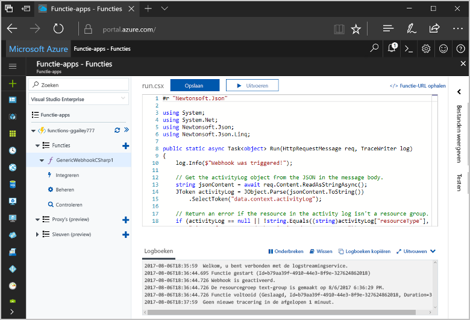
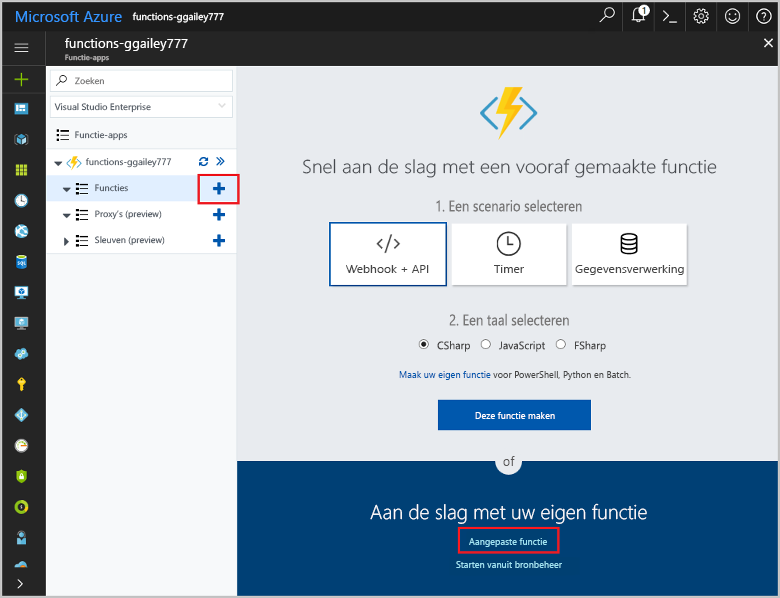
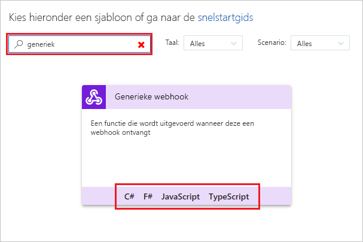
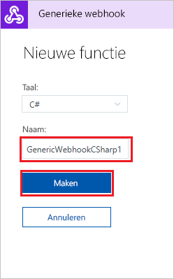
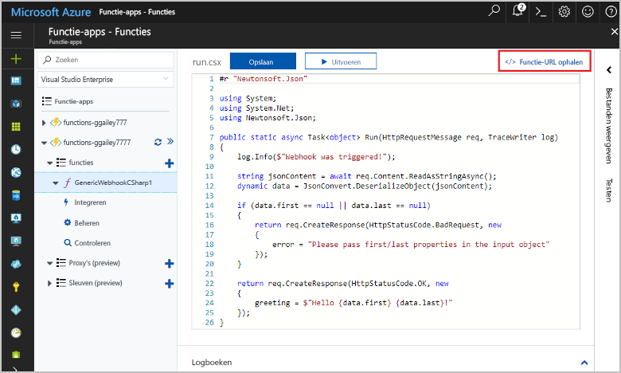
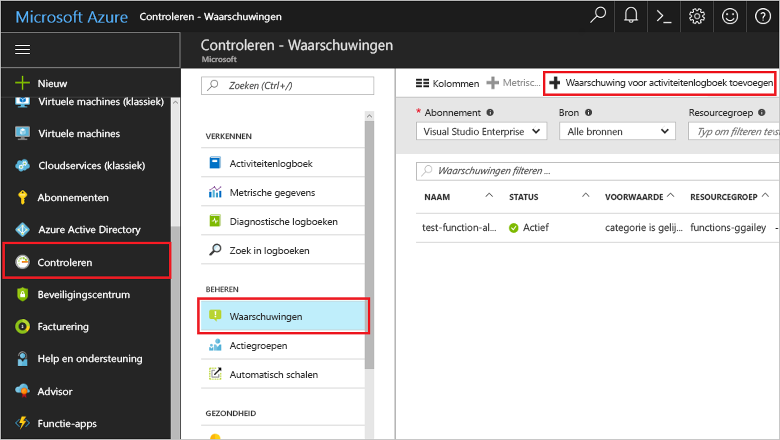
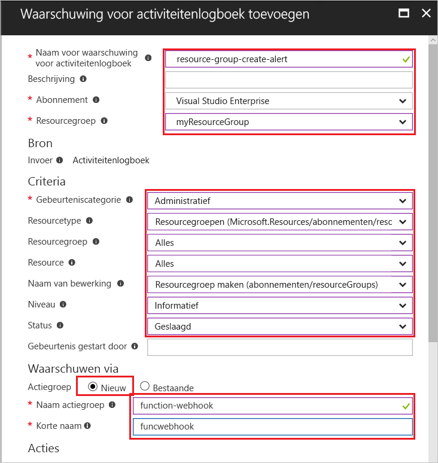
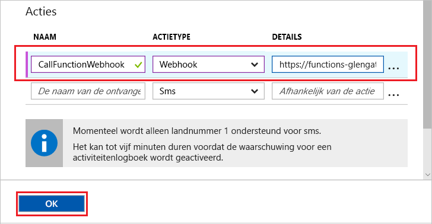
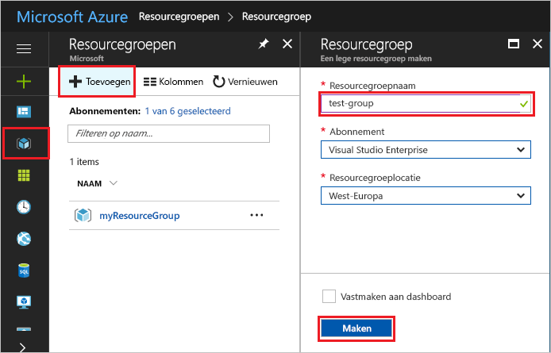
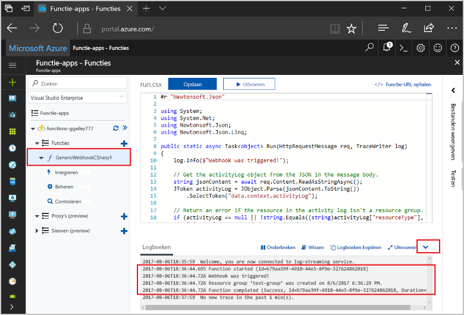

# <a name="create-a-function-triggered-by-a-generic-webhook"></a>Een door een algemene webhook geactiveerde functie maken

Met Azure Functions kunt u uw code in een serverloze omgeving uitvoeren zonder dat u eerst een virtuele machine moet maken of een webtoepassing moet publiceren. U kunt bijvoorbeeld een functie configureren die wordt geactiveerd wanneer in Azure Monitor een waarschuwing wordt gegenereerd. In dit onderwerp leest u hoe u C#-code uitvoert, wanneer een resourcegroep wordt toegevoegd aan uw abonnement.   



## <a name="prerequisites"></a>Vereisten 

Vereisten voor het voltooien van deze zelfstudie:

+ Als u nog geen abonnement op Azure hebt, maak dan een [gratis account](https://azure.microsoft.com/free/?WT.mc_id=A261C142F) aan voordat u begint.

[!INCLUDE [functions-portal-favorite-function-apps](../../includes/functions-portal-favorite-function-apps.md)]

## <a name="create-an-azure-function-app"></a>Een Azure-functie-app maken

[!INCLUDE [Create function app Azure portal](../../includes/functions-create-function-app-portal.md)]

Vervolgens maakt u een functie in de nieuwe functie-app.

## <a name="create-function"></a>Een door een algemene webhook geactiveerde functie maken

1. Vouw de functie-app uit en klik op de knop **+** naast **Functies**. Als dit de eerste functie in de functie-app is, selecteert u **Aangepaste functie**. U ziet nu de volledige set het functiesjablonen.

    

2. Typ `generic` in het zoekveld en kies vervolgens de gewenste taal voor de trigger-sjabloon voor de algemene webhook. In dit onderwerp wordt gebruikgemaakt van een C#-functie.

     

2. Typ een **Naam** voor de functie en selecteer vervolgens **Maken**. 

      

2. Klik in de nieuwe functie op **</> Functie-URL ophalen**, kopieer de waarde en sla deze op. U gebruikt deze waarde om de webhook te configureren. 

    
         
Vervolgens maakt u een webhookeindpunt in een waarschuwing voor activiteitenlogboek in Azure Monitor. 

## <a name="create-an-activity-log-alert"></a>Een waarschuwing voor activiteitenlogboek maken

1. Navigeer in Azure Portal naar de service **Controleren**, selecteer **Waarschuwingen** en klik op **Waarschuwing voor activiteitenlogboek toevoegen**.   

    

2. Gebruik de instellingen zoals opgegeven in de tabel:

    

    | Instelling      |  Voorgestelde waarde   | Beschrijving                              |
    | ------------ |  ------- | -------------------------------------------------- |
    | **Naam voor een waarschuwing voor activiteitenlogboek** | resourcegroep-maken-waarschuwing | Naam van de waarschuwing voor activiteitenlogboek. |
    | **Abonnement** | Uw abonnement | Het abonnement dat u gebruikt voor deze zelfstudie. | 
    |  **Resourcegroep** | myResourceGroup | De resourcegroep waarin de waarschuwingsresources worden geïmplementeerd. Als u dezelfde resourcegroep gebruikt als de functie-app, maakt dit het opschonen gemakkelijker nadat u de zelfstudie hebt voltooid. |
    | **Gebeurteniscategorie** | Administratief | Deze categorie omvat wijzigingen die zijn aangebracht in Azure-resources.  |
    | **Resourcetype** | Resourcegroepen | Filtert waarschuwingen op activiteiten van resourcegroepen. |
    | **Resourcegroep**<br/>en **Resource** | Alle | Controleer alle resources. |
    | **Naam van bewerking** | Een resourcegroep maken | Filtert waarschuwingen op maakbewerkingen. |
    | **Niveau** | Informatief | Neem waarschuwingen op informatieniveau op. | 
    | **Status** | Geslaagd | Filtert waarschuwingen op acties die zijn voltooid. |
    | **Actiegroep** | Nieuw | Maak een nieuwe actiegroep waarin de uitgevoerde actie wordt gedefinieerd wanneer een waarschuwing is gegenereerd. |
    | **Naam van actiegroep** | functiewebhook | Een naam om de actiegroep te identificeren.  | 
    | **Korte naam** | funcwebhook | Een korte naam voor de actiegroep. |  

3. Voeg in **Acties** een actie toe met behulp van de instellingen die zijn opgegeven in de tabel: 

    

    | Instelling      |  Voorgestelde waarde   | Beschrijving                              |
    | ------------ |  ------- | -------------------------------------------------- |
    | **Naam** | CallFunctionWebhook | Een naam voor de actie. |
    | **Actietype** | Webhook | Als antwoord op de waarschuwing wordt een webhook-URL aangeroepen. |
    | **Details** | Functie-URL | Plak de webhook-URL van de functie die u eerder hebt gekopieerd. |v

4. Klik op **OK** om de waarschuwing en actiegroep te maken.  

De webhook wordt nu aangeroepen wanneer een resourcegroep wordt gemaakt in uw abonnement. Vervolgens werkt u de code in de functie bij om de JSON-logboekgegevens in de hoofdtekst van de aanvraag te verwerken.   

## <a name="update-the-function-code"></a>De functiecode bijwerken

1. Ga terug naar de functie-app in de portal en vouw de functie uit. 

2. Vervang de C#-scriptcode in de functie in de portal door de volgende code:

    ```csharp
    #r "Newtonsoft.Json"
    
    using System;
    using System.Net;
    using Newtonsoft.Json;
    using Newtonsoft.Json.Linq;
    
    public static async Task<object> Run(HttpRequestMessage req, TraceWriter log)
    {
        log.Info($"Webhook was triggered!");
    
        // Get the activityLog object from the JSON in the message body.
        string jsonContent = await req.Content.ReadAsStringAsync();
        JToken activityLog = JObject.Parse(jsonContent.ToString())
            .SelectToken("data.context.activityLog");
    
        // Return an error if the resource in the activity log isn't a resource group. 
        if (activityLog == null || !string.Equals((string)activityLog["resourceType"], 
            "Microsoft.Resources/subscriptions/resourcegroups"))
        {
            log.Error("An error occured");
            return req.CreateResponse(HttpStatusCode.BadRequest, new
            {
                error = "Unexpected message payload or wrong alert received."
            });
        }
    
        // Write information about the created resource group to the streaming log.
        log.Info(string.Format("Resource group '{0}' was {1} on {2}.",
            (string)activityLog["resourceGroupName"],
            ((string)activityLog["subStatus"]).ToLower(), 
            (DateTime)activityLog["submissionTimestamp"]));
    
        return req.CreateResponse(HttpStatusCode.OK);    
    }
    ```

U kunt de functie nu testen door een nieuwe resourcegroep te maken in uw abonnement.

## <a name="test-the-function"></a>De functie testen

1. Klik op het pictogram Resourcegroep links in Azure Portal, selecteer **+ Toevoegen**, typ een **Naam resourcegroep** en selecteer **Maken** om een lege resourcegroep te maken.
    
    

2. Ga terug naar de functie en vouw het venster **Logboeken** uit. Nadat de resourcegroep is gemaakt, wordt de webhook geactiveerd door de waarschuwing voor activiteitenlogboek, en wordt de functie uitgevoerd. Zoals u ziet, is de naam van de nieuwe resourcegroep nu naar de logboeken geschreven.  

    

3. (Optioneel) Ga terug en verwijder de resourcegroep die u hebt gemaakt. Let op: door deze activiteit wordt de functie niet geactiveerd. Dit komt omdat verwijderbewerkingen eruit worden gefilterd door de waarschuwing. 

## <a name="clean-up-resources"></a>Resources opschonen

[!INCLUDE [Next steps note](../../includes/functions-quickstart-cleanup.md)]

## <a name="next-steps"></a>Volgende stappen

U hebt een functie gemaakt die wordt uitgevoerd wanneer een aanvraag wordt ontvangen van een algemene webhook. 

[!INCLUDE [Next steps note](../../includes/functions-quickstart-next-steps.md)]

Zie [Azure Functions HTTP and webhook bindings](functions-bindings-http-webhook.md) (Azure Functions-HTTP- en webhookbindingen) voor meer informatie over webhooktriggers. Zie [Azure Functions C# script developer reference](functions-reference-csharp.md) (Naslaginformatie voor ontwikkelaars van Azure Functions C#-scripts) voor meer informatie over het ontwikkelen van functies in C#.

