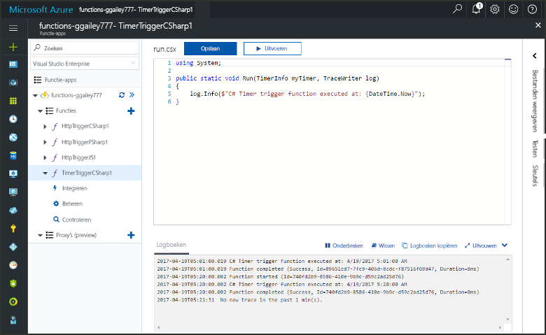
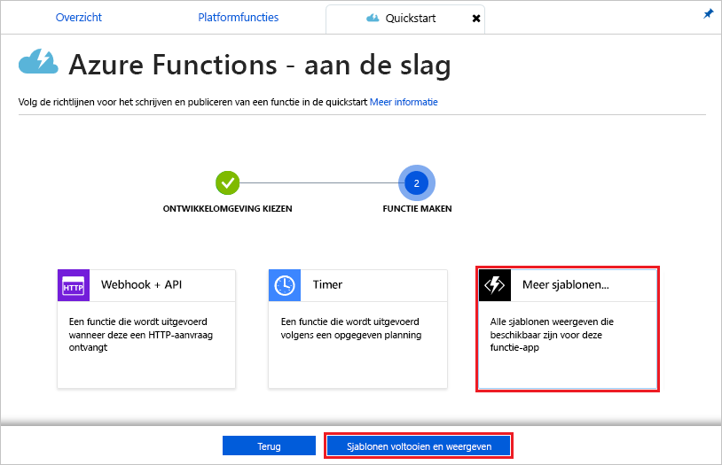
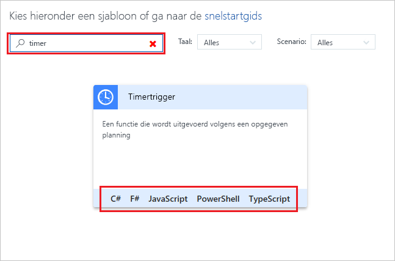
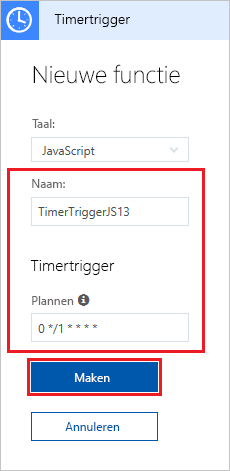
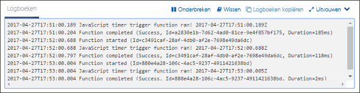
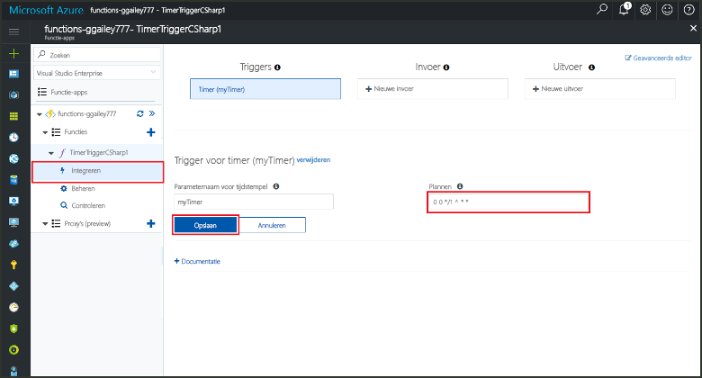

# Maak een functie in Azure die wordt geactiveerd door een timer

Ontdek hoe u Azure Functions gebruikt om een [serverloze](https://azure.microsoft.com/overview/serverless-computing/) functie te maken die wordt uitgevoerd op basis van een schema dat u definieert.

## Vereisten

Vereisten voor het voltooien van deze zelfstudie:

+ Als u nog geen abonnement op Azure hebt, maak dan een [gratis account](https://azure.microsoft.com/free/?WT.mc_id=A261C142F) aan voordat u begint.

[!INCLUDE [functions-portal-favorite-function-apps](../../includes/functions-portal-favorite-function-apps.md)]

## Een Azure-functie-app maken

[!INCLUDE [Create function app Azure portal](../../includes/functions-create-function-app-portal.md)]

Vervolgens maakt u een functie in de nieuwe functie-app.

## Een door een timer geactiveerde functie maken

1. Vouw de functie-app uit en klik op de knop **+** naast **Functies**. Als dit de eerste functie in de functie-app is, selecteert u **Aangepaste functie**. U ziet nu de volledige set het functiesjablonen.

    

2. Typ `timer` in het zoekveld en kies vervolgens de gewenste taal voor de trigger-sjabloon voor de timer. 

    

3. Configureer de nieuwe trigger met de instellingen zoals opgegeven in de tabel onder de afbeelding.

    

    | Instelling | Voorgestelde waarde | Beschrijving |
    |---|---|---|
    | **Naam** | Standaard | Bepaalt de naam van de door de timer geactiveerde functie. |
    | **[Planning](http://en.wikipedia.org/wiki/Cron#CRON_expression)** | 0 \*/1 \* \* \* \* | Een [CRON-expressie](http://en.wikipedia.org/wiki/Cron#CRON_expression) met zes velden aan de hand waarvan uw functie elke minuut wordt uitgevoerd. |

2. Klik op **Create**. Er wordt een functie gemaakt in uw gekozen taal en deze wordt elke minuut uitgevoerd.

3. Controleer of dit correct wordt uitgevoerd door de traceringsinformatie die naar logboeken wordt geschreven te bekijken.

    

U kunt het schema van de functie nu wijzigen zodat deze één keer per uur wordt uitgevoerd in plaats van elke minuut. 

## Het timerschema bijwerken

1. Vouw de functie uit en klik op **Integreren**. Dit is waar u de invoer- en uitvoerbindingen voor de functie definieert en het schema instelt. 

2. Voer een nieuwe waarde voor **Planning** per uur in van `0 0 */1 * * *` in, en klik vervolgens op **Opslaan**.  

U hebt nu een functie die één keer per uur wordt uitgevoerd. 

## Resources opschonen

[!INCLUDE [Next steps note](../../includes/functions-quickstart-cleanup.md)]

## Volgende stappen

U hebt een functie gemaakt die wordt uitgevoerd op basis van een schema.

[!INCLUDE [Next steps note](../../includes/functions-quickstart-next-steps.md)]

Zie voor meer informatie over timeractiveringen [Schedule code execution with Azure Functions](functions-bindings-timer.md) (Code-uitvoering plannen met Azure Functions).
