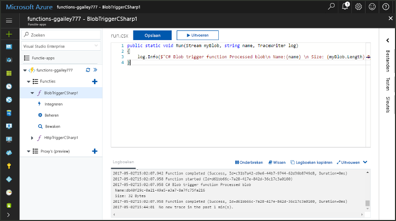
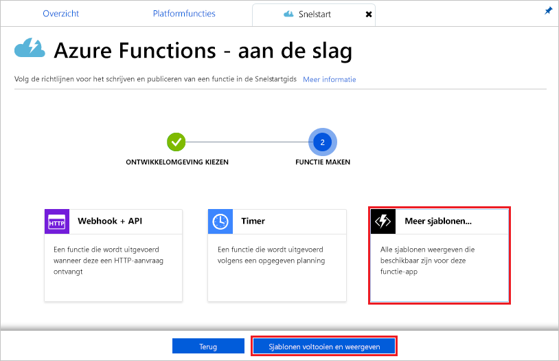
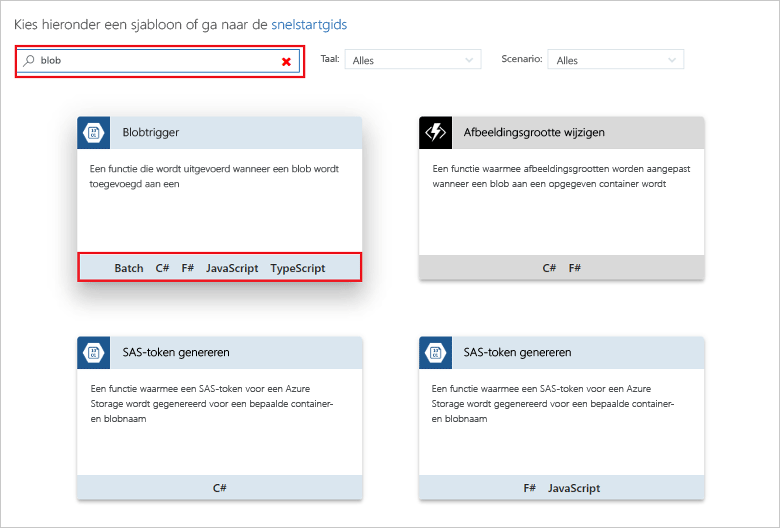
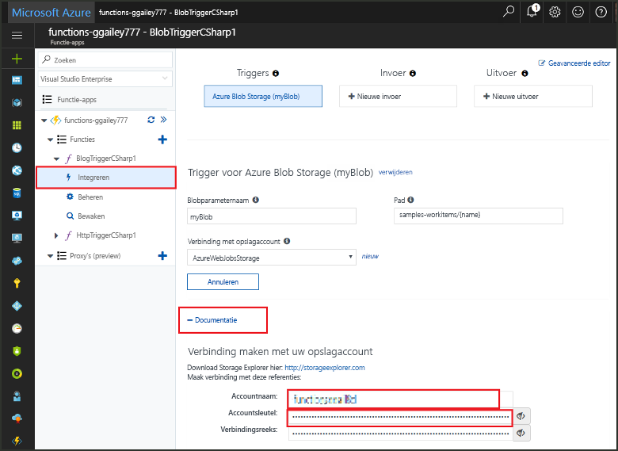
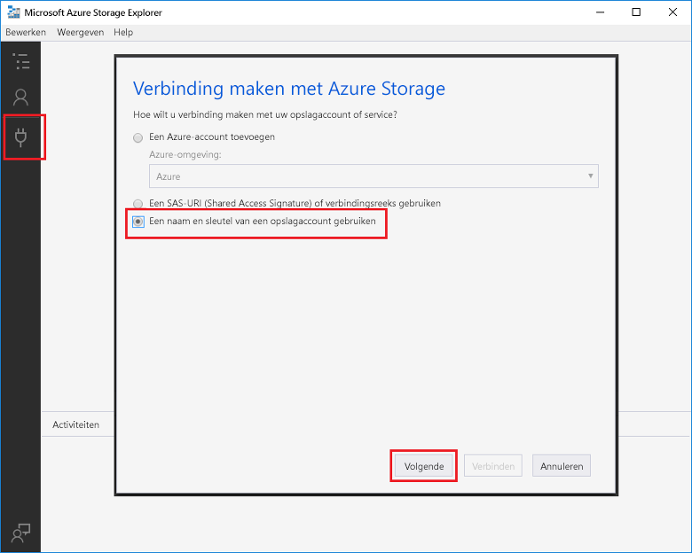
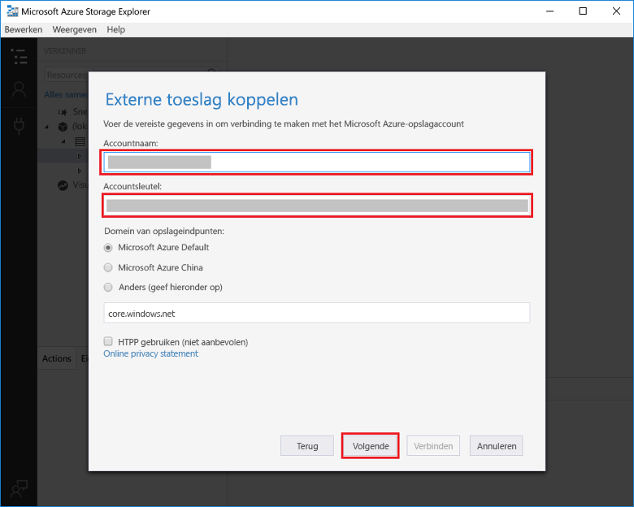
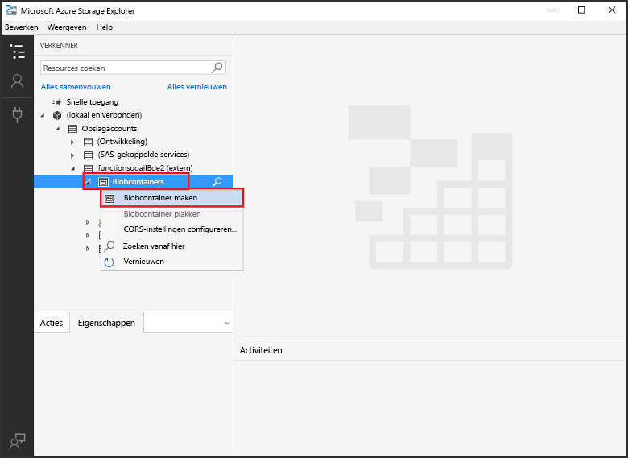
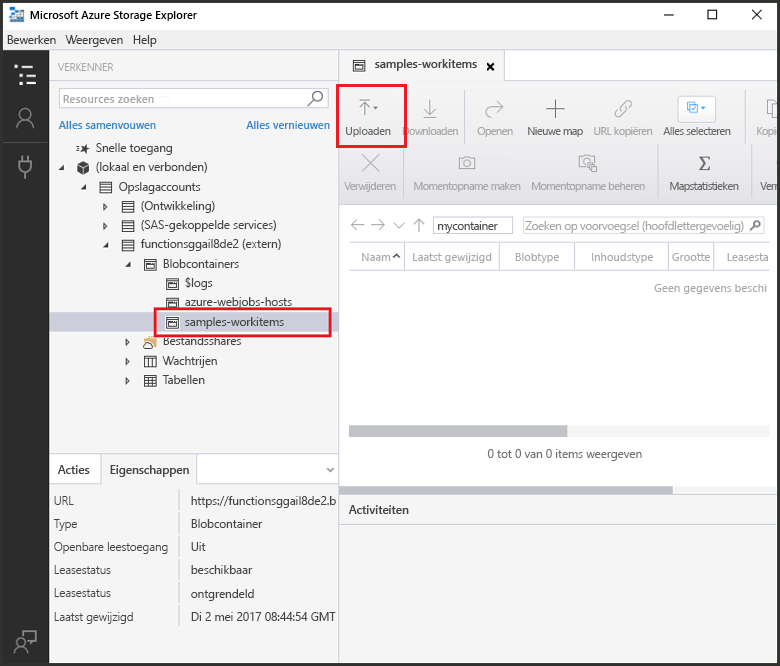
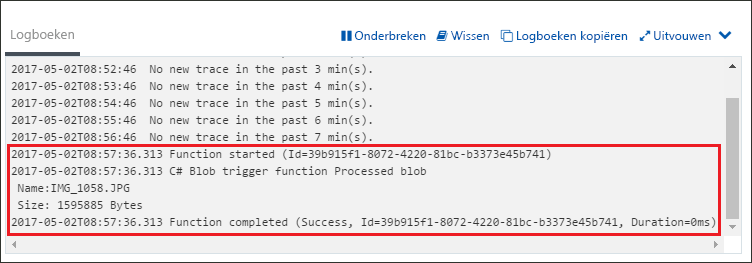

# Een door Azure Blob Storage geactiveerde functie maken

Ontdek hoe u een functie maakt die wordt geactiveerd wanneer bestanden worden geüpload naar of bijgewerkt in Azure Blob Storage.

## Vereisten

+ De [Microsoft Azure Storage Explorer](http://storageexplorer.com/) downloaden en installeren.
+ Een Azure-abonnement. Als u nog geen abonnement hebt, maakt u een [gratis account](https://azure.microsoft.com/free/?WT.mc_id=A261C142F) voordat u begint.

[!INCLUDE [functions-portal-favorite-function-apps](../../includes/functions-portal-favorite-function-apps.md)]

## Een Azure-functie-app maken

[!INCLUDE [Create function app Azure portal](../../includes/functions-create-function-app-portal.md)]

Vervolgens maakt u een functie in de nieuwe functie-app.

## Een door Blob Storage geactiveerde functie maken

1. Vouw de functie-app uit en klik op de knop **+** naast **Functies**. Als dit de eerste functie in de functie-app is, selecteert u **Aangepaste functie**. U ziet nu de volledige set het functiesjablonen.

    

2. Selecteer de sjabloon **BlobTrigger** voor de gewenste taal en gebruik de instellingen die zijn opgegeven in de tabel.

    

    | Instelling | Voorgestelde waarde | Beschrijving |
    |---|---|---|
    | **Pad**   | mycontainer/{name}    | Locatie in Blob Storage die wordt bewaakt. De bestandsnaam van de blob wordt doorgegeven in de binding als de _naam_-parameter.  |
    | **Opslagaccountverbinding** | AzureWebJobStorage | U kunt de opslagaccountverbinding gebruiken die al door de functie-app wordt gebruikt of u kunt een nieuwe maken.  |
    | **Een naam voor de functie opgeven** | Uniek in uw functie-app | Naam van deze door Blob geactiveerde functie. |

3. Klik op **Maken** om de functie te maken.

Vervolgens maakt u verbinding met uw Azure Storage-account en maakt u de **mycontainer**-container.

## De container maken

1. Klik in de functie op **Integreren**, vouw **Documentatie** uit en kopieer de **Accountnaam** en de **Accountsleutel**. Met deze referenties kunt u verbinding maken met het opslagaccount. Als u uw opslagaccount al hebt verbonden, gaat u naar stap 4.

    

1. Voer het hulpprogramma [Microsoft Azure Storage Explorer](http://storageexplorer.com/) uit, klik op het verbindingspictogram aan de linkerkant, kies **Een opslagaccountnaam en -sleutel gebruiken** en klik op **Volgende**.

    

1. Voer de **Accountnaam** en de **Accountsleutel** van stap 1 in. Klik op **Volgende** en vervolgens op **Verbinding maken**. 

    

1. Vouw het gekoppelde opslagaccount uit. Klik met de rechtermuisknop op **Blob-containers**, klik op **Blob-container maken**, typ `mycontainer` en druk op Enter.

    

U hebt nu een blob-container en u kunt de functie testen door een bestand naar de container te uploaden.

## De functie testen

1. Blader in Azure Portal naar de functie, vouw de **Logboeken** onderaan de pagina uit en zorg ervoor dat logboekstreaming niet wordt onderbroken.

1. Vouw in Storage Explorer uw opslagaccount, **Blob-containers** en **mycontainer** uit. Klik op **Uploaden** en klik vervolgens op **Bestanden uploaden...**.

    

1. Klik in het dialoogvenster **Bestanden uploaden** op het veld **Bestanden**. Blader naar een bestand op uw lokale computer, zoals een afbeeldingsbestand, selecteer dit en klik op **Openen** en vervolgens op **Uploaden**.

1. Ga terug naar de functielogboeken en controleer of de blob is gelezen.

   

    >[!NOTE]
    > Wanneer uw functie-app in het standaardverbruiksabonnement wordt uitgevoerd, kan er een vertraging van maximaal een aantal minuten zitten tussen de blob die wordt toegevoegd of bijgewerkt en de functie die wordt geactiveerd. Overweeg om uw functie-app in een App Service-plan uit te voeren, als u lage latentie in uw door blob geactiveerde functies nodig hebt.

## Resources opschonen

[!INCLUDE [Next steps note](../../includes/functions-quickstart-cleanup.md)]

## Volgende stappen

U hebt een functie gemaakt die wordt uitgevoerd wanneer er een blob wordt toegevoegd aan of bijgewerkt in Blob Storage. 

[!INCLUDE [Next steps note](../../includes/functions-quickstart-next-steps.md)]

Zie [Azure Functions Blob storage bindings](functions-bindings-storage-blob.md) (Blob-opslagbindingen in Azure Functions) voor meer informatie over de Blob-opslagtriggers.
